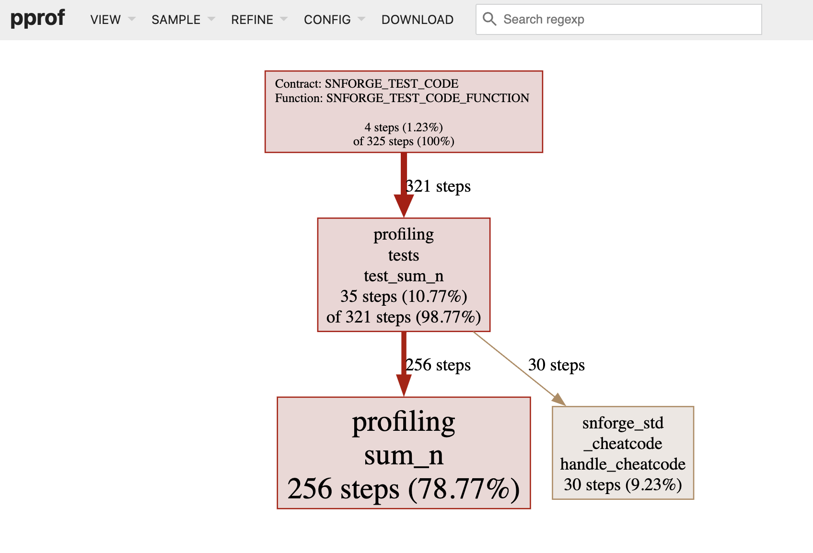

# How To Write Tests

## The Anatomy of a Test Function

Tests are Cairo functions that verify that the non-test code is functioning in the expected manner. The bodies of test functions typically perform these three actions:

- Set up any needed data or state.
- Run the code you want to test.
- Assert the results are what you expect.

Let’s look at the features Cairo provides for writing tests that take these actions, which include:

- `#[test]` attribute.
- `assert!`macro.
- `assert_eq!`, `assert_ne!`, `assert_lt!`, `assert_le!`, `assert_gt!` and `assert_ge!` macros. In order to use them, you will need to add `assert_macros = "2.8.2"` as a dev dependency.
- `#[should_panic]` attribute.

> Note: Make sure to select Starknet Foundry as a test runner when creating your project.

### The Anatomy of a Test Function

At its simplest, a test in Cairo is a function that’s annotated with the `#[test]` attribute. Attributes are metadata about pieces of Cairo code; one example is the `#[derive()]` attribute we used with structs in [Chapter {{#chap using-structs-to-structure-related-data}}][structs]. To change a function into a test function, add `#[test]` on the line before `fn`. When you run your tests with the `scarb test` command, Scarb runs Starknet Foundry's test runner binary that runs the annotated functions and reports on whether each test function passes or fails.

Let's create a new project called _adder_ using Scarb with the command `scarb new adder`. Remove the _tests_ folder.

```shell
adder
├── Scarb.toml
└── src
    └── lib.cairo
```

In _lib.cairo_, let's remove the existing content and add a `tests` module containing the first test, as shown in Listing {{#ref first-test}}.

<span class="filename">Filename: src/lib.cairo</span>

```cairo, noplayground
{{#include ../listings/ch10-testing-cairo-programs/listing_10_01/src/lib.cairo:it_works}}
```

{{#label first-test}}
<span class="caption">Listing {{#ref first-test}}: A simple test function</span>

Note the `#[test]` annotation: this attribute indicates this is a test function, so the test runner knows to treat this function as a test. We might also have non-test functions to help set up common scenarios or perform common operations, so we always need to indicate which functions are tests.

We use the `#[cfg(test)]` attribute for the `tests` module, so that the compiler knows the code it contains needs to be compiled only when running tests. This is actually not an option: if you put a simple test with the `#[test]` attribute in a _lib.cairo_ file, it will not compile. We will talk more about the `#[cfg(test)]` attribute in the next [Test Organization][test organization] section.

The example function body uses the `assert_eq!` macro, which contains the result of adding 2 and 2, which equals 4. This assertion serves as an example of the format for a typical test. We'll explain in more detail how `assert_eq!` works later in this chapter. Let’s run it to see that this test passes.

The `scarb test` command runs all tests found in our project, and shows the following output:

```shell
{{#include ../listings/ch10-testing-cairo-programs/listing_10_01/output.txt}}
```

`scarb test` compiled and ran the test. We see the line `Collected 1 test(s) from adder package` followed by the line `Running 1 test(s) from src/`. The next line shows the name of the test function, called `it_works`, and that the result of running that test is `ok`. The test runner also provides an estimation of the gas consumption. The overall summary shows that all the tests passed, and the portion that reads `1 passed; 0 failed` totals the number of tests that passed or failed.

It’s possible to mark a test as ignored so it doesn’t run in a particular instance; we’ll cover that in the [Ignoring Some Tests Unless Specifically Requested](#ignoring-some-tests-unless-specifically-requested) section later in this chapter. Because we haven’t done that here, the summary shows `0 ignored`. We can also pass an argument to the `scarb test` command to run only a test whose name matches a string; this is called filtering and we’ll cover that in the [Running Single Tests](#running-single-tests) section. Since we haven’t filtered the tests being run, the end of the summary shows `0 filtered out`.

Let’s start to customize the test to our own needs. First change the name of the `it_works` function to a different name, such as `exploration`, like so:

```cairo, noplayground
{{#include ../listings/ch10-testing-cairo-programs/listing_10_01/src/lib.cairo:exploration}}
```

Then run `scarb test` again. The output now shows `exploration` instead of `it_works`:

```shell
{{#include ../listings/ch10-testing-cairo-programs/listing_10_01/output.txt}}
```

Now we’ll add another test, but this time we’ll make a test that fails! Tests fail when something in the test function panics. Each test is run in a new thread, and when the main thread sees that a test thread has died, the test is marked as failed. Enter the new test as a function named `another`, so your _src/lib.cairo_ file looks like in Listing {{#ref second-test}}.

<span class="filename">Filename: src/lib.cairo</span>

```cairo, noplayground
{{#include ../listings/ch10-testing-cairo-programs/listing_10_02/src/lib.cairo:exploration-and-another}}
```

{{#label second-test}}
<span class="caption">Listing {{#ref second-test}}: Adding a second test in _lib.cairo_ that will fail</span>

Run `scarb test` and you will see the following output:

```shell
Collected 2 test(s) from adder package
Running 2 test(s) from src/
[FAIL] adder::tests::another

Failure data:
    "Make this test fail"

[PASS] adder::tests::exploration (gas: ~1)
Tests: 1 passed, 1 failed, 0 skipped, 0 ignored, 0 filtered out

Failures:
    adder::tests::another
```

Instead of `[PASS]`, the line `adder::tests::another` shows `[FAIL]`. A new section appears between the individual results and the summary. It displays the detailed reason for each test failure. In this case, we get the details that `another` failed because it panicked with `"Make this test fail"` error.

After that, the summary line is displayed: we had one test pass and one test fail. At the end, we see a list of the failing tests.

Now that you've seen what the test results look like in different scenarios, let’s look at some functions that are useful in tests.

[structs]: ./ch05-01-defining-and-instantiating-structs.md
[test organization]: ./ch10-02-test-organization.md

## Checking Results with the `assert!` Macro

The `assert!` macro, provided by Cairo, is useful when you want to ensure that some condition in a test evaluates to `true`. We give the `assert!` macro the first argument that evaluates to a boolean. If the value is `true`, nothing happens and the test passes. If the value is `false`, the `assert!` macro calls `panic()` to cause the test to fail with a message we defined as the second argument. Using the `assert!` macro helps us check that our code is functioning in the way we intended.

Remember in [Chapter {{#chap using-structs-to-structure-related-data}}][method syntax], we used a `Rectangle` struct and a `can_hold` method, which are repeated here in Listing {{#ref rectangle}}. Let’s put this code in the _src/lib.cairo_ file, then write some tests for it using the `assert!` macro.

<span class="filename">Filename: src/lib.cairo</span>

```cairo, noplayground
{{#include ../listings/ch10-testing-cairo-programs/listing_10_03/src/lib.cairo:trait_impl}}
```

{{#label rectangle}}
<span class="caption">Listing {{#ref rectangle}}: Using the `Rectangle` struct and its `can_hold` method from Chapter {{#chap using-structs-to-structure-related-data}}</span>

The `can_hold` method returns a `bool`, which means it’s a perfect use case for the `assert!` macro. We can write a test that exercises the `can_hold` method by creating a `Rectangle` instance that has a width of `8` and a height of `7` and asserting that it can hold another `Rectangle` instance that has a width of `5` and a height of `1`.

```cairo, noplayground
{{#rustdoc_include ../listings/ch10-testing-cairo-programs/listing_10_03/src/lib.cairo:test1}}
```

Note the `use super::*;` line inside the `tests` module. The `tests` module is
a regular module that follows the usual visibility rules we covered in Chapter
{{#chap paths-for-referring-to-an-item-in-the-module-tree}} in the [“Paths for Referring to an Item in the Module
Tree”][paths-for-referring-to-an-item-in-the-module-tree]<!-- ignore -->
section. Because the `tests` module is an inner module, we need to bring the
code under test in the outer module into the scope of the inner module. We use
a glob here, so anything we define in the outer module is available to this
`tests` module.

We’ve named our test `larger_can_hold_smaller`, and we’ve created the two `Rectangle` instances that we need. Then we called the `assert!` macro and passed it the result of calling `larger.can_hold(@smaller)`. This expression is supposed to return `true`, so our test should pass. Let’s find out!

```shell
{{#include ../listings/ch10-testing-cairo-programs/listing_10_03/output.txt}}
```

It does pass! Let’s add another test, this time asserting that a smaller rectangle cannot hold a larger rectangle:

<span class="filename">Filename: src/lib.cairo</span>

```cairo, noplayground
{{#rustdoc_include ../listings/ch10-testing-cairo-programs/listing_10_03/src/lib.cairo:test2}}
```

{{#label another-test}}
<span class="caption">Listing {{#ref another-test}}: Adding another test in _lib.cairo_ that will pass</span>

Because the correct result of the `can_hold` method, in this case, is `false`, we need to negate that result before we pass it to the `assert!` macro. As a result, our test will pass if `can_hold` returns `false`:

```shell
{{#include ../listings/ch10-testing-cairo-programs/listing_10_03/output.txt}}
```

Two tests that pass! Now let’s see what happens to our test results when we introduce a bug in our code. We’ll change the implementation of the `can_hold` method by replacing the `>` sign with a `<` sign when it compares the widths:

```cairo, noplayground
{{#include ../listings/ch10-testing-cairo-programs/no_listing_01_wrong_can_hold_impl/src/lib.cairo:wrong_impl}}
```

Running the tests now produces the following:

```shell
{{#include ../listings/ch10-testing-cairo-programs/no_listing_01_wrong_can_hold_impl/output.txt}}
```

Our tests caught the bug! Because `larger.width` is `8` and `smaller.width` is `5`, the comparison of the widths in `can_hold` now returns `false` (`8` is not less than `5`) in the `larger_can_hold_smaller` test. Notice that the `smaller_cannot_hold_larger` test still passes: to make this test fail, the height comparison should also be modified in `can_hold` method, replacing the `>` sign with a `<` sign.

[method syntax]: ./ch05-03-method-syntax.md

## Testing Equality and Comparisons with the `assert_xx!` Macros

### `assert_eq!` and `assert_ne!` Macros

A common way to verify functionality is to test for equality between the result
of the code under test and the value you expect the code to return. You could
do this using the `assert!` macro and passing it an expression using the `==`
operator. However, this is such a common test that the standard library
provides a pair of macros — `assert_eq!` and `assert_ne!` — to perform this test
more conveniently. These macros compare two arguments for equality or
inequality, respectively. They’ll also print the two values if the assertion
fails, which makes it easier to see _why_ the test failed; conversely, the
`assert!` macro only indicates that it got a `false` value for the `==`
expression, without printing the values that led to the `false` value.

In Listing {{#ref add_two}}, we write a function named `add_two` that adds `2` to its
parameter, then we test this function using `assert_eq!` and `assert_ne!` macros.

<span class="filename">Filename: src/lib.cairo</span>

```cairo, noplayground
{{#include ../listings/ch10-testing-cairo-programs/listing_10_04/src/add_two.cairo}}
```

{{#label add_two}}
<span class="caption">Listing {{#ref add_two}}: Testing the function `add_two` using `assert_eq!` and `assert_ne!` macros</span>

Let’s check that it passes!

```shell
{{#include ../listings/ch10-testing-cairo-programs/listing_10_04/output.txt}}
```

In the `it_adds_two` test, we pass `4` as argument to `assert_eq!` macro, which is equal to the result of
calling `add_two(2)`. The line for this test is `[PASS] adder::tests::it_adds_two (gas: ~1)`.

In the `wrong_check` test, we pass `0` as argument to `assert_ne!` macro, which is not equal to the result of
calling `add_two(2)`. Tests that use the `assert_ne!` macro will pass if the two values we give it are _not_ equal and
fail if they’re equal. This macro is most useful for cases when we’re not sure
what a value _will_ be, but we know what the value definitely _shouldn’t_ be.
For example, if we’re testing a function that is guaranteed to change its input
in some way, but how the input is changed depends on the day of
the week that we run our tests, the best thing to assert might be that the
output of the function is not equal to the input.

Let’s introduce a bug into our code to see what `assert_eq!` looks like when it
fails. Change the implementation of the `add_two` function to instead add `3`:

```cairo, noplayground
{{#include ../listings/ch10-testing-cairo-programs/listing_10_04/src/wrong_add_two.cairo}}
```

Run the tests again:

```shell
{{#include ../listings/ch10-testing-cairo-programs/listing_10_04/output.txt}}
```

Our test caught the bug! The `it_adds_two` test failed with the following
message: ``"assertion `4 == add_two(2)` failed``.
It tells us that the assertion that failed was `` "assertion `left == right` failed`` and the `left`
and `right` values are printed on the next lines as `left: left_value` and `right: right_value`.
This helps us start debugging: the `left` argument was `4` but the `right` argument, where we had
`add_two(2)`, was `5`. You can imagine that this would be especially helpful
when we have a lot of tests going on.

Note that in some languages and test frameworks, the parameters for equality
assertion functions are called `expected` and `actual`, and the order in which
we specify the arguments matters. However, in Cairo, they’re called `left` and
`right`, and the order in which we specify the value we expect and the value
the code produces doesn’t matter. We could write the assertion in this test as
`assert_eq!(add_two(2), 4)`, which would result in the same failure message
that displays `` assertion failed: `(left == right)` ``.

Here is a simple example comparing two structs, showing how to use `assert_eq!` and `assert_ne!` macros:

```cairo, noplayground
{{#include ../listings/ch10-testing-cairo-programs/no_listing_10_assert_eq_ne_macro/src/lib.cairo}}
```

Under the surface, `assert_eq!` and `assert_ne!` macros use the operators
`==` and `!=`, respectively. They both take snapshots of values as arguments. When the assertions fail, these macros print their
arguments using debug formatting (`{:?}` syntax), which means the values being compared must
implement `PartialEq` and `Debug` traits. All primitive types and most of
the core library types implement these traits. For structs and enums that
you define yourself, you’ll need to implement `PartialEq` to assert equality of
those types. You’ll also need to implement `Debug` to print the values when the
assertion fails. Because both traits are derivable, this is usually as straightforward as adding the
`#[derive(Drop, Debug, PartialEq)]` annotation to your struct or enum definition. See
[Appendix C][derivable traits] for more details about these and other derivable traits.

[derivable traits]: ./appendix-03-derivable-traits.md

### `assert_lt!`, `assert_le!`, `assert_gt!` and `assert_ge!` Macros

Comparisons in tests can be done using the `assert_xx!` macros:

- `assert_lt!` checks if a given value is lower than another value, and reverts otherwise.
- `assert_le!` checks if a given value is lower or equal than another value, and reverts otherwise.
- `assert_gt!` checks if a given value is greater than another value, and reverts otherwise.
- `assert_ge!` checks if a given value is greater or equal than another value, and reverts otherwise.

Listing {{#ref assert_macros}} demonstrates how to use these macros:

```cairo, noplayground
{{#include ../listings/ch10-testing-cairo-programs/listing_10_08/src/lib.cairo}}
```

{{#label assert_macros}}
<span class="caption">Listing {{#ref assert_macros}}: Example of tests that use the `assert_xx!` macros for comparisons</span>

In this example, we roll a `Dice` struct multiple times and compare the results. We need to manually implement the `PartialOrd` trait for our struct so that we can compare `Dice` instances with `lt`, `le`, `gt` and `ge` functions, which are used by `assert_lt!`, `assert_le!`, `assert_gt!` and `assert_ge!` macros, respectively. We also need to derive the `Copy` trait on our `Dice` struct to use the instantiated structs multiple times, as the comparison functions take ownership of the variables.

## Adding Custom Failure Messages

You can also add a custom message to be printed with the failure message as
optional arguments to `assert!`, `assert_eq!`, and `assert_ne!` macros. Any
arguments specified after the required arguments are passed along to the
`format!` macro (discussed in the [Printing][formatting] chapter), so you can pass a format string that contains `{}` placeholders and
values to go in those placeholders. Custom messages are useful for documenting
what an assertion means; when a test fails, you’ll have a better idea of what
the problem is with the code.

Let’s add a custom failure message composed of a format
string with a placeholder filled in with the actual value we got from the previous
`add_two` function:

```cairo, noplayground
{{#include ../listings/ch10-testing-cairo-programs/no_listing_02_custom_messages/src/lib.cairo:here}}
```

Now when we run the test, we’ll get a more informative error message:

```shell
{{#include ../listings/ch10-testing-cairo-programs/no_listing_02_custom_messages/output.txt}}
```

We can see the value we actually got in the test output, which would help us
debug what happened instead of what we were expecting to happen.

[formatting]: ./ch11-08-printing.md#formatting

## Checking for panics with `should_panic`

In addition to checking return values, it’s important to check that our code handles error conditions as we expect. For example, consider the `Guess` type in Listing {{#ref guess}}:

<span class="filename">Filename: src/lib.cairo</span>

```cairo, noplayground
{{#include ../listings/ch10-testing-cairo-programs/listing_10_05/src/lib.cairo:guess}}
```

{{#label guess}}
<span class="caption">Listing {{#ref guess}}: `Guess` struct and its `new` method</span>

Other code that uses `Guess` depends on the guarantee that `Guess` instances will contain only values between `1` and `100`. We can write a test that ensures that attempting to create a `Guess` instance with a value outside that range panics.

We do this by adding the attribute `should_panic` to our test function. The test passes if the code inside the function panics; the test fails if the code inside the function doesn’t panic.

```cairo, noplayground
{{#include ../listings/ch10-testing-cairo-programs/listing_10_05/src/lib.cairo:test}}
```

We place the `#[should_panic]` attribute after the `#[test]` attribute and before the test function it applies to. Let’s look at the result to see that this test passes:

```shell
{{#include ../listings/ch10-testing-cairo-programs/listing_10_05/output.txt}}
```

Looks good! Now let’s introduce a bug in our code by removing the condition that the `new` function will panic if the value is greater than `100`:

```cairo, noplayground
{{#rustdoc_include ../listings/ch10-testing-cairo-programs/no_listing_03_wrong_new_impl/src/lib.cairo:here}}
```

When we run the test, it will fail:

```shell
{{#include ../listings/ch10-testing-cairo-programs/no_listing_03_wrong_new_impl/output.txt}}
```

We don’t get a very helpful message in this case, but when we look at the test function, we see that it’s annotated with `#[should_panic]` attribute. The failure we got means that the code in the test function did not cause a panic.

Tests that use `should_panic` can be imprecise. A `should_panic` test would pass even if the test panics for a different reason from the one we were expecting. To make `should_panic` tests more precise, we can add an optional `expected` parameter to the `#[should_panic]` attribute. The test harness will make sure that the failure message contains the provided text. For example, consider the modified code for `GuessImpl` in Listing {{#ref guess-2}} where the `new` function panics with different messages depending on whether the value is too small or too large:

<span class="filename">Filename: src/lib.cairo</span>

```cairo, noplayground
{{#rustdoc_include ../listings/ch10-testing-cairo-programs/listing_10_06/src/lib.cairo:here}}
```

{{#label guess-2}}
<span class="caption">Listing {{#ref guess-2}}: `new` implementation that panics with different error messages</span>

The test will pass because the value we put in the `should_panic` attribute’s `expected` parameter is the string that the `Guess::new` method panics with. We need to specify the entire panic message that we expect.

To see what happens when a `should_panic` test with an expected message fails, let’s again introduce a bug into our code by swapping the bodies of the `if value < 1` and the `else if value > 100` blocks:

```cairo, noplayground
{{#include ../listings/ch10-testing-cairo-programs/no_listing_04_new_bug/src/lib.cairo:here}}
```

This time when we run the `should_panic` test, it will fail:

```shell
{{#include ../listings/ch10-testing-cairo-programs/no_listing_04_new_bug/output.txt}}
```

The failure message indicates that this test did indeed panic as we expected, but the panic message did not include the expected string. The panic message that we did get in this case was `Guess must be >= 1`. Now we can start figuring out where our bug is!

## Running Single Tests

Sometimes, running a full test suite can take a long time. If you’re working on code in a particular area, you might want to run only the tests pertaining to that code. You can choose which tests to run by passing `scarb test` the name of the test you want to run as an argument.

To demonstrate how to run a single test, we’ll first create two test functions, as shown in Listing {{#ref two-tests}}, and choose which ones to run.

<span class="filename">Filename: src/lib.cairo</span>

```cairo, noplayground
{{#include ../listings/ch10-testing-cairo-programs/listing_10_07/src/lib.cairo}}
```

{{#label two-tests}}
<span class="caption">Listing {{#ref two-tests}}: Two tests with two different names</span>

We can pass the name of any test function to `scarb test` to run only that test:

```shell
{{#include ../listings/ch10-testing-cairo-programs/listing_10_07/output.txt}}
```

Only the test with the name `add_two_and_two` ran; the other test didn’t match that name. The test output lets us know we had one more test that didn’t run by displaying `1 filtered out;` at the end.

We can also specify part of a test name, and any test whose name contains that value will be run.

## Ignoring Some Tests Unless Specifically Requested

Sometimes a few specific tests can be very time-consuming to execute, so you might want to exclude them during most runs of `scarb test`. Rather than listing as arguments all tests you do want to run, you can instead annotate the time-consuming tests using the `#[ignore]` attribute to exclude them, as shown here:

```cairo, noplayground
{{#include ../listings/ch10-testing-cairo-programs/no_listing_05_ignore_tests/src/lib.cairo}}
```

After `#[test]` we add the `#[ignore]` line to the test we want to exclude. Now when we run our tests, `it_works` runs, but `expensive_test` doesn’t:

```shell
{{#include ../listings/ch10-testing-cairo-programs/no_listing_05_ignore_tests/output.txt}}
```

The `expensive_test` function is listed as ignored.

When you’re at a point where it makes sense to check the results of the ignored tests and you have time to wait for the results, you can run `scarb test --include-ignored` to run all tests, whether they’re ignored or not.

## Testing Recursive Functions or Loops

When testing recursive functions or loops, the test is instantiated by default with a maximum amount of gas that it can consume. This prevents running infinite loops or consuming too much gas, and can help you benchmark the efficiency of your implementations. This value is assumed reasonably large enough, but you can override it by adding the `#[available_gas(<Number>)]` attribute to the test function. The following example shows how to use it:

```cairo, noplayground
{{#include ../listings/ch10-testing-cairo-programs/no_listing_06_test_gas/src/lib.cairo}}
```

## Benchmarking Cairo Programs

Starknet Foundry contains a profiling feature that is useful to analyze and optimize the performance of your Cairo programs.

The [profiling][profiling] feature generates execution traces for successful tests, which are used to create profile outputs. This allows you to benchmark specific parts of your code.

To use the profiler, you will need to:

1. Install [Cairo Profiler][cairo profiler] from Software Mansion.
2. Install [Go][go], [Graphviz][graphviz] and [pprof][pprof], all of them are required to visualize the generated profile output.
3. Run `snforge test --build-profile` command, which generates a trace file for each passing test, stored in the _snfoundry_trace_ directory of your project. This command also generates the corresponding output files in the _profile_ directory.
4. Run `go tool pprof -http=":8000" path/to/profile/output.pb.gz` to analyse a profile. This will start a web server at the specified port.

Let's reuse the `sum_n` function studied above:

```cairo, noplayground
{{#include ../listings/ch10-testing-cairo-programs/no_listing_06_test_gas/src/lib.cairo}}
```

After generating the trace file and the profile output, running `go tool pprof` in your project will start the web server where you can find many useful information about the test that you ran:

- The test includes one function call, corresponding to the call to the test function. Calling `sum_n` multiple times in the test function will still return 1 call. This is because `snforge` simulates a contract call when executing a test.

- The `sum_n` function execution uses 256 Cairo steps:

<div align="center">
    
</div>

Other information is also available such as memory holes (i.e., unused memory cells) or builtins usage. The Cairo Profiler is under active development, and many other features will be made available in the future.

[hello world]: ./ch01-02-hello-world.md#creating-a-project-with-scarb
[profiling]: https://foundry-rs.github.io/starknet-foundry/snforge-advanced-features/profiling.html
[cairo profiler]: https://github.com/software-mansion/cairo-profiler
[go]: https://go.dev/doc/install
[Graphviz]: https://www.graphviz.org/download/
[pprof]: https://github.com/google/pprof?tab=readme-ov-file#building-pprof
[paths-for-referring-to-an-item-in-the-module-tree]: ./ch07-03-paths-for-referring-to-an-item-in-the-module-tree.md

{{#quiz ../quizzes/ch10-01-how_to_write_tests.toml}}
