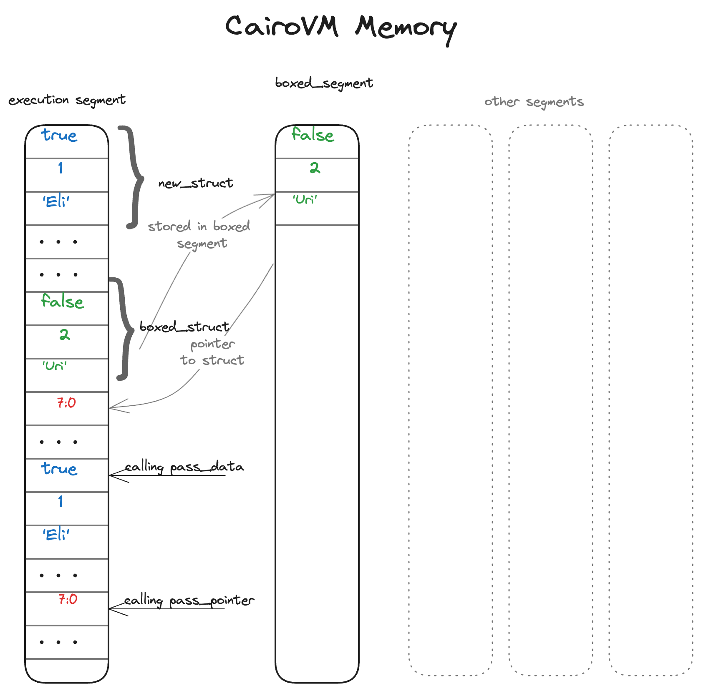

# Smart Pointers

A pointer is a general concept for a variable that contains a memory address. This address refers to, or “points at,” some other data. While pointers are a powerful feature, they can also be a source of bugs and security vulnerabilities. For example, a pointer can reference an unassigned memory cell, which means that attempting to access the data at that address would cause the program to crash, making it unprovable. To prevent such issues, Cairo uses _Smart Pointers_.

Smart pointers are data structures that act like a pointer, but also have additional metadata and capabilities. The concept of smart pointers isn’t unique to Cairo: smart pointers originated in C++ and exist in other languages like Rust as well. In the specific case of Cairo, smart pointers ensure that memory is not addressed in an unsafe way that could cause a program to be unprovable, by providing a safe way to access memory through strict type checking and ownership rules.

Though we didn’t call them as such at the time, we’ve already encountered a few smart pointers in this book, including `Felt252Dict<T>` and `Array<T>` in Chapter 3. Both these types count as smart pointers because they own a memory segment and allow you to manipulate it. They also have metadata and extra capabilities or guarantees. Arrays keep track of their current length to ensure that existing elements are not overwritten, and that new elements are only appended to the end.

The Cairo VM memory is composed by multiple segments that can store data, each identified by a unique index. When you create an array, you allocate a new segment in the memory to store the future elements. The array itself is just a pointer to that segment where the elements are stored.

## The `Box<T>` Type to Manipulate Pointers

The principal smart pointer type in Cairo is a _box_, denoted as `Box<T>`. Manually defining boxes allow you to store data in a specific memory segment of the Cairo VM called the _boxed segment_. This segment is dedicated to store all boxed values, and what remains in the execution segment is only a pointer to the boxed segment. Whenever you instantiate a new pointer variable of type `Box<T>`, you append the data of type `T` to the boxed segment.

Boxes have very little performance overhead, other than writing their inner values to the boxed segment. But they don’t have many extra capabilities either. You’ll use them most often in these situations:

- When you have a type whose size can’t be known at compile time and you want to use a value of that type in a context that requires an exact size
- When you have a large amount of data and you want to transfer ownership but ensure the data won’t be copied when you do so

We’ll demonstrate the first situation in the [“Enabling Recursive Types with Boxes”][nullable recursive types] section.
In the second case, transferring ownership of a large amount of data can take a long time because the data is copied around in memory. To improve performance in this situation, we can store the large amount of data in the boxed segment using a box type. Then, only the small amount of pointer data is copied around in memory, while the data it references stays in one place on the boxed segment.

[nullable recursive types]: ./ch11-02-smart-pointers.md#enabling-recursive-types-with-nullable-boxes

### Using a `Box<T>` to Store Data in the Boxed Segment

Before we discuss the boxed segment storage use cases for `Box<T>`, we’ll cover the syntax and how to interact with values stored within a `Box<T>`.

Listing {{#ref basic_box}} shows how to use a box to store a value in the boxed segment:

```rust
{{#include ../listings/ch11-advanced-features/listing_04_basic_box/src/lib.cairo}}
```

{{#label basic_box}}
<span class="caption">Listing {{#ref basic_box}}: Storing a `u128` value in the boxed segment using a box</span>

We define the variable `b` to have the value of a `Box` that points to the value `5`, which is stored in the boxed segment. This program will print `b = 5`; in this case, we can access the data in the box similar to how we would if this data was simply in the execution memory. Putting a single value in a box isn’t very useful, so you won’t use boxes by themselves in this way very often. Having values like a single `u128` in the execution memory, where they’re stored by default, is more appropriate in the majority of situations. Let’s look at a case where boxes allow us to define types that we wouldn’t be allowed to if we didn’t have boxes.

### Enabling Recursive Types with Nullable Boxes

<!-- TODO -->

### Using Boxes to Improve Performance

Passing pointers between functions allows you to reference data without copying the data itself. Using boxes can improve performance as it allows you to pass a pointer to some data from one function to another, without the need to copy the entire data in memory before performing the function call. Instead of having to write `n` values into memory before calling a function, only a single value is written, corresponding to the pointer to the data. If the data stored in the box is very large, the performance improvement can be significant, as you would save `n-1` memory operations before each function call.

Let's take a look at the code in Listing {{#ref box}}, which shows two ways of passing data to a function: by value and by pointer.

```rust
{{#include ../listings/ch11-advanced-features/listing_05_box/src/lib.cairo}}
```

{{#label box}}
<span class="caption">Listing {{#ref box}}: Storing large amounts of data in a box for performance.</span>

The `main` function includes 2 function calls:

- `pass_data` that takes a variable of type `Cart`.
- `pass_pointer` that takes a pointer of type `Box<Cart>`.

When passing data to a function, the entire data is copied into the last available memory cells right before the function call. Calling `pass_data` will copy all 3 fields of `Cart` to memory, while `pass_pointer` only requires the copy of the `new_box` pointer which is of size 1.

<div align="center">
    
<div align="center">
    </div>
    <span class="caption">CairoVM Memory layout when using boxes</span>
</div>

The illustration above demonstrates how the memory behaves in both cases. The first instance of `Cart` is stored in the execution segment, and we need to copy all its fields to memory before calling the `pass_data` function. The second instance of `Cart` is stored in the boxed segment, and the pointer to it is stored in the execution segment. When calling the `pass_pointer` function, only the pointer to the struct is copied to memory right before the function call. In both cases, however, instantiating the struct will store all its values in the execution segment: the boxed segment can only be filled with data taken from the execution segment.

## The `Nullable<T>` Type for Dictionaries

`Nullable<T>` is another type of smart pointer that can either point to a value or be `null` in the absence of value. It is defined at the Sierra level. This type is mainly used in dictionaries that contain types that don't implement the `zero_default` method of the `Felt252DictValue<T>` trait (i.e., arrays and structs).

If we try to access an element that does not exist in a dictionary, the code will fail if the `zero_default` method cannot be called.

[Chapter 3.2][dictionary nullable span] about dictionaries thoroughly explains how to store a `Span<felt252>` variable inside a dictionary using the `Nullable<T>` type. Please refer to it for further information.

[dictionary nullable span]: /ch03-02-dictionaries.md#dictionaries-of-types-not-supported-natively

{{#quiz ../quizzes/ch11-02-smart_pointers.toml}}
