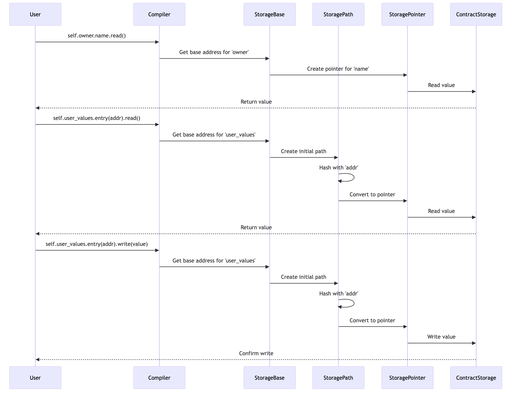

# Contract Storage

The contract’s storage is a persistent storage space where you can read, write, modify, and persist data. The storage is a map with
\\(2^{251}\\) slots, where each slot is a `felt252` initialized to 0.

Each storage slot is identified by a `felt252` value, called the storage address, which is computed from the variable's name and parameters that depend on the variable's type, outlined in the ["Addresses of Storage Variables"][storage addresses] section.

[storage addresses]: ./ch14-01-00-contract-storage.md#addresses-of-storage-variables

We can interact with the contract's storage in two ways:

1. Through high-level storage variables, which are declared in a special `Storage` struct annotated with the `#[storage]` attribute.
2. Directly accessing storage slots using their computed address and the low-level `storage_read` and `storage_write` syscalls. This is useful when you need to perform custom storage operations that don't fit well with the structured approach of storage variables, but should generally be avoided; as such, we will not cover them in this chapter.

## Declaring and Using Storage Variables

Storage variables in Starknet contracts are stored in a special struct called `Storage`:

```cairo, noplayground
{{#rustdoc_include ../listings/ch14-building-starknet-smart-contracts/listing_simple_storage/src/lib.cairo:storage}}
```

The `Storage` struct is a [struct][structs] like any other, except that it **must** be annotated with the `#[storage]` attribute. This annotation tells the compiler to generate the required code to interact with the blockchain state, and allows you to read and write data from and to storage. This struct can contain any type that implements the `Store` trait, including other structs, enums, as well as [Storage Mappings][storage mappings], [Storage Vectors][storage vecs], and [Storage Nodes][storage nodes]. In this section, we'll focus on simple storage variables, and we'll see how to store more complex types in the next sections.

[storage mappings]: ./ch14-01-01-storage-mappings.md
[storage vecs]: ./ch14-01-02-storage-vecs.md
[storage nodes]: ./ch14-01-00-contract-storage.md#storage-nodes
[structs]: ./ch05-00-using-structs-to-structure-related-data.md

### Accessing Storage Variables

Variables stored in the `Storage` struct can be accessed and modified using the `read` and `write` functions, respectively. All these functions are automatically generated by the compiler for each storage variable.

To read the value of the `owner` storage variable, which is of type `Person`, we call the `read` function on the `owner` variable, passing in no arguments.

```cairo, noplayground
{{#rustdoc_include ../listings/ch14-building-starknet-smart-contracts/listing_simple_storage/src/lib.cairo:read_owner}}
```

To write a new value to the storage slot of a storage variable, we call the `write` function, passing in the value as argument. Here, we only pass in the value to write to the `owner` variable as it is a simple variable.

```cairo, noplayground
{{#rustdoc_include ../listings/ch14-building-starknet-smart-contracts/listing_simple_storage/src/lib.cairo:write_owner}}
```

When working with compound types, instead of calling `read` and `write` on the struct variable itself, which would perform a storage operation for each member, you can call `read` and `write` on specific members of the struct. This allows you to access and modify the values of the struct members directly, minimizing the amount of storage operations performed. In the following example, the `owner` variable is of type `Person`. Thus, it has one attribute called `name`, on which we can call the `read` and `write` functions to access and modify its value.

```cairo, noplayground
{{#rustdoc_include ../listings/ch14-building-starknet-smart-contracts/listing_simple_storage/src/lib.cairo:read_owner_name}}
```

## Storing Custom Types with the `Store` Trait

The `Store` trait, defined in the `starknet::storage_access` module, is used to specify how a type should be stored in storage. In order for a type to be stored in storage, it **must** implement the `Store` trait. Most types from the core library, such as unsigned integers (`u8`, `u128`, `u256`...), `felt252`, `bool`, `ByteArray`, `ContractAddress`, etc. implement the `Store` trait and can thus be stored without further action. However, **memory collections**, such as `Array<T>` and `Felt252Dict<T>`, **cannot** be stored in contract storage - you will have to use the special types `Vec<T>` and `Map<K, V>` instead.

But what if you wanted to store a type that you defined yourself, such as an enum or a struct? In that case, you have to explicitly tell the compiler how to store this type.

In our example, we want to store a `Person` struct in storage, which is only possible by implementing the `Store` trait for the `Person` type. This can be simply achieved by adding a `#[derive(starknet::Store)]` attribute on top of our struct definition. Note that all the members of the struct need to implement the `Store` trait for the trait to be derived.

```cairo, noplayground
{{#rustdoc_include ../listings/ch14-building-starknet-smart-contracts/listing_simple_storage/src/lib.cairo:person}}
```

Similarly, Enums can only be written to storage if they implement the `Store` trait, which can be trivially derived as long as all associated types implement the `Store` trait.

Enums used in contract storage **must** define a default variant. This default variant is returned when reading an empty storage slot - otherwise, it will result in a runtime error.

Here's an example of how to properly define an enum for use in contract storage:

```cairo, noplayground
{{#rustdoc_include ../listings/ch14-building-starknet-smart-contracts/listing_simple_storage/src/lib.cairo:enum}}
```

In this example, we've added the `#[default]` attribute to the `Infinite` variant. This tells the Cairo compiler that if we try to read an uninitialized enum from storage, the `Infinite` variant should be returned.

You might have noticed that we also derived `Drop` and `Serde` on our custom types. Both of them are required for properly serializing arguments passed to entrypoints and deserializing their outputs.

## Structs Storage Layout

On Starknet, structs are stored in storage as a sequence of primitive types.
The elements of the struct are stored in the same order as they are defined in the struct definition. The first element of the struct is stored at the base address of the struct, which is computed as specified in the ["Addresses of Storage Variables"][storage addresses] section and can be obtained with `var.__base_address__`. Subsequent elements are stored at addresses contiguous to the previous element.
For example, the storage layout for the `owner` variable of type `Person` will result in the following layout:

| Fields  | Address                     |
| ------- | --------------------------- |
| name    | `owner.__base_address__`    |
| address | `owner.__base_address__ +1` |

Note that tuples are similarly stored in contract's storage, with the first element of the tuple being stored at the base address, and subsequent elements stored contiguously.

## Enums Storage Layout

When you store an enum variant, what you're essentially storing is the variant's index and eventual associated values. This index starts at 0 for the first variant of your enum and increments by 1 for each subsequent variant.
If your variant has an associated value, this value is stored starting from the address immediately following the address of the index of the variant.
For example, suppose we have the `Expiration` enum with the `Finite` variant that carries an associated limit date, and the `Infinite` variant without associated data. The storage layout for the `Finite` variant would look like this:

| Element                      | Address                           |
| ---------------------------- | --------------------------------- |
| Variant index (0 for Finite) | `expiration.__base_address__`     |
| Associated limit date        | `expiration.__base_address__ + 1` |

while the storage layout for the `Infinite` variant would be as follows:

| Element                        | Address                       |
| ------------------------------ | ----------------------------- |
| Variant index (1 for Infinite) | `expiration.__base_address__` |

<!-- TODO: add example -->

## Storage Nodes

A storage node is a special kind of struct that can contain storage-specific types, such as [`Map`][storage mappings], [`Vec`][storage vecs], or other storage nodes, as members. Unlike regular structs, storage nodes can only exist within contract storage and cannot be instantiated or used outside of it.
You can think of storage nodes as intermediate nodes involved in address calculations within the tree representing the contract's storage space. In the next subsection, we will introduce how this concept is modeled in the core library.

The main benefits of storage nodes is that they allow you to create more sophisticated storage layouts, including mappings or vectors inside custom types, and allow you to logically group related data, improving code readability and maintainability.

Storage nodes are structs defined with the `#[starknet::storage_node]` attribute. In this new contract that implements a voting system, we implement a `ProposalNode` storage node containing a `Map<ContractAddress, bool>` to keep track of the voters of the proposal, along with other fields to store the proposal's metadata.

```cairo, noplayground
{{#rustdoc_include ../listings/ch14-building-starknet-smart-contracts/listing_storage_node/src/lib.cairo:storage_node}}
```

When accessing a storage node, you can't `read` or `write` it directly. Instead, you have to access its individual members. Here's an example from our `VotingSystem` contract that demonstrates how we populate each field of the `ProposalNode` storage node:

```cairo, noplayground
{{#rustdoc_include ../listings/ch14-building-starknet-smart-contracts/listing_storage_node/src/lib.cairo:create_proposal}}
```

Because no voter has voted on this proposal yet, we don't need to populate the `voters` map when creating the proposal. But we could very well access the `voters` map to check if a given address has already voted on this proposal when it tries to cast its vote:

```cairo, noplayground
{{#rustdoc_include ../listings/ch14-building-starknet-smart-contracts/listing_storage_node/src/lib.cairo:vote}}
```

In this example, we access the `ProposalNode` for a specific proposal ID. We then check if the caller has already voted by reading from the `voters` map within the storage node. If they haven't voted yet, we write to the `voters` map to mark that they have now voted.

## Addresses of Storage Variables

The address of a storage variable is computed as follows:

- If the variable is a single value, the address is the `sn_keccak` hash of the ASCII encoding of the variable's name. `sn_keccak` is Starknet's version of the Keccak256 hash function, whose output is truncated to 250 bits.

- If the variable is composed of multiple values (i.e., a tuple, a struct or an enum), we also use the `sn_keccak` hash of the ASCII encoding of the variable's name to determine the base address in storage. Then, depending on the type, the storage layout will differ. See the ["Storing Custom Types"][custom types storage layout] section.

- If the variable is part of a [storage node][storage nodes], its address is based on a chain of hashes that reflects the structure of the node. For a storage node member `m` within a storage variable `variable_name`, the path to that member is computed as `h(sn_keccak(variable_name), sn_keccak(m))`, where `h` is the Pedersen hash. This process continues for nested storage nodes, building a chain of hashes that represents the path to a leaf node. Once a leaf node is reached, the storage calculation proceeds as it normally would for that type of variable.

- If the variable is a [Map][storage mappings] or a [Vec][storage vecs], the address is computed relative to the storage base address, which is the `sn_keccak` hash of the variable's name, and the keys of the mapping or indexes in the Vec. The exact computation is described in the ["Storage Mappings"][storage mappings] and ["Storage Vecs"][storage vecs] sections.

You can access the base address of a storage variable by accessing the `__base_address__` attribute on the variable, which returns a `felt252` value.

```cairo, noplayground
{{#rustdoc_include ../listings/ch14-building-starknet-smart-contracts/listing_01_reference_contract/src/lib.cairo:owner_address}}
```

This address calculation mechanism is performed through a modelisation of the contract storage space using a concept of StoragePointers and StoragePaths that we'll now introduce.

[custom types storage layout]: ./ch14-01-00-contract-storage.md#storing-custom-types

## Modeling of the Contract Storage in the Core Library

To understand how storage variables are stored in Cairo, it's important to note that they are not stored contiguously but in different locations in the contract's storage. To facilitate the retrieval of these addresses, the core library provides a model of the contract storage through a system of `StoragePointers` and `StoragePaths`.

Each storage variable can be converted to a `StoragePointer`. This pointer contains two main fields:

- The base address of the storage variable in the contract's storage.
- The offset, relative to the base address, of the specific storage slot being pointed to.

An example is worth a thousand words. Let's consider the `Person` struct defined in the previous section:

```cairo, noplayground
{{#rustdoc_include ../listings/ch14-building-starknet-smart-contracts/listing_simple_storage/src/lib.cairo:person}}
```

When we write `let x = self.owner;`, we access a variable of type `StorageBase` that represents the base location of the `owner` variable in the contract's storage.
From this base address, we can either get pointers to the struct's fields (like `name` or `address`) or a pointer to the struct itself. On these pointers, we can call `read` and `write`, defined in the `Store` trait, to read and write the values pointed to.

Of course, all of this is transparent to the developer. We can read and write to the struct's fields as if we were accessing regular variables, but the compiler translates these accesses into the appropriate `StoragePointer` manipulations under the hood.

For storage mappings, the process is similar, except that we introduce an intermediate type, `StoragePath`. A `StoragePath` is a chain of storage nodes and struct fields that form a path to a specific storage slot. For example, to access a value contained in a `Map<ContractAddress, u128>`, the process would be the following:

1. Start at `StorageBase` of the `Map`, and convert it to a `StoragePath`.
2. Walk the `StoragePath` to reach the desired value using the `entry` method, which, in the case of a `Map`, hashes the current path with the next key to
   generate the next `StoragePath`.
3. Repeat step 2 until the `StoragePath` points to the desired value, converting the final value to a `StoragePointer`
4. Read or write the value at that pointer.

Note that we need to convert the `ContractAddress` to a `StoragePointer` before being able to read or write to it.



<!-- ./mermaid-storage-model.txt -->

## Summary

In this chapter, we covered the following key points:

- **Storage Variables**: These are used to store persistent data on the blockchain. They are defined in a special `Storage` struct annotated with the `#[storage]` attribute.
- **Accessing Storage Variables**: You can read and write storage variables using automatically generated `read` and `write` functions. For structs, you can access individual members directly.
- **Custom Types with the `Store` Trait**: To store custom types like structs and enums, they must implement the `Store` trait. This can be achieved using the `#[derive(starknet::Store)]` attribute or writing your own implementation.
- **Addresses of Storage Variables**: The address of a storage variable is computed using the `sn_keccak` hash of its name, and additional steps for special types. For complex types, the storage layout is determined by the type's structure.
- **Structs and Enums Storage Layout**: Structs are stored as a sequence of primitive types, while enums store the variant index and potential associated values.
- **Storage Nodes**: Special structs that can contain storage-specific types like `Map` or `Vec`. They allow for more sophisticated storage layouts and can only exist within contract storage.

Next, we'll focus on the `Map` and `Vec` types in depth.
