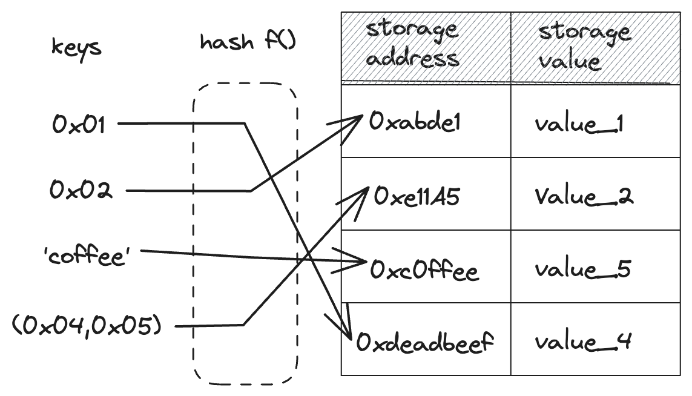

# Contract Storage

The most common way for interacting with a contract’s storage is through storage variables. As stated previously, storage variables allow you to store data that will be stored in the contract's storage that is itself stored on the blockchain. These data are persistent and can be accessed and potentially modified anytime once the contract is deployed.

Storage variables in Starknet contracts are stored in a special struct called `Storage`:

```rust, noplayground
{{#rustdoc_include ../listings/ch14-building-starknet-smart-contracts/listing_01_reference_contract/src/lib.cairo:storage}}
```

The `Storage` struct is a [struct][structs chapter] like any other, except that it **must** be annotated with the `#[storage]` attribute. This annotation tells the compiler to generate the required code to interact with the blockchain state, and allows you to read and write data from and to storage. Moreover, this allows you to define storage mappings using the dedicated `Map` type.

Variables declared in the `Storage` struct are not stored contiguously but in different locations in the contract's storage. The storage address of a particular variable is determined by the variable's name, and the eventual keys of the variable if it is a mapping.

[structs chapter]: ./ch05-00-using-structs-to-structure-related-data.md

## Addresses of Storage Variables

The address of a storage variable is computed as follows:

- If the variable is a single value, the address is the `sn_keccak` hash of the ASCII encoding of the variable's name. `sn_keccak` is Starknet's version of the Keccak256 hash function, whose output is truncated to 250 bits.

- If the variable is composed of multiple values (i.e., a tuple, a struct or an enum), we also use the `sn_keccak` hash of the ASCII encoding of the variable's name to determine the base address in storage. Then, depending on the type, the storage layout will differ. See the ["Storing Custom Types"][custom types storage layout] section.

- If the variable is a [mapping][storage mappings] with a key `k`, the address of the value at key `k` is `h(sn_keccak(variable_name),k)`, where ℎ is the Pedersen hash and the final value is taken modulo \\( {2^{251}} - 256\\). If the key is composed of more than one `felt252`, the address of the value will be `h(...h(h(sn_keccak(variable_name),k_1),k_2),...,k_n)`, with `k_1,...,k_n` being all `felt252` that constitute the key. In the case of mappings to complex values (e.g., tuples or structs), then this complex value lies in a continuous segment starting from the address calculated with the previous formula. Note that 256 field elements is the current limitation on the maximal size of a complex storage value.

- If the variable is part of a [storage node][storage nodes], its address is based on a chain of hashes that reflects the structure of the node. For a storage node member `m` within a storage variable `variable_name`, the path to that member is computed as `h(sn_keccak(variable_name), sn_keccak(m))`, where `h` is the Pedersen hash. This process continues for nested storage nodes, building a chain of hashes that represents the path to a leaf node. Once a leaf node is reached he storage calculation proceeds as it normally would for that type of variable.

You can access the base address of a storage variable by accessing the `__base_address__` attribute on the variable, which returns a `felt252` value.

```rust, noplayground
{{#rustdoc_include ../listings/ch14-building-starknet-smart-contracts/listing_01_reference_contract/src/lib.cairo:owner_address}}
```

[custom types storage layout]: ./ch14-01-contract-storage.md#storing-custom-types
[storage mappings]: ./ch14-01-contract-storage.md#storage-mappings
[storage nodes]: ./ch14-01-contract-storage.md#storage-nodes

## Accessing Storage Variables

Variables stored in the `Storage` struct can be accessed and modified using the `read` and `write` functions, respectively. As previously mentioned, you can access their address in storage through the `address` field. All these functions are automatically generated by the compiler for each storage variable.

### Accessing full types

To read the value of the `owner` storage variable, which is of type `Person`, we call the `read` function on the `owner` variable, passing in no arguments.

```rust, noplayground
{{#rustdoc_include ../listings/ch14-building-starknet-smart-contracts/listing_01_reference_contract/src/lib.cairo:read_owner}}
```

To write a new value to the storage slot of a storage variable, we call the `write` function, passing in the value as argument. Here, we only pass in the value to write to the `owner` variable as it is a simple variable.

```rust, noplayground
{{#rustdoc_include ../listings/ch14-building-starknet-smart-contracts/listing_01_reference_contract/src/lib.cairo:write_owner}}
```

### Accessing mappings

To read the value of the storage variable `names`, which is a mapping from `ContractAddress` to `felt252`, we first need to retrieve the entry path for the specific key in the mapping. We do this by calling the `entry` method on the `names` variable, passing in the `address` as a parameter. This gives us access to the specific entry in the mapping.
Once we have the entry path, we can call the `read` function on it to retrieve the stored value.

If the mapping had more than one key, we would chain multiple `entry` calls before the final `read`, passing in each key as a parameter.

```rust, noplayground
{{#rustdoc_include ../listings/ch14-building-starknet-smart-contracts/listing_01_reference_contract/src/lib.cairo:read}}
```

Similarly, to write a value in a storage mapping, we need to retrieve the storage entry path corresponding to the key, just as we did when reading the value. Once we have this entry path, we can call the `write` function on it with the value to write. If the mapping had more than one key, we would chain multiple `entry` calls with respective keys before the final `write`, passing in value as a parameter.

```rust, noplayground
{{#rustdoc_include ../listings/ch14-building-starknet-smart-contracts/listing_01_reference_contract/src/lib.cairo:write}}
```

### Accessing Individual Storage Members

When working with structs, instead of calling `read` and `write` on the struct variable itself, you can call `read` and `write` on the individual members of the struct. This allows you to access and modify the values of the struct members directly, minimizing the amount of storage operations performed. In the following example, the `owner` variable is of type `Person`. Thus, it has one attribute called `name`, on which we can call the `read` and `write` functions to access and modify the value of the `name` attribute.

```rust, noplayground
{{#rustdoc_include ../listings/ch14-building-starknet-smart-contracts/listing_01_reference_contract/src/lib.cairo:read_owner_name}}
```

## Storing Custom Types

The `Store` trait, defined in the `starknet::storage_access` module, is used to specify how a type should be stored in storage. In order for a type to be stored in storage, it **must** implement the `Store` trait. Most types from the core library, such as unsigned integers (`u8`, `u128`, `u256`...), `felt252`, `bool`, `ByteArray`, `ContractAddress`, etc. implement the `Store` trait and can thus be stored without further action.

But what if you wanted to store a type that you defined yourself, such as an enum or a struct? In that case, you have to explicitly tell the compiler how to store this type.

In our example, we want to store a `Person` struct in storage, which is only possible by implementing the `Store` trait for the `Person` type. This can be simply achieved by adding a `#[derive(starknet::Store)]` attribute on top of our struct definition. Note that all the members of the struct need to implement the `Store` trait.

```rust, noplayground
{{#rustdoc_include ../listings/ch14-building-starknet-smart-contracts/listing_01_reference_contract/src/lib.cairo:person}}
```

Similarly, Enums can only be written to storage if they implement the `Store` trait, which can be trivially derived as long as all associated types implement the `Store` trait.

```rust, noplayground
{{#rustdoc_include ../listings/ch14-building-starknet-smart-contracts/listing_01_reference_contract/src/lib.cairo:enum_store}}
```

You might have noticed that we also derived `Drop` and `Serde` on our custom types. Both of them are required for properly serializing arguments passed to entrypoints and deserializing their outputs.

## Storing Collections

When working with smart contracts, you may need to store collections of values. While Cairo doesn't allow direct storage of arrays of type `Array<T>`, the core library provides a storage-specific type named `Vec`. The `Vec` type enables you to maintain vector-like collections within your contract's storage.

In our registry contract, we would like to be able to track all the addresses that have registered a name. To do this, we will use a `Vec` to store all the registered addresses.
Everytime a new registration is made, we will push the address to the `all_addresses` storage variable.

```rust, noplayground
{{#rustdoc_include ../listings/ch14-building-starknet-smart-contracts/listing_01_reference_contract/src/lib.cairo:store_address}}
```

<!-- show how we read all addresses and return them fro man entrypoint-->

We would also like to be able to get the entire list of registered addresses. To do this, we will sequentially read all the addresses stored in the `all_addresses` variable and return them as an `Array<ContractAddress>`.

```rust, noplayground
{{#rustdoc_include ../listings/ch14-building-starknet-smart-contracts/listing_01_reference_contract/src/lib.cairo:get_addresses}}
```

## Storage Nodes

A storage node is a special kind of struct that can contain storage-specific types, such as `Map` or `Vec`, as members. Unlike regular structs, storage nodes can only exist within contract storage and cannot be instantiated or used outside of it.
You can think of storage nodes as intermediate nodes in a tree representing the contract's storage space:

- The actual storage content is stored in the leaves of this tree.
- Storage nodes are internal branches, allowing you to create more complex paths to these leaves.
- This tree-like structure enables more flexible and sophisticated storage layouts in Cairo contracts.

The main benefits of storage nodes is that they allow you to create more sophisticated storage layouts, including nested mappings and custom types, and allow you to logically group related data, improving code readability and maintainability.

### Using Storage Nodes

Here's how you define a storage node:

```rust
{{#rustdoc_include ../listings/ch14-building-starknet-smart-contracts/listing_01_reference_contract/src/lib.cairo:storage_node_def}}
```

The `#[starknet::storage_node]` attribute tells the compiler that this struct is a storage node. This allows us to use types like Map within the struct, which wouldn't be possible with a regular struct in storage.

In our contract's storage, the `registrations` field is a mapping where each value points to a `RegistrationNode`.

When accessing a storage node, you can't `read` or `write` it directly. Instead, you access its individual members. Here's an example from our `NameRegistry` contract:

```rust
{{#rustdoc_include ../listings/ch14-building-starknet-smart-contracts/listing_01_reference_contract/src/lib.cairo:storage_node}}
```

In this example, we create a new `RegistrationInfo`, and access the `RegistrationNode` for a specific user. We write to the `info` field of the node, read the current value of `count`, use it to write to the `history` map, and then increment it.

### Comparison with Regular Structs

The following table summarizes the differences between regular structs and storage nodes:

| Aspect        | Regular Structs                           | Storage Nodes                                           |
| ------------- | ----------------------------------------- | ------------------------------------------------------- |
| Usage         | Can be used anywhere in the code          | Can only be used within contract storage                |
| Members       | Limited to other regular types            | Can include storage-specific types like `Map` and `Vec` |
| Storage       | Stored contiguously in storage            | Members can be spread across storage                    |
| Flexibility   | Less flexible for complex storage layouts | More flexible, allowing nested and complex structures   |
| Instantiation | Can be instantiated in memory             | Cannot be instantiated, only used as storage references |

## Structs Storage Layout

On Starknet, structs are stored in storage as a sequence of primitive types.
The elements of the struct are stored in the same order as they are defined in the struct definition. The first element of the struct is stored at the base address of the struct, which is computed as specified in ["Addresses of Storage Variables"][storage addresses] section and can be obtained with `var.__base_address__` and subsequent elements are stored at addresses contiguous to the first element.
For example, the storage layout for the `owner` variable of type `Person` will result in the following layout:

| Fields  | Address                     |
| ------- | --------------------------- |
| name    | `owner.__base_address__`    |
| address | `owner.__base_address__ +1` |

Note that tuples are similarly stored in contract's storage, with the first element of the tuple being stored at the base address, and subsequent elements stored contiguously.

[storage addresses]: ./ch14-01-contract-storage.html#addresses-of-storage-variables

## Enums Storage Layout

When you store an enum variant, what you're essentially storing is the variant's index and eventual associated values. This index starts at 0 for the first variant of your enum and increments by 1 for each subsequent variant.
If your variant has an associated value, this value is stored starting from the address immediately following the address of the index of the variant.
For example, suppose we have the `RegistrationType` enum with the `finite` variant that carries an associated limit date, and the `infinite` variant without associated data. The storage layout for the `finite` variant would look like this:

| Element                      | Address                                  |
| ---------------------------- | ---------------------------------------- |
| Variant index (0 for finite) | `registration_type.__base_address__`     |
| Associated limit date        | `registration_type.__base_address__ + 1` |

while the storage layout for the `infinite` would be as follows:

| Element                        | Address                              |
| ------------------------------ | ------------------------------------ |
| Variant index (1 for infinite) | `registration_type.__base_address__` |

## Storage Mappings

Storage mappings are similar to hash tables in that they allow mapping keys to values. However, unlike a typical hash table, the key data itself is not stored - only its hash is used to look up the associated value in the contract's storage.
Mappings do not have a concept of length or whether a key/value pair is set. All values are by default set to 0. The only way to remove an entry from a mapping is to set its value to the default zero value.

Mappings are only used to compute the location of data in the storage of a
contract given certain keys. They are thus **only allowed as storage variables**.
They cannot be used as parameters or return parameters of contract functions,
and cannot be used as types inside structs.

<div align="center">
    
<div align="center">
    </div>
    <span class="caption">Mapping keys to storage values</span>
</div>

To declare a mapping, use the `Map` type enclosed in angle brackets `<>`,
specifying the key and value types.

Note: You might encounter `LegacyMap` in older code or documentation. This was the previous mapping type used in Cairo contracts, but it has been deprecated in favor of the more flexible `Map` type. If you are using `LegacyMap`, it's recommended to update it to `Map` that provides more control over storage, as they have identical storage layouts allowing for a safe migration.

You can also create more complex mappings with multiple keys. You can find in Listing {{#ref storage-mapping}} the popular `allowances` storage variable of the ERC20 Standard which maps an `owner` and an allowed `spender` to their `allowance` amount using multiple keys passed inside a tuple:

```rust, noplayground
{{#rustdoc_include ../listings/ch14-building-starknet-smart-contracts/listing_02_storage_mapping/src/lib.cairo:here}}
```

{{#label storage-mapping}}
<span class="caption">Listing {{#ref storage-mapping}}: Storing a mapping with multiple keys inside a tuple</span>

The address in storage of a variable stored in a mapping is computed according to the description in the ["Addresses of Storage Variables"][storage addresses] section.

If the key of a mapping is a struct, each element of the struct constitutes a key. Moreover, the struct should implement the `Hash` trait, which can be derived with the `#[derive(Hash)]` attribute. For example, if you have a struct with two fields, the address will be `h(h(sn_keccak(variable_name),k_1),k_2)` modulo \\( {2^{251}} - 256\\), where `k_1` and `k_2` are the values of the two fields of the struct.

Similarly, in the case of a nested mapping using a tuple as key, such as `Map<ContractAddress, Map<ContractAddress, u8>>,`, the address will be computed in the same way, with each element of the tuple being a key: `h(h(sn_keccak(variable_name),k_1),k_2)`.

[storage addresses]: ./ch14-01-contract-storage.html#addresses-of-storage-variables
