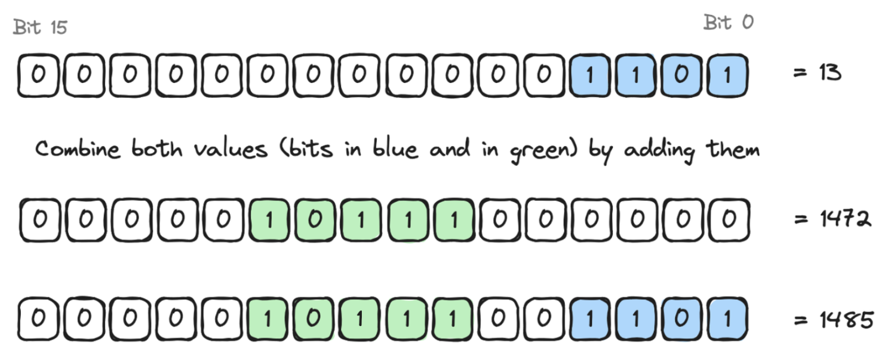

# Optimizing Storage Costs

Bit-packing is a simple concept: use as few bits as possible to store a piece of data. When done well, it can significantly reduce the size of the data you need to store. This is especially important in smart contracts, where storage is expensive.

When writing Cairo smart contracts, it is important to optimize storage usage to reduce gas costs. Indeed, most of the cost associated with a transaction is related to storage updates; and each storage slot costs gas to write to.
This means that by packing multiple values into fewer slots, you can decrease the gas cost incurred by the users of your smart contract.

## Integer Structure and Bitwise Operators

An integer is coded on a certain number of bits, depending on its size (For example, a `u8` integer is coded on 8 bits).

<div align="center">
    
<div align="center">
</div>
    <span class="caption">Representation of a u8 integer in bits</span>
</div>

Intuitively, several integers can be combined into a single integer if the size of this single integer is greater than or equal to the sum of the sizes of the integers (For example, two `u8` and one `u16` in one `u32`).

But, to do that, we need some bitwise operators:

- multiplying or dividing an integer by a power of 2 shifts the integer value to the left or to the right respectively

<div align="center">
    
<div align="center">
</div>
    <span class="caption">Shifting to the left or to the right an integer value</span>
</div>

- applying a mask (`AND` operator) on an integer value isolates some bits of this integer

<div align="center">
    
<div align="center">
</div>
    <span class="caption">Isolate bits with a mask</span>
</div>

- adding (`OR` operator) two integers will combine both values into a single one.

<div align="center">
    
<div align="center">
</div>
    <span class="caption">Combining two integers</span>
</div>

With these bitwise operators, let's see how to combine two `u8` integers into a single `u16` integer (called `packing`) and reversely (called `unpacking`) in the following example:

<div align="center">
    
<div align="center">
</div>
    <span class="caption">Packing and unpacking integer values</span>
</div>

## Bit-packing in Cairo

The storage of a Starknet smart contract is a map with 2<sup>251</sup> slots, where each slot is a `felt252` which is initialized to 0.

As we saw earlier, to reduce gas costs due to storage updates, we have to use as few bits as possible, so we have to organize stored variables by packing them.

For example, consider the following `Sizes` struct with 3 fields of different types: one `u8`, one `u32` and one `u64`. The total size is 8 + 32 + 64 = 104 bits. This is less than a slot size (i.e 251 bits) so we can pack them together to be stored into a single slot.

Note that, as it also fits in a `u128`, it's a good practice to use the smallest type to pack all your variables, so here a `u128` should be used.

```cairo,noplayground
{{#include ../listings/ch16-building-advanced-starknet-smart-contracts/listing_01_storage_packing/src/lib.cairo:struct}}
```

To pack these 3 variables into a `u128` we have to successively shift them to the left, and finally sum them.

<div align="center">
    
<div align="center">
</div>
    <span class="caption">Sizes packing</span>
</div>

To unpack these 3 variables from a `u128` we have to successively shift them to the right and use a mask to isolate them.

<div align="center">
    
<div align="center">
</div>
    <span class="caption">Sizes unpacking</span>
</div>

## The `StorePacking` Trait

Cairo provides the `StorePacking` trait to enable packing struct fields into fewer storage slots. `StorePacking<T, PackedT>` is a generic trait taking the type you want to pack (`T`) and the destination type (`PackedT`) as parameters. It provides two functions to implement: `pack` and `unpack`.

Here is the implementation of the example of the previous chapter:

```cairo,noplayground
{{#include ../listings/ch16-building-advanced-starknet-smart-contracts/listing_01_storage_packing/src/lib.cairo:here}}
```

<div align="center">
    <span class="caption">Optimizing storage by implementing the `StorePacking` trait.</span>
</div>

In this code snippet, you see that:

- `TWO_POW_8` and `TWO_POW_40` are used to shift left in the `pack` function and shift right in the `unpack`function,
- `MASK_8` and `MASK_32` are used to isolate a variable in the `unpack` function,
- all the variables from the storage are converted to `u128` to be able to use bitwise operators.

This technique can be used for any group of fields that fit within the bit size of the packed storage type. For example, if you have a struct with multiple fields whose bit sizes add up to 256 bits, you can pack them into a single `u256` variable. If the bit sizes add up to 512 bits, you can pack them into a single `u512` variable, and so on. You can define your own structs and logic to pack and unpack them.

The rest of the work is done magically by the compiler - if a type implements the `StorePacking` trait, then the compiler will know it can use the `StoreUsingPacking` implementation of the `Store` trait in order to pack before writing and unpack after reading from storage.
One important detail, however, is that the type that `StorePacking::pack` spits out also has to implement `Store` for `StoreUsingPacking` to work. Most of the time, we will want to pack into a felt252 or u256 - but if you want to pack into a type of your own, make sure that this one implements the `Store` trait.
