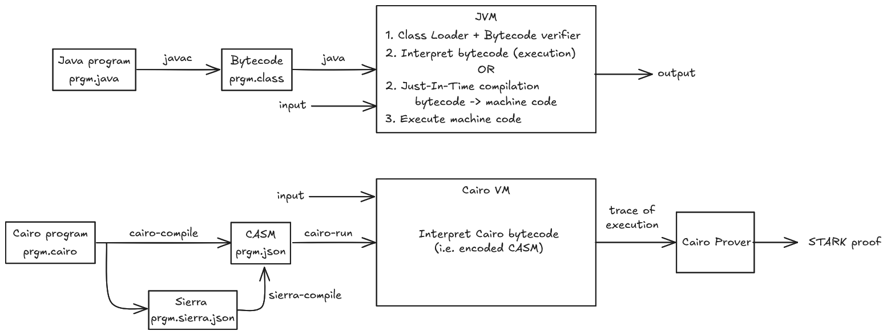

# Introduction

Ever wondered how your Cairo programs were executed?

First, they are compiled by the Cairo Compiler, then executed
by the Cairo Virtual Machine, or _Cairo VM_ for short,
which generates a trace of execution, used by the Prover
to generate a STARK proof of that execution. This proof can later
be verified by a Verifier.

The following chapters will go deep inside the inner workings of the Cairo VM.
We'll cover its architecture, its memory model, and its execution model.
Next, we'll explore builtins and hints, their purpose, and how they work.
Finally, we'll look at the runner, which orchestrates the execution of a Cairo program.

But first, what do we mean by "virtual machine"?

## Virtual Machine

Virtual Machines (VMs) are software emulations of physical computers.
They provide a complete programming environment through an API which
includes everything required for the correct execution of programs above it.

Every virtual machine API includes an instruction set architecture (ISA)
in which to express programs. It could be the same instruction set as some
physical machine (e.g. RISC-V), or a dedicated one implemented in the VM
(e.g. Cairo assembly, CASM).

Those that emulate an OS are called _System Virtual Machines_, such as Xen and VMWare.
We're not interested in them here.

The other ones we're interested in are _Process Virtual Machines_.
They provide the environment needed by a single user-level process.

The most well-known process VM might be the Java Virtual Machine (JVM).

- Given a Java program `prgm.java`, it is compiled into a class `prgm.class`,
  containing _Java bytecode_ (JVM instructions and metadata).
- The JVM verifies that the bytecode is safe to run.
- The bytecode is either interpreted (slow) or compiled to machine code just in time (JIT, fast).
- If using JIT, the bytecode is translated to machine code while executing the program.
- Java programs could also be directly compiled to a specific CPU architecture (read machine code) through a process called _ahead-of-time compilation_ (AOT).

The Cairo VM is also a process VM, similar to the JVM, with one significant difference:
Java and its JVM are designed for (platform-independent) general-purpose computing,
while Cairo and its Cairo VM are specifically designed for (platform-independent)
_provable_ general-purpose computing.

- A Cairo program `prgm.cairo` is compiled into compilation artifacts `prgm.json`,
  containing _Cairo bytecode_ (encoded CASM, the Cairo instruction set, and extra data).
- As seen in the [introduction](ch00-00-introduction.md), Cairo Zero directly compiles to CASM
  while Cairo first compiles to _Sierra_ and then to a safe subset of CASM.
- The Cairo VM _interprets_ the provided CASM and generates a trace of the program execution.
- The obtained trace data can be fed to the Cairo Prover in order to generate a STARK proof,
  allowing to prove the correct execution of the program. Creating this _validity proof_ is the
  main purpose of Cairo.

Here is a high-level flow diagram showing how a Java program and a Cairo one are executed
with their respective compiler and VM. The proof generation of a Cairo program is included.

  

  Java and Cairo program high-level execution flow diagram

An ongoing project, [Cairo Native][cairo-native] works on providing
Sierra to machine code compilation, including JIT and AOT, for executing Cairo programs.

Even though the high-level flow of both VMs is similar, their actual architectures
are extremely different: the instruction set, the memory model, Cairo's non-determinism
and the output.

[cairo-native]: https://github.com/lambdaclass/cairo_native

## References

Michael L. Scott, in Programming Language Pragmatics, 2015
