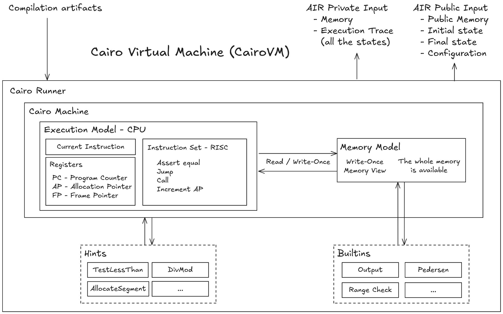

# Architecture

Cairo is a STARK-friendly Von Neumann architecture capable of generating validity proofs
of arbitrary computation. STARK-friendly means that the Cairo design favors the STARK
proof system while being capable of using another proof system backend.
It is a Turing-complete process virtual machine.

Cairo is made of three softwares:

1. The Cairo compiler
2. The Cairo Virtual Machine (CairoVM)
3. The Cairo prover and verifier

The Cairo compiler transforms the Cairo code you've written to Cairo bytecode (encoded instructions and metadata).
We usually refer to the compiler output as the _compilation artifacts_.

The CairoVM implements the theoretic _Cairo machine_,
reading the compilation artifacts and executing the instructions
to produce the information required by the prover to generate a proof,
and for the verifier to verify it.
Its outputs are referred to as the _AIR (Arithmetic Intermediate Representation) private input_ (witness) and _AIR public input_:

- The AIR private input includes the _execution trace_, or simply the trace, and the _memory_.
- The AIR public input includes the _initial & final states_ — the first and last entry of the trace —
  the _public memory_ — a subset of the memory — and configuration data
  (e.g. layout) of the run.

The prover takes the AIR's private and public inputs to generate proof
of the corresponding program execution.
The verifier can then (i.e. asynchronously) verify the
proof's correctness, given the proof and the AIR public input.

What are AIRs, though?

## Arithmetic Intermediate Representation - AIR

AIR stands for _Arithmetic Intermediate Representation_, which is an arithmetization
technique. Arithmetization is the basis of every proof system: STARK uses AIRs,
though other proof systems might rely on different techniques (e.g. R1CS, PLONKish arithmetization...).
It allows converting a computational statement into a set of polynomial equations.
These polynomial equations then represent the constraints of your system:
If they all hold while following the proof system protocol, then the proof is valid;
otherwise, it's not.

At its heart, Cairo is then a set of AIRs that represent a Turing-complete machine for the Cairo ISA: the _Cairo machine_.
This way, one can prove any statement (i.e. arbitrary code) through the Cairo machine.

The Cairo machine abstracts the need to write AIRs for the program you would like to prove,
and Cairo, as a language, allows having a human-readable interface to use the Cairo machine.

Each component of the Cairo machine has its corresponding AIR: the CPU, the Memory, the Builtins...

Good AIRs are critical to the performance of generating and verifying proof.
Indeed, there can be many ways of expressing a computational statement into polynomials,
but not all are equal. Writing optimal AIRs is a long and tedious process.

We won't go any further on AIRs here, but it's good to know that the CairoVM's purpose
is to provide the required inputs to the Cairo prover for it to generate proof of the given Cairo program.
In a nutshell, the Cairo prover and verifier job is to verify that the constraints
defined by the Cairo AIR holds for the CairoVM outputs.

## Cairo Machine

The Cairo machine is the theoretical model that defines the Von Neumann architecture to
prove arbitrary computation.

Two models define the Cairo Machine:

- CPU, or Execution model - The Instruction Set Architecture (ISA)
- Memory model - Non-deterministic Read-only Memory

The Execution model defines the ISA: the instruction set, the registers `(pc, ap, fp)`, and
the state transition algorithm. Cairo has its own ISA optimized for proof generation/verification: it is a custom ZK-ISA, oppsed to general-purpose ISA such as RISC-V.
The Memory model defines how the CPU interacts with the memory.
Following a Von Neumann architecture, the same memory stores both the program and instruction data.

There are two versions of the Cairo machine: the _deterministic machine_, used
by the prover, and the _non-deterministic_ one, used by the verifier.

Why are there two versions of the Cairo machine, one for the prover and one for the verifier?

### Deterministic and Non-deterministic Cairo Machine

The deterministic machine takes a trace (a sequence of states) and the whole memory
(a memory function), and verifies that the transition between two consecutive states is valid.
It returns `accept` if all state transitions are valid and `reject` otherwise.
This machine does not perform any computation, it only asserts the validity of a trace
and its memory.

The non-deterministic machine relies on the deterministic one: it only takes the initial
state, the final state, and a partial memory function (i.e. the public memory)
and returns `accept` if there exists a sequence of states (a trace)
with the same initial and final states and a memory function that extends the partial memory
(a whole memory that includes the public-memory) which is accepted by the deterministic machine.

The deterministic machine allows the prover to generate a proof, while the non-deterministic
machine allows the verifier to verify the proof succinctly in a zero-knowledge way
(some data can be kept private from the verifier).

The CairoVM is the implementation of this theoretical machine,
including some functionalities to benefit from its design (_builtins_ & _hints_).
Among the various implementations of the CairoVM, what we call the _Cairo Runner_ is the
entrypoint for running a Cairo program and generating the AIR inputs needed for proof.

When a Cairo program is executed by the CairoVM, we could view the memory model as a Write-Once one.

#### Recap - Differences between the two Cairo machines

We could recap in a table the key differences between the deterministic Cairo machine,
and the non-deterministic one.

|        | Deterministic Cairo Machine | Non-Deterministic Cairo Machine |
| ------ | --------------------------- | ------------------------------- |
| Usage  | Prover                      | Verifier                        |
| Hints  | Executed                    | Not aware of them               |
| Memory | Complete memory             | Public memory only              |
| Trace  | Full execution trace        | Initial & Final states only     |

## Cairo Virtual Machine Architecture Diagram

The following diagram represent the architecture of the CairoVM,
to generate the AIR inputs for the proof system.

  

