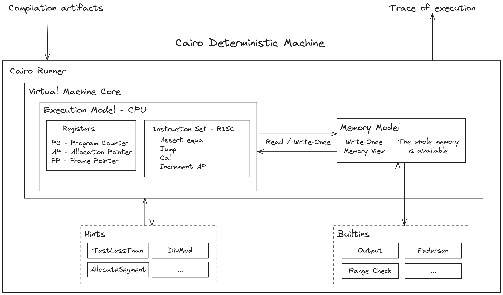
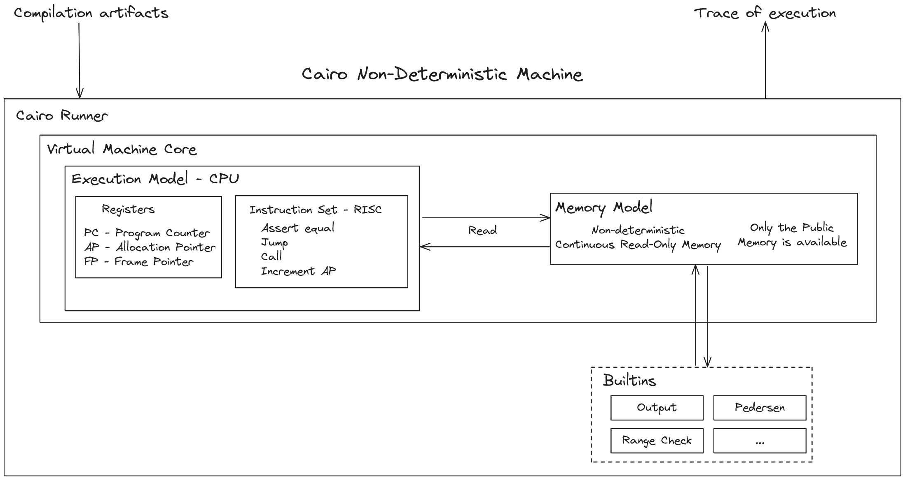

# Architecture

Cairo is made of three softwares:

- Cairo compiler
- Cairo VM
- Cairo prover and verifier

The Cairo VM takes the Cairo bytecode produced
by the Cairo compiler, interprets it and provides
the expected input for the prover to generate
a STARK proof. The verifier can later
(i.e. asynchronously) verify the
correctness of the proof.

## Overview

The Cairo VM has three core components,
the _Execution Model_, also called CPU,
the _Memory model_ and the _Runner_.

The CPU defines the _Instruction Set Architecture_ (ISA):
the available instructions, the registers and the state transition algorithm.

The Memory model defines how memory is managed when executing a Cairo program.

The Runner orchestrates all the different parts of the architecture,
it is the entrypoint and the endpoint when executing a program.
It handles the initialization of the run, the run and its finalization.

Those three components are enough to run a basic Cairo program.

The Cairo architecture also contains two additional components,
builtins, used to increase performance and _Prover hints_,
or simply _hints_ to take advantage of the non-determinism
introduced by the memory model.

## Deterministic and Non-Deterministic Machine

There are two different view of the Cairo VM,
the _deterministic machine_ and the _non-deterministic_
machine.

- When used by the Prover, the Cairo VM is deterministic.
- When used by the Verifier, the Cairo VM is non-deterministic.

When considering the Cairo VM as a deterministic machine,
we can view the memory model as _Write-Once_.

There are three key differences between the deterministic and
non-deterministic machine:

- Hints are only available to the deterministic machine.
- The deterministic machine has a full access to the memory,
  while the non-deterministic one has only a partial access to the memory,
  called the _Public memory_.
- The deterministic machine has the full list of states (values taken
  by the registers) available while the non-deterministic one only has
  access to the _initial_ and _final_ states.

The following diagrams represent the architecture of the Cairo VM
as a deterministic machine and a non-deterministic one.

  " width="800px"/>

  Cairo VM architecture as a deterministic machine

  " width="800px"/>

  Cairo VM architecture as a non-deterministic machine

## Arithmetic Intermediate Representation - AIR

When proving a program execution, one way is writing
an AIR for such program. An AIR can be seen as a
system of polynomial equations, which defines constraints.
However, it can become tedious to design AIR for every
program that you wanna prove, as this process is quite hard.

The goal of Cairo is to abstracts those AIR, by defining
a single AIR representing the CPU and its memory
which is able to execute any program.
As Cairo is Turing-complete, any program
can be proven from the defined AIR.

Builtins are predefined operations in the Cairo architecture,
when used they add constraints to the CPU AIR
(i.e. additional set of equations to the CPU AIR).

We'll not discuss AIR here but it is important to know that
behind Cairo as a language and the Cairo VM, there are
cryptographic maths happening.
