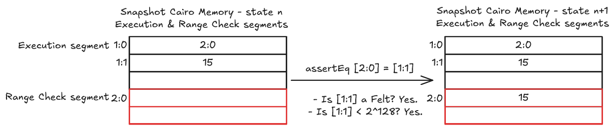
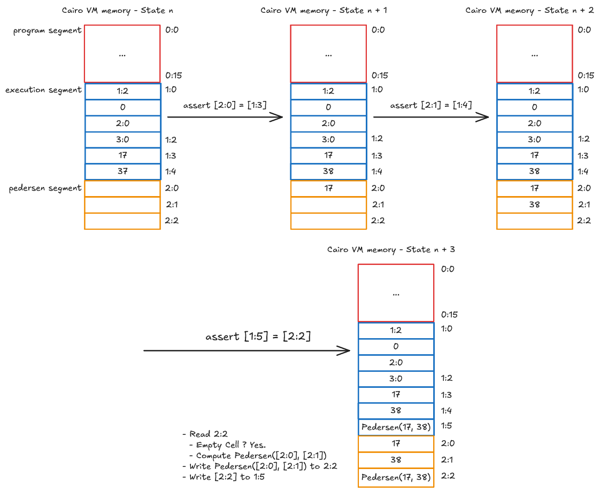

# How Builtins Work

A builtin enforces some constraints on the Cairo memory
to perform specific tasks, such as computing a hash.

Each builtin works on a dedicated memory segment,
which represents in the end a fixed address range.
This communication method is called _memory-mapped I/O_:
specific ranges of memory addresses dedicated to builtins.

For a Cairo program to interact with a builtin, it simply
needs to read or write to the corresponding memory cells.

There are two main types of builtin constraints that we'll
refer as _validation property_ and _deduction property_.
The builtins with a deduction property are usually split
in block of cells where some cells are constrained by
a validation property

If the defined property doesn't hold, then the Cairo VM
will panic.

## Validation Property

A validation property defines constraints a value must
hold for it to be written to a builtin memory cell.

For example, the _Range Check_ builtin only accepts felts and verify
that such a felt is within the range `[0, 2**128)`.
A program can write a value to the Range Check builtin
only if those two constraints hold. Those two constraints
represent the validation property of the Range Check builtin.

  

  Diagram of the Cairo VM memory using the Range Check builtin

## Deduction Property

A deduction property defines constraints on a block
of cells, when reading or writing to a cell.

A block of cells has two categories of cells:

- _Input cells_ - cells the program can write to,
  their constraints are similar to a validation property.
- _Output cells_ - cells the program must read,
  and their value is computed based on the deduction
  property and the input cells value.

A program that only writes to the input cells, without
ever reading the output cell, is valid as long as the constraints
on those cells hold. Though, it is useless.

For example, the _Pedersen_ builtin works with triplets of cells:

- Two input cells to store two felts, `a` and `b`.
- One output cell which will store `Pedersen(a, b)`.

To compute the Pedersen hash of `a` and `b`, the program must:

- Write `a` to the first cell
- Write `b` to the second cell
- Read the third cell, which will compute and write `Pedersen(a, b) to it.

In the following diagram, the Pedersen builtin is used,
highlighting its deduction property: the output cell `2:2`
being read when writing its value to the cell `1:5`.

  

  Diagram of the Cairo VM memory using the Pedersen builtin

