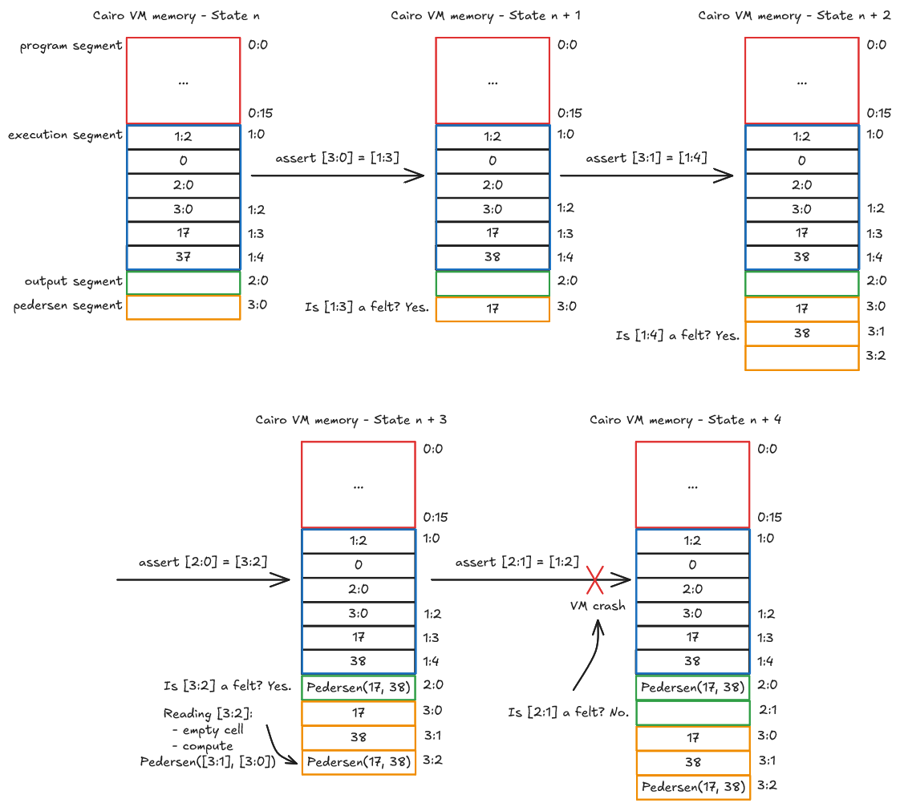

# How Builtins Work

In this section we'll see how builtins work.

Builtins are AIRs that enforce specific properties.
During a program execution, a builtin is assigned
a memory segment with properties that match its AIR.

When reading a cell value or asserting a value to a cell,
the properties of the builtin must always hold.
If it doesn't, it means that the program execution
cannot be proven, and the Cairo VM terminates.

There are two types of properties for builtin segments,
_validation_ and _deduction_ properties.

## Validation Property

A validation property defines constraints a value must
hold to be asserted in a cell of a builtin segment.

For example, the _output_ builtin only accepts felts.
Trying to assert a relocatable to one of its cells would
make the Cairo VM throw.

## Deduction Property

Deduction properties are used for builtins that compute
a value based on some other values. To properly work,
the builtin is split into blocks of cells, with _input_
and _output_ cells.

The input cells might hold a validation property (e.g. only felts).

The output cells are computed from the input cells value and
the specification of the builtin.

From the point of view of the prover, while the input cells
are directly asserted to, the output cells are only read, they are
computed nondeterministically. When read, their value is
computed and then asserted to the cell.
If not read, the cell will be left empty.

For example, the _pedersen_ builtin works with triplet of cells:

- Two input cells to store two felts, `a` and `b`.
- One output cell which will store `Pedersen(a, b)`.

The following diagram shows in a simplified way
how the validation and deduction properties work.

The program is in the state n, the instructions that follow
compute the Pedersen hash of 17 and 38 and assert it
to the output segment. Finally, it tries to assert
a relocatable to the output segment which crashes the VM.

