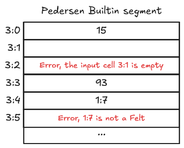

# Pedersen Builtin

The _Pedersen_ builtin is dedicated to computing the pedersen hash
of two felts. Its use in Cairo is explained on section 11.4 [Working with Hashes](ch11-04-hash.md).

## Cells organization

The Pedersen builtin has its own segment during a Cairo VM run.
It follows a deduction property, organized by _triplets of cells_,
two input and one output.

- The input cells must store felts, relocatable are forbidden.
  It makes sense as you cannot compute the hash of a pointer
  (unless you allow dereferencing pointers from the builtin...)
- The output cell is deduced from the input cells.
  Once an instruction tries reading the cell, the Pedersen hash
  of the two related input cells is computed and written to
  the cell.

Let's take a look at two snapshots of a Pedersen segment,
during the execution of a dummy program by the Cairo VM.

In the first snapshot, the first triplet has its three cells
storing felts and the second one only has its two input cells
storing felts.

It means that the Pedersen hash of 15 and 35 has been computed,
because the cell `3:2` has been read.
The cell `3:5` is still empty while its two input cells are filled
with 93 and 5. It means that even if the input cells have been written to,
the output cell `3:5` has not been read yet, so
the Pedersen hash of 93 and 5 has not been computed yet.

  

  Snapshot 1 - Pedersen builtin segment with valid inputs

On the second snapshot, both triplets of cells would throw
an error if their output cell was read.

Why is there an error when trying to read `3:2`?

This is because one of the input cells is empty.
It's hard to compute a hash of something missing.

Why is there an error when trying to read `3:5`?

If you look closely to the related input cells `3:3` and `3:4`,
you'll notice that the value asserted in `3:4` is a _relocatable_,
a pointer to the cell `1:7`. Recall that the Pedersen builtin
cannot hash a relocatable value, hence the error.

The error arises when the output cell is read. In the second case,
it could have been caught earlier if the input cells were validated
as being felts only.

  

  Snapshot 2 - Pedersen builtin segment with invalid inputs

## Implementation References

These implementation references of the Pedersen builtin might not be exhaustive.

- [TypeScript Pedersen Builtin](https://github.com/kkrt-labs/cairo-vm-ts/blob/58fd07d81cff4a4bb45c30ab99976ba66f0576ad/src/builtins/pedersen.ts#L4)
- [Python Pedersen Builtin](https://github.com/starkware-libs/cairo-lang/blob/0e4dab8a6065d80d1c726394f5d9d23cb451706a/src/starkware/cairo/lang/builtins/hash/hash_builtin_runner.py)
- [Rust Pedersen Builtin](https://github.com/lambdaclass/cairo-vm/blob/41476335884bf600b62995f0c005be7d384eaec5/vm/src/vm/runners/builtin_runner/hash.rs)
- [Go Pedersen Builtin](https://github.com/NethermindEth/cairo-vm-go/blob/dc02d614497f5e59818313e02d2d2f321941cbfa/pkg/vm/builtins/pedersen.go)
- [Zig Pedersen Builtin](https://github.com/keep-starknet-strange/ziggy-starkdust/blob/55d83e61968336f6be93486d7acf8530ba868d7e/src/vm/builtins/builtin_runner/hash.zig)

## Resources on Pedersen Hash

If you're interested about the Pedersen hash and its use,
take a look at those references:

- StarkNet, [Hash Functions - Pedersen Hash](https://docs.starknet.io/architecture-and-concepts/cryptography/hash-functions/#pedersen-hash)
- nccgroup, [Breaking Pedersen Hashes in Practice](https://research.nccgroup.com/2023/03/22/breaking-pedersen-hashes-in-practice/), 2023, March 22
- Ryan S., [Pedersen Hash Function Overview](https://rya-sge.github.io/access-denied/2024/05/07/pedersen-hash-function/), 2024, May 07
