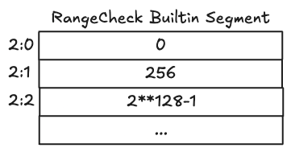
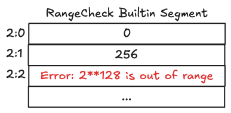
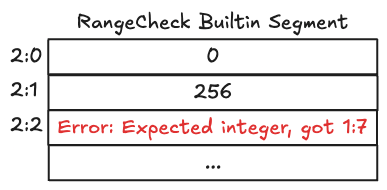

# Range Check Builtin

The _Range Check_ builtin is used to check whether a field element is in the range \\([0,n]\\).
It is used when instantiating and comparing the various integer types.
There's two variants of this builtin, the standard one that operates on a \\(2^{128}-1\\) upper bound and another variant named _Range Check 96_ that operates on a \\(2^{96}-1\\) upper bound. We will focus on the standard one in this section, but the same principles apply to the 96 variant.

While it's possible to implement range checking using pure Cairo code (for example, by decomposing a number into its binary representation and verifying each bit), using the builtin is significantly more efficient. A pure Cairo implementation would require at least 384 instructions to verify a single range check, whereas the builtin achieves the same result with computational cost equivalent to about 1.5 instructions. This efficiency makes the Range Check builtin essential for the implementation of bounded integer arithmetic and other operations that require value range verification.

## Cells organization

The Range Check builtin enforces that all values written to its memory cells are within the range \\([0,2^{128}-1]\\).
The memory cells constrained by this builtin are called range-checked cells as every values written to this memory segment must be contained within the range \\([0,2^{128}-1]\\) otherwise an out of range error will be thrown.
These range-checked cells must store valid field elements, not relocatable values.

In the following example, a Cairo program writes 0, 256 and \\(2^{128}-1\\) to the Range Check memory segment, since these 3 field elements are constrained within the \\([0,2^{128}-1]\\) range, the program execution is valid.

  

  Snapshot 1 - Range Check builtin segment with valid range-checked cells

On the next example however, the program tries to write \\(2^{128}\\) to memory cell `2:2`, which is not contained within the builtin valid range. An out of range error is thrown and the program execution aborted.

  

  Snapshot 2 - Range Check builtin segment with invalid range-checked cell caused by an out of range error

In the final example, the program attempts to write a _relocatable_ value, a pointer to the cell `1:7` which is not allowed by the builtin as it only accepts field elements.

  

  Snapshot 3 - Range Check builtin segment with invalid range-checked cell caused by the assignment of a relocatable value

## Implementation References

These implementation references of the Range Check builtin might not be exhaustive.

- [TypeScript Range Check Builtin](https://github.com/kkrt-labs/cairo-vm-ts/blob/58fd07d81cff4a4bb45c30ab99976ba66f0576ad/src/builtins/rangeCheck.ts)
- [Python Range Check Builtin](https://github.com/starkware-libs/cairo-lang/blob/0e4dab8a6065d80d1c726394f5d9d23cb451706a/src/starkware/cairo/lang/builtins/range_check/range_check_builtin_runner.py)
- [Rust Range Check Builtin](https://github.com/lambdaclass/cairo-vm/blob/41476335884bf600b62995f0c005be7d384eaec5/vm/src/vm/runners/builtin_runner/range_check.rs)
- [Go Range Check Builtin](https://github.com/NethermindEth/cairo-vm-go/blob/dc02d614497f5e59818313e02d2d2f321941cbfa/pkg/vm/builtins/range_check.go)
- [Zig Range Check Builtin](https://github.com/keep-starknet-strange/ziggy-starkdust/blob/55d83e61968336f6be93486d7acf8530ba868d7e/src/vm/builtins/builtin_runner/range_check.zig)

## Resources on Range Check

If you're interested in how the Range Check builtin works and its usage in the Cairo VM, take a look at these references:

- Starknet, [CairoZero documentation, Range Checks section of Builtins and implicit arguments](https://docs.cairo-lang.org/how_cairo_works/builtins.html#range-checks)
- Lior G., Shahar P., Michael R., [Cairo Whitepaper, Sections 2.8 and 8](https://eprint.iacr.org/2021/1063.pdf)
