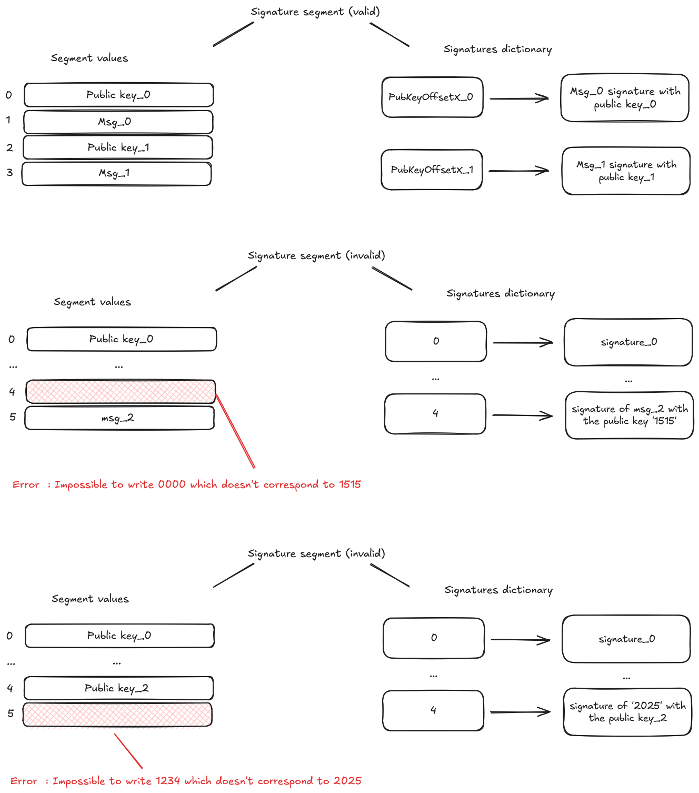

# ECDSA Builtin

The _ECDSA_ builtin is dedicated to sign a message hash and check the signature with a public key using ECDSA (Elliptic Curve Digital Signature Algorithm).

## Memory organization

The ECDSA builtin has its own segment during a Cairo VM run.
It has two components : the segment values (storing the public keys and the hashes) and a dictionary mapping the public keys' offsets to the corresponding signatures.

The segment values store the public keys and the hashes which are both Felts.
When segment values are set, the runner checks that the public key and the hash are valid if there is a corresponding signature in the dictionary.
The segment values store the public keys and the hashes which are both Felts.
When segment values are set, the runner checks that the public key and the hash are valid if there is a corresponding signature in the dictionary.
If there is no corresponding signature in the dictionary, the runner will throw an error - signatures must be explicitly added inside the signature cache before interacting with the builtin.

In the first drawing, we see that the cell 0 and 2 contain public keys and the cells 1 and 3 contain hashes.

**The cells with an even offset are for the public keys and the cells with an odd offset are for the hashes. Each hash will be signed with the corresponding public key whose offset is the integer before the hash's offset.**

In this drawing, we wrote the public key_0 and the hash_0 in the cells 0 and 1 respectively. Then, the signature of the hash_0 with the public key_0 is stored in the dictionary with the number 0 as the key (PubKeyOffsetX_0) and the signature as the value.
Then we wrote the public key_1 and the hash_1 in the cells 2 and 3 respectively. The signature of the hash_1 with the public key_1 is stored in the dictionary with the number 2 as the key (PubKeyOffsetX_1) and the signature as the value.

  

  Examples of ecdsa segments

On the second drawing, we try to write a hash message that doesn't match with the signature in the dictionary for its public key. This will throw an error.

Why is there an error? First we have a signature of a hash for the public key whose offset is 4 in the dictionary. The offset of the hash is always the next integer after the public key offset so here it'd be 5. Let's suppose the signature corresponds to the hash '2025'. So, when we write a message hash at the offset 5 different than '2025', like '1324', the runner will throw the error because the signature in the dictionary and the hash are incoherent.

On the third drawing, we try to write a public key that hadn't be used to create the signature in the dictionary. This will throw an error.

Why is there an error? First we have a signature of a hash for the public key whose offset is 4 in the dictionary. The public key at the offset 4 will always be the one used to sign the hash at the offset 5. Let's suppose the signature is created by the key '1515'. So, when we write a public key at the offset 4 different than '1515', like '0000', the runner will throw the error because the signature in the dictionary and the public key are incoherent.

## Implementation References

These implementation references of the ecdsa builtin might not be exhaustive.

- [TypeScript Signature Builtin](https://github.com/kkrt-labs/cairo-vm-ts/blob/58fd07d81cff4a4bb45c30ab99976ba66f0576ad/src/builtins/ecdsa.ts)
- [Python Signature Builtin](https://github.com/starkware-libs/cairo-lang/blob/0e4dab8a6065d80d1c726394f5d9d23cb451706a/src/starkware/cairo/lang/builtins/signature/signature_builtin_runner.py)
- [Rust Signature Builtin](https://github.com/lambdaclass/cairo-vm/blob/41476335884bf600b62995f0c005be7d384eaec5/vm/src/vm/runners/builtin_runner/signature.rs)
- [Go Signature Builtin](https://github.com/NethermindEth/cairo-vm-go/blob/dc02d614497f5e59818313e02d2d2f321941cbfa/pkg/vm/builtins/ecdsa.go)
- [Zig Signature Builtin](https://github.com/keep-starknet-strange/ziggy-starkdust/blob/55d83e61968336f6be93486d7acf8530ba868d7e/src/vm/builtins/builtin_runner/signature.zig)

## Resources on ECDSA signature

If you're interested about the ecdsa signature and its use, take a look at those references:

- StarkNet, [STARK curve](https://docs.starknet.io/architecture-and-concepts/cryptography/stark-curve/)
- Svetlin Nakov, [ECDSA: Elliptic Curve Signatures](https://cryptobook.nakov.com/digital-signatures/ecdsa-sign-verify-messages), 2020
