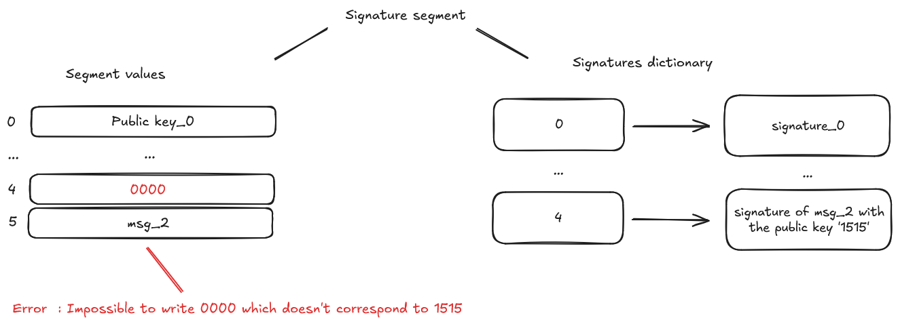

# ECDSA Builtin

The _ECDSA_ (Elliptic Curve Digital Signature Algorithm) builtin verifies cryptographic signatures on the STARK curve. This builtin is primarily used to validate that a message hash was signed by the holder of a specific private key.

## Memory Organization

The ECDSA builtin has a unique memory structure with two interconnected components:

1. **Memory Segment**: A dedicated segment that stores public keys and message hashes as field elements
2. **Signature Dictionary**: A mapping that associates public key offsets with their corresponding signatures

### Cell Layout in the Memory Segment

The ECDSA segment arranges cells in pairs:

- **Even offsets** (0, 2, 4, ...) store public keys
- **Odd offsets** (1, 3, 5, ...) store message hashes

Each public key at offset `2n` is associated with a message hash at offset `2n+1`. For example, public key at offset 0 pairs with the hash at offset 1.

### Signature Verification Process

Before using the ECDSA builtin, signatures must be explicitly registered in the signature dictionary. The VM performs signature verification when the program writes values to the ECDSA segment:

1. When a public key is written at offset `2n`, the VM checks if it matches the key used to create the signature registered at that offset
2. When a message hash is written at offset `2n+1`, the VM verifies that it matches the hash that was signed

If either check fails, the VM throws an error immediately - this is different from some other builtins that defer validation until output access.

### Valid Usage Example

  

  Example of valid ECDSA segment usage

In this example:

- Public key_0 at offset 0 and hash_0 at offset 1 are verified against the signature stored at dictionary key 0
- Public key_1 at offset 2 and hash_1 at offset 3 are verified against the signature stored at dictionary key 2
- All verifications pass because the public keys and hashes match what was originally signed

### Error Conditions

#### Invalid Hash Error

  

  Error: Hash doesn't match the signed message

When a program writes hash "1324" at offset 5, but the signature at dictionary key 4 was created for hash "2025", the VM throws an error because the hash doesn't match what was originally signed with that public key.

#### Invalid Public Key Error

  

  Error: Public key doesn't match the signing key

When a program writes public key "0000" at offset 4, but the signature at dictionary key 4 was created using public key "1515", the VM throws an error because the public key doesn't match the one used to create the signature.

## Implementation References

These implementation references of the ecdsa builtin might not be exhaustive.

- [TypeScript Signature Builtin](https://github.com/kkrt-labs/cairo-vm-ts/blob/main/src/builtins/ecdsa.ts)
- [Python Signature Builtin](https://github.com/starkware-libs/cairo-lang/blob/0e4dab8a6065d80d1c726394f5d9d23cb451706a/src/starkware/cairo/lang/builtins/signature/signature_builtin_runner.py)
- [Rust Signature Builtin](https://github.com/lambdaclass/cairo-vm/blob/41476335884bf600b62995f0c005be7d384eaec5/vm/src/vm/runners/builtin_runner/signature.rs)
- [Zig Signature Builtin](https://github.com/keep-starknet-strange/ziggy-starkdust/blob/55d83e61968336f6be93486d7acf8530ba868d7e/src/vm/builtins/builtin_runner/signature.zig)

## Resources on ECDSA signature

If you're interested about the ecdsa signature and its use, take a look at those references:

- StarkNet, [STARK curve](https://docs.starknet.io/architecture-and-concepts/cryptography/stark-curve/)
- Svetlin Nakov, [ECDSA: Elliptic Curve Signatures](https://cryptobook.nakov.com/digital-signatures/ecdsa-sign-verify-messages), 2020
