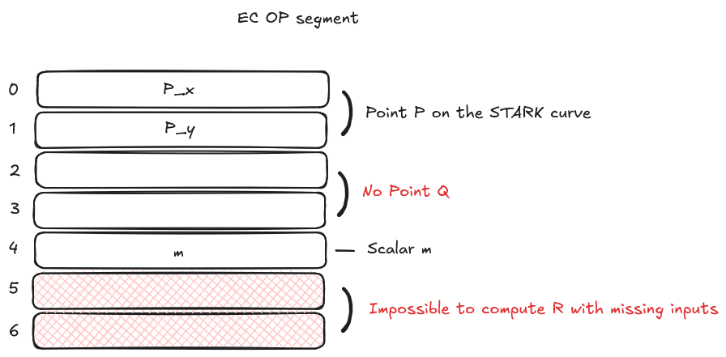

# EC OP Builtin

The _EC OP_ builtin is dedicated to compute the point R = P + mQ where P and Q are points on the STARK curve and m is a scalar. Each point (P, Q and R) is represented by two field elements, x and y.

## Cells organization

The EC OP builtin has its own segment during a Cairo VM run.
It works with blocks of 7 cells (5 inputs and 2 outputs):

- The first two cells are inputs storing the x and y coordinates of the point P. _(Offset 0 and 1)_
- The next two cells are inputs storing the x and y coordinates of the point Q. _(Offset 2 and 3)_
- The next cell is an input storing the scalar m. _(Offset 4)_
- The next two cells are outputs storing the x and y coordinates of the point R. _(Offset 5 and 6)_

In this snapshot, we wrote the coordinates of the points P and Q and the scalar m (inputs). The runner computes the point R = P + mQ and writes the result in the last two cells (outputs).

  

  Snapshot 1 - Example of the EC OP segment

On the second snapshot, we try read the coordinates of the point R but some input values are missing. This will throw an error.

  

  Snapshot 2 - Incomplete input values in EC OP builtin segment 

Why is there an error? We want the runner to compute the point R = P + mQ. To do so, we need to provide the coordinates of the points P and Q and the scalar m. If one or more of these values is missing or invalid (not a Felt for example), the runner will throw an error. Here, we didn't provide the coordinates of the point Q.

## Implementation References

These implementation references of the EC OP builtin might not be exhaustive.

- [TypeScript EC OP Builtin](https://github.com/kkrt-labs/cairo-vm-ts/blob/58fd07d81cff4a4bb45c30ab99976ba66f0576ad/src/builtins/ecdsa.ts)
- [Python EC OP Builtin](https://github.com/starkware-libs/cairo-lang/blob/0e4dab8a6065d80d1c726394f5d9d23cb451706a/src/starkware/cairo/lang/builtins/signature/signature_builtin_runner.py)
- [Rust EC OP Builtin](https://github.com/lambdaclass/cairo-vm/blob/41476335884bf600b62995f0c005be7d384eaec5/vm/src/vm/runners/builtin_runner/signature.rs)
- [Go EC OP Builtin](https://github.com/NethermindEth/cairo-vm-go/blob/dc02d614497f5e59818313e02d2d2f321941cbfa/pkg/vm/builtins/ecdsa.go)
- [Zig EC OP Builtin](https://github.com/keep-starknet-strange/ziggy-starkdust/blob/55d83e61968336f6be93486d7acf8530ba868d7e/src/vm/builtins/builtin_runner/signature.zig)
