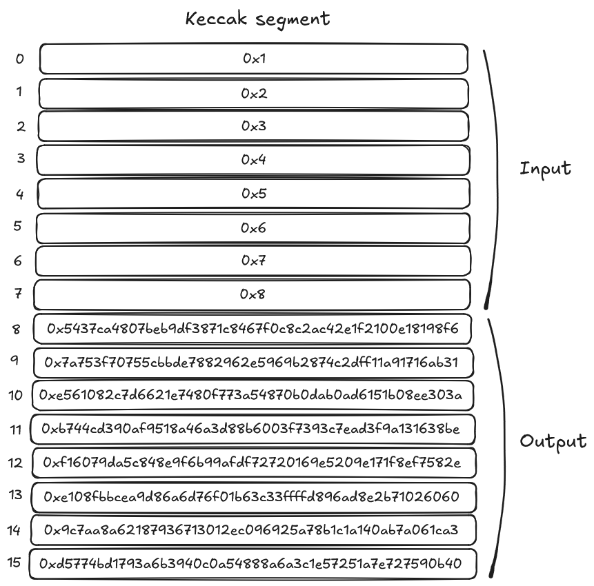

# Keccak Builtin

The _Keccak_ builtin implements the core functionality of the SHA-3 family of hash functions. It computes the new state `s'` by applying the 24 rounds of the keccak-f1600 permutation to an input state `s`. This builtin is particularly important for Ethereum compatibility, as Ethereum uses Keccak-256 for various cryptographic operations.

## Cells Organization

The Keccak builtin uses a dedicated memory segment organized in blocks of 16 consecutive cells:

| Cell Range    | Purpose           | Description                                            |
| ------------- | ----------------- | ------------------------------------------------------ |
| First 8 cells | Input state `s`   | Each cell stores 200 bits of the 1600-bit input state  |
| Next 8 cells  | Output state `s'` | Each cell stores 200 bits of the 1600-bit output state |

The builtin processes each block independently, applying the following rules:

1. **Input validation**: Each input cell must contain a valid field element not exceeding 200 bits (0 ≤ value < 2^200)
2. **Lazy computation**: The output state is only computed when any output cell is accessed
3. **Caching**: Once computed, results are cached to avoid redundant calculations if other output cells from the same block are accessed

### Example Operation

  

  Keccak builtin segment with a complete operation

In this example:

- The program has written input values [0x1, 0x2, 0x3, 0x4, 0x5, 0x6, 0x7, 0x8] to the first 8 cells
- Upon reading any of the output cells, the VM computes the keccak-f1600 permutation on the entire state
- The resulting output state is stored in the next 8 cells
- The computation happens only once per block and is cached

### Error Conditions

The Keccak builtin will throw an error in the following scenarios:

- If any input cell contains a value that exceeds 200 bits (≥ 2^200)
- If any input cell contains a relocatable value (pointer) instead of a field element
- If an output cell is read before all eight input cells have been initialized

## Implementation References

These implementation references of the Keccak builtin in various Cairo VM implementations:

- [TypeScript Keccak Builtin](https://github.com/kkrt-labs/cairo-vm-ts/blob/58fd07d81cff4a4bb45c30ab99976ba66f0576ad/src/builtins/keccak.ts)
- [Python Keccak Builtin](https://github.com/starkware-libs/cairo-lang/blob/0e4dab8a6065d80d1c726394f5d9d23cb451706a/src/starkware/cairo/lang/builtins/keccak/keccak_builtin_runner.py)
- [Rust Keccak Builtin](https://github.com/lambdaclass/cairo-vm/blob/41476335884bf600b62995f0c005be7d384eaec5/vm/src/vm/runners/builtin_runner/keccak.rs)
- [Go Keccak Builtin](https://github.com/NethermindEth/cairo-vm-go/blob/dc02d614497f5e59818313e02d2d2f321941cbfa/pkg/vm/builtins/keccak.go)
- [Zig Keccak Builtin](https://github.com/keep-starknet-strange/ziggy-starkdust/blob/55d83e61968336f6be93486d7acf8530ba868d7e/src/vm/builtins/builtin_runner/keccak.zig)

## Resources on Keccak Hash

If you're interested in the Keccak hash function and its applications:

- StarkNet, [Hash Functions - Starknet Keccak](https://docs.starknet.io/architecture-and-concepts/cryptography/hash-functions/#starknet_keccak)
- NIST, [SHA-3 Standard: Permutation-Based Hash and Extendable-Output Functions](https://nvlpubs.nist.gov/nistpubs/FIPS/NIST.FIPS.202.pdf)
- Wikipedia, [SHA-3 (Secure Hash Algorithm 3)](https://en.wikipedia.org/wiki/SHA-3)
- Keccak Team, [Keccak Reference](https://keccak.team/keccak_specs_summary.html)
