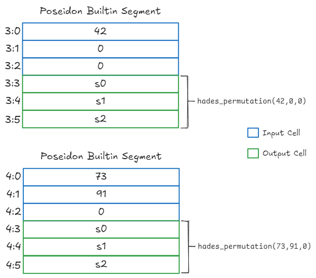
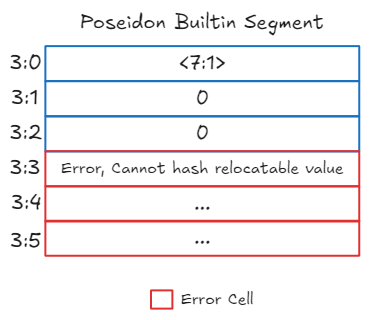

# Poseidon Builtin

The *Poseidon* builtin is dedicated to computing the Poseidon hash in Cairo VM. It is specifically designed for efficient computation in algebraic circuits and is a core component in StarkNet's cryptographic operations.
. It uses the Hades permutation strategy, which combines full rounds and partial rounds to achieve both security and efficiency in zero-knowledge STARK proofs. It's use in Cairo is explained on section 11.4 [Working with Hashes](ch12-04-hash.md).

## Cells organization

The Poseidon builtin has its own segment during a Cairo VM run. It follows a deduction property where input cells store the values to be hashed, and output cells store the computed hash results. The input cells must store felts, relocatable values are forbidden. It makes sense as you cannot compute the hash of a pointer.

The output cell is deduced from the input cells. Once an instruction tries reading the cell, the Poseidon hash is computed using the Hades permutation and written to the cell.

Let's examine two snapshots of a Poseidon segment during the execution of a dummy program by the Cairo VM.

In the first snapshot, we see both single-value and sequence hashing:

  

  Snapshot 1 - Poseidon builtin segment with valid inputs

This snapshot shows that:
- The hash of value 42 has been computed in cell `3:1` because it was read. This computation follows the formula `[hades_permutation(42, 0, 1)]₀`, where `[·]₀` indicates taking the first coordinate of the result.
- The hash of sequence [73, 91] appears in cell `3:4` after it was read. This computation follows the formula `[hades_permutation(73, 91, 2)]₀`, where `[·]₀` indicates taking the first coordinate of the result.
- Cell `3:5` is empty as its hash hasn't been requested yet

In the second snapshot, we see error conditions:

  

  Snapshot 1 - Poseidon builtin segment with invalid input

When trying to read `3:1`, an error occurs because the input in `3:0` is a relocatable value (pointer to cell `1:7`). The Poseidon builtin cannot hash relocatable values - it only operates on field elements.

The error manifests when the output cell is read. In the case with the relocatable value, this could be caught earlier if the input cells were validated as being felts only.

## Implementation References

These implementation references of the Poseidon builtin might not be exhaustive.

* [Typescript Poseidon Builtin](https://github.com/kkrt-labs/cairo-vm-ts/blob/58fd07d81cff4a4bb45c30ab99976ba66f0576ad/src/builtins/poseidon.ts)
* [Python Poseidon Builtin](https://github.com/starkware-libs/cairo-lang/blob/0e4dab8a6065d80d1c726394f5d9d23cb451706a/src/starkware/cairo/lang/builtins/poseidon/poseidon_builtin_runner.py)
* [Rust Poseidon Builtin](https://github.com/lambdaclass/cairo-vm/blob/052e7cef977b336305c869fccbf24e1794b116ff/vm/src/vm/runners/builtin_runner/poseidon.rs)
* [Go Poseidon Builtin](https://github.com/NethermindEth/cairo-vm-go/blob/dc02d614497f5e59818313e02d2d2f321941cbfa/pkg/vm/builtins/poseidon.go)
* [Zig Poseidon Builtin](https://github.com/keep-starknet-strange/ziggy-starkdust/blob/55d83e61968336f6be93486d7acf8530ba868d7e/src/vm/builtins/builtin_runner/poseidon.zig)

## Resources on Poseidon Hash

If you're interested about the Poseidon hash and its use, take a look at those references:

* StarkNet - [Hash Functions: Poseidon Hash](https://docs.starknet.io/architecture-and-concepts/cryptography/hash-functions/#poseidon-hash)
* StarkWare - [Poseidon](https://github.com/starkware-industries/poseidon/tree/main)
* [Poseidon Journal](https://autoparallel.github.io/overview/index.html)
* [Poseidon: ZK-friendly Hashing](https://www.poseidon-hash.info/)