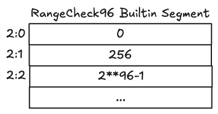
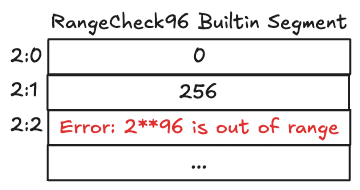

# Range Check 96 Builtin

The _Range Check 96_ builtin is used to check whether a field element is in the range \\([0,2^{96}-1]\\).
It is used when instantiating and comparing the various integer types.
All arithmetic comparisons use the range check builtin.
This specific variant operates on a \\(2^{96}-1\\) upper bound while the standard Range Check builtin operates on a \\(2^{128}-1\\) upper bound.

## Cells organization

The Range Check builtin enforces that all values written to its memory cells are within the range \\([0,2^{96}-1]\\). The memory cells constrained by this builtin are called range-checked cells as every values written to this memory segment must be contained within the range \\([0,2^{96}-1]\\) otherwise an out of range error will be thrown.

In the following example, a Cairo program writes 0, 256 and \\(2^{96}-1\\) to the Range Check 96 memory segment, since these 3 field elements are constrained within the \\([0,2^{96}-1]\\) range, the program execution is valid.

  

  Snapshot 1 - Range Check 96 builtin segment with valid range-checked cells

On the next example however, the program tries to write \\(2^{96}\\) to memory cell `2:2`, which is not contained within the builtin valid range. An out of range error is thrown and the program execution aborted.

  

  Snapshot 2 - Range Check 96 builtin segment with an invalid range-checked cell

## Implementation References

These implementation references of the Range Check builtin might not be exhaustive.

- [TypeScript Range Check Builtin](https://github.com/kkrt-labs/cairo-vm-ts/blob/58fd07d81cff4a4bb45c30ab99976ba66f0576ad/src/builtins/rangeCheck.ts)
- [Python Range Check Builtin](https://github.com/starkware-libs/cairo-lang/blob/0e4dab8a6065d80d1c726394f5d9d23cb451706a/src/starkware/cairo/lang/builtins/range_check/range_check_builtin_runner.py)
- [Rust Range Check Builtin](https://github.com/lambdaclass/cairo-vm/blob/41476335884bf600b62995f0c005be7d384eaec5/vm/src/vm/runners/builtin_runner/range_check.rs)
- [Go Range Check Builtin](https://github.com/NethermindEth/cairo-vm-go/blob/dc02d614497f5e59818313e02d2d2f321941cbfa/pkg/vm/builtins/range_check.go)
- [Zig Range Check Builtin](https://github.com/keep-starknet-strange/ziggy-starkdust/blob/55d83e61968336f6be93486d7acf8530ba868d7e/src/vm/builtins/builtin_runner/range_check.zig)

## Resources on Range Check

If you're interested in how the Range Check builtin works and its usage in the Cairo VM, take a look at these references:

- Starknet, [CairoZero documentation, Range Checks section of Builtins and implicit arguments](https://docs.cairo-lang.org/how_cairo_works/builtins.html#range-checks)
- Lior G., Shahar P., Michael R., [Cairo Whitepaper, Sections 2.8 and 8](https://eprint.iacr.org/2021/1063.pdf)
