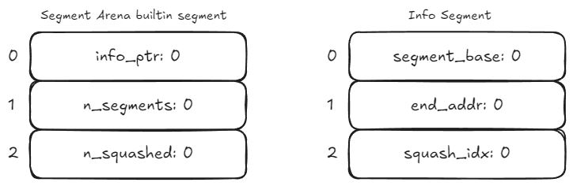
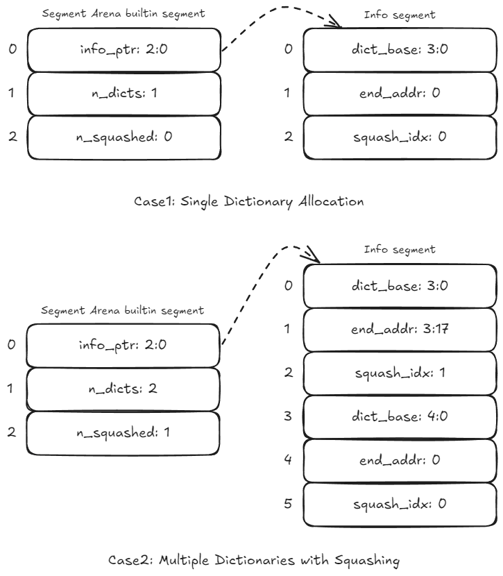
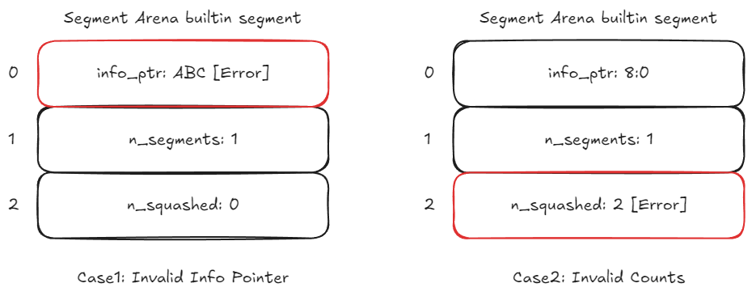

# Segment Arena Builtin

The _Segment Arena_ builtin is a critical component in Cairo VM that manages memory segments and dictionaries. It serves as the backbone for Cairo's dynamic memory allocation and dictionary operations, making it essential for programs that require flexible memory management.

## Cells Organization

Each Segment Arena builtin instance works with blocks of 3 cells that maintain the state of dictionaries:

- First cell: Contains the base address of the info pointer
- Second cell: Contains the current number of allocated dictionaries
- Third cell: Contains the current number of squashed dictionaries

This structure works in close conjunction with an Info segment, which is also organized in blocks of 3 cells:

- First cell: Base address of a dictionary
- Second cell: End address of a dictionary (when squashed)
- Third cell: Current number of squashed dictionaries (squashing index)

  

  Segment Arena builtin segment

Let's take a look at two snapshots of a Segment Arena segment,
during the execution of a dummy program by the Cairo VM.

In the first snapshot, Let's look at first case when a dictionary is allocated:
- `info_ptr` points to new info segment
- `n_dicts` increments to 1
- Info segment created with three cells
- Dictionary gets new segment `<3:0>`

Now, In the second case one more dictionary is allocated:
- Info segment grows by three cells per dictionary
- Squashed dictionaries have end addresses set
- Squashing indices assigned sequentially
- Unfinished dictionaries have zero end address

  

  Snapshot 1 - Valid Segment Arena builtin segment

On the second snapshot both the cases shows the error consitions where in the first case invalid state occurs when `info_ptr` contains _non-relocatable_ value `ABC`. Error triggered when accessing info segment.
In The second case the error triggers when there's a inconsistent state.

  

  Snapshot 2 - Invalid Segment Arena builtin segment

### Key Validation Rules

The builtin enforces several critical rules:

- The Info segment must exist when dictionaries are allocated
- All cell values must be valid field elements
- Dictionary counts must remain consistent
- Squashing operations must maintain sequential order
- Info segment entries must correspond to dictionary allocations

## Implementation References

These implementation references of the Segment Arena builtin might not be exhaustive.

- [TypeScript Segment Arena Builtin](https://github.com/kkrt-labs/cairo-vm-ts/blob/58fd07d81cff4a4bb45c30ab99976ba66f0576ad/src/builtins/segmentArena.ts)
- [Rust Segment Arena Builtin](https://github.com/lambdaclass/cairo-vm/blob/41476335884bf600b62995f0c005be7d384eaec5/vm/src/vm/runners/builtin_runner/segment_arena.rs)
- [Zig Segment Arena Builtin](https://github.com/keep-starknet-strange/ziggy-starkdust/blob/55d83e61968336f6be93486d7acf8530ba868d7e/src/vm/builtins/builtin_runner/segment_arena.zig)