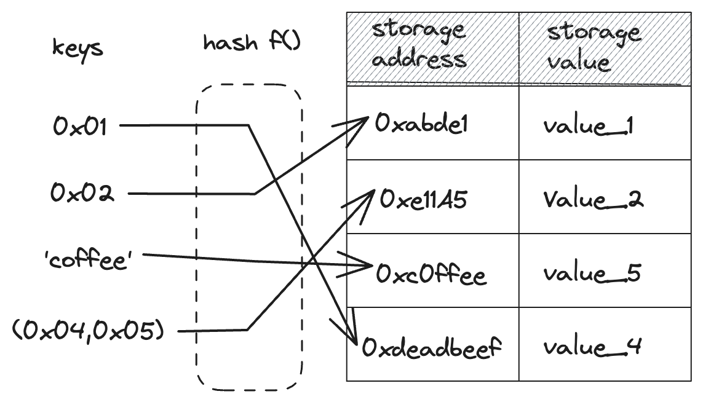

# Contract Storage

The most common way for interacting with a contract’s storage is through storage variables. As stated previously, storage variables allow you to store data that will be stored in the contract's storage that is itself stored on the blockchain. These data are persistent and can be accessed and modified anytime once the contract is deployed.

Storage variables in Starknet contracts are stored in a special struct called `Storage`:

```rust, noplayground
{{#rustdoc_include ../listings/ch99-starknet-smart-contracts/listing_99_03_example_contract/src/lib.cairo:storage}}
```

<span class="caption">A Storage Struct</span>

The storage struct is a [struct](./ch05-00-using-structs-to-structure-related-data.md) like any other,
except that it **must** be annotated with `#[storage]`. This annotation tells the compiler to generate the required code to interact with the blockchain state, and allows you to read and write data from and to storage. Moreover, this allows you to define storage mappings using the `LegacyMap` type.

Each variable stored in the storage struct is stored in a different location in the contract's storage. The storage address of a variable is determined by the variable's name, and the eventual keys of the variable if it is a [mapping](#storing-mappings).

## Storage Addresses

The address of a storage variable is computed as follows:

- If the variable is a single value (not a mapping), the address is the `sn_keccak` hash of the ASCII encoding of the variable's name. `sn_keccak` is Starknet's version of the Keccak256 hash function, whose output is truncated to 250 bits.
- If the variable is a [mapping](#storing-mappings), the address of the value at key `k_1,...,k_n` is `h(...h(h(sn_keccak(variable_name),k_1),k_2),...,k_n)` where ℎ is the Pedersen hash and the final value is taken `mod (2^251) − 256`.
- If it is a mapping to complex values (e.g., tuples or structs), then this complex value lies in a continuous segment starting from the address calculated in the previous point. Note that 256 field elements is the current limitation on the maximal size of a complex storage value.

You can access the address of a storage variable by calling the `address` function on the variable, which returns a `StorageBaseAddress` value.

```rust, noplayground
{{#rustdoc_include ../listings/ch99-starknet-smart-contracts/listing_99_03_example_contract/src/lib.cairo:owner_address}}
```

## Interacting with Storage Variables

Variables stored in the storage struct can be accessed and modified using the `read` and `write` functions, and you can get their address in storage using the `addr` function. These functions are automatically generated by the compiler for each storage variable.

To read the value of the `owner` storage variable, which is a single value, we call the `read` function on the `owner` variable, passing in no parameters.

```rust, noplayground
{{#rustdoc_include ../listings/ch99-starknet-smart-contracts/listing_99_03_example_contract/src/lib.cairo:read_owner}}
```

<span class="caption">Calling the `read` function on the `owner` variable</span>

To read the value of the storage variable `names`, which is a mapping from `ContractAddress` to `felt252`, we call the `read` function on the `names` variable, passing in the key `address` as a parameter. If the mapping had more than one key, we would pass in the other keys as parameters as well.

```rust, noplayground
{{#rustdoc_include ../listings/ch99-starknet-smart-contracts/listing_99_03_example_contract/src/lib.cairo:read}}
```

<span class="caption">Calling the `read` function on the `names` variable</span>

To write a value to a storage variable, we call the `write` function passing in the eventual keys the value as arguments. As with the `read` function, the number of arguments depends on the number of keys - here, we only pass in the value to write to the `owner` variable as it is a simple variable.

```rust, noplayground
{{#rustdoc_include ../listings/ch99-starknet-smart-contracts/listing_99_03_example_contract/src/lib.cairo:write_owner}}
```

<span class="caption">Calling the `write` function on the `owner` variable</span>

```rust, noplayground
{{#rustdoc_include ../listings/ch99-starknet-smart-contracts/listing_99_03_example_contract/src/lib.cairo:write}}
```

<span class="caption">Calling the `write` function on the `names` variable</span>

## Storing custom types

The `Store` trait, defined in the `starknet::storage_access` module, is used to specify how a type should be stored in storage. In order for a type to be stored in storage, it must implement the `Store` trait. Most types from the core library, such as unsigned integers (`u8`, `u128`, `u256`...), `felt252`, `bool`, `ContractAddress`, etc. implement the `Store` trait and can thus be stored without further action.

But what if you wanted to store a type that you defined yourself, such as an enum or a struct? In that case, you have to explicitly tell the compiler how to store this type.

In our example, we want to store a `Person` struct in storage, which is possible by implementing the `Store` trait for the `Person` type. This can be achieved by simply adding a `#[derive(starknet::Store)]` attribute on top of our struct definition.

```rust, noplayground
{{#rustdoc_include ../listings/ch99-starknet-smart-contracts/listing_99_03_example_contract/src/lib.cairo:person}}
```

Similarly, Enums can be written to storage if they implement the `Store` trait, which can be trivially derived as long as all associated types implement the `Store` trait.

```rust, noplayground
{{#rustdoc_include ../listings/ch99-starknet-smart-contracts/listing_99_03_example_contract/src/lib.cairo:enum_store}}
```

### Structs storage layout

On Starknet, structs are stored in storage as a sequence of primitive types.
The elements of the struct are stored in the same order as they are defined in the struct definition. The first element of the struct is stored at the base address of the struct, which is computed as specified in [Storage Addresses](#storage-addresses) and can be obtained by calling `var.address()`, and subsequent elements are stored at addresses contiguous to the first element.
For example, the storage layout for the `owner` variable of type `Person` will result in the following layout:

| Fields  | Address            |
| ------- | ------------------ |
| name    | owner.address()    |
| address | owner.address() +1 |

### Enums storage layout

When you store an enum variant, what you're essentially storing is the variant's index and an eventual associated values. This index starts at 0 for the first variant of your enum and increments by 1 for each subsequent variant.
If your variant has an associated value, it's stored starting from the address immediately following the base address.
For example, suppose we have the `RegistrationType` enum with the `finite` variant, which carries an associated limit date. The storage layout would look like this:

| Element                           | Address                         |
| --------------------------------- | ------------------------------- |
| Variant index (e.g. 1 for finite) | registration_type.address()     |
| Associated limit date             | registration_type.address() + 1 |

## Storage mappings

Storage mappings are similar to hash tables in that they allow mapping keys to values. However, unlike a typical hash table, the key data itself is not stored - only its hash is used to look up the associated value in the contract's storage.
Mappings do not have a concept of length or whether a key/value pair is set. The only way to remove a mapping is to set its value to the default zero value.

Mappings are only used to compute the location of data in the storage of a
contract given certain keys. They are thus **only allowed as storage variables**.
They cannot be used as parameters or return parameters of contract functions,
and cannot be used as types inside structs.

<div align="center">
    
<div align="center">
    </div>
    <span class="caption">Mapping keys to storage values</span>
</div>

To declare a mapping, use the `LegacyMap` type enclosed in angle brackets `<>`,
specifying the key and value types.

You can also create more complex mappings with multiple keys. You can find one in Listing 99-2bis like the popular `allowances` storage variable in the ERC20 Standard which maps an `owner` and an allowed `spender` to its `allowance` amount using multiple keys passed inside a tuple:

```rust,noplayground
{{#include ../listings/ch99-starknet-smart-contracts/no_listing_01_storage_mapping/src/lib.cairo:here}}
```

<span class="caption">Listing 99-2bis: Storing mappings</span>

The address in storage of a variable stored in a mapping is computed according to the description in the [Storage Addresses](#storage-addresses) section.
If the key of a mapping is a struct, each element of the struct constitutes a key. Moreover, the struct should implement the `Hash` trait, which can be derived with the `#[derive(Hash)]` attribute. For example, if you have struct with two fields, the address will be `h(h(sn_keccak(variable_name),k_1),k_2)` - where `k_1` and `k_2` are the values of the two fields of the struct.

Similarly, in the case of a nested mapping such as `LegacyMap((ContractAddress, ContractAddress), u8)`, the address will be computed in the same way: `h(h(sn_keccak(variable_name),k_1),k_2)`.

For more details about the contract storage layout in the [Starknet Documentation](https://docs.starknet.io/documentation/architecture_and_concepts/Smart_Contracts/contract-storage/#storage_variables)
