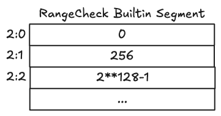

# Cairo Book for LLMs

### Introduction to Cairo and its Ecosystem

#### What is Cairo?

Cairo is a general-purpose programming language designed for creating provable programs, leveraging STARK (Scalable Transparent ARguments of Knowledge) technology for computational integrity. It abstracts underlying cryptographic complexities, allowing developers to focus on program logic.

#### Cairo's Role in the Ecosystem

Cairo's primary application is Starknet, an Ethereum Layer 2 scaling solution. It enables off-chain computations where a prover generates a STARK proof, which is then verified on Ethereum (L1). This significantly scales transactions by reducing the computational burden on L1. Unlike most competitors, Starknet uses its own VM, offering more flexibility than the EVM. This, combined with native account abstraction, opens possibilities for advanced smart accounts, transparent AI, machine learning, and fully on-chain blockchain games.

#### Cairo Programs and Starknet Smart Contracts: What Is the Difference?

Starknet contracts are a special superset of Cairo programs. A standard Cairo program must have a `main` function as its entry point:

```cairo
fn main() {}
```

Conversely, contracts deployed on Starknet do not have a `main` function but instead have one or multiple functions that serve as entry points, and they can access Starknet's state.

Setting Up Your Cairo Development Environment

# Setting Up Your Cairo Development Environment

## Installation

To install Cairo, Scarb (Cairo's build toolchain and package manager), and Starknet Foundry (the default test runner), use `starkup`.

For Linux or macOS, open a terminal and enter the following command:

```bash
curl --proto '=https' --tlsv1.2 -sSf https://sh.starkup.dev | sh
```

If the installation is successful, you will see `starkup: Installation complete.`

## Verifying Installation

After installation, verify the versions of Scarb and Starknet Foundry in a new terminal session:

```bash
$ scarb --version
scarb 2.11.4 (c0ef5ec6a 2025-04-09)
cairo: 2.11.4 (https://crates.io/crates/cairo-lang-compiler/2.11.4)
sierra: 1.7.0

$ snforge --version
snforge 0.39.0
```

## Creating a Project Directory

It's recommended to create a dedicated directory for your Cairo projects, such as `cairo_projects` in your home directory.

For Linux, macOS, and PowerShell on Windows:

```shell
mkdir ~/cairo_projects
cd ~/cairo_projects
```

For Windows CMD:

```cmd
> mkdir "%USERPROFILE%\cairo_projects"
> cd /d "%USERPROFILE%\cairo_projects"
```

## Creating a New Project with Scarb

Navigate to your `cairo_projects` directory and use Scarb to create a new project. For example, to create a project named `hello_world`:

```bash
scarb new hello_world
```

Scarb will prompt you to choose a test runner; select `Starknet Foundry (default)`. This command creates a new directory with the project name and a basic `Scarb.toml` file. An example `Scarb.toml` structure is:

<span class="filename">Filename: Scarb.toml</span>

```toml
[package]
name = "prime_prover"
version = "0.1.0"
edition = "2024_07"

[dependencies]

[dev-dependencies]
cairo_test = "2.11.4"
```

## Installing the VSCode Extension

Install the Cairo VSCode extension from the [VSCode Marketplace](https://marketplace.visualstudio.com/items?itemName=starkware.cairo1). After installation, go to the extension settings and ensure `Enable Language Server` and `Enable Scarb` options are ticked.

## Common Compiler Diagnostics

When working with Cairo components, you might encounter compiler diagnostics:

- `Plugin diagnostic: name is not a substorage member in the contract's Storage. Consider adding to Storage: (...)`: This indicates you need to add the component's storage to your contract's storage, annotated with the `#[substorage(v0)]` attribute.
- `Plugin diagnostic: name is not a nested event in the contract's Event enum. Consider adding to the Event enum:`: This means you need to add the component's events to your contract's events enum.

Cairo Project Structure and Scarb Basics

### Cairo Project Structure and Scarb Basics

#### Packages and Crates

A Cairo **package** is a directory containing a `Scarb.toml` manifest file and associated source code. A package can contain multiple crates. A **crate** is a subset of a package used in Cairo compilation, identified by its package name and a crate root. It includes package source code and metadata like the `edition` field in `Scarb.toml`. Crates can contain modules, which may be defined in other files.

#### The Crate Root

The **crate root** is the `lib.cairo` source file from which the Cairo compiler starts compilation, forming the root module of your crate.

#### Creating a Package with Scarb

To create a new Cairo package, use the `scarb new` command:

```bash
scarb new my_package
```

This command generates a new package directory named `my_package` with the following default structure:

```
my_package/
├── Scarb.toml
└── src
    └── lib.cairo
```

- `src/`: The main directory for all Cairo source files.
- `lib.cairo`: The default root module and main entry point of the crate.
- `Scarb.toml`: The package manifest file, containing metadata and configuration options.

#### The `Scarb.toml` Manifest File

`Scarb.toml` is a TOML-formatted file that configures your Cairo project. A newly generated `Scarb.toml` typically looks like this:

```toml
[package]
name = "my_package"
version = "0.1.0"
edition = "2024_07"

[dependencies]
# foo = { path = "vendor/foo" }
```

Key sections include:

- `[package]`: Defines package name, version, and Cairo edition.
- `[dependencies]`: Lists project dependencies (other Cairo packages, also known as crates).
- `[dev-dependencies]`: Specifies dependencies required only for development (e.g., `snforge_std`, `assert_macros`).
- `[[target.starknet-contract]]`: Configures building Starknet smart contracts.
- `[scripts]`: Allows defining custom scripts (e.g., `test = "snforge test"`).

For a basic Cairo program, you might simplify your `Scarb.toml` to:

```toml
[package]
name = "hello_world"
version = "0.1.0"
edition = "2024_07"

[dependencies]
```

#### Source File Organization

Scarb requires source files to be located within the `src` directory. The top-level project directory is reserved for non-code content like `README` files or license information. If you have an existing project not using Scarb, you can convert it by moving code into `src` and creating an appropriate `Scarb.toml`.

For a simple

Cairo Language Fundamentals

### Cairo Language Fundamentals

#### Keywords

Cairo defines several categories of keywords:

- **Strict Keywords**: These can only be used in their correct contexts and cannot be used as names for items. Examples include `as`, `break`, `const`, `continue`, `else`, `enum`, `extern`, `false`, `fn`, `if`, `impl`, `implicits`, `let`, `loop`, `match`, `mod`, `mut`, `nopanic`, `of`, `pub`, `ref`, `return`, `struct`, `trait`, `true`, `type`, `use`, and `while`.
- **Loose Keywords**: These are associated with specific behavior but can also be used to define items. Examples are `self` (method subject) and `super` (parent module).
- **Reserved Keywords**: These are not explicitly listed but are implied to exist.

Additionally, functions from the core library, while not reserved, are not recommended for use as item names to follow good practices.

#### Anatomy of a Cairo Program

Every executable Cairo program starts with a `main` function. This function is special as it's always the first code to run. Its body is enclosed in curly brackets `{}`. Cairo style dictates four-space indentation and placing the opening curly bracket on the same line as the function declaration.

```cairo,noplayground
fn main() {

}
```

Inside the `main` function, operations like printing text are performed using macros. For example, `println!` is a macro (denoted by the `!`) used to print to the screen.

```cairo,noplayground
    println!("Hello, World!");
```

The `scarb fmt` tool can be used to automatically format Cairo code to a standard style.

#### Core Library and Editions

The Cairo core library prelude, defined in `corelib/src/lib.cairo`, provides fundamental programming constructs without requiring explicit imports. It includes primitive data types (integers, bools, arrays, dicts), traits (for arithmetic, comparison, serialization), operators (arithmetic, logical, bitwise), and utility functions. This automatic import simplifies development by making common elements like `ArrayTrait::append()` or the `Default` trait readily available.

Cairo supports different **editions**, which are versions of the core library prelude. The desired edition is specified in the `Scarb.toml` configuration file (e.g., `edition = "2024_07"`). When creating a new project with `scarb new`, the latest edition is automatically included. Different editions expose different functions and traits, making it important to specify the correct version for project compatibility and to leverage the latest features.

| Version   | Details                                                                                                    |
| :-------- | :--------------------------------------------------------------------------------------------------------- |
| `2024-07` | [details for 2024-07](https://community.starknet.io/t/cairo-v2-7-0-is-coming/114362#the-2024_07-edition-3) |

Writing and Executing Cairo Programs

### Writing and Executing Cairo Programs

To create an executable Cairo program, the `Scarb.toml` manifest file needs to be configured, and the program's entry point defined.

#### Project Setup: Modifying Scarb.toml

For an executable program that can be proven, modify `Scarb.toml` to define an executable target and include the `cairo_execute` plugin.

<span class="filename">Filename: Scarb.toml</span>

```toml
[package]
name = "prime_prover"
version = "0.1.0"
edition = "2024_07"

[[target.executable]]

[cairo]
enable-gas = false

[dependencies]
cairo_execute = "2.11.4"
```

The additions include:

- `[[target.executable]]`: Specifies that this package compiles to a Cairo executable.
- `[cairo] enable-gas = false`: Disables gas tracking, which is specific to Starknet contracts and not required for executables.
- `[dependencies] cairo_execute = "2.11.4"`: Adds the plugin necessary to execute and prove the program.

#### Writing the Prime-Checking Logic

Replace the contents of `src/lib.cairo` with the following code to implement a prime-checking program. The `#[executable]` attribute marks the `main` function as the program's entry point.

<span class="filename">Filename: src/lib.cairo</span>

```cairo
/// Checks if a number is prime
///
/// # Arguments
///
/// * `n` - The number to check
///
/// # Returns
///
/// * `true` if the number is prime
/// * `false` if the number is not prime
fn is_prime(n: u32) -> bool {
    if n <= 1 {
        return false;
    }
    if n == 2 {
        return true;
    }
    if n % 2 == 0 {
        return false;
    }
    let mut i = 3;
    let mut is_prime = true;
    loop {
        if i * i > n {
            break;
        }
        if n % i == 0 {
            is_prime = false;
            break;
        }
        i += 2;
    }
    is_prime
}

// Executable entry point
#[executable]
fn main(input: u32) -> bool {
    is_prime(input)
}
```

The `is_prime` function takes a `u32` and returns a `bool`, checking for primality using a trial division algorithm. The `main` function, marked with `#[executable]`, serves as the program's entry point, taking a `u32` input and calling `is_prime`.

#### Executing the Program

To run the program, use the `scarb execute` command, providing the package name and input arguments.

```bash
scarb execute -p prime_prover --print-program-output --arguments 17
```

- `-p prime_prover`: Specifies the package name.
- `--print-program-output`: Displays the program's result.
- `--arguments 17`: Passes `17` as input to the `main` function.

Example output for `17` (prime):

```bash
$ scarb execute -p prime_prover --print-program-output --arguments 17
   Compiling prime_prover v0.1.0 (listings/ch01-getting-started/prime_prover/Scarb.toml)
    Finished `dev` profile target(s) in 2 seconds
   Executing prime_prover
Program output:
0
1
Saving output to: target/execute/prime_prover/execution2

```

The output `0` indicates successful execution (no panic), and `1` represents `true` (17 is prime).

Example outputs for other numbers:

```bash
$ scarb execute -p prime_prover --print-program-output --arguments 4
[0, 0]  # 4 is not prime
$ scarb execute -p prime_prover --print-program-output --arguments 23
[0, 1]  # 23 is prime
```

Here, `0` in `[0, 0]` means `false` (4 is not prime), and `1` in `[0, 1]` means `true` (23 is prime).

Data Types

Scalar and Primitive Types

## Scalar and Primitive Types

Cairo is a statically typed language, requiring variable types to be known at compile time. While the compiler often infers types, explicit type annotations or conversion methods can be used when multiple types are possible.

```cairo
fn main() {
    let x: felt252 = 3;
    let y: u32 = x.try_into().unwrap();
}
```

A _scalar_ type represents a single value. Cairo's primary scalar types are felts, integers, and booleans.

### Felt Type

The default type in Cairo, if not specified, is `felt252` (a field element). This represents an integer in the range \( 0 \leq x < P \), where \( P \) is a large prime (currently \( {2^{251}} + 17 \cdot {2^{192}} + 1 \)). Arithmetic operations (`mod P`) wrap around within this range.

Unlike standard integer division, division of field elements in Cairo always satisfies the equation \( \frac{x}{y} \cdot y == x \). For example, \( \frac{1}{2} \) in Cairo is \( \frac{P + 1}{2} \) (not 0 or 0.5), because \( 2 \cdot \frac{P + 1}{2} = P + 1 \equiv 1 \mod P \).

### Integer Types

While `felt252` is fundamental, using integer types is highly recommended for enhanced security due to built-in overflow and underflow checks. An `integer` is a number without a fractional component, with an explicit bit size.

Table 3-1 shows the built-in unsigned integer types:

| Length  | Unsigned |
| ------- | -------- |
| 8-bit   | `u8`     |
| 16-bit  | `u16`    |
| 32-bit  | `u32`    |
| 64-bit  | `u64`    |
| 128-bit | `u128`   |
| 256-bit | `u256`   |
| 32-bit  | `usize`  |

<br>
<div align="center"><span class="caption">Table 3-1: Integer Types in Cairo.</span></div>

`usize` is currently an alias for `u32` and is primarily used for indexing collections. Unsigned integers cannot hold negative values; attempting to do so will cause a program panic:

```cairo
fn sub_u8s(x: u8, y: u8) -> u8 {
    x - y
}

fn main() {
    sub_u8s(1, 3);
}
```

All integer types fit into a `felt252` except `u256`, which is internally represented as a struct: `u256 {low: u128, high: u128}`.

Cairo also supports signed integers, prefixed with `i` (e.g., `i8` to `i128`). An `in` type can store numbers from \( -({2^{n - 1}}) \) to \( {2^{n - 1}} - 1 \) inclusive.

Integer literals can be written in various forms, as shown in Table 3-2. Type suffixes (e.g., `57_u8`) can specify the type, and `_` can be used as a visual separator.

| Numeric literals | Example   |
| ---------------- | --------- |
| Decimal          | `98222`   |
| Hex              | `0xff`    |
| Octal            | `0o04321` |
| Binary           | `0b01`    |

<br>
<div align="center"><span class="caption">Table 3-2: Integer Literals in Cairo.</span></div>

Choose the appropriate integer type based on the maximum expected value.

### Numeric Operations

Cairo supports standard mathematical operations for all integer types: addition, subtraction, multiplication, division, and remainder. Integer division truncates toward zero.

```cairo
fn main() {
    // addition
    let sum = 5_u128 + 10_u128;

    // subtraction
    let difference = 95_u128 - 4_u128;

    // multiplication
    let product = 4_u128 * 30_u128;

    // division
    let quotient = 56_u128 / 32_u128; //result is 1
    let quotient = 64_u128 / 32_u128; //result is 2

    // remainder
    let remainder = 43_u128 % 5_u128; // result is 3
}
```

### The Boolean Type

The Boolean type in Cairo has two values: `true` and `false`. It is specified using the `bool` keyword and occupies one `felt252` in size.

```cairo
fn main() {
    let t = true;

    let f: bool = false; // with explicit type annotation
}
```

When declaring a `bool` variable, it is mandatory to use `true` or `false` literals; integer literals (e.g., `0`) are not allowed. Booleans are primarily used in conditional expressions.

String Types

### String Types

Cairo lacks a native string type but handles them using short strings (single quotes) and `ByteArray` (double quotes).

#### Short Strings

Short strings are ASCII strings where each character is encoded on one byte. They are stored as `felt252` and are limited to 31 characters (248 bits) due to the `felt252`'s 251-bit size. They can be represented directly with single quotes or as hexadecimal values.

```cairo
# fn main() {
    let my_first_char = 'C';
    let my_first_char_in_hex = 0x43;

    let my_first_string = 'Hello world';
    let my_first_string_in_hex = 0x48656C6C6F20776F726C64;
#
#     let long_string: ByteArray = "this is a string which has more than 31 characters";
# }
```

#### Byte Array Strings

The `ByteArray` type from Cairo's Core Library handles strings and byte sequences longer than short strings, and is useful for string operations. It is implemented as an array of `bytes31` words combined with a pending `felt252` word for incomplete byte sequences.

Tuples and Fixed-Size Arrays

### Tuples and Fixed-Size Arrays

#### The Tuple Type

A _tuple_ is a general way of grouping together a number of values with a variety of types into one compound type. Tuples have a fixed length; once declared, they cannot grow or shrink in size. Tuples are created by writing a comma-separated list of values inside parentheses. Each position in the tuple has a type, and the types of the different values in the tuple don’t have to be the same.

```cairo
fn main() {
    let tup: (u32, u64, bool) = (10, 20, true);
}
```

To get individual values out of a tuple, you can use pattern matching to destructure it:

```cairo
fn main() {
    let tup = (500, 6, true);

    let (x, y, z) = tup;

    if y == 6 {
        println!("y is 6!");
    }
}
```

Tuples can also be declared with values and types, and destructured simultaneously:

```cairo
fn main() {
    let (x, y): (felt252, felt252) = (2, 3);
}
```

##### The Unit Type `()`

The _unit type_ is a type which has only one value `()`. It is represented by a tuple with no elements, has a size of zero, and is guaranteed not to exist in the compiled code. In Cairo, everything is an expression, and an expression that returns nothing actually returns `()` implicitly.

#### The Fixed Size Array Type

A _fixed size array_ is a collection of multiple values where every element must have the same type. Values are written as a comma-separated list inside square brackets. The array’s type is written using square brackets with the type of each element, a semicolon, and then the number of elements in the array, like so:

```cairo
fn main() {
    let arr1: [u64; 5] = [1, 2, 3, 4, 5];
}
```

In `[u64; 5]`, `u64` specifies the element type, and `5` defines the array's length. Fixed-size arrays are useful when you want to hardcode a potentially long sequence of data directly in your program. Because their size is known at compile-time, they don't require runtime memory management, making them more efficient than dynamically-sized arrays like `Array<T>`. They are ideal for lookup tables that won't change during runtime.

```cairo
    let months = [
        'January', 'February', 'March', 'April', 'May', 'June', 'July', 'August', 'September',
        'October', 'November', 'December',
    ];

```

You can also initialize an array to contain the same value for each element:

```cairo
    let a = [3; 5];
```

This creates an array `a` with 5 elements, all set to `3`.

##### Accessing Fixed Size Array Elements

Fixed-size array content is represented as a sequence of values in the program bytecode, allowing efficient access. There are two ways to access elements:

1.  **Deconstructing the array into multiple variables:**

    ```cairo
    fn main() {
        let my_arr = [1, 2, 3, 4, 5];

        // Accessing elements of a fixed-size array by deconstruction
        let [a, b, c, _, _] = my_arr;
        println!("c: {}", c); // c: 3
    }
    ```

2.  **Converting the array to a `Span` that supports indexing:** This operation is free and incurs no runtime cost.

    ```cairo
    fn main() {
        let my_arr = [1, 2, 3, 4, 5];

        // Accessing elements of a fixed-size array by index
        let my_span = my_arr.span();
        println!("my_span[2]: {}", my_span[2]); // my_span[2]: 3
    }
    ```

Enums and Advanced Array Concepts

## Enums and Advanced Array Concepts

### Enums

Enums, short for "enumerations," define a custom data type consisting of a fixed set of named values, called _variants_. They are useful for representing a collection of related, distinct values.

```cairo, noplayground
#[derive(Drop)]
enum Direction {
    North,
    East,
    South,
    West,
}
```

Variants can be instantiated using `Enum::Variant` syntax, e.g., `let direction = Direction::North;`. Variants can also have associated values:

```cairo, noplayground
#[derive(Drop)]
enum Direction {
    North: u128,
    East: u128,
    South: u128,
    West: u128,
}
#
# fn main() {
    let direction = Direction::North(10);
# }
```

Enums can store more complex custom data types with each variant:

```cairo, noplayground
#[derive(Drop)]
enum Message {
    Quit,
    Echo: felt252,
    Move: (u128, u128),
}
```

### The `Option` Enum

The `Option` enum is a standard Cairo enum representing an optional value. It has two variants: `Some: T` (value of type `T` is present) and `None` (absence of a value). This helps explicitly represent the possibility of a value being absent, preventing issues like `null` values.

```cairo,noplayground
enum Option<T> {
    Some: T,
    None,
}
```

Here are examples of functions returning `Option<usize>`:

```cairo,noplayground
fn find_value_recursive(mut arr: Span<felt252>, value: felt252, index: usize) -> Option<usize> {
    match arr.pop_front() {
        Some(index_value) => { if (*index_value == value) {
            return Some(index);
        } },
        None => { return None; },
    };

    find_value_recursive(arr, value, index + 1)
}

fn find_value_iterative(mut arr: Span<felt252>, value: felt252) -> Option<usize> {
    let mut result = None;
    let mut index = 0;

    while let Some(array_value) = arr.pop_front() {
        if (*array_value == value) {
            result = Some(index);
            break;
        };

        index += 1;
    };

    result
}
```

### Storing Multiple Types in Arrays with Enums

To store elements of different types in an array, you can use an enum to define a custom data type that can hold multiple types:

```cairo
#[derive(Copy, Drop)]
enum Data {
    Integer: u128,
    Felt: felt252,
    Tuple: (u32, u32),
}

fn main() {
    let mut messages: Array<Data> = array![];
    messages.append(Data::Integer(100));
    messages.append(Data::Felt('hello world'));
    messages.append(Data::Tuple((10, 30)));
}
```

### Span

`Span` is a struct that represents a snapshot of an `Array`. It provides safe, controlled, read-only access to array elements without modifying the original array, useful for data integrity and avoiding borrowing issues. All methods provided by `Array` can also be used with `Span`, except for `append()`.

To create a `Span` from an `Array`, call the `span()` method:

```cairo
# fn main() {
#     let mut array: Array<u8> = ArrayTrait::new();
    array.span();
# }
```

Type Conversion

### Type Conversion

Cairo facilitates type conversion using the `into` and `try_into` methods, provided by the `Into` and `TryInto` traits from the core library. These traits have numerous standard library implementations and can also be implemented for custom types.

#### Into

The `Into` trait defines how a type converts itself into another when success is guaranteed, such as converting a smaller type to a larger one. To perform the conversion, call `var.into()` on the source value. The new variable's type must be explicitly defined.

```cairo
fn main() {
    let my_u8: u8 = 10;
    let my_u16: u16 = my_u8.into();
    let my_u32: u32 = my_u16.into();
    let my_u64: u64 = my_u32.into();
    let my_u128: u128 = my_u64.into();

    let my_felt252 = 10;
    // As a felt252 is smaller than a u256, we can use the into() method
    let my_u256: u256 = my_felt252.into();
    let my_other_felt252: felt252 = my_u8.into();
    let my_third_felt252: felt252 = my_u16.into();
}
```

#### TryInto

The `TryInto` trait is used for fallible conversions, where the target type might not fit the source value. It returns an `Option<T>`. Similar to `Into`, conversion is done by calling `var.try_into()` on the source value, and the new variable's type must be explicitly defined. The `Option<T>` result often requires unwrapping.

```cairo
fn main() {
    let my_u256: u256 = 10;

    // Since a u256 might not fit in a felt252, we need to unwrap the Option<T> type
    let my_felt252: felt252 = my_u256.try_into().unwrap();
    let my_u128: u128 = my_felt252.try_into().unwrap();
    let my_u64: u64 = my_u128.try_into().unwrap();
    let my_u32: u32 = my_u64.try_into().unwrap();
    let my_u16: u16 = my_u32.try_into().unwrap();
    let my_u8: u8 = my_u16.try_into().unwrap();

    let my_large_u16: u16 = 2048;
    let my_large_u8: u8 = my_large_u16.try_into().unwrap(); // panics with 'Option::unwrap failed.'
}
```

Variables and Mutability

Variables and Mutability

## Variables and Mutability

Cairo utilizes an immutable memory model where memory cells, once written, cannot be overwritten. Consequently, variables in Cairo are immutable by default. This design prevents certain classes of bugs and makes code easier to reason about.

### Immutable Variables

Once a value is bound to an immutable variable, it cannot be changed. Attempting to reassign an immutable variable results in a compile-time error. For instance:

<span class="filename">Filename: src/lib.cairo</span>

```cairo,does_not_compile
fn main() {
    let x = 5;
    println!("The value of x is: {}", x);
    x = 6;
    println!("The value of x is: {}", x);
}

```

Running this code with `scarb cairo-run` produces the error:

```shell
$ scarb cairo-run
   Compiling no_listing_01_variables_are_immutable v0.1.0 (listings/ch02-common-programming-concepts/no_listing_01_variables_are_immutable/Scarb.toml)
error: Cannot assign to an immutable variable.
 --> listings/ch02-common-programming-concepts/no_listing_01_variables_are_immutabl/src/lib.cairo:6:5
    x = 6;
    ^***^

error: could not compile `no_listing_01_variables_are_immutable` due to previous error
error: `scarb metadata` exited with error

```

### Mutable Variables

While values are immutable, variables can be made mutable using the `mut` keyword. This explicitly indicates that the variable's associated value can change. In Cairo, assigning to a mutable variable is syntactic sugar for redeclaring it to refer to a new value in a different memory cell, effectively shadowing the previous value. The compiler handles this abstraction, and the variable's type cannot change upon reassignment.

Consider the following example with `mut`:

```cairo
fn main() {
    let mut x = 5;
    println!("The value of x is: {}", x);
    x = 6;
    println!("The value of x is: {}", x);
}
```

Executing this program yields:

```shell
$ scarb cairo-run
   Compiling no_listing_02_adding_mut v0.1.0 (listings/ch02-common-programming-concepts/no_listing_02_adding_mut/Scarb.toml)
    Finished `dev` profile target(s) in 4 seconds
     Running no_listing_02_adding_mut
The value of x is: 5
The value of x is: 6
Run completed successfully, returning []

```

Constants

### Constants

Constants are immutable values bound to a name. Unlike `mut` variables, constants are always immutable and are declared using the `const` keyword instead of `let`. Their type must always be explicitly annotated.

Constants can be declared with any data type, including structs, enums, and fixed-size arrays. They can only be declared in the global scope and must be set to a constant expression, not a value computed at runtime.

However, the `consteval_int!` macro allows defining constants that are the result of computations.

#### Declaration Examples

```cairo,noplayground
struct AnyStruct {
    a: u256,
    b: u32,
}

enum AnyEnum {
    A: felt252,
    B: (usize, u256),
}

const ONE_HOUR_IN_SECONDS: u32 = 3600;
const STRUCT_INSTANCE: AnyStruct = AnyStruct { a: 0, b: 1 };
const ENUM_INSTANCE: AnyEnum = AnyEnum::A('any enum');
const BOOL_FIXED_SIZE_ARRAY: [bool; 2] = [true, false];
```

#### Using `consteval_int!`

```cairo, noplayground
    const ONE_HOUR_IN_SECONDS: u32 = consteval_int!(60 * 60);
```

Variable Shadowing

### Variable Shadowing

Variable shadowing involves declaring a new variable with the same name as a previous one, effectively making the new variable visible to the compiler until it is itself shadowed or its scope ends. This is achieved by repeating the `let` keyword with the same variable name.

#### Shadowing Example

```cairo
fn main() {
    let x = 5;
    let x = x + 1;
    {
        let x = x * 2;
        println!("Inner scope x value is: {}", x);
    }
    println!("Outer scope x value is: {}", x);
}
```

This program first binds `x` to `5`, then shadows it to `6` (`5 + 1`). Inside an inner scope, `x` is shadowed again to `12` (`6 * 2`). After the inner scope, `x` reverts to `6`.

```shell
$ scarb cairo-run
   Compiling no_listing_03_shadowing v0.1.0 (listings/ch02-common-programming-concepts/no_listing_03_shadowing/Scarb.toml)
    Finished `dev` profile target(s) in 4 seconds
     Running no_listing_03_shadowing
Inner scope x value is: 12
Outer scope x value is: 6
Run completed successfully, returning []

```

#### Shadowing vs. Mutability (`mut`)

Shadowing differs from marking a variable as `mut` in two key ways:

1.  **Compile-time Errors:** With `mut`, attempting to reassign without the `let` keyword results in a compile-time error. Shadowing, by using `let` again, creates a new variable, thus avoiding this.
2.  **Type Changing:** Shadowing allows changing the type of the value while reusing the same name, as a new variable is created. This is not possible with `mut` variables.

**Example: Type Change with Shadowing**

```cairo
fn main() {
    let x: u64 = 2;
    println!("The value of x is {} of type u64", x);
    let x: felt252 = x.into(); // converts x to a felt, type annotation is required.
    println!("The value of x is {} of type felt252", x);
}
```

Here, `x` is first `u64` and then `felt252`.

**Example: `mut` Fails with Type Change**

```cairo,does_not_compile
fn main() {
    let mut x: u64 = 2;
    println!("The value of x is: {}", x);
    x = 5_u8;
    println!("The value of x is: {}", x);
}
```

This `mut` example will result in a compile-time error because `u64` cannot be directly reassigned with a `u8` value.

Statements and Expressions

### Statements and Expressions

Statements in Cairo do not return values. Consequently, you cannot assign a `let` statement to another variable, as it would result in an error because there is no value to assign.

For example, the following code attempts to assign the result of `let y = 6` to `x`, which is invalid:

```cairo, noplayground
fn main() {
    let x = (let y = 6);
}
```

Running this program yields errors indicating missing tokens and skipped statements, confirming that `let y = 6` does not produce a value that can be assigned:

```shell
$ scarb cairo-run
   Compiling no_listing_18_statements_dont_return_values v0.1.0 (listings/ch02-common-programming-concepts/no_listing_20_statements_dont_return_values/Scarb.toml)
error: Missing token TerminalRParen.
 --> listings/ch02-common-programming-concepts/no_listing_20_statements_dont_return_values/src/lib.cairo:3:14
    let x = (let y = 6);
             ^

error: Missing token TerminalSemicolon.
 --> listings/ch02-common-programming-concepts/no_listing_20_statements_dont_return_values/src/lib.cairo:3:14
    let x = (let y = 6);
             ^

error: Missing token TerminalSemicolon.
 --> listings/ch02-common-programming-concepts/no_listing_20_statements_dont_return_values/src/lib.cairo:3:23
    let x = (let y = 6);
                      ^

error: Skipped tokens. Expected: statement.
 --> listings/ch02-common-programming-concepts/no_listing_20_statements_dont_return_values/src/lib.cairo:3:23
    let x = (let y = 6);
                      ^^

warn[E0001]: Unused variable. Consider ignoring by prefixing with `_`.
 --> listings/ch02-common-programming-concepts/no_listing_20_statements_dont_return_values/src/lib.cairo:3:9
    let x = (let y = 6);
        ^

warn[E0001]: Unused variable. Consider ignoring by prefixing with `_`.
 --> listings/ch02-common-programming-concepts/no_listing_20_statements_dont_return_values/src/lib.cairo:3:18
    let x = (let y = 6);
                 ^

error: could not compile `no_listing_18_statements_dont_return_values` due to previous error
error: `scarb metadata` exited with error

```

Ownership and Memory Model

Cairo's Linear Type System and Ownership Basics

### Cairo's Linear Type System and Ownership Basics

Cairo utilizes a linear type system, meaning every value (basic type, struct, enum) must be used exactly once. 'Used' implies a value is either _destroyed_ or _moved_.

#### Destruction

Destruction occurs when a variable goes out of scope, a struct is destructured, or `destruct()` is explicitly called.

#### Moving

_Moving_ a value means passing it to another function. When a value is moved, the original variable referring to it is destroyed and can no longer be used, and a new variable is created in the new scope to hold the value.

Cairo's linear type system serves two main purposes: ensuring code provability for verification and abstracting away the Cairo VM's immutable memory.

#### Ownership

In Cairo, ownership applies to _variables_, not _values_, as values are always immutable. Variables, however, can be mutable, and the compiler prevents accidental modification of constant variables. Variables adhere to rules similar to Rust's values:

- Each variable has an owner.
- There can only be one owner at a time.
- When the owner goes out of scope, the variable is destroyed.

#### Variable Scope

A variable's scope defines the range within a program where it is valid. A variable is valid from its declaration until the end of its current scope.

```cairo
# //TAG: ignore_fmt
# fn main() {
    { // s is not valid here, it’s not yet declared
        let s = 'hello'; // s is valid from this point forward
        // do stuff with s
    } // this scope is now over, and s is no longer valid
# }
```

#### Moving Values in Practice

Complex types like `Array` are moved when passed to functions. This prevents operations that would violate the Cairo VM's immutable memory, such as attempting to write to the same memory cell twice. The compiler enforces this by preventing reuse of a variable after its value has been moved.

Consider this example which attempts to call `foo(arr)` twice:

```cairo,does_not_compile
fn foo(mut arr: Array<u128>) {
    arr.pop_front();
}

fn main() {
    let arr: Array<u128> = array![];
    foo(arr);
    foo(arr);
}
```

This code will not compile, resulting in an error indicating the variable `arr` was previously moved:

```shell
$ scarb cairo-run
   Compiling no_listing_02_pass_array_by_value v0.1.0 (listings/ch04-understanding-ownership/no_listing_02_pass_array_by_value/Scarb.toml)
warn: Unhandled `#[must_use]` type `core::option::Option::<core::integer::u128>`
 --> listings/ch04-understanding-ownership/no_listing_02_pass_array_by_value/src/lib.cairo:3:5
    arr.pop_front();
    ^*************^

error: Variable was previously moved.
 --> listings/ch04-understanding-ownership/no_listing_02_pass_array_by_value/src/lib.cairo:9:9
    foo(arr);
        ^*^
note: variable was previously used here:
  --> listings/ch04-understanding-ownership/no_listing_02_pass_array_by_value/src/lib.cairo:8:9
    foo(arr);
        ^*^
note: Trait has no implementation in context: core::traits::Copy::<core::array::Array::<core::integer::u128>>.

error: could not compile `no_listing_02_pass_array_by_value` due to previous error
error: `scarb metadata` exited with error

```

#### Cloning Values

To create a deep copy of data, such as an `Array`, the `clone()` method can be used. This operation copies the value to new memory cells, and a new variable refers to this copied value.

```cairo
fn main() {
    let arr1: Array<u128> = array![];
    let arr2 = arr1.clone();
}
```

#### Return Values and Scope

Returning values from a function is equivalent to moving them. The ownership of the returned value is transferred to the calling function.

````cairo
#[derive(Drop)]
struct A {}

fn main() {
    let a1 = gives_ownership();           // gives_ownership moves its return
                                          // value into a1

    let a2 = A {};                        // a2 comes into scope

    let a3 = takes_and_gives_back(a2);    // a2 is moved into
                                          // takes_and_gives_back, which also
                                          // moves its return value into a3

} // Here, a3 goes out of scope and is dropped. a2 was moved, so nothing
  // happens. a1 goes out of scope and is dropped.

fn gives_ownership() -> A {               // gives_ownership will move its
                                          // return value into the function
                                          // that calls it

    let some_a = A {};                    // some_a comes into scope

    some_a                                // some_a is returned and
                                          // moves ownership to the calling
                                          // function
}

// This function takes an instance some_a of A and returns it
fn takes_and_gives_back(some_a: A) -> A { // some_a comes into scope

    some_a                                // some_a is returned and
                                          // moves ownership to the calling
                                          // function
}
```"
```"
```"
```"
````

The `Copy` Trait for Implicit Duplication

### The `Copy` Trait for Implicit Duplication

The `Copy` trait enables simple types to be duplicated by copying felts, avoiding new memory allocations. This contrasts with Cairo's default "move" semantics, which transfer ownership to ensure memory safety. `Copy` is implemented for types where duplication is safe and efficient, bypassing move semantics. Basic types implement `Copy` by default.

Types like `Array` and `Felt252Dict` cannot implement `Copy` because manipulating them in different scopes is forbidden by the type system. However, custom types that do not contain such non-copyable components can implement `Copy`.

To implement `Copy` for a custom type, add the `#[derive(Copy)]` annotation to its definition. Cairo enforces that a type can only be annotated with `Copy` if the type itself and all its components implement the `Copy` trait.

Consider the `Point` struct:

```cairo,ignore_format
#[derive(Copy, Drop)]
struct Point {
    x: u128,
    y: u128,
}

fn main() {
    let p1 = Point { x: 5, y: 10 };
    foo(p1);
    foo(p1);
}

fn foo(p: Point) { // do something with p
}
```

In this example, `p1` can be passed twice to the `foo` function because the `Point` type implements `Copy`. This means a copy of `p1` is passed, and `p1` remains valid in the `main` function, retaining its ownership. Removing the `Copy` trait derivation would result in a compile-time error.

Managing Value Destruction: The `Destruct` Trait

### Managing Value Destruction: The `Destruct` Trait

Linear types in Cairo can be destroyed, requiring proper resource release. For instance, `Felt252Dict` must be 'squashed' upon destruction for provability, a process enforced by the type system. Cairo provides two traits for managing value destruction: `Drop` for no-op destruction and `Destruct` for destruction with side-effects.

#### No-op Destruction: The `Drop` Trait

The `Drop` trait signifies a no-op destruction. Types implementing `Drop` are automatically destroyed when they go out of scope, serving as a hint to the compiler that the value can be safely discarded. This trait can be derived for all types, except for dictionaries (`Felt252Dict`) and types containing them.

The following code will not compile because `A` is not moved or explicitly dropped:

```cairo,does_not_compile
struct A {}

fn main() {
    A {}; // error: Variable not dropped.
}
```

However, by deriving `Drop`, the type `A` can be automatically dropped:

```cairo
#[derive(Drop)]
struct A {}

fn main() {
    A {}; // Now there is no error.
}
```

#### Destruction with a Side-effect: The `Destruct` Trait

When a value is destroyed, the compiler first attempts to call its `drop` method. If `drop` is not implemented, the compiler then tries to call `destruct`, which is provided by the `Destruct` trait. This trait is used for types that require specific actions (side-effects) during destruction.

Dictionaries (`Felt252Dict`) are a prime example, as they must be "squashed" when they go out of scope to ensure provability. This behavior is enforced by `Felt252Dict` implementing the `Destruct` trait.

The following example will not compile because `A` contains a `Felt252Dict` and doesn't implement `Drop` or `Destruct`:

```cairo,does_not_compile
use core::dict::Felt252Dict;

struct A {
    dict: Felt252Dict<u128>,
}

fn main() {
    A { dict: Default::default() };
}
```

To resolve this, the `Destruct` trait can be derived for `A`:

```cairo
use core::dict::Felt252Dict;

#[derive(Destruct)]
struct A {
    dict: Felt252Dict<u128>,
}

fn main() {
    A { dict: Default::default() }; // No error here
}
```

When `A` goes out of scope, its dictionary will be automatically squashed.

For types that manually manage dictionaries, the `Destruct` trait can be implemented to explicitly call `squash()`:

```cairo,noplayground
#
# use core::dict::Felt252Dict;
# use core::nullable::NullableTrait;
# use core::num::traits::WrappingAdd;
#
# trait MemoryVecTrait<V, T> {
#     fn new() -> V;
#     fn get(ref self: V, index: usize) -> Option<T>;
#     fn at(ref self: V, index: usize) -> T;
#     fn push(ref self: V, value: T) -> ();
#     fn set(ref self: V, index: usize, value: T);
#     fn len(self: @V) -> usize;
# }
#
# struct MemoryVec<T> {
#     data: Felt252Dict<Nullable<T>>,
#     len: usize,
# }
#
impl DestructMemoryVec<T, +Drop<T>> of Destruct<MemoryVec<T>> {
    fn destruct(self: MemoryVec<T>) nopanic {
        self.data.squash();
    }
}
#
# impl MemoryVecImpl<T, +Drop<T>, +Copy<T>> of MemoryVecTrait<MemoryVec<T>, T> {
#     fn new() -> MemoryVec<T> {
#         MemoryVec { data: Default::default(), len: 0 }
#     }\n#
#     fn get(ref self: MemoryVec<T>, index: usize) -> Option<T> {
#         if index < self.len() {
#             Some(self.data.get(index.into()).deref())
#         } else {
#             None
#         }
#     }
#
#     fn at(ref self: MemoryVec<T>, index: usize) -> T {
#         assert!(index < self.len(), "Index out of bounds");
#         self.data.get(index.into()).deref()
#     }
#
#     fn push(ref self: MemoryVec<T>, value: T) -> () {
#         self.data.insert(self.len.into(), NullableTrait::new(value));
#         self.len.wrapping_add(1_usize);
#     }
#     fn set(ref self: MemoryVec<T>, index: usize, value: T) {
#         assert!(index < self.len(), "Index out of bounds");
#         self.data.insert(index.into(), NullableTrait::new(value));
#     }
#     fn len(self: @MemoryVec<T>) -> usize {
#         *self.len
#     }
# }
#
#
```

Non-Owning Data Access: Snapshots (`@` Operator)

### Non-Owning Data Access: Snapshots (`@` Operator)

Cairo's ownership system prevents using a variable after it has been moved. Snapshots provide an immutable view of a value at a specific point in program execution, allowing functions to access data without taking ownership. This means the original variable retains ownership and can be used after the function call.

A snapshot is created using the `@` operator (e.g., `@rec`). When a variable is modified, it fills a new memory cell, and a snapshot refers to the "old" value, effectively providing a view "into the past."

Consider the `calculate_area` function that takes a snapshot of a `Rectangle` struct:

<span class="filename">Filename: src/lib.cairo</span>

```cairo
#[derive(Drop)]
struct Rectangle {
    height: u64,
    width: u64,
}

fn main() {
    let mut rec = Rectangle { height: 3, width: 10 };
    let first_snapshot = @rec; // Take a snapshot of `rec` at this point in time
    rec.height = 5; // Mutate `rec` by changing its height
    let first_area = calculate_area(first_snapshot); // Calculate the area of the snapshot
    let second_area = calculate_area(@rec); // Calculate the current area
    println!("The area of the rectangle when the snapshot was taken is {}", first_area);
    println!("The current area of the rectangle is {}", second_area);
}

fn calculate_area(rec: @Rectangle) -> u64 {
    *rec.height * *rec.width
}
```

The output demonstrates how `first_snapshot` retains the value of `rec` before mutation, while `@rec` in the second call reflects the current state:

```shell
$ scarb cairo-run
warn: `scarb cairo-run` will be deprecated soon
help: use `scarb execute` instead
   Compiling no_listing_09_snapshots v0.1.0 (listings/ch04-understanding-ownership/no_listing_09_snapshots/Scarb.toml)
    Finished `dev` profile target(s) in 2 seconds
     Running no_listing_09_snapshots
The area of the rectangle when the snapshot was taken is 30
The current area of the rectangle is 50
Run completed successfully, returning []

```

When passing `@rec` to `calculate_area`, the function's parameter type is `@Rectangle`. Snapshots are immutable views, so the usual rules of the linear type system are not enforced. Snapshot variables always implement the `Drop` trait, never `Destruct`.

It's important to note that `@T` is not a pointer; snapshots are passed by value, meaning the entire struct is copied to the function's stack. The size of `@T` is the same as the size of `T`.

#### Desnap Operator (`*`)

To convert a snapshot back into a regular variable, the `desnap` operator `*` is used. This is the opposite of the `@` operator. Desnapping is only possible for `Copy` types. Since the value is not modified, the new variable created by `*` reuses the old value, making desnapping a free operation.

Here's another example illustrating the use of the desnap operator:

```cairo
#[derive(Drop)]
struct Rectangle {
    height: u64,
    width: u64,
}

fn main() {
    let rec = Rectangle { height: 3, width: 10 };
    let area = calculate_area(@rec);
    println!("Area: {}", area);
}

fn calculate_area(rec: @Rectangle) -> u64 {
    // As rec is a snapshot to a Rectangle, its fields are also snapshots of the fields types.
    // We need to transform the snapshots back into values using the desnap operator `*`.
    // This is only possible if the type is copyable, which is the case for u64.
    // Here, `*` is used for both multiplying the height and width and for desnapping the snapshots.
    *rec.height * *rec.width
}
```

Attempting to modify a value through a snapshot will result in a compile-time error, as snapshots provide an immutable view:

<span class="filename">Filename: src/lib.cairo</span>

```cairo,does_not_compile
#[derive(Copy, Drop)]
struct Rectangle {
    height: u64,
    width: u64,
}

fn main() {
    let rec = Rectangle { height: 3, width: 10 };
    flip(@rec);
}

fn flip(rec: @Rectangle) {
    let temp = rec.height;
    rec.height = rec.width;
    rec.width = temp;
}
```

This code fails with an error:

```shell
$ scarb cairo-run
   Compiling listing_04_04 v0.1.0 (listings/ch04-understanding-ownership/listing_04_attempt_modifying_snapshot/Scarb.toml)
error: Invalid left-hand side of assignment.
 --> listings/ch04-understanding-ownership/listing_04_attempt_modifying_snapshot/src/lib.cairo:15:5
    rec.height = rec.width;
    ^********^

error: Invalid left-hand side of assignment.
 --> listings/ch04-understanding-ownership/listing_04_attempt_modifying_snapshot/src/lib.cairo:16:5
    rec.width = temp;
    ^*******^

error: could not compile `listing_04_04` due to previous error
error: `scarb metadata` exited with error

```

Mutable Data Access: Mutable References (`ref` Keyword)

### Mutable Data Access: Mutable References (`ref` Keyword)

Mutable references provide a way to modify values within a function while retaining ownership in the calling context. Unlike snapshots, which prevent modification, mutable references allow mutation and are implicitly returned at the function's end, transferring ownership back to the caller.

#### Usage with `ref` Keyword

In Cairo, a parameter can be passed as a mutable reference using the `ref` modifier. It's crucial that the variable being passed is declared as mutable with `mut`.

Consider the following example where a `Rectangle`'s dimensions are swapped using a mutable reference:

```cairo
#[derive(Drop)]
struct Rectangle {
    height: u64,
    width: u64,
}

fn main() {
    let mut rec = Rectangle { height: 3, width: 10 };
    flip(ref rec);
    println!("height: {}, width: {}", rec.height, rec.width);
}

fn flip(ref rec: Rectangle) {
    let temp = rec.height;
    rec.height = rec.width;
    rec.width = temp;
}
```

In this code, `rec` is declared `mut`. When `flip(ref rec)` is called, a mutable reference of `rec` is passed. The function signature `fn flip(ref rec: Rectangle)` clearly indicates that `flip` will mutate the `Rectangle` instance.

#### Behavior of Mutable References

Similar to snapshots, `ref` arguments are passed by value, meaning the entire type is copied to the function's stack. The function operates on its local copy, which is then implicitly returned to the caller, ensuring the original value is updated and ownership is maintained. For large types where copying is undesirable, Cairo offers the `Box<T>` type as an alternative.

Running the example program yields the following output:

```shell
$ scarb cairo-run
   Compiling listing_04_05 v0.1.0 (listings/ch04-understanding-ownership/listing_05_mutable_reference/Scarb.toml)
    Finished `dev` profile target(s) in 3 seconds
     Running listing_04_05
height: 10, width: 3
Run completed successfully, returning []

```

As demonstrated, the `height` and `width` fields of the `rec` variable are successfully swapped.

Functions and Methods

Functions

### Functions

Functions are fundamental in Cairo code, with the `main` function serving as the entry point for many programs. New functions are declared using the `fn` keyword, adhering to the `snake_case` naming convention.

#### Defining and Calling Functions

Functions are defined by `fn` followed by a name and parentheses, with the body enclosed in curly brackets. They can be called by their name followed by parentheses. Cairo allows functions to be defined before or after their callers, as long as they are in a visible scope.

```cairo
fn another_function() {
    println!("Another function.");
}

fn main() {
    println!("Hello, world!");
    another_function();
}
```

#### Parameters

Functions can accept _parameters_, which are special variables in the function's signature. Concrete values passed to these parameters are called _arguments_. Each parameter's type _must_ be explicitly declared in the function signature. Multiple parameters are separated by commas.

```cairo
fn main() {
    another_function(5);
}

fn another_function(x: felt252) {
    println!("The value of x is: {}", x);
}
```

```cairo
fn main() {
    print_labeled_measurement(5, "h");
}

fn print_labeled_measurement(value: u128, unit_label: ByteArray) {
    println!("The measurement is: {value}{unit_label}");
}
```

##### Named Parameters

Cairo supports named parameters for improved readability. Arguments can be passed using `parameter_name: value`. If the argument variable has the same name as the parameter, a shorthand `:parameter_name` can be used.

```cairo
fn foo(x: u8, y: u8) {}

fn main() {
    let first_arg = 3;
    let second_arg = 4;
    foo(x: first_arg, y: second_arg);
    let x = 1;
    let y = 2;
    foo(:x, :y)
}
```

#### Statements and Expressions

Function bodies consist of statements, optionally ending with an expression. This distinction is crucial in Cairo:

- **Statements** are instructions that perform an action but do not return a value (e.g., `let y = 6;`, function definitions).
- **Expressions** evaluate to a resultant value (e.g., `5 + 6`, function calls, code blocks).

Adding a semicolon to an expression turns it into a statement, preventing it from returning a value.

```cairo
fn main() {
    let y = {
        let x = 3;
        x + 1
    };

    println!("The value of y is: {}", y);
}
```

#### Functions with Return Values

Functions can return values, whose type must be declared after an arrow (`->`) in the signature. The return value is implicitly the value of the final expression in the function body. The `return` keyword can be used for early returns.

```cairo
fn five() -> u32 {
    5
}

fn main() {
    let x = five();
    println!("The value of x is: {}", x);
}
```

If the final expression has a semicolon, it becomes a statement and returns the unit type `()`, leading to an error if the function expects a different return type.

```cairo,does_not_compile
fn main() {
    let x = plus_one(5);

    println!("The value of x is: {}", x);
}

fn plus_one(x: u32) -> u32 {
    x + 1;
}
```

#### Const Functions

Functions evaluable at compile time can be marked `const` using `const fn`. This allows them to be called from a constant context and interpreted by the compiler. `const fn` restricts argument and return types, and limits the function body to constant expressions.

```cairo
use core::num::traits::Pow;

const BYTE_MASK: u16 = 2_u16.pow(8) - 1;

fn main() {
    let my_value = 12345;
    let first_byte = my_value & BYTE_MASK;
    println!("first_byte: {}", first_byte);
}
```

#### Example: Abstracting Duplicate Code

Functions are used to eliminate code duplication and create abstractions. The following `largest` function demonstrates finding the largest number in an array, abstracting the logic so it can be reused for different arrays.

```cairo
fn largest(ref number_list: Array<u8>) -> u8 {
    let mut largest = number_list.pop_front().unwrap();

    while let Some(number) = number_list.pop_front() {
        if number > largest {
            largest = number;
        }
    }

    largest
}

fn main() {
    let mut number_list = array![34, 50, 25, 100, 65];

    let result = largest(ref number_list);
    println!("The largest number is {}", result);

    let mut number_list = array![102, 34, 255, 89, 54, 2, 43, 8];

    let result = largest(ref number_list);
    println!("The largest number is {}", result);
}
```

To achieve this, the process involves identifying duplicate code, extracting it into a function with defined inputs and return values, and then updating the original instances to call the new function.

Methods and Associated Functions

### Methods and Associated Functions

Methods are functions defined within the context of a struct (or enum) via an `impl` block for a trait. Unlike regular functions, their first parameter is always `self`, which represents the instance on which the method is called. This provides method syntax (`instance.method()`) and helps organize code by grouping functionalities related to a specific type.

#### Defining Methods

To define a method, an `impl` block for a trait must be created, and the method moved inside, changing its first parameter to `self`. Cairo requires methods to be defined within a trait and its `impl` block; the `#[generate_trait]` attribute can simplify this.

```cairo, noplayground
#[derive(Copy, Drop)]
struct Rectangle {
    width: u64,
    height: u64,
}

trait RectangleTrait {
    fn area(self: @Rectangle) -> u64;
}

impl RectangleImpl of RectangleTrait {
    fn area(self: @Rectangle) -> u64 {
        (*self.width) * (*self.height)
    }
}

fn main() {
    let rect1 = Rectangle { width: 30, height: 50 };
    println!("Area is {}", rect1.area());
}
```

The `self` parameter can take various forms: `self: @Type` (snapshot, most common), `ref self: Type` (mutable reference), or `self` (takes ownership, rare, used for transformations).

#### Methods with Several Parameters

Methods can accept multiple parameters in addition to `self`.

```cairo
#[generate_trait]
impl RectangleImpl of RectangleTrait {
    fn area(self: @Rectangle) -> u64 {
        *self.width * *self.height
    }

    fn scale(ref self: Rectangle, factor: u64) {
        self.width *= factor;
        self.height *= factor;
    }

    fn can_hold(self: @Rectangle, other: @Rectangle) -> bool {
        *self.width > *other.width && *self.height > *other.height
    }
}

fn main() {
    let rect1 = Rectangle { width: 30, height: 50 };
    let rect2 = Rectangle { width: 10, height: 40 };
    let rect3 = Rectangle { width: 60, height: 45 };

    println!("Can rect1 hold rect2? {}", rect1.can_hold(@rect2));
    println!("Can rect1 hold rect3? {}", rect1.can_hold(@rect3));
}
```

#### Associated Functions

Associated functions are functions defined inside an `impl` block that do not take `self` as their first parameter. They are associated with a type but do not require an instance of that type to be called. They are often used as constructors, such as `new` or `square`, returning a new instance of the type.

```cairo
#[generate_trait]
impl RectangleImpl of RectangleTrait {
    fn area(self: @Rectangle) -> u64 {
        (*self.width) * (*self.height)
    }

    fn new(width: u64, height: u64) -> Rectangle {
        Rectangle { width, height }
    }

    fn square(size: u64) -> Rectangle {
        Rectangle { width: size, height: size }
    }

    fn avg(lhs: @Rectangle, rhs: @Rectangle) -> Rectangle {
        Rectangle {
            width: ((*lhs.width) + (*rhs.width)) / 2, height: ((*lhs.height) + (*rhs.height)) / 2,
        }
    }
}

fn main() {
    let rect1 = RectangleTrait::new(30, 50);
    let rect2 = RectangleTrait::square(10);

    println!(
        "The average Rectangle of {:?} and {:?} is {:?}",
        @rect1,
        @rect2,
        RectangleTrait::avg(@rect1, @rect2),
    );
}
```

Associated functions are called using the double colon (`::`) syntax with the trait name, e.g., `RectangleTrait::square(3)`.

Structs

Introduction to Structs: Concepts and Motivation

### Introduction to Structs: Concepts and Motivation

Structs are custom data types that group multiple related values, similar to an object's data attributes in object-oriented languages. While similar to tuples in holding multiple related values of potentially different types, structs differ by allowing you to name each piece of data (called fields). This naming provides clarity about the values' meaning and offers greater flexibility, as you don't rely on data order for specification or access.

#### Defining and Instantiating Structs

To define a struct, use the `struct` keyword followed by the struct's chosen name. Inside curly brackets, define the names and types of its fields.

```cairo
#[derive(Drop)]
struct User {
    active: bool,
    username: ByteArray,
    email: ByteArray,
    sign_in_count: u64,
}
```

To use a struct, create an instance by stating the struct's name, followed by curly brackets containing `key: value` pairs for each field. The order of fields during instantiation does not need to match the definition.

```cairo
#[derive(Drop)]
struct User {
    active: bool,
    username: ByteArray,
    email: ByteArray,
    sign_in_count: u64,
}

fn main() {
    let user1 = User {
        active: true, username: "someusername123", email: "someone@example.com", sign_in_count: 1,
    };
    let user2 = User {
        sign_in_count: 1, username: "someusername123", active: true, email: "someone@example.com",
    };
}
```

#### Structuring Related Data: A Motivational Example

To illustrate the benefit of structs, consider calculating the area of a rectangle.

**Using Separate Variables:**
Initially, `width` and `height` can be passed as separate variables, but their relationship is not explicit in the `area` function's signature.

```cairo
fn main() {
    let width = 30;
    let height = 10;
    let area = area(width, height);
    println!("Area is {}", area);
}

fn area(width: u64, height: u64) -> u64 {
    width * height
}
```

**Refactoring with Tuples:**
Using a tuple groups the dimensions, but elements are accessed by index (e.g., `dimension.0`), which reduces clarity and makes the code less obvious and potentially prone to errors if the order is confused.

```cairo
fn main() {
    let rectangle = (30, 10);
    let area = area(rectangle);
    println!("Area is {}", area);
}

fn area(dimension: (u64, u64)) -> u64 {
    let (x, y) = dimension;
    x * y
}
```

**Refactoring with Structs: Adding More Meaning:**
Structs provide the most readable and manageable solution by labeling the data. This allows access to fields by name (e.g., `rectangle.width`), making the code clearer and less error-prone.

```cairo
struct Rectangle {
    width: u64,
    height: u64,
}

fn main() {
    let rectangle = Rectangle { width: 30, height: 10 };
    let area = area(rectangle);
    println!("Area is {}", area);
}

fn area(rectangle: Rectangle) -> u64 {
    rectangle.width * rectangle.height
}
```

#### Structs for Complex Types

Structs are also essential for representing complex data types, especially when serialization is required. For example, a `u256` value in Cairo is represented by a struct composed of two `u128` fields, which will be serialized as two `felt252` values.

```cairo,does_not_compile
struct u256 {
    low: u128,
    high: u128,
}
```

Working with Structs: Access, Modification, and Type Conversion

### Accessing and Modifying Struct Fields

To access a specific value from a struct, use dot notation (e.g., `user1.email`). If the struct instance is mutable, you can change a field's value using dot notation and assignment. Note that the entire instance must be mutable; individual fields cannot be marked as mutable.

```cairo
# #[derive(Drop)]
# struct User {
#     active: bool,
#     username: ByteArray,
#     email: ByteArray,
#     sign_in_count: u64,
# }
fn main() {
    let mut user1 = User {
        active: true, username: "someusername123", email: "someone@example.com", sign_in_count: 1,
    };
    user1.email = "anotheremail@example.com";
}
#
# fn build_user(email: ByteArray, username: ByteArray) -> User {
#     User { active: true, username: username, email: email, sign_in_count: 1 }
# }
#
# fn build_user_short(email: ByteArray, username: ByteArray) -> User {
#     User { active: true, username, email, sign_in_count: 1 }
# }
#
#
```

### Returning Struct Instances from Functions

A new instance of a struct can be constructed as the last expression in a function body to implicitly return that instance.

```cairo
# #[derive(Drop)]
# struct User {
#     active: bool,
#     username: ByteArray,
#     email: ByteArray,
#     sign_in_count: u64,
# }
# fn main() {
#     let mut user1 = User {
#         active: true, username: "someusername123", email: "someone@example.com", sign_in_count: 1,
#     };
#     user1.email = "anotheremail@example.com";
# }
#
fn build_user(email: ByteArray, username: ByteArray) -> User {
    User { active: true, username: username, email: email, sign_in_count: 1 }
}
#
# fn build_user_short(email: ByteArray, username: ByteArray) -> User {
#     User { active: true, username, email, sign_in_count: 1 }
# }
#
#
```

### Custom Type Conversion with `Into`

For custom types, conversion can be defined using the `Into` trait. This typically requires specifying the target type, as the compiler often cannot infer it automatically.

```cairo
// Compiler automatically imports the core library, so you can omit this import
use core::traits::Into;

#[derive(Drop, PartialEq)]
struct Rectangle {
    width: u64,
    height: u64,
}

#[derive(Drop)]
struct Square {
    side_length: u64,
}

impl SquareIntoRectangle of Into<Square, Rectangle> {
    fn into(self: Square) -> Rectangle {
        Rectangle { width: self.side_length, height: self.side_length }
    }
}

fn main() {
    let square = Square { side_length: 5 };
    // Compiler will complain if you remove the type annotation
    let result: Rectangle = square.into();
    let expected = Rectangle { width: 5, height: 5 };
    assert!(
        result == expected,
        "A square is always convertible to a rectangle with the same width and height!",
    );
}
```

Streamlining Struct Initialization and Updates

### Streamlining Struct Initialization and Updates

Cairo provides convenient shorthand for initializing and updating structs.

#### Field Init Shorthand

When a function parameter name is identical to a struct field name, you can use the field init shorthand to avoid repetition. Instead of `field_name: field_name`, you can simply write `field_name`.

For example, if a `build_user` function takes `email` and `username` parameters that match the `User` struct's fields, the initialization can be streamlined:

```cairo
# #[derive(Drop)]
# struct User {
#     active: bool,
#     username: ByteArray,
#     email: ByteArray,
#     sign_in_count: u64,
# }
# fn main() {
#     let mut user1 = User {
#         active: true, username: "someusername123", email: "someone@example.com", sign_in_count: 1,
#     };
#     user1.email = "anotheremail@example.com";
# }
#
# fn build_user(email: ByteArray, username: ByteArray) -> User {
#     User { active: true, username: username, email: email, sign_in_count: 1 }
# }
#
fn build_user_short(email: ByteArray, username: ByteArray) -> User {
    User { active: true, username, email, sign_in_count: 1 }
}
#
#
```

#### Struct Update Syntax

To create a new struct instance based on an existing one, modifying only a few fields, you can use the struct update syntax (`..`). This syntax copies the values of unspecified fields from another instance.

For example, to create `user2` from `user1` but with a different email:

```cairo
# use core::byte_array;
# #[derive(Drop)]
# struct User {
#     active: bool,
#     username: ByteArray,
#     email: ByteArray,
#     sign_in_count: u64,
# }
#
fn main() {
    // --snip--
#
#     let user1 = User {
#         email: "someone@example.com", username: "someusername123", active: true, sign_in_count: 1,
#     };

    let user2 = User { email: "another@example.com", ..user1 };
}
#
#
```

The `..user1` part must come last. This syntax moves data; if fields like `ByteArray` (which do not implement `Copy`) are moved from `user1` to `user2`, `user1` can no longer be used as a whole. However, fields with types implementing the `Copy` trait (e.g., `bool`, `u64`) are copied, allowing the original instance to remain valid for those fields.

Control Flow

If and Else If Expressions

### If and Else If Expressions

Control flow in Cairo allows code execution to branch based on conditions. `if` expressions are fundamental for this, enabling conditional execution of code blocks.

#### `if` Expressions

An `if` expression allows you to execute a block of code only if a specified condition is true. Optionally, an `else` expression can provide an alternative block of code to run if the condition is false. If no `else` is provided and the condition is false, the `if` block is simply skipped.

The condition in an `if` expression _must_ evaluate to a `bool`. Unlike some other languages, Cairo does not implicitly convert non-Boolean types (e.g., numbers) to Booleans.

**Example:**

```cairo
fn main() {
    let number = 3;

    if number == 5 {
        println!("condition was true and number = {}", number);
    } else {
        println!("condition was false and number = {}", number);
    }
}
```

Running this code with `number = 3` yields:

```shell
$ scarb cairo-run
   Compiling no_listing_24_if v0.1.0 (listings/ch02-common-programming-concepts/no_listing_27_if/Scarb.toml)
    Finished `dev` profile target(s) in 4 seconds
     Running no_listing_24_if
condition was false and number = 3
Run completed successfully, returning []
```

If `number` is changed to `5`:

```cairo, noplayground
    let number = 5;
```

The output becomes:

```shell
$ scarb cairo-run
condition was true and number = 5
Run completed successfully, returning []
```

**Non-Boolean Condition Error:**

Attempting to use a non-boolean value as a condition will result in a compilation error:

```cairo
fn main() {
    let number = 3;

    if number {
        println!("number was three");
    }
}
```

This produces an error because Cairo expects a `bool` for the `if` condition:

```shell
$ scarb build
   Compiling no_listing_28_bis_if_not_bool v0.1.0 (listings/ch02-common-programming-concepts/no_listing_28_bis_if_not_bool/Scarb.toml)
error: Mismatched types. The type `core::bool` cannot be created from a numeric literal.
 --> listings/ch02-common-programming-concepts/no_listing_28_bis_if_not_bool/src/lib.cairo:4:18
    let number = 3;
                 ^

error: could not compile `no_listing_28_bis_if_not_bool` due to previous error
```

To check if a number is not zero, explicitly compare it:

```cairo
fn main() {
    let number = 3;

    if number != 0 {
        println!("number was something other than zero");
    }
}
```

This will print `number was something other than zero`.

#### Handling Multiple Conditions with `else if`

For handling multiple conditions, `if` and `else` can be combined with `else if` expressions. The conditions are checked sequentially, and the first `true` condition's block is executed.

**Example:**

```cairo
fn main() {
    let number = 3;

    if number == 12 {
        println!("number is 12");
    } else if number == 3 {
        println!("number is 3");
    } else if number - 2 == 1 {
        println!("number minus 2 is 1");
    } else {
        println!("number not found");
    }
}
```

Running this code yields:

```shell
$ scarb cairo-run
   Compiling no_listing_25_else_if v0.1.0 (listings/ch02-common-programming-concepts/no_listing_30_else_if/Scarb.toml)
    Finished `dev` profile target(s) in 4 seconds
     Running no_listing_25_else_if
number is 3
Run completed successfully, returning []
```

Looping Constructs

### Looping Constructs

Cairo provides three kinds of loops for executing a block of code multiple times: `loop`, `while`, and `for`.

#### Repeating Code with `loop`

The `loop` keyword executes a block of code repeatedly until explicitly told to stop. This typically involves using the `break` keyword.

```cairo
fn main() {
    loop {
        println!("again!");
    }
}
```

Programs with infinite loops are prevented by Cairo's gas meter, which limits computation. To run such a program, the `--available-gas` flag must be set to a sufficiently large value. This mechanism is particularly important for smart contracts on Starknet.

The `break` keyword stops the execution of the loop.

```cairo
fn main() {
    let mut i: usize = 0;
    loop {
        if i > 10 {
            break;
        }
        println!("i = {}", i);
        i += 1;
    }
}
```

The `continue` keyword tells the program to skip the rest of the current iteration and proceed to the next.

```cairo
fn main() {
    let mut i: usize = 0;
    loop {
        if i > 10 {
            break;
        }
        if i == 5 {
            i += 1;
            continue;
        }
        println!("i = {}", i);
        i += 1;
    }
}
```

#### Returning Values from Loops

A `loop` can return a value by placing the desired value after the `break` expression.

```cairo
fn main() {
    let mut counter = 0;

    let result = loop {
        if counter == 10 {
            break counter * 2;
        }
        counter += 1;
    };

    println!("The result is {}", result);
}
```

#### Conditional Loops with `while`

The `while` loop executes a block of code as long as a specified condition remains `true`.

```cairo
fn main() {
    let mut number = 3;

    while number != 0 {
        println!("{number}!");
        number -= 1;
    }

    println!("LIFTOFF!!!");
}
```

While `while` can iterate over collections, it is error-prone and potentially slower due to manual indexing and runtime bounds checks.

```cairo
fn main() {
    let a = [10, 20, 30, 40, 50].span();
    let mut index = 0;

    while index < 5 {
        println!("the value is: {}", a[index]);
        index += 1;
    }
}
```

#### Looping Through a Collection with `for`

The `for` loop is the most commonly used loop construct in Cairo for iterating over collections safely and concisely, eliminating the risk of out-of-bounds errors.

```cairo
fn main() {
    let a = [10, 20, 30, 40, 50].span();

    for element in a {
        println!("the value is: {element}");
    }
}
```

For running code a specific number of times, a `Range` can be used with a `for` loop.

```cairo
fn main() {
    for number in 1..4_u8 {
        println!("{number}!");
    }
    println!("Go!!!");
}
```

#### Equivalence Between Loops and Recursive Functions

Loops and recursive functions are two common ways to repeat a block of code. Loops can often be transformed into recursive functions, which achieve repetition by calling themselves.

Example `loop`:

```cairo
fn main() -> felt252 {
    let mut x: felt252 = 0;
    loop {
        if x == 2 {
            break;
        } else {
            x += 1;
        }
    }
    x
}
```

Equivalent recursive function:

```cairo
fn main() -> felt252 {
    recursive_function(0)
}

fn recursive_function(mut x: felt252) -> felt252 {
    if x == 2 {
        x
    } else {
        recursive_function(x + 1)
    }
}
```

If Let Expressions

### If Let Expressions

The `if let` syntax provides a more concise way to handle values that match a specific pattern, ignoring all others. It combines `if` and `let` into a less verbose expression, acting as syntactic sugar for a `match` expression that only cares about one variant and uses `_ => ()` for all other cases.

#### Basic Usage

Consider a `match` expression that only executes code if the value is a `Some` variant:

```cairo
# fn main() {
    let config_max = Some(5);
    match config_max {
        Some(max) => println!("The maximum is configured to be {}", max),
        _ => (),
    }
# }
```

This can be written more succinctly using `if let`:

```cairo
# fn main() {
    let number = Some(5);
    if let Some(max) = number {
        println!("The maximum is configured to be {}", max);
    }
# }
```

The `if let` expression takes a pattern (`Some(max)`) and an expression (`number`). If the value matches the pattern, `max` binds to the value inside `Some`, and the code block is executed. If it doesn't match, the block is skipped.

#### `if let` with `else`

An `else` block can be included with `if let`, serving the same purpose as the `_` case in a `match` expression. For example, to handle `Coin` enum variants:

Using `match`:

```cairo
# #[derive(Drop)]
# enum Coin {
#     Penny,
#     Nickel,
#     Dime,
#     Quarter,
# }
#
# fn main() {
    let coin = Coin::Quarter;
    let mut count = 0;
    match coin {
        Coin::Quarter => println!("You got a quarter!"),
        _ => count += 1,
    }
# }
```

Using `if let` and `else`:

```cairo
# #[derive(Drop)]
# enum Coin {
#     Penny,
#     Nickel,
#     Dime,
#     Quarter,
# }
#
# fn main() {
    let coin = Coin::Quarter;
    let mut count = 0;
    if let Coin::Quarter = coin {
        println!("You got a quarter!");
    } else {
        count += 1;
    }
#     println!("{}", count);
# }
#
```

#### Trade-offs

While `if let` reduces boilerplate, typing, and indentation, it sacrifices the exhaustive checking enforced by `match` expressions. The choice between `match` and `if let` depends on whether conciseness is an appropriate trade-off for losing exhaustive pattern matching in a given situation.

Error Handling and Panics

Introduction to Cairo Error Handling

### Introduction to Cairo Error Handling

Recoverable Errors: The Result and Option Enums

### Recoverable Errors: The Result and Option Enums

Most errors don’t require a program to stop entirely. When a function fails, it might be for a reason that allows for interpretation and response. Cairo provides the `Result` enum for handling such recoverable errors.

#### The `Result` Enum

The `Result` enum is defined with two variants, `Ok` and `Err`:

```cairo,noplayground
enum Result<T, E> {
    Ok: T,
    Err: E,
}
```

`Result<T, E>` is a generic enum where `Ok` holds a value of type `T` (success) and `Err` holds a value of type `E` (failure). This makes it suitable for operations that might succeed or fail.

#### The `ResultTrait`

The `ResultTrait` provides methods for working with the `Result<T, E>` enum, including unwrapping values, checking its variant, and panicking with custom messages. The `ResultTraitImpl` defines the logic for these methods:

```cairo,noplayground
trait ResultTrait<T, E> {
    fn expect<+Drop<E>>(self: Result<T, E>, err: felt252) -> T;

    fn unwrap<+Drop<E>>(self: Result<T, E>) -> T;

    fn expect_err<+Drop<T>>(self: Result<T, E>, err: felt252) -> E;

    fn unwrap_err<+Drop<T>>(self: Result<T, E>) -> E;

    fn is_ok(self: @Result<T, E>) -> bool;

    fn is_err(self: @Result<T, E>) -> bool;
}
```

- **`expect` and `unwrap`**: Both extract the `T` value from an `Ok` variant. If the `Result` is `Err`, they panic. `expect` allows a custom panic message, while `unwrap` uses a default message.
- **`expect_err` and `unwrap_err`**: These are the opposite. They extract the `E` value from an `Err` variant. If the `Result` is `Ok`, they panic. `expect_err` allows a custom panic message, while `unwrap_err` uses a default message.
- **`is_ok` and `is_err`**: These utility functions check the `Result` variant without consuming it. `is_ok` returns `true` for `Ok`, `false` for `Err`. `is_err` returns `true` for `Err`, `false` for `Ok`.

Note the `<+Drop<T>>` and `<+Drop<E>>` syntax, which are generic type constraints requiring the `Drop` trait implementation for types `T` and `E`.

#### Examples

Consider a function signature for `u128_overflowing_add`:

```cairo,noplayground
fn u128_overflowing_add(a: u128, b: u128) -> Result<u128, u128>;
```

This function takes two `u128` integers and returns `Ok(sum)` if no overflow occurs, or `Err(overflowed_value)` if it does. This `Result` can then be used, for example, to return an `Option<u128>`:

```cairo,noplayground
fn u128_checked_add(a: u128, b: u128) -> Option<u128> {
    match u128_overflowing_add(a, b) {
        Ok(r) => Some(r),
        Err(r) => None,
    }
}

```

Here, `u128_checked_add` converts the `Result` into an `Option`, returning `Some(sum)` on success and `None` on overflow, without panicking.

Another example is `parse_u8`:

```cairo,noplayground
fn parse_u8(s: felt252) -> Result<u8, felt252> {
    match s.try_into() {
        Some(value) => Ok(value),
        None => Err('Invalid integer'),
    }
}
```

This function attempts to convert a `felt252` to a `u8`, returning `Ok(value)` on success or `Err('Invalid integer')` on failure.

Test cases for `parse_u8`:

```cairo,noplayground
# fn parse_u8(s: felt252) -> Result<u8, felt252> {
#     match s.try_into() {
#         Some(value) => Ok(value),
#         None => Err('Invalid integer'),
#     }
# }
#
#[cfg(test)]
mod tests {
    use super::*;

    #[test]
    fn test_felt252_to_u8() {
        let number: felt252 = 5;
        // should not panic
        let res = parse_u8(number).unwrap();
    }

    #[test]
    #[should_panic]
    fn test_felt252_to_u8_panic() {
        let number: felt252 = 256;
        // should panic
        let res = parse_u8(number).unwrap();
    }
}
#
#
```

`#[test]` marks a function as a test, and `#[should_panic]` indicates the test passes if execution panics. The first test verifies a valid conversion doesn't panic, while the second expects a panic for an out-of-range value.

#### The `?` Operator

The `?` operator provides concise error handling for `Result` and `Option` types:

- If the value is `Ok(x)` or `Some(x)`, it unwraps and returns `x`.
- If the value is `Err(e)` or `None`, it immediately returns from the function, propagating the error or `None`.

Example using the `?` operator:

```cairo,noplayground
fn do_something_with_parse_u8(input: felt252) -> Result<u8, felt252> {
    let input_to_u8: u8 = parse_u8(input)?;
    // DO SOMETHING
    let res = input_to_u8 - 1;
    Ok(res)
}
```

Here, `parse_u8(input)?` will either assign the `u8` value to `input_to_u8` or return the `Err` variant from `do_something_with_parse_u8` if `parse_u8` fails.

Test case for `do_something_with_parse_u8`:

```cairo,noplayground
# fn parse_u8(s: felt252) -> Result<u8, felt252> {
#     match s.try_into() {
#         Some(value) => Ok(value),
#         None => Err('Invalid integer'),
#     }
# }
#
# fn do_something_with_parse_u8(input: felt252) -> Result<u8, felt252> {
#     let input_to_u8: u8 = parse_u8(input)?;
#     // DO SOMETHING
#     let res = input_to_u8 - 1;
#     Ok(res)
# }
#
# #[cfg(test)]
# mod tests {
#     use super::*;
    #[test]
    fn test_function_2() {
        let number: felt252 = 258;
        match do_something_with_parse_u8(number) {
            Ok(value) => println!("Result: {}", value),
            Err(e) => println!("Error: {}", e),
        }
    }
# }
```

Unrecoverable Errors: Panicking in Cairo

### Unrecoverable Errors: Panicking in Cairo

In Cairo, unexpected runtime issues can lead to program termination via the `panic` function from the core library. Panics can be triggered inadvertently (e.g., array out-of-bounds access) or deliberately by calling `panic`. When a panic occurs, the program terminates abruptly, variables are dropped, and dictionaries are squashed to ensure soundness.

The `panic` function takes an array as an argument for an error message. For example:

<span class="filename">Filename: src/lib.cairo</span>

```cairo
fn main() {
    let mut data = array![2];

    if true {
        panic(data);
    }
    println!("This line isn't reached");
}
```

Running this code will output:

```shell
$ scarb cairo-run
   Compiling no_listing_01_panic v0.1.0 (listings/ch09-error-handling/no_listing_01_panic/Scarb.toml)
    Finished `dev` profile target(s) in 4 seconds
     Running no_listing_01_panic
Run panicked with [2, ].

```

The `println!` macro is never reached as the program terminates.

#### `panic_with_felt252` Function

An idiomatic alternative is `panic_with_felt252`, which abstracts the array-defining process, allowing a one-liner panic with a `felt252` error message. It is preferred for clearer intent when only a single value is needed for the error message.

```cairo
use core::panic_with_felt252;

fn main() {
    panic_with_felt252(2);
}
```

This yields the same error message as the previous example.

#### `panic!` Macro

The `panic!` macro simplifies error handling by taking a string as a parameter, eliminating the need to create an array. It also allows for error messages longer than 31 bytes.

```cairo
fn main() {
    if true {
        panic!("2");
    }
    println!("This line isn't reached");
}
```

Example of a longer message:

```cairo, noplayground
panic!("the error for panic! macro is not limited to 31 characters anymore");
```

#### `nopanic` Notation

The `nopanic` notation indicates that a function will never panic. Only `nopanic` functions can be called within a function annotated as `nopanic`.

```cairo,noplayground
fn function_never_panic() -> felt252 nopanic {
    42
}
```

Attempting to compile a `nopanic` function that calls a function which may panic (like `assert` or `==` for equality) will result in a compilation error:

```cairo,noplayground
fn function_never_panic() nopanic {
    assert(1 == 1, 'what');
}
```

```shell
$ scarb cairo-run
   Compiling no_listing_04_nopanic_wrong v0.1.0 (listings/ch09-error-handling/no_listing_05_nopanic_wrong/Scarb.toml)
error: Function is declared as nopanic but calls a function that may panic.
 --> listings/ch09-error-handling/no_listing_05_nopanic_wrong/src/lib.cairo:4:12
    assert(1 == 1, 'what');
           ^****^

error: Function is declared as nopanic but calls a function that may panic.
 --> listings/ch09-error-handling/no_listing_05_nopanic_wrong/src/lib.cairo:4:5
    assert(1 == 1, 'what');
    ^********************^

error: could not compile `no_listing_04_nopanic_wrong` due to previous error
error: `scarb metadata` exited with error

```

#### `panic_with` Attribute

The `panic_with` attribute marks a function that returns an `Option` or `Result`. It takes two arguments: the data for the panic reason and the name for a wrapping function. This attribute creates a wrapper that will panic with the given data if the annotated function returns `None` or `Err`.

```cairo
#[panic_with('value is 0', wrap_not_zero)]
fn wrap_if_not_zero(value: u128) -> Option<u128> {
    if value == 0 {
        None
    } else {
        Some(value)
    }
}

fn main() {
    wrap_if_not_zero(0); // this returns None
    wrap_not_zero(0); // this panics with 'value is 0'
}
```

Common Error Messages and Debugging Tips

### Common Error Messages and Debugging Tips

This section lists common error messages encountered in Cairo, along with their explanations and debugging tips.

#### `Variable not dropped.`

This error occurs when a variable with a type that does not implement the `Drop` trait goes out of scope without being destroyed. Ensure such variables implement either the `Drop` or `Destruct` trait. Refer to the [Ownership](ch04-01-what-is-ownership.md#destroying-values---example-with-feltdict) section.

#### `Variable was previously moved.`

This indicates an attempt to use a variable whose ownership has already been transferred to another function. For types not implementing `Copy`, ownership is moved on function calls, making the variable unusable in the original context. Consider using the `clone` method if you need to retain the original value.

#### `error: Trait has no implementation in context: core::fmt::Display::<package_name::struct_name>`

This error arises when trying to print an instance of a custom data type using `{}` placeholders in `print!` or `println!` macros. To fix this, either manually implement the `Display` trait for your type or apply `derive(Debug)` to your type and use `{:?}` placeholders for printing.

#### `Got an exception while executing a hint: Hint Error: Failed to deserialize param #x.`

This error signifies that an entrypoint was called with incorrect or missing arguments. Verify that the arguments provided match the expected signature. A common issue is with `u256` variables, which are structs of two `u128`s; thus, functions expecting a `u256` require two values as arguments.

#### `Item path::item is not visible in this context.`

This means the path to an item is correct, but there's a visibility issue. By default, all Cairo items are private to parent modules. To resolve this, declare all modules on the path and the items themselves with `pub(crate)` or `pub`.

#### `Identifier not found.`

This general error can indicate two main issues:

- A variable is used before declaration. Ensure variables are declared with the `let` keyword.
- The path to bring an item into scope is incorrectly defined. Verify the path's validity.

#### `Trait not found. Not a trait.` (Starknet Components Related)

This error often occurs when the component's `impl` block is not imported correctly in your contract. Ensure you respect the following syntax for embedding:

```cairo,noplayground
#[abi(embed_v0)]
impl IMPL_NAME = PATH_TO_COMPONENT::EMBEDDED_NAME<ContractState>
```

Traits and Generics

Introduction to Generics

### Introduction to Generics

Generics are abstract stand-ins for concrete types or other properties, allowing the creation of definitions for item declarations (like structs, functions, enums, traits, implementations, and methods) that can be used with many different concrete data types. This enables writing reusable code, avoiding duplication, and enhancing maintainability. While generics reduce development time for programmers, the compiler creates a new definition for each concrete type, which can increase contract size in Starknet.

#### Generic Functions

Functions can operate on different types by placing generic type parameters in their signature. This avoids the need for multiple type-specific implementations.

```cairo
// Specify generic type T between the angulars
fn largest_list<T>(l1: Array<T>, l2: Array<T>) -> Array<T> {
    if l1.len() > l2.len() {
        l1
    } else {
        l2
    }
}

fn main() {
    let mut l1 = array![1, 2];
    let mut l2 = array![3, 4, 5];

    // There is no need to specify the concrete type of T because
    // it is inferred by the compiler
    let l3 = largest_list(l1, l2);
}
```

For generic trait implementations used only as constraints, the `+` operator can specify an _anonymous generic implementation parameter_, e.g., `+PartialOrd<T>` is equivalent to `impl TPartialOrd: PartialOrd<T>`.

```cairo
fn smallest_element<T, +PartialOrd<T>, +Copy<T>, +Drop<T>>(list: @Array<T>) -> T {
#     let mut smallest = *list[0];
#     let mut index = 1;
#     loop {
#         if index >= list.len() {
#             break smallest;
#         }
#         if *list[index] < smallest {
#             smallest = *list[index];
#         }
#         index = index + 1;
#     }
# }
```

#### Generic Structs

Structs can use generic type parameters for one or more fields. The type parameter is declared in angle brackets after the struct's name.

```cairo
#[derive(Drop)]
struct Wallet<T> {
    balance: T,
}

fn main() {
    let w = Wallet { balance: 3 };
}
```

Manually implementing `Drop` for a generic struct requires an additional generic type for the implementation, indicating that the struct is droppable if its generic type `T` is also droppable.

```cairo
struct Wallet<T> {
    balance: T,
}

impl WalletDrop<T, +Drop<T>> of Drop<Wallet<T>>;

fn main() {
    let w = Wallet { balance: 3 };
}
```

Structs can also use multiple generic types.

```cairo
#[derive(Drop)]
struct Wallet<T, U> {
    balance: T,
    address: U,
}

fn main() {
    let w = Wallet { balance: 3, address: 14 };
}
```

#### Generic Enums

Enums can hold generic data types in their variants.

The `Option<T>` enum is generic over type `T`:

```cairo,noplayground
enum Option<T> {
    Some: T,
    None,
}
```

Enums can also use multiple generic types, like the `Result<T, E>` enum:

```cairo,noplayground
enum Result<T, E> {
    Ok: T,
    Err: E,
}
```

#### Generic Methods

Methods can be implemented on structs and enums using generic types defined in their definitions. Both the trait and its implementation must include the generic type.

```cairo
#[derive(Copy, Drop)]
struct Wallet<T> {
    balance: T,
}

trait WalletTrait<T> {
    fn balance(self: @Wallet<T>) -> T;
}

impl WalletImpl<T, +Copy<T>> of WalletTrait<T> {
    fn balance(self: @Wallet<T>) -> T {
        return *self.balance;
    }
}

fn main() {
    let w = Wallet { balance: 50 };
    assert!(w.balance() == 50);
}
```

Constraints can be specified on generic types for methods, allowing implementations only for specific concrete types.

```cairo
#[derive(Copy, Drop)]
struct Wallet<T> {
    balance: T,
}

/// Generic trait for wallets
trait WalletTrait<T> {
    fn balance(self: @Wallet<T>) -> T;
}

impl WalletImpl<T, +Copy<T>> of WalletTrait<T> {
    fn balance(self: @Wallet<T>) -> T {
        return *self.balance;
    }
}

/// Trait for wallets of type u128
trait WalletReceiveTrait {
    fn receive(ref self: Wallet<u128>, value: u128);
}

impl WalletReceiveImpl of WalletReceiveTrait {
    fn receive(ref self: Wallet<u128>, value: u128) {
        self.balance += value;
    }
}

fn main() {
    let mut w = Wallet { balance: 50 };
    assert!(w.balance() == 50);

    w.receive(100);
    assert!(w.balance() == 150);
}
```

#### Generics Syntax Summary

| Syntax                  | Description                   |
| :---------------------- | :---------------------------- |
| `fn ident<...> ...`     | Define generic function       |
| `struct ident<...> ...` | Define generic structure      |
| `enum ident<...> ...`   | Define generic enumeration    |
| `impl<...> ...`         | Define generic implementation |

Introduction to Traits

### Introduction to Traits

In Cairo, a trait defines a set of methods that a type can implement, allowing for shared behavior in an abstract way, similar to interfaces in other languages. Traits combined with generic types define functionality a particular type has and can share.

#### Defining a Trait

A trait definition groups method signatures together to define a set of behaviors. You declare a trait using the `trait` keyword, followed by its name. Inside curly brackets, you list method signatures ending with a semicolon, without providing an implementation.

Traits can be generic, allowing them to define behavior for various types. For instance, a `Summary` trait could be defined for a generic type `T`:

```cairo,noplayground
mod aggregator {
    pub trait Summary<T> {
        fn summarize(self: @T) -> ByteArray;
    }
}
```

#### Implementing a Trait on a Type

To implement a trait for a type, use the `impl` keyword, followed by a name for the implementation, then the `of` keyword, and the trait name. If the trait is generic, specify the generic type in angle brackets after the trait name. Within the `impl` block, provide the method bodies for all signatures defined in the trait.

For a trait method to be accessible, its implementation must be visible in the scope where the method is called, and the trait itself must be brought into scope.

**Example: `Summary` Trait Implementation**

```cairo,noplayground
mod aggregator {
    pub trait Summary<T> {
        fn summarize(self: @T) -> ByteArray;
    }

    #[derive(Drop)]
    pub struct NewsArticle {
        pub headline: ByteArray,
        pub location: ByteArray,
        pub author: ByteArray,
        pub content: ByteArray,
    }

    impl NewsArticleSummary of Summary<NewsArticle> {
        fn summarize(self: @NewsArticle) -> ByteArray {
            format!("{} by {} ({})", self.headline, self.author, self.location)
        }
    }

    #[derive(Drop)]
    pub struct Tweet {
        pub username: ByteArray,
        pub content: ByteArray,
        pub reply: bool,
        pub retweet: bool,
    }

    impl TweetSummary of Summary<Tweet> {
        fn summarize(self: @Tweet) -> ByteArray {
            format!("{}: {}", self.username, self.content)
        }
    }
}

use aggregator::{Summary, NewsArticle, Tweet};

fn main() {
    let news = NewsArticle {
        headline: "Cairo has become the most popular language for developers",
        location: "Worldwide",
        author: "Cairo Digger",
        content: "Cairo is a new programming language for zero-knowledge proofs",
    };

    let tweet = Tweet {
        username: "EliBenSasson",
        content: "Crypto is full of short-term maximizing projects. \n @Starknet and @StarkWareLtd are about long-term vision maximization.",
        reply: false,
        retweet: false,
    }; // Tweet instantiation

    println!("New article available! {}", news.summarize());
    println!("New tweet! {}", tweet.summarize());
}
```

**Example: `TryInto` Trait**

The `TryInto` trait allows for fallible conversions between types.

```cairo
// Compiler automatically imports the core library, so you can omit this import
use core::traits::TryInto;

#[derive(Drop)]
struct Rectangle {
    width: u64,
    height: u64,
}

#[derive(Drop, PartialEq)]
struct Square {
    side_length: u64,
}

impl RectangleIntoSquare of TryInto<Rectangle, Square> {
    fn try_into(self: Rectangle) -> Option<Square> {
        if self.height == self.width {
            Some(Square { side_length: self.height })
        } else {
            None
        }
    }
}

fn main() {
    let rectangle = Rectangle { width: 8, height: 8 };
    let result: Square = rectangle.try_into().unwrap();
    let expected = Square { side_length: 8 };
    assert!(
        result == expected,
        "Rectangle with equal width and height should be convertible to a square.",
    );

    let rectangle = Rectangle { width: 5, height: 8 };
    let result: Option<Square> = rectangle.try_into();
    assert!(
        result.is_none(),
        "Rectangle with different width and height should not be convertible to a square.",
    );
}
```

**Example: `Display` Trait for Custom Types**

To print custom data types using `println!` with the `{}` placeholder, you must implement the `core::fmt::Display` trait for your type. The `fmt` method takes a snapshot of `self` and a mutable reference to a `Formatter`.

```cairo
use core::fmt::{Display, Formatter, Error};

#[derive(Copy, Drop)]
struct Point {
    x: u8,
    y: u8,
}

impl PointDisplay of Display<Point> {
    fn fmt(self: @Point, ref f: Formatter) -> Result<(), Error> {
        let str: ByteArray = format!("Point ({}, {})", *self.x, *self.y);
        f.buffer.append(@str);
        Ok(())
    }
}

fn main() {
    let p = Point { x: 1, y: 3 };
    println!("{}", p); // Point: (1, 3)
}
```

**Example: Trait Implementations for Enums**

Traits can also be implemented for enums, allowing you to define methods and behaviors associated with enum variants.

```cairo
#[derive(Drop)]
enum Message {
    Quit,
    Echo: felt252,
    Move: (u128, u128),
}

trait Processing {
    fn process(self: Message);
}

impl ProcessingImpl of Processing {
    fn process(self: Message) {
        match self {
            Message::Quit => { println!("quitting") },
            Message::Echo(value) => { println!("echoing {}", value) },
            Message::Move((x, y)) => { println!("moving from {} to {}", x, y) },
        }
    }
}
fn main() {
    let msg: Message = Message::Quit;
    msg.process(); // prints "quitting"
}
```

#### The `#[generate_trait]` Attribute

For cases where a trait is defined and immediately implemented without being reused, Cairo provides the `#[generate_trait]` attribute. Placing this attribute above an `impl` block tells the compiler to automatically generate the corresponding trait definition, simplifying the code by removing the need for an explicit `trait` declaration.

**Example: `#[generate_trait]` with Snapshot and Mutable References**

Trait methods can take `self` as a snapshot (`@self`) if they don't modify the instance, or as a mutable reference (`ref self`) if they do.

```cairo
#[derive(Copy, Drop)]
struct Rectangle {
    width: u64,
    height: u64,
}

#[generate_trait]
impl RectangleImpl of RectangleTrait {
    fn area(self: @Rectangle) -> u64 {
        (*self.width) * (*self.height)
    }
    fn scale(ref self: Rectangle, factor: u64) {
        self.width *= factor;
        self.height *= factor;
    }
}

fn main() {
    let rect1 = Rectangle { width: 30, height: 50 };
    println!("Area is {}", rect1.area());

    let mut rect2 = Rectangle { width: 10, height: 20 };
    rect2.scale(2);
    println!("The new size is (width: {}, height: {})", rect2.width, rect2.height);
}
```

#### Multiple `impl` Blocks

A struct can have multiple `impl` blocks, even if they implement different traits or methods. This allows for organizing methods into logical groups, though it's not always necessary.

Default Trait Implementations

### Default Trait Implementations

Default behavior for trait methods can be defined, allowing implementors to either keep or override this behavior. This avoids requiring full implementations for all methods on every type.

For example, the `Summary` trait can define a default `summarize` method:

```cairo
# mod aggregator {
    pub trait Summary<T> {
        fn summarize(self: @T) -> ByteArray {
            "(Read more...)"
        }
    }
#
#     #[derive(Drop)]
#     pub struct NewsArticle {
#         pub headline: ByteArray,
#         pub location: ByteArray,
#         pub author: ByteArray,
#         pub content: ByteArray,
#     }
#
#     impl NewsArticleSummary of Summary<NewsArticle> {}
#
#     #[derive(Drop)]
#     pub struct Tweet {
#         pub username: ByteArray,
#         pub content: ByteArray,
#         pub reply: bool,
#         pub retweet: bool,
#     }
#
#     impl TweetSummary of Summary<Tweet> {
#         fn summarize(self: @Tweet) -> ByteArray {
#             format!("{}: {}", self.username, self.content)
#         }
#     }
# }
#
# use aggregator::{Summary, NewsArticle};
#
# fn main() {
#     let news = NewsArticle {
#         headline: "Cairo has become the most popular language for developers",
#         location: "Worldwide",
#         author: "Cairo Digger",
#         content: "Cairo is a new programming language for zero-knowledge proofs",
#     };
#
#     println!("New article available! {}", news.summarize());
# }
#
#
```

To use this default implementation for `NewsArticle`, an empty `impl` block is used:

```cairo
# mod aggregator {
#     pub trait Summary<T> {
#         fn summarize(self: @T) -> ByteArray {
#             "(Read more...)"
#         }
#     }
#
#     #[derive(Drop)]
#     pub struct NewsArticle {
#         pub headline: ByteArray,
#         pub location: ByteArray,
#         pub author: ByteArray,
#         pub content: ByteArray,
#     }
#
#     impl NewsArticleSummary of Summary<NewsArticle> {}
#
#     #[derive(Drop)]
#     pub struct Tweet {
#         pub username: ByteArray,
#         pub content: ByteArray,
#         pub reply: bool,
#         retweet: bool,
#     }
#
#     impl TweetSummary of Summary<Tweet> {
#         fn summarize(self: @Tweet) -> ByteArray {
#             format!("{}: {}", self.username, self.content)
#         }
#     }
# }
#
use aggregator::{Summary, NewsArticle};

fn main() {
    let news = NewsArticle {
        headline: "Cairo has become the most popular language for developers",
        location: "Worldwide",
        author: "Cairo Digger",
        content: "Cairo is a new programming language for zero-knowledge proofs",
    };

    println!("New article available! {}", news.summarize());
}
#
#
```

This will print: `New article available! (Read more...)`.

Overriding a default implementation uses the same syntax as implementing a trait method without a default. Default implementations can also call other methods within the same trait, even if those methods don't have default implementations. This allows traits to provide significant functionality while requiring implementors to specify only a small part.

For instance, `Summary` could require `summarize_author` and provide a default `summarize` that calls it:

```cairo
# mod aggregator {
    pub trait Summary<T> {
        fn summarize(
            self: @T,
        ) -> ByteArray {
            format!("(Read more from {}...)", Self::summarize_author(self))
        }
        fn summarize_author(self: @T) -> ByteArray;
    }
#
#     #[derive(Drop)]
#     pub struct Tweet {
#         pub username: ByteArray,
#         pub content: ByteArray,
#         pub reply: bool,
#         pub retweet: bool,
#     }
#
#     impl TweetSummary of Summary<Tweet> {
#         fn summarize_author(self: @Tweet) -> ByteArray {
#             format!("@{}", self.username)
#         }
#     }
# }
#
# use aggregator::{Summary, Tweet};
#
# fn main() {
#     let tweet = Tweet {
#         username: "EliBenSasson",
#         content: "Crypto is full of short-term maximizing projects. \n @Starknet and @StarkWareLtd are about long-term vision maximization.",
#         reply: false,
#         retweet: false,
#     };
#
#     println!("1 new tweet: {}", tweet.summarize());
# }
#
#
```

To use this `Summary` version, only `summarize_author` needs to be defined when implementing the trait for `Tweet`:

```cairo
# mod aggregator {
#     pub trait Summary<T> {
#         fn summarize(
#             self: @T,
#         ) -> ByteArray {
#             format!("(Read more from {}...)", Self::summarize_author(self))
#         }
#         fn summarize_author(self: @T) -> ByteArray;
#     }
#
#     #[derive(Drop)]
#     pub struct Tweet {
#         pub username: ByteArray,
#         pub content: ByteArray,
#         pub reply: bool,
#         pub retweet: bool,
#     }
#
    impl TweetSummary of Summary<Tweet> {
        fn summarize_author(self: @Tweet) -> ByteArray {
            format!("@{}", self.username)
        }
    }
# }
#
# use aggregator::{Summary, Tweet};
#
# fn main() {
#     let tweet = Tweet {
#         username: "EliBenSasson",
#         content: "Crypto is full of short-term maximizing projects. \n @Starknet and @StarkWareLtd are about long-term vision maximization.",
#         reply: false,
#         retweet: false,
#     };
#
#     println!("1 new tweet: {}", tweet.summarize());
# }
#
#
```

Calling `summarize` on a `Tweet` instance will then use the default implementation, which in turn calls the provided `summarize_author`:

```cairo
# mod aggregator {
#     pub trait Summary<T> {
#         fn summarize(
#             self: @T,
#         ) -> ByteArray {
#             format!("(Read more from {}...)", Self::summarize_author(self))
#         }
#         fn summarize_author(self: @T) -> ByteArray;
#     }
#
#     #[derive(Drop)]
#     pub struct Tweet {
#         pub username: ByteArray,
#         pub content: ByteArray,
#         pub reply: bool,
#         pub retweet: bool,
#     }
#
#     impl TweetSummary of Summary<Tweet> {
#         fn summarize_author(self: @Tweet) -> ByteArray {
#             format!("@{}", self.username)
#         }
#     }
# }
#
use aggregator::{Summary, Tweet};

fn main() {
    let tweet = Tweet {
        username: "EliBenSasson",
        content: "Crypto is full of short-term maximizing projects. \n @Starknet and @StarkWareLtd are about long-term vision maximization.",
        reply: false,
        retweet: false,
    };

    println!("1 new tweet: {}", tweet.summarize());
}
#
#
```

This code prints: `1 new tweet: (Read more from @EliBenSasson...)`.

Note that it's not possible to call a default implementation from an overriding implementation of the same method.

Trait Bounds and Constraints

### Trait Bounds and Constraints

When working with generic types, the Cairo compiler needs guarantees about their capabilities, especially concerning ownership and operations. This is achieved through _trait bounds_, which specify that a generic type must implement certain traits.

For instance, the `largest_list` function compares two lists of a generic type `T` and returns the longer one. If `T` is an `Array<T>`, the compiler cannot guarantee `Array<T>` is droppable without knowing how to drop `T`. To resolve this, `T` must implement the `Drop` trait:

```cairo
fn largest_list<T, impl TDrop: Drop<T>>(l1: Array<T>, l2: Array<T>) -> Array<T> {
    if l1.len() > l2.len() {
        l1
    } else {
        l2
    }
}
```

This `TDrop: Drop<T>` syntax is a trait bound, ensuring `T` is droppable. The compiler can then deduce the concrete type's `Drop` implementation in `main`.

#### Constraints for Generic Types

Trait bounds are crucial for enabling specific logic within functions. For example, to find the smallest element in an `Array<T>`, `T` must implement `PartialOrd` for comparison. Initially, you might write:

```cairo
// Given a list of T get the smallest one
// The PartialOrd trait implements comparison operations for T
fn smallest_element<T, impl TPartialOrd: PartialOrd<T>>(list: @Array<T>) -> T {
    // This represents the smallest element through the iteration
    // Notice that we use the desnap (*) operator
    let mut smallest = *list[0];

    // The index we will use to move through the list
    let mut index = 1;

    // Iterate through the whole list storing the smallest
    while index < list.len() {
        if *list[index] < smallest {
            smallest = *list[index];
        }
        index = index + 1;
    }

    smallest
}

fn main() {
    let list: Array<u8> = array![5, 3, 10];

    // We need to specify that we are passing a snapshot of `list` as an argument
    let s = smallest_element(@list);
    assert!(s == 3);
}
```

However, this code won't compile. Indexing `list[index]` yields a snapshot `@T`. The `*` desnap operator requires `T` to implement `Copy`. Furthermore, after copying, the new `T` value needs to be dropped, requiring `T` to also implement `Drop`. The correct function signature includes all necessary bounds:

```cairo
fn smallest_element<T, impl TPartialOrd: PartialOrd<T>, impl TCopy: Copy<T>, impl TDrop: Drop<T>>(
    list: @Array<T>,
) -> T {
    let mut smallest = *list[0];
    let mut index = 1;

    while index < list.len() {
        if *list[index] < smallest {
            smallest = *list[index];
        }
        index = index + 1;
    }

    smallest
}
```

Generic methods within generic traits also require explicit trait bounds. Consider a `WalletMixTrait` that combines two `Wallet` instances:

```cairo,noplayground
struct Wallet<T, U> {
    balance: T,
    address: U,
}

// This does not compile!
trait WalletMixTrait<T1, U1> {
    fn mixup<T2, U2>(self: Wallet<T1, U1>, other: Wallet<T2, U2>) -> Wallet<T1, U2>;
}

impl WalletMixImpl<T1, U1> of WalletMixTrait<T1, U1> {
    fn mixup<T2, U2>(self: Wallet<T1, U1>, other: Wallet<T2, U2>) -> Wallet<T1, U2> {
        Wallet { balance: self.balance, address: other.address }
    }
}

```

This fails because `self` and `other` are dropped at the end of `mixup`, and the compiler needs to know how to drop `Wallet<T, U>`. This means all generic types (`T1`, `U1`, `T2`, `U2`) must implement `Drop`:

```cairo
trait WalletMixTrait<T1, U1> {
    fn mixup<T2, +Drop<T2>, U2, +Drop<U2>>(
        self: Wallet<T1, U1>, other: Wallet<T2, U2>,
    ) -> Wallet<T1, U2>;
}

impl WalletMixImpl<T1, +Drop<T1>, U1, +Drop<U1>> of WalletMixTrait<T1, U1> {
    fn mixup<T2, +Drop<T2>, U2, +Drop<U2>>(
        self: Wallet<T1, U1>, other: Wallet<T2, U2>,
    ) -> Wallet<T1, U2> {
        Wallet { balance: self.balance, address: other.address }
    }
}
```

#### Dictionaries as Struct Members

When a struct contains a `Felt252Dict<T>`, `T` requires specific trait bounds for correct interaction. For a `UserDatabase<T>`:

```cairo,noplayground
struct UserDatabase<T> {
    users_updates: u64,
    balances: Felt252Dict<T>,
}

trait UserDatabaseTrait<T> {
    fn new() -> UserDatabase<T>;
    fn update_user<+Drop<T>>(ref self: UserDatabase<T>, name: felt252, balance: T);
    fn get_balance<+Copy<T>>(ref self: UserDatabase<T>, name: felt252) -> T;
}
```

To implement `UserDatabaseTrait`, `T` must satisfy `Felt252Dict<T>` requirements:

1.  `T` must implement `Copy<T>` for getting values from `Felt252Dict<T>`. (`get_balance` requires `+Copy<T>`).
2.  `T` must implement `Felt252DictValue<T>` as all dictionary value types do.
3.  `T` must implement `Drop<T>` for inserting values. (`update_user` requires `+Drop<T>`).

The implementation with these constraints is:

```cairo,noplayground
impl UserDatabaseImpl<T, +Felt252DictValue<T>> of UserDatabaseTrait<T> {
    // Creates a database
    fn new() -> UserDatabase<T> {
        UserDatabase { users_updates: 0, balances: Default::default() }
    }

    // Get the user's balance
    fn get_balance<+Copy<T>>(ref self: UserDatabase<T>, name: felt252) -> T {
        self.balances.get(name)
    }

    // Add a user
    fn update_user<+Drop<T>>(ref self: UserDatabase<T>, name: felt252, balance: T) {
        self.balances.insert(name, balance);
        self.users_updates += 1;
    }
}
```

Finally, because `UserDatabase<T>` contains a `Felt252Dict<T>` and uses generics, it doesn't automatically implement `Drop<T>` or `Destruct<T>`. `#[derive(Destruct)]` won't work. Thus, `Destruct<UserDatabase<T>>` must be implemented manually, requiring `Drop<T>` and `Felt252DictValue<T>` bounds for `T`:

```cairo,noplayground
impl UserDatabaseDestruct<T, +Drop<T>, +Felt252DictValue<T>> of Destruct<UserDatabase<T>> {
    fn destruct(self: UserDatabase<T>) nopanic {
        self.balances.squash();
    }
}
```

Associated Items in Traits

### Associated Items in Traits

Associated items are elements logically related to a trait's implementation, including associated functions, types, constants, and implementations. Each kind comes in two varieties: definitions (actual implementations) and declarations (signatures).

#### Associated Types

Associated types are type aliases that define abstract type placeholders within traits. They allow trait implementers to choose the actual types to use, keeping the trait definition clean and flexible. The `Result` type in the `Pack` trait below is an example of such a placeholder, where its concrete type is specified by the trait implementer.

Cairo 2.9 and later (with `experimental-features = ["associated_item_constraints"]` in `Scarb.toml`) allows specifying the associated type of a trait, such as requiring a closure to return a `boolean` for a `filter` function:

```cairo, noplayground
#[generate_trait]
impl ArrayFilterExt of ArrayFilterExtTrait {
    // Needed in Cairo 2.11.4 because of a bug in inlining analysis.
    #[inline(never)]
    fn filter<
        T,
        +Copy<T>,
        +Drop<T>,
        F,
        +Drop<F>,
        impl func: core::ops::Fn<F, (T,)>[Output: bool],
        +Drop<func::Output>,
    >(
        self: Array<T>, f: F,
    ) -> Array<T> {
        let mut output: Array<T> = array![];
        for elem in self {
            if f(elem) {
                output.append(elem);
            }
        }
        output
    }
}
```

Consider the `Pack` trait:

```cairo, noplayground
trait Pack<T> {
    type Result;

    fn pack(self: T, other: T) -> Self::Result;
}
```

Compared to a generic approach where a function `foo` might need to specify both `T` and `U` (e.g., `fn foo<T, U, +PackGeneric<T, U>>(self: T, other: T) -> U`), associated types allow for a more concise definition. For instance, `bar` only needs `T`:

```cairo, noplayground
fn bar<T, impl PackImpl: Pack<T>>(self: T, b: T) -> PackImpl::Result {
    PackImpl::pack(self, b)
}
```

Here's how `Pack` can be implemented and how `PackGeneric` would look for comparison:

```cairo, noplayground
impl PackU32Impl of Pack<u32> {
    type Result = u64;

    fn pack(self: u32, other: u32) -> Self::Result {
        let shift: u64 = 0x100000000; // 2^32
        self.into() * shift + other.into()
    }
}

trait PackGeneric<T, U> {
    fn pack_generic(self: T, other: T) -> U;
}

impl PackGenericU32 of PackGeneric<u32, u64> {
    fn pack_generic(self: u32, other: u32) -> u64 {
        let shift: u64 = 0x100000000; // 2^32
        self.into() * shift + other.into()
    }
}
```

Both approaches yield the same result, but associated types lead to cleaner function signatures:

```cairo
fn main() {
    let a: u32 = 1;
    let b: u32 = 1;

    let x = foo(a, b);
    let y = bar(a, b);

    // result is 2^32 + 1
    println!("x: {}", x);
    println!("y: {}", y);
}
```

#### Associated Constants

Associated constants are constants defined within a trait using the `const` keyword and implemented in its associated types. They bind a constant value directly to the trait, improving code organization, enabling compile-time checks, and ensuring consistency across instances of the same type.

```cairo, noplayground
trait Shape<T> {
    const SIDES: u32;
    fn describe() -> ByteArray;
}

struct Triangle {}

impl TriangleShape of Shape<Triangle> {
    const SIDES: u32 = 3;
    fn describe() -> ByteArray {
        "I am a triangle."
    }
}

struct Square {}

impl SquareShape of Shape<Square> {
    const SIDES: u32 = 4;
    fn describe() -> ByteArray {
        "I am a square."
    }
}
```

These constants can be used in generic functions:

```cairo, noplayground
fn print_shape_info<T, impl ShapeImpl: Shape<T>>() {
    println!("I have {} sides. {}", ShapeImpl::SIDES, ShapeImpl::describe());
}
```

Running the example:

```cairo
fn main() {
    print_shape_info::<Triangle>();
    print_shape_info::<Square>();
}
```

#### Associated Implementations

Associated implementations declare that a trait implementation must exist for an associated type, enforcing relationships between types and implementations at the trait level. This ensures type safety and consistency in generic programming contexts.

Consider the `Iterator` and `IntoIterator` traits from the Cairo core library:

```cairo, noplayground
// Collection type that contains a simple array
#[derive(Drop)]
pub struct ArrayIter<T> {
    array: Array<T>,
}

// T is the collection type
pub trait Iterator<T> {
    type Item;
    fn next(ref self: T) -> Option<Self::Item>;
}

impl ArrayIterator<T> of Iterator<ArrayIter<T>> {
    type Item = T;
    fn next(ref self: ArrayIter<T>) -> Option<T> {
        self.array.pop_front()
    }
}

/// Turns a collection of values into an iterator
pub trait IntoIterator<T> {
    /// The iterator type that will be created
    type IntoIter;
    impl Iterator: Iterator<Self::IntoIter>;

    fn into_iter(self: T) -> Self::IntoIter;
}

impl ArrayIntoIterator<T> of IntoIterator<Array<T>> {
    type IntoIter = ArrayIter<T>;
    fn into_iter(self: Array<T>) -> ArrayIter<T> {
        ArrayIter { array: self }
    }
}
```

The `impl Iterator: Iterator<Self::IntoIter>;` line in `IntoIterator` is an associated implementation. It ensures that the `IntoIter` type, which represents the iterator created from a collection, always implements the `Iterator` trait. This guarantees that `into_iter` returns an iterable type, improving code ergonomics and enforcing type safety.

Another example is using the `TypeEqual` trait to ensure two state machines have the same associated state type:

```cairo
trait StateMachine {
    type State;
    fn transition(ref state: Self::State);
}

#[derive(Copy, Drop)]
struct StateCounter {
    counter: u8,
}

impl TA of StateMachine {
    type State = StateCounter;
    fn transition(ref state: StateCounter) {
        state.counter += 1;
    }
}

impl TB of StateMachine {
    type State = StateCounter;
    fn transition(ref state: StateCounter) {
        state.counter *= 2;
    }
}

fn combine<
    impl A: StateMachine,
    impl B: StateMachine,
    +core::metaprogramming::TypeEqual<A::State, B::State>,
>(
    ref self: A::State,
) {
    A::transition(ref self);
    B::transition(ref self);
}

fn main() {
    let mut initial = StateCounter { counter: 0 };
    combine::<TA, TB>(ref initial);
}
```

Common and Derivable Traits

### Common and Derivable Traits

In Cairo, the `derive` attribute automatically generates code to implement a default trait on a struct or enum definition. This section details the standard library traits compatible with the `derive` attribute.

#### `Drop` and `Destruct`

- **`Drop`**: Intervenes when variables move out of scope, handling their destruction. More details can be found in the ownership chapter.
- **`Destruct`**: Allows Dictionaries to be automatically squashed when they go out of scope, preventing manual calls to `squash`.

#### `Clone` and `Copy` for Duplicating Values

- **`Clone`**: Provides functionality to explicitly create a deep copy of a value. Deriving `Clone` implements the `clone` method by calling `clone` on each of the type's components, requiring all fields to also implement `Clone`.

  ```cairo
  #[derive(Clone, Drop)]
  struct A {
      item: felt252,
  }

  fn main() {
      let first_struct = A { item: 2 };
      let second_struct = first_struct.clone();
      assert!(second_struct.item == 2, "Not equal");
  }
  ```

- **`Copy`**: Allows for the duplication of values. You can derive `Copy` on any type whose parts all implement `Copy`.

  ```cairo
  #[derive(Copy, Drop)]
  struct A {
      item: felt252,
  }

  fn main() {
      let first_struct = A { item: 2 };
      let second_struct = first_struct;
      // Copy Trait prevents first_struct from moving into second_struct
      assert!(second_struct.item == 2, "Not equal");
      assert!(first_struct.item == 2, "Not Equal");
  }
  ```

#### `Debug` for Printing and Debugging

The `Debug` trait enables debug formatting in format strings using `:?` within `{}` placeholders. It allows printing instances of a type for debugging purposes, making it useful for inspecting values during program execution. This trait is also required by `assert_xx!` macros in tests for printing values upon assertion failure.

```cairo
#[derive(Copy, Drop, Debug)]
struct Point {
    x: u8,
    y: u8,
}

fn main() {
    let p = Point { x: 1, y: 3 };
    println!("{:?}", p);
}
```

Output:

```shell
Point { x: 1, y: 3 }
```

#### `Default` for Default Values

The `Default` trait allows the creation of a default value for a type, commonly zero for primitive types. For composite types, all elements must implement `Default`. For `enum` types, the default variant must be declared using the `#[default]` attribute.

```cairo
#[derive(Default, Drop)]
struct A {
    item1: felt252,
    item2: u64,
}

#[derive(Default, Drop, PartialEq)]
enum CaseWithDefault {
    A: felt252,
    B: u128,
    #[default]
    C: u64,
}

fn main() {
    let defaulted: A = Default::default();
    assert!(defaulted.item1 == 0_felt252, "item1 mismatch");
    assert!(defaulted.item2 == 0_u64, "item2 mismatch");

    let default_case: CaseWithDefault = Default::default();
    assert!(default_case == CaseWithDefault::C(0_u64), "case mismatch");
}
```

#### `PartialEq` for Equality Comparisons

The `PartialEq` trait enables comparison between instances of a type for equality, allowing the use of `==` and `!=` operators. When derived for structs, two instances are equal if all their fields are equal. For enums, each variant is equal only to itself. Custom implementations are possible for specific comparison logic, such as comparing rectangles by area.

```cairo
#[derive(Copy, Drop)]
struct Rectangle {
    width: u64,
    height: u64,
}

impl PartialEqImpl of PartialEq<Rectangle> {
    fn eq(lhs: @Rectangle, rhs: @Rectangle) -> bool {
        (*lhs.width) * (*lhs.height) == (*rhs.width) * (*rhs.height)
    }

    fn ne(lhs: @Rectangle, rhs: @Rectangle) -> bool {
        (*lhs.width) * (*lhs.height) != (*rhs.width) * (*rhs.height)
    }
}

fn main() {
    let rect1 = Rectangle { width: 30, height: 50 };
    let rect2 = Rectangle { width: 50, height: 30 };

    println!("Are rect1 and rect2 equal? {}", rect1 == rect2);
}
```

`PartialEq` is also required by the `assert_eq!` macro in tests for comparing two instances.

```cairo
#[derive(PartialEq, Drop)]
struct A {
    item: felt252,
}

fn main() {
    let first_struct = A { item: 2 };
    let second_struct = A { item: 2 };
    assert!(first_struct == second_struct, "Structs are different");
}
```

#### Serializing with `Serde`

`Serde` provides trait implementations for `serialize` and `deserialize` functions, allowing transformation of data structures into a format for storage or transmission (serialization) and vice-versa (deserialization). This is useful for persisting program state.

```cairo
#[derive(Serde, Drop)]
struct A {
    item_one: felt252,
    item_two: felt252,
}

fn main() {
    let first_struct = A { item_one: 2, item_two: 99 };
    let mut output_array = array![];
    first_struct.serialize(ref output_array);
    panic(output_array);
}

```

Output:

```shell
Run panicked with [2, 99 ('c'), ].
```

In the example, `struct A` is serialized into an array. Deriving `Drop` for `A` is necessary because the `main` function retains ownership of `first_struct`.

Advanced Trait Concepts

### Impl Aliases

Implementations can be aliased when imported, which is useful for instantiating generic implementations with concrete types. This allows defining a generic implementation in a private module and then exposing specific instantiations publicly via aliases, avoiding code duplication while keeping the public API clean.

```cairo,noplayground
trait Two<T> {
    fn two() -> T;
}

mod one_based {
    pub impl TwoImpl<
        T, +Copy<T>, +Drop<T>, +Add<T>, impl One: core::num::traits::One<T>,
    > of super::Two<T> {
        fn two() -> T {
            One::one() + One::one()
        }
    }
}

pub impl U8Two = one_based::TwoImpl<u8>;
pub impl U128Two = one_based::TwoImpl<u128>;
```

### Negative Impls

**Note:** This is an experimental feature; enable it by adding `experimental-features = ["negative_impls"]` under the `[package]` section in your `Scarb.toml`.

Negative implementations allow expressing that a type does not implement a certain trait, enabling implementations that apply only when another implementation does not exist. For example, you can define a default `Consumer` trait implementation for all types _except_ those that also implement `Producer`.

```cairo
#[derive(Drop)]
struct ProducerType {}

#[derive(Drop, Debug)]
struct AnotherType {}

#[derive(Drop, Debug)]
struct AThirdType {}

trait Producer<T> {
    fn produce(self: T) -> u32;
}

trait Consumer<T> {
    fn consume(self: T, input: u32);
}

impl ProducerImpl of Producer<ProducerType> {
    fn produce(self: ProducerType) -> u32 {
        42
    }
}

impl TConsumerImpl<T, +core::fmt::Debug<T>, +Drop<T>, -Producer<T>> of Consumer<T> {
    fn consume(self: T, input: u32) {
        println!("{:?} consumed value: {}", self, input);
    }
}

fn main() {
    let producer = ProducerType {};
    let another_type = AnotherType {};
    let third_type = AThirdType {};
    let production = producer.produce();

    // producer.consume(production); Invalid: ProducerType does not implement Consumer
    another_type.consume(production);
    third_type.consume(production);
}
```

### Constraint traits on associated items

**Note:** This is an experimental feature; enable it by adding `experimental-features = ["associated_item_constraints"]` under the `[package]` section in your `Scarb.toml`.

Associated items of a trait can be constrained based on the generic parameter's type using the `[AssociatedItem: ConstrainedValue]` syntax after a trait bound. This is useful, for instance, to ensure an iterator's elements match a collection's element type when extending it.

```cairo
trait Extend<T, A> {
    fn extend<I, +core::iter::Iterator<I>[Item: A], +Destruct<I>>(ref self: T, iterator: I);
}

impl ArrayExtend<T, +Drop<T>> of Extend<Array<T>, T> {
    fn extend<I, +core::iter::Iterator<I>[Item: T], +Destruct<I>>(ref self: Array<T>, iterator: I) {
        for item in iterator {
            self.append(item);
        }
    }
}
```

### `TypeEqual` Trait for type equality constraints

The `core::metaprogramming::TypeEqual` trait allows creating constraints based on type equality, useful in advanced scenarios to exclude specific types from an implementation or to ensure two types are equal (especially with associated types).

One use case is implementing a trait for all types matching certain conditions, _except_ for specific types, using a negative implementation on `TypeEqual`.

```cairo
trait SafeDefault<T> {
    fn safe_default() -> T;
}

#[derive(Drop, Default)]
struct SensitiveData {
    secret: felt252,
}

// Implement SafeDefault for all types EXCEPT SensitiveData
impl SafeDefaultImpl<
    T, +Default<T>, -core::metaprogramming::TypeEqual<T, SensitiveData>,
> of SafeDefault<T> {
    fn safe_default() -> T {
        Default::default()
    }
}

fn main() {
    let _safe: u8 = SafeDefault::safe_default();
    let _unsafe: SensitiveData = Default::default(); // Allowed
    // This would cause a compile error:
// let _dangerous: SensitiveData = SafeDefault::safe_default();
}
```

Operators and Syntax Reference

### Operators and Syntax Reference

#### Cairo Operators

This section provides a reference for operators and syntax elements used in Cairo.

| Operator | Example                    | Explanation                              | Overloadable? |
| -------- | -------------------------- | ---------------------------------------- | ------------- | -------------------------------- | --- |
| `!`      | `!expr`                    | Logical complement                       | `Not`         |
| `~`      | `~expr`                    | Bitwise NOT                              | `BitNot`      |
| `!=`     | `expr != expr`             | Non-equality comparison                  | `PartialEq`   |
| `%`      | `expr % expr`              | Arithmetic remainder                     | `Rem`         |
| `%=`     | `var %= expr`              | Arithmetic remainder and assignment      | `RemEq`       |
| `&`      | `expr & expr`              | Bitwise AND                              | `BitAnd`      |
| `&&`     | `expr && expr`             | Short-circuiting logical AND             |               |
| `*`      | `expr * expr`              | Arithmetic multiplication                | `Mul`         |
| `*=`     | `var *= expr`              | Arithmetic multiplication and assignment | `MulEq`       |
| `@`      | `@var`                     | Snapshot                                 |               |
| `*`      | `*var`                     | Desnap                                   |               |
| `+`      | `expr + expr`              | Arithmetic addition                      | `Add`         |
| `+=`     | `var += expr`              | Arithmetic addition and assignment       | `AddEq`       |
| `,`      | `expr, expr`               | Argument and element separator           |               |
| `-`      | `-expr`                    | Arithmetic negation                      | `Neg`         |
| `-`      | `expr - expr`              | Arithmetic subtraction                   | `Sub`         |
| `-=`     | `var -= expr`              | Arithmetic subtraction and assignment    | `SubEq`       |
| `->`     | `fn(...) -> type`, `       | ...                                      | -> type`      | Function and closure return type |     |
| `.`      | `expr.ident`               | Member access                            |               |
| `/`      | `expr / expr`              | Arithmetic division                      | `Div`         |
| `/=`     | `var /= expr`              | Arithmetic division and assignment       | `DivEq`       |
| `:`      | `pat: type`, `ident: type` | Constraints                              |               |
| `:`      | `ident: expr`              | Struct field initializer                 |               |
| `;`      | `expr;`                    | Statement and item terminator            |               |

Macros

Introduction to Cairo Macros

### Introduction to Cairo Macros

Cairo provides macros as a fundamental feature for metaprogramming, allowing you to write code that generates other code. This extends Cairo's capabilities beyond what regular functions offer, helping reduce the amount of code to write and maintain.

#### The Difference Between Macros and Functions

Macros differ from functions in several key ways:

- **Variable Parameters**: Unlike functions, which require a fixed number and type of parameters in their signature, macros can take a variable number of arguments (e.g., `println!("hello")` vs. `println!("hello {}", name)`).
- **Expansion Time**: Macros are expanded _before_ the compiler interprets the code, enabling them to perform actions like implementing a trait on a given type at compile time, which functions cannot do as they are called at runtime.
- **Complexity**: Cairo macros are written in Rust and operate on Cairo code, making their definitions generally more complex to read, understand, and maintain compared to function definitions.

#### Procedural Macros

_Procedural macros_ are a type of macro that allows you to run code at compile time, operating over Cairo syntax by both consuming and producing it. They can be thought of as functions that transform an Abstract Syntax Tree (AST) into another AST. The three kinds of procedural macros are _custom derive_, _attribute-like_, and _function-like_.

#### Cairo Procedural Macros are Rust Functions

Just like the Cairo compiler, procedural macros are Rust functions that take Cairo code as input and return modified Cairo code. To implement them, a package requires both a `Cargo.toml` (for macro implementation dependencies) and a `Scarb.toml` (to mark the package as a macro and define its metadata). These functions operate on key types representing Cairo code.

Creating Procedural Macros

### Creating Procedural Macros

Procedural macros operate on `TokenStream` and `ProcMacroResult` types. A `TokenStream` is a sequence of Cairo tokens, the smallest units of code recognized by the compiler. `ProcMacroResult` is an enhanced `TokenStream` that includes generated code and diagnostic messages.

#### Macro Types and Signatures

Macro functions are decorated with one of three special attributes:

- `#[inline_macro]`: For function-like macros (e.g., `println!()`).
- `#[attribute_macro]`: For macros acting as attributes (e.g., `#[generate_trait]`).
- `#[derive_macro]`: For macros that automatically implement traits.

Here are their signatures:

```rust, ignore
#[inline_macro]
pub fn inline(code: TokenStream) -> ProcMacroResult {}

#[attribute_macro]
pub fn attribute(attr: TokenStream, code: TokenStream) -> ProcMacroResult {}

#[derive_macro]
pub fn derive(code: TokenStream) -> ProcMacroResult {}
```

#### Project Setup

To use procedural macros, the Rust toolchain (Cargo) must be installed:

```bash
curl --proto '=https' --tlsv1.2 -sSf https://sh.rustup.rs | sh
```

Creating a procedural macro requires a specific project structure:

```bash
├── Cargo.toml
├── Scarb.toml
├── src
│   └── lib.rs
```

1.  **Rust Project**: Contains the macro implementation. \* `Cargo.toml`: Defines Rust dependencies and build settings. It must include `crate-type = ["cdylib"]` under `[lib]` and `cairo-lang-macro` as a dependency.

        ```toml
        [package]
        name = "pow"
        version = "0.1.0"
        edition = "2021"
        publish = false

        [lib]

    crate-type = ["cdylib"]

        [dependencies]
        bigdecimal = "0.4.5"
        cairo-lang-macro = "0.1.1"
        cairo-lang-parser = "2.11.4"
        cairo-lang-syntax = "2.11.4"

        [workspace]
        ```

        *   `src/lib.rs`: Implements the procedural macro API.

2.  **Cairo Project**: Declares the macro for Cairo projects.

    - `Scarb.toml`: Must define a `[cairo-plugin]` target type.

    ```toml
    [package]
    name = "pow"
    version = "0.1.0"

    [cairo-plugin]
    ```

    The project does not require any Cairo source files, only the `Scarb.toml` manifest.

#### Using Your Macro

From the user's perspective, the macro package is added to the `[dependencies]` in the Cairo project's `Scarb.toml`:

```toml
[package]
name = "no_listing_15_procedural_macro"
version = "0.1.0"
edition = "2024_07"

# See more keys and their definitions at https://docs.swmansion.com/scarb/docs/reference/manifest.html

[dependencies]
pow = { path = "../no_listing_16_procedural_macro_expression" }
hello_macro = { path = "../no_listing_17_procedural_macro_derive" }
rename_macro = { path = "../no_listing_18_procedural_macro_attribute" }


[dev-dependencies]
cairo_test = "2.11.4"
```

#### Expression Macros

Expression macros provide function-like functionality with enhanced capabilities, allowing variable arguments, different argument types, compile-time code generation, and complex transformations. An example is a compile-time power function.

##### Creating an Expression Macro

Here's an implementation of a `pow` macro from the Alexandria library, which computes the power of a number at compile time. It uses `cairo_lang_macro`, `cairo_lang_parser`, and `cairo_lang_syntax` crates.

```rust, noplayground
use bigdecimal::{num_traits::pow, BigDecimal};
use cairo_lang_macro::{inline_macro, Diagnostic, ProcMacroResult, TokenStream};
use cairo_lang_parser::utils::SimpleParserDatabase;

#[inline_macro]
pub fn pow(token_stream: TokenStream) -> ProcMacroResult {
    let db = SimpleParserDatabase::default();
    let (parsed, _diag) = db.parse_virtual_with_diagnostics(token_stream);

    // extracting the args from the parsed input
    let macro_args: Vec<String> = parsed
        .descendants(&db)
        .next()
        .unwrap()
        .get_text(&db)
        .trim_matches(|c| c == '(' || c == ')')
        .split(',')
        .map(|s| s.trim().to_string())
        .collect();

    if macro_args.len() != 2 {
        return ProcMacroResult::new(TokenStream::empty()).with_diagnostics(
            Diagnostic::error(format!("Expected two arguments, got {:?}", macro_args)).into(),
        );
    }

    // getting the value from the base arg
    let base: BigDecimal = match macro_args[0].parse() {
        Ok(val) => val,
        Err(_) => {
            return ProcMacroResult::new(TokenStream::empty())
                .with_diagnostics(Diagnostic::error("Invalid base value").into());
        }
    };

    // getting the value from the exponent arg
    let exp: usize = match macro_args[1].parse() {
        Ok(val) => val,
        Err(_) => {
            return ProcMacroResult::new(TokenStream::empty())
                .with_diagnostics(Diagnostic::error("Invalid exponent value").into());
        }
    };

    // base^exp
    let result: BigDecimal = pow(base, exp);

    ProcMacroResult::new(TokenStream::new(result.to_string()))
}
```

Once defined, the `pow` macro can be used in a Cairo project after adding its path to `[dependencies]` in `Scarb.toml`:

```cairo
# fn main() {
#     let a = SomeType {};
#     a.hello();
#
    let res = pow!(10, 2);
    println!("res : {}", res);
#
#     let _a = RenamedType {};
# }
#
#
# #[derive(HelloMacro, Drop, Destruct)]
# struct SomeType {}
#
# #[rename]
# struct OldType {}
#
# trait Hello<T> {
#     fn hello(self: @T);
# }
#
#
```

#### Derive Macros

Derive macros enable automatic trait implementation for types. When a type is annotated with `#[derive(TraitName)]`, the derive macro receives the type's structure, applies custom logic to generate the trait implementation, and outputs the code to be included in the crate. This eliminates repetitive trait implementation code.

##### Creating a Derive Macro

Consider implementing a derive macro for a `Hello` trait, which has a `hello()` function that prints "Hello, StructName!".

First, the `Hello` trait definition:

```cairo
# fn main() {
#     let a = SomeType {};
#     a.hello();
#
#     let res = pow!(10, 2);
#     println!("res : {}", res);
#
#     let _a = RenamedType {};
# }
#
#
# #[derive(HelloMacro, Drop, Destruct)]
# struct SomeType {}
#
# #[rename]
# struct OldType {}
#
# trait Hello<T> {
    fn hello(self: @T);
}
#
#
```

The `hello_macro` function parses the input token stream, extracts the struct name, and returns a hard-coded implementation of the `Hello` trait for that struct:

```rust, noplayground
use cairo_lang_macro::{derive_macro, ProcMacroResult, TokenStream};
use cairo_lang_parser::utils::SimpleParserDatabase;
use cairo_lang_syntax::node::kind::SyntaxKind::{TerminalStruct, TokenIdentifier};

#[derive_macro]
pub fn hello_macro(token_stream: TokenStream) -> ProcMacroResult {
    let db = SimpleParserDatabase::default();
    let (parsed, _diag) = db.parse_virtual_with_diagnostics(token_stream);
    let mut nodes = parsed.descendants(&db);

    let mut struct_name = String::new();
    for node in nodes.by_ref() {
        if node.kind(&db) == TerminalStruct {
            struct_name = nodes
                .find(|node| node.kind(&db) == TokenIdentifier)
                .unwrap()
                .get_text(&db);
            break;
        }
    }

    ProcMacroResult::new(TokenStream::new(indoc::formatdoc! {r#"
            impl SomeHelloImpl of Hello<{0}> {{
                fn hello(self: @{0}) {{
                    println!("Hello {0}!");
                }}
            }}
        "#, struct_name}))
}
```

To use this macro, add `hello_macro = { path = "path/to/hello_macro" }` to the `[dependencies]` in your Cairo project's `Scarb.toml`:

```cairo, noplayground
#[derive(HelloMacro, Drop, Destruct)]
struct SomeType {}
```

Now, the `hello` function can be called on a variable of type `SomeType`:

```cairo, noplayground
# fn main() {
    let a = SomeType {};
    a.hello();
#
#     let res = pow!(10, 2);
#     println!("res : {}", res);
#
#     let _a = RenamedType {};
# }
#
#
# #[derive(HelloMacro, Drop, Destruct)]
# struct SomeType {}
#
# #[rename]
# struct OldType {}
#
# trait Hello<T> {
#     fn hello(self: @T);
# }
#
#
```

Types of Procedural Macros

### Attribute Macros

Attribute-like macros are similar to custom derive macros but offer broader possibilities, not being restricted to structs and enums. They can be applied to other items like functions and are used for diverse code generation, such as modifying item names, adding fields, executing code before functions, or changing function signatures.

Their signature includes a second `TokenStream` argument:

```rust, noplayground
#[attribute_macro]
pub fn attribute(attr: TokenStream, code: TokenStream) -> ProcMacroResult {}
```

The first argument (`attr`) is for attribute arguments (e.g., `#[macro(arguments)]`), while the second (`code`) is for the actual code the attribute is applied to.

#### Creating an Attribute Macro

Here's an example of an attribute macro that renames a struct:

```rust, noplayground
use cairo_lang_macro::attribute_macro;
use cairo_lang_macro::{ProcMacroResult, TokenStream};

#[attribute_macro]
pub fn rename(_attr: TokenStream, token_stream: TokenStream) -> ProcMacroResult {
    ProcMacroResult::new(TokenStream::new(
        token_stream
            .to_string()
            .replace("struct OldType", "#[derive(Drop)]\n struct RenamedType"),
    ))
}
```

To use this macro in a Cairo project, add `rename_macro = { path = "path/to/rename_macro" }` to the `[dependencies]` target in `Scarb.toml`. It can then be used directly on any struct:

```cairo
# fn main() {
#     let a = SomeType {};
#     a.hello();
#
#     let res = pow!(10, 2);
#     println!("res : {}", res);
#
#     let _a = RenamedType {};
# }
#
#
# #[derive(HelloMacro, Drop, Destruct)]
# struct SomeType {};
#
#[rename]
struct OldType {};
#
# trait Hello<T> {
#     fn hello(self: @T);
# }
#
#
```

Inline Macros

### Inline Macros

No content available for this section.

Common and Built-in Macros

### Common and Built-in Macros

Cairo provides `inline_macros` which are a way of writing code that generates other code, simplifying development.

#### `consteval_int!` Macro

This macro is used to declare a constant that is the result of an integer computation at compile time. For example:

```cairo,noplayground
const a: felt252 = consteval_int!(2 * 2 * 2);
```

This will be interpreted by the compiler as `const a: felt252 = 8;`.

#### `selector!` Macro

The `selector!("function_name")` macro generates the entry point selector for the given function name.

#### Printing Macros (`print!`, `println!`, `write!`, `writeln!`)

- `print!`: Performs inline printing.
- `println!`: Prints on a new line.
- `write!`: Writes formatted strings in a formatter.
- `writeln!`: Writes formatted strings in a formatter on a new line.

#### Array Macro (`array!`)

The `array!` macro is used to instantiate and fill arrays.

#### Panic and Assertion Macros (`panic!`, `assert!`, `assert_xx!`)

- `panic!`: Calls the `panic` function and allows providing an error message longer than 31 characters.
- `assert!`: Evaluates a Boolean expression and panics if `false`.
- `assert_eq!`: Evaluates an equality and panics if not equal.
- `assert_ne!`: Evaluates an equality and panics if equal.
- `assert_lt!`: Evaluates a comparison and panics if greater or equal.
- `assert_le!`: Evaluates a comparison and panics if greater.
- `assert_gt!`: Evaluates a comparison and panics if lower or equal.
- `assert_ge!`: Evaluates a comparison and panics if lower.

#### String Formatting Macro (`format!`)

The `format!` macro formats a string and returns a `ByteArray` with the contents.

#### Component Macros (`get_dep_component!`, `get_dep_component_mut!`, `component!`)

- `get_dep_component!`: Returns the requested component state from a snapshot of the state inside a component.
- `get_dep_component_mut!`: Returns the requested component state from a reference of the state inside a component.
- `component!`: Used in Starknet contracts to embed a component inside a contract.

Output and Formatting Macros

### Output and Formatting Macros

Cairo provides several macros for outputting and formatting strings, primarily `print!`, `println!`, `format!`, `write!`, and `writeln!`. These macros leverage traits like `Display` and `LowerHex` for type-specific formatting.

#### `println!` and `print!` Macros

`println!` and `print!` macros are used for printing output to the console. They support positional arguments using empty curly brackets `{}` and named arguments using variable names within curly brackets, e.g., `{variable_name}`.

```cairo
fn main() {
    let a = 10;
    let b = 20;
    let c = 30;

    println!("Hello world!");
    println!("{} {} {}", a, b, c); // 10 20 30
    println!("{c} {a} {}", b); // 30 10 20
}
```

These macros internally use the `Display` trait. They work seamlessly with basic data types that implement `Display`. However, attempting to print complex data types directly with `println!` or `print!` will result in an error unless the `Display` trait is manually implemented for that type. For debugging complex types, the `Debug` trait is often preferred.

#### `format!` Macro

The `format!` macro is similar to `println!` but instead of printing to the screen, it returns a `ByteArray` containing the formatted string. A key advantage of `format!` is that it uses snapshots, meaning it does not take ownership of its parameters, unlike string concatenation with the `+` operator.

```cairo
fn main() {
    let s1: ByteArray = "tic";
    let s2: ByteArray = "tac";
    let s3: ByteArray = "toe";
    let s = s1 + "-" + s2 + "-" + s3;
    // using + operator consumes the strings, so they can't be used again!

    let s1: ByteArray = "tic";
    let s2: ByteArray = "tac";
    let s3: ByteArray = "toe";
    let s = format!("{s1}-{s2}-{s3}"); // s1, s2, s3 are not consumed by format!
    // or
    let s = format!("{}-{}-{}", s1, s2, s3);

    println!("{}", s);
}
```

#### `write!` and `writeln!` Macros

`write!` and `writeln!` macros are used to write formatted strings into a `Formatter`. This is particularly useful for building strings incrementally or for implementing custom display logic for types.

```cairo
use core::fmt::Formatter;

fn main() {
    let mut formatter: Formatter = Default::default();
    let a = 10;
    let b = 20;
    write!(formatter, "hello");
    write!(formatter, "world");
    write!(formatter, " {a} {b}");

    println!("{}", formatter.buffer); // helloworld 10 20
}
```

These macros are also instrumental in implementing the `Display` trait for custom data types, allowing them to be printed using `println!` or `print!`.

```cairo
use core::fmt::{Display, Formatter, Error};

#[derive(Copy, Drop)]
struct Point {
    x: u8,
    y: u8,
}

impl PointDisplay of Display<Point> {
    fn fmt(self: @Point, ref f: Formatter) -> Result<(), Error> {
        let x = *self.x;
        let y = *self.y;

        writeln!(f, "Point ({x}, {y})")
    }
}

fn main() {
    let p = Point { x: 1, y: 3 };
    println!("{}", p); // Point: (1, 3)
}
```

For debugging complex data types, it's generally recommended to use the `Debug` trait instead of manually implementing `Display`.

#### Print in Hexadecimal

By default, the `Display` trait prints integer values in decimal. To print them in hexadecimal, you can use the `{:x}` notation within the formatting string. This functionality relies on the `LowerHex` trait, which is implemented for common types like unsigned integers, `felt252`, `NonZero`, `ContractAddress`, and `ClassHash`. You can also implement `LowerHex` for your custom types if needed.

Collections

Felt252Dict: Core Concepts and Operations

### Felt252Dict: Core Concepts and Operations

The `Felt252Dict<T>` data type in Cairo's core library represents a collection of unique key-value pairs, similar to maps or hash tables in other languages. Its key type is fixed to `felt252`, while the value type `T` can be specified. This type is crucial for organizing data where array indexing is insufficient and for simulating mutable memory in Cairo's otherwise immutable environment.

#### Basic Operations

The core functionality of `Felt252Dict<T>` is provided by the `Felt252DictTrait` trait, which includes `insert(felt252, T) -> ()` for writing and `get(felt252) -> T` for reading values.

When a new `Felt252Dict<T>` instance is created (e.g., using `Default::default()`), all keys are implicitly initialized with a zero value. This means `get` on a non-existent key will return `0` (or the default value of `T`) instead of an error, and there is no direct way to delete entries.

The `Felt252Dict<T>` effectively allows "rewriting" stored values for a given key, simulating mutability despite Cairo's immutable memory model.

```cairo
use core::dict::Felt252Dict;

fn main() {
    let mut balances: Felt252Dict<u64> = Default::default();

    balances.insert('Alex', 100);
    balances.insert('Maria', 200);

    let alex_balance = balances.get('Alex');
    assert!(alex_balance == 100, "Balance is not 100");

    let maria_balance = balances.get('Maria');
    assert!(maria_balance == 200, "Balance is not 200");

    // Re-inserting a value for an existing key
    balances.insert('Alex', 200);
    let alex_balance_2 = balances.get('Alex');
    assert!(alex_balance_2 == 200, "Alex balance is not 200");
}
```

#### Dictionaries Underneath

Cairo's immutable memory constraint means `Felt252Dict<T>` is implemented as a list of entries. Each interaction (read/write/update) with the dictionary registers a new `Entry<T>`. An `Entry<T>` struct has three fields: `key`, `previous_value`, and `new_value`.

```cairo,noplayground
struct Entry<T> {
    key: felt252,
    previous_value: T,
    new_value: T,
}
```

- A `get` operation registers an entry where `previous_value` and `new_value` are identical.
- An `insert` operation registers an entry where `new_value` is the inserted element, and `previous_value` is the last value held at that key (or zero if it's the first entry for that key).

This mechanism avoids actual rewriting, instead creating new memory cells for each interaction. For example, operations like `balances.insert('Alex', 100); balances.insert('Maria', 50); balances.insert('Alex', 200); balances.get('Maria');` would produce the following entry list:

| key   | previous | new |
| :---- | -------- | --- |
| Alex  | 0        | 100 |
| Maria | 0        | 50  |
| Alex  | 100      | 200 |
| Maria | 50       | 50  |

#### Dictionary Destruction

When a `Felt252Dict<T>` instance goes out of scope, the `Destruct<T>` trait implementation automatically calls a "squash" operation on the dictionary. Squashing reduces the list of entries to only the final state for each key. Unlike `Drop<T>`, `Destruct<T>` can generate CASM.

#### Entry and Finalize Methods

Cairo provides `entry` and `finalize` methods, part of `Felt252DictTrait<T>`, to manually interact with dictionary entries, mirroring the internal mechanism.

The `entry` method takes ownership of the dictionary and a `key`, returning a `Felt252DictEntry<T>` (the type representing dictionary entries) and the `previous_value` held at that key.

```cairo,noplayground
fn entry(self: Felt252Dict<T>, key: felt252) -> (Felt252DictEntry<T>, T) nopanic
```

The `finalize` method takes the `Felt252DictEntry<T>` and a `new_value`, inserting the updated entry and returning ownership of the dictionary.

```cairo,noplayground
fn finalize(self: Felt252DictEntry<T>, new_value: T) -> Felt252Dict<T>
```

These methods can be used to implement custom dictionary operations.

##### Custom `get` Example

```cairo,noplayground
use core::dict::{Felt252Dict, Felt252DictEntryTrait};

fn custom_get<T, +Felt252DictValue<T>, +Drop<T>, +Copy<T>>(
    ref dict: Felt252Dict<T>, key: felt252,
) -> T {
    // Get the new entry and the previous value held at `key`
    let (entry, prev_value) = dict.entry(key);

    // Store the value to return
    let return_value = prev_value;

    // Update the entry with `prev_value` and get back ownership of the dictionary
    dict = entry.finalize(prev_value);

    // Return the read value
    return_value
}
```

##### Custom `insert` Example

```cairo,noplayground
use core::dict::{Felt252Dict, Felt252DictEntryTrait};

fn custom_insert<T, +Felt252DictValue<T>, +Destruct<T>, +Drop<T>>(
    ref dict: Felt252Dict<T>, key: felt252, value: T,
) {
    // Get the last entry associated with `key`
    // Notice that if `key` does not exist, `_prev_value` will
    // be the default value of T.
    let (entry, _prev_value) = dict.entry(key);

    // Insert `entry` back in the dictionary with the updated value,
    // and receive ownership of the dictionary
    dict = entry.finalize(value);
}
```

##### Usage Example

```cairo
use core::dict::{Felt252Dict, Felt252DictEntryTrait};

fn custom_get<T, +Felt252DictValue<T>, +Drop<T>, +Copy<T>>(
    ref dict: Felt252Dict<T>, key: felt252,
) -> T {
    // Get the new entry and the previous value held at `key`
    let (entry, prev_value) = dict.entry(key);

    // Store the value to return
    let return_value = prev_value;

    // Update the entry with `prev_value` and get back ownership of the dictionary
    dict = entry.finalize(prev_value);

    // Return the read value
    return_value
}

fn custom_insert<T, +Felt252DictValue<T>, +Destruct<T>, +Drop<T>>(
    ref dict: Felt252Dict<T>, key: felt252, value: T,
) {
    // Get the last entry associated with `key`
    // Notice that if `key` does not exist, `_prev_value` will
    // be the default value of T.
    let (entry, _prev_value) = dict.entry(key);

    // Insert `entry` back in the dictionary with the updated value,
    // and receive ownership of the dictionary
    dict = entry.finalize(value);
}

fn main() {
    let mut dict: Felt252Dict<u64> = Default::default();

    custom_insert(ref dict, '0', 100);

    let val = custom_get(ref dict, '0');

    assert!(val == 100, "Expecting 100");
}
```

#### Felt252DictValue Trait

The `Felt252DictValue<T>` trait is a restriction on the value type `T` for `Felt252Dict<T>`. It defines the `zero_default` method, which is invoked when a value for a given key does not exist in the dictionary, providing the default zero value.

Felt252Dict: Storing and Managing Arrays

### Felt252Dict: Storing and Managing Arrays

Storing arrays and array-like structures such as `Span` in `Felt252Dict` requires careful handling due to Cairo's memory model and trait implementations. `Nullable<T>` is commonly used to wrap these types.

#### Storing and Retrieving Spans

To store a `Span<felt252>` in a `Felt252Dict`, you wrap it in `Nullable<Span<felt252>>` using `NullableTrait::new()`. Retrieval involves using `d.get()` and then `match_nullable` to unbox the value.

```cairo
use core::dict::Felt252Dict;
use core::nullable::{NullableTrait, match_nullable, FromNullableResult};

fn main() {
    // Create the dictionary
    let mut d: Felt252Dict<Nullable<Span<felt252>>> = Default::default();

    // Create the array to insert
    let a = array![8, 9, 10];

    // Insert it as a `Span`
    d.insert(0, NullableTrait::new(a.span()));

    // Get value back
    let val = d.get(0);

    // Search the value and assert it is not null
    let span = match match_nullable(val) {
        FromNullableResult::Null => panic!("No value found"),
        FromNullableResult::NotNull(val) => val.unbox(),
    };

    // Verify we are having the right values
    assert!(*span.at(0) == 8, "Expecting 8");
    assert!(*span.at(1) == 9, "Expecting 9");
    assert!(*span.at(2) == 10, "Expecting 10");
}

```

#### Storing and Managing Arrays (`Array<T>`)

Storing `Array<T>` directly in a `Felt252Dict` is also possible, but retrieving it using `get` will result in a compiler error because `Array<T>` does not implement the `Copy` trait, which `get` attempts to use for copying the value.

```cairo
use core::dict::Felt252Dict;

fn main() {
    let arr = array![20, 19, 26];
    let mut dict: Felt252Dict<Nullable<Array<u8>>> = Default::default();
    dict.insert(0, NullableTrait::new(arr));
    println!("Array inserted successfully.");
}
```

Attempting to read it with `dict.get(0)` will cause an error:

```shell
error: Trait has no implementation in context: core::traits::Copy::<core::nullable::Nullable::<core::array::Array::<core::integer::u8>>>.
 --> listings/ch03-common-collections/no_listing_15_dict_of_array_attempt_get/src/lib.cairo:13:20
    let val = dict.get(0); // This will cause a compiler error
                   ^*^
```

To correctly read and modify arrays stored in a `Felt252Dict`, you must use dictionary entries via `dict.entry()`. This allows getting a reference to the array value without copying it.

##### Reading Arrays using Entries

```cairo,noplayground
fn get_array_entry(ref dict: Felt252Dict<Nullable<Array<u8>>>, index: felt252) -> Span<u8> {
    let (entry, _arr) = dict.entry(index);
    let mut arr = _arr.deref_or(array![]);
    let span = arr.span();
    dict = entry.finalize(NullableTrait::new(arr));
    span
}
```

> Note: The array must be converted to a `Span` before finalizing the entry, as calling `NullableTrait::new(arr)` moves the array.

##### Modifying Arrays using Entries

To modify a stored array, access its entry, dereference the array, perform modifications (e.g., `append`), and then finalize the entry with the updated array.

```cairo,noplayground
fn append_value(ref dict: Felt252Dict<Nullable<Array<u8>>>, index: felt252, value: u8) {
    let (entry, arr) = dict.entry(index);
    let mut unboxed_val = arr.deref_or(array![]);
    unboxed_val.append(value);
    dict = entry.finalize(NullableTrait::new(unboxed_val));
}
```

##### Complete Example for Array Management

```cairo
use core::nullable::NullableTrait;
use core::dict::{Felt252Dict, Felt252DictEntryTrait};

fn append_value(ref dict: Felt252Dict<Nullable<Array<u8>>>, index: felt252, value: u8) {
    let (entry, arr) = dict.entry(index);
    let mut unboxed_val = arr.deref_or(array![]);
    unboxed_val.append(value);
    dict = entry.finalize(NullableTrait::new(unboxed_val));
}

fn get_array_entry(ref dict: Felt252Dict<Nullable<Array<u8>>>, index: felt252) -> Span<u8> {
    let (entry, _arr) = dict.entry(index);
    let mut arr = _arr.deref_or(array![]);
    let span = arr.span();
    dict = entry.finalize(NullableTrait::new(arr));
    span
}

fn main() {
    let arr = array![20, 19, 26];
    let mut dict: Felt252Dict<Nullable<Array<u8>>> = Default::default();
    dict.insert(0, NullableTrait::new(arr));
    println!("Before insertion: {:?}", get_array_entry(ref dict, 0));

    append_value(ref dict, 0, 30);

    println!("After insertion: {:?}", get_array_entry(ref dict, 0));
}
```

Simulating Data Structures with Felt252Dict

### UserDatabase Example

Implementing `Destruct<T>` for `UserDatabase` enables a fully functional database. Here's an example demonstrating its usage:

```cairo
# use core::dict::Felt252Dict;
#
# struct UserDatabase<T> {
#     users_updates: u64,
#     balances: Felt252Dict<T>,
# }
#
# trait UserDatabaseTrait<T> {
#     fn new() -> UserDatabase<T>;
#     fn update_user<+Drop<T>>(ref self: UserDatabase<T>, name: felt252, balance: T);
#     fn get_balance<+Copy<T>>(ref self: UserDatabase<T>, name: felt252) -> T;
# }
#
# impl UserDatabaseImpl<T, +Felt252DictValue<T>> of UserDatabaseTrait<T> {
#     // Creates a database
#     fn new() -> UserDatabase<T> {
#         UserDatabase { users_updates: 0, balances: Default::default() }
#     }
#
#     // Get the user's balance
#     fn get_balance<+Copy<T>>(ref self: UserDatabase<T>, name: felt252) -> T {
#         self.balances.get(name)
#     }
#
#     // Add a user
#     fn update_user<+Drop<T>>(ref self: UserDatabase<T>, name: felt252, balance: T) {
#         self.balances.insert(name, balance);
#         self.users_updates += 1;
#     }
# }
#
# impl UserDatabaseDestruct<T, +Drop<T>, +Felt252DictValue<T>> of Destruct<UserDatabase<T>> {
#     fn destruct(self: UserDatabase<T>) nopanic {
#         self.balances.squash();
#     }
# }
#
fn main() {
    let mut db = UserDatabaseTrait::<u64>::new();

    db.update_user('Alex', 100);
    db.update_user('Maria', 80);

    db.update_user('Alex', 40);
    db.update_user('Maria', 0);

    let alex_latest_balance = db.get_balance('Alex');
    let maria_latest_balance = db.get_balance('Maria');

    assert!(alex_latest_balance == 40, "Expected 40");
    assert!(maria_latest_balance == 0, "Expected 0");
}
#
#
```

### Simulating a Dynamic Array (MemoryVec)

To simulate a mutable dynamic array, named `MemoryVec`, we define a trait that supports operations like appending, accessing by index, setting values, and getting the current length.

```cairo,noplayground
trait MemoryVecTrait<V, T> {
    fn new() -> V;
    fn get(ref self: V, index: usize) -> Option<T>;
    fn at(ref self: V, index: usize) -> T;
    fn push(ref self: V, value: T) -> ();
    fn set(ref self: V, index: usize, value: T);
    fn len(self: @V) -> usize;
}
```

The `MemoryVec` struct uses a `Felt252Dict<Nullable<T>>` to store data (mapping index numbers to values) and a `usize` field to track the length. The `Nullable` pointer allows for any type `T`.

```cairo,noplayground
#
# use core::dict::Felt252Dict;
# use core::nullable::NullableTrait;
# use core::num::traits::WrappingAdd;
#
# trait MemoryVecTrait<V, T> {
#     fn new() -> V;
#     fn get(ref self: V, index: usize) -> Option<T>;
#     fn at(ref self: V, index: usize) -> T;
#     fn push(ref self: V, value: T) -> ();
#     fn set(ref self: V, index: usize, value: T);
#     fn len(self: @V) -> usize;
# }
#
struct MemoryVec<T> {
    data: Felt252Dict<Nullable<T>>,
    len: usize,
}
#
# impl DestructMemoryVec<T, +Drop<T>> of Destruct<MemoryVec<T>> {
#     fn destruct(self: MemoryVec<T>) nopanic {
#         self.data.squash();
#     }
# }
#
# impl MemoryVecImpl<T, +Drop<T>, +Copy<T>> of MemoryVecTrait<MemoryVec<T>, T> {
#     fn new() -> MemoryVec<T> {
#         MemoryVec { data: Default::default(), len: 0 }
#     }
#
#     fn get(ref self: MemoryVec<T>, index: usize) -> Option<T> {
#         if index < self.len() {
#             Some(self.data.get(index.into()).deref())
#         } else {
#             None
#         }
#     }
#
#     fn at(ref self: MemoryVec<T>, index: usize) -> T {
#         assert!(index < self.len(), "Index out of bounds");
#         self.data.get(index.into()).deref()
#     }
#
#     fn push(ref self: MemoryVec<T>, value: T) -> () {
#         self.data.insert(self.len.into(), NullableTrait::new(value));
#         self.len.wrapping_add(1_usize);
#     }
#     fn set(ref self: MemoryVec<T>, index: usize, value: T) {
#         assert!(index < self.len(), "Index out of bounds");
#         self.data.insert(index.into(), NullableTrait::new(value));
#     }
#     fn len(self: @MemoryVec<T>) -> usize {
#         *self.len
#     }
# }
#
#
```

Updating a value at a specific index is achieved by inserting into the dictionary, overwriting any previous value:

```cairo,noplayground
#
# use core::dict::Felt252Dict;
# use core::nullable::NullableTrait;
# use core::num::traits::WrappingAdd;
#
# trait MemoryVecTrait<V, T> {
#     fn new() -> V;
#     fn get(ref self: V, index: usize) -> Option<T>;
#     fn at(ref self: V, index: usize) -> T;
#     fn push(ref self: V, value: T) -> ();
#     fn set(ref self: V, index: usize, value: T);
#     fn len(self: @V) -> usize;
# }
#
# struct MemoryVec<T> {
#     data: Felt252Dict<Nullable<T>>,
#     len: usize,
# }
#
# impl DestructMemoryVec<T, +Drop<T>> of Destruct<MemoryVec<T>> {
#     fn destruct(self: MemoryVec<T>) nopanic {
#         self.data.squash();
#     }
# }
#
# impl MemoryVecImpl<T, +Drop<T>, +Copy<T>> of MemoryVecTrait<MemoryVec<T>, T> {
#     fn new() -> MemoryVec<T> {
#         MemoryVec { data: Default::default(), len: 0 }
#     }
#
#     fn get(ref self: MemoryVec<T>, index: usize) -> Option<T> {
#         if index < self.len() {
#             Some(self.data.get(index.into()).deref())
#         } else {
#             None
#         }
#     }
#
#     fn at(ref self: MemoryVec<T>, index: usize) -> T {
#         assert!(index < self.len(), "Index out of bounds");
#         self.data.get(index.into()).deref()
#     }
#
#     fn push(ref self: MemoryVec<T>, value: T) -> () {
#         self.data.insert(self.len.into(), NullableTrait::new(value));
#         self.len.wrapping_add(1_usize);
#     }
    fn set(ref self: MemoryVec<T>, index: usize, value: T) {
        assert!(index < self.len(), "Index out of bounds");
        self.data.insert(index.into(), NullableTrait::new(value));
    }
#     fn len(self: @MemoryVec<T>) -> usize {
#         *self.len
#     }
# }
#
#
```

The full implementation of the `MemoryVecTrait` for `MemoryVec` is as follows:

```cairo,noplayground
#
# use core::dict::Felt252Dict;
# use core::nullable::NullableTrait;
# use core::num::traits::WrappingAdd;
#
# trait MemoryVecTrait<V, T> {
#     fn new() -> V;
#     fn get(ref self: V, index: usize) -> Option<T>;
#     fn at(ref self: V, index: usize) -> T;
#     fn push(ref self: V, value: T) -> ();
#     fn set(ref self: V, index: usize, value: T);
#     fn len(self: @V) -> usize;
# }
#
# struct MemoryVec<T> {
#     data: Felt252Dict<Nullable<T>>,
#     len: usize,
# }
#
# impl DestructMemoryVec<T, +Drop<T>> of Destruct<MemoryVec<T>> {
#     fn destruct(self: MemoryVec<T>) nopanic {
#         self.data.squash();
#     }
# }
#
impl MemoryVecImpl<T, +Drop<T>, +Copy<T>> of MemoryVecTrait<MemoryVec<T>, T> {
    fn new() -> MemoryVec<T> {
        MemoryVec { data: Default::default(), len: 0 }
    }

    fn get(ref self: MemoryVec<T>, index: usize) -> Option<T> {
        if index < self.len() {
            Some(self.data.get(index.into()).deref())
        } else {
            None
        }
    }

    fn at(ref self: MemoryVec<T>, index: usize) -> T {
        assert!(index < self.len(), "Index out of bounds");
        self.data.get(index.into()).deref()
    }

    fn push(ref self: MemoryVec<T>, value: T) -> () {
        self.data.insert(self.len.into(), NullableTrait::new(value));
        self.len.wrapping_add(1_usize);
    }
    fn set(ref self: MemoryVec<T>, index: usize, value: T) {
        assert!(index < self.len(), "Index out of bounds");
        self.data.insert(index.into(), NullableTrait::new(value));
    }
    fn len(self: @MemoryVec<T>) -> usize {
        *self.len
    }
}
#
#
```

### Simulating a Stack (NullableStack)

A Stack is a LIFO (Last-In, First-Out) collection. Its operations include pushing an item to the top, popping an item from the top, and checking if it's empty. The trait for a Stack is defined as:

```cairo,noplayground
trait StackTrait<S, T> {
    fn push(ref self: S, value: T);
    fn pop(ref self: S) -> Option<T>;
    fn is_empty(self: @S) -> bool;
}
```

The `NullableStack` struct, similar to `MemoryVec`, uses a `Felt252Dict<Nullable<T>>` to store values and a `usize` field for tracking the length.

```cairo,noplayground
struct NullableStack<T> {
    data: Felt252Dict<Nullable<T>>,
    len: usize,
}
```

The `push`, `pop`, and `is_empty` functions are implemented as follows:

```cairo,noplayground
#
# use core::dict::Felt252Dict;
# use core::nullable::{match_nullable, FromNullableResult, NullableTrait};
#
# trait StackTrait<S, T> {
#     fn push(ref self: S, value: T);
#     fn pop(ref self: S) -> Option<T>;
#     fn is_empty(self: @S) -> bool;
# }
#
# struct NullableStack<T> {
#     data: Felt252Dict<Nullable<T>>,
#     len: usize,
# }
#
# impl DestructNullableStack<T, +Drop<T>> of Destruct<NullableStack<T>> {
#     fn destruct(self: NullableStack<T>) nopanic {
#         self.data.squash();
#     }
# }
#
#
impl NullableStackImpl<T, +Drop<T>, +Copy<T>> of StackTrait<NullableStack<T>, T> {
    fn push(ref self: NullableStack<T>, value: T) {
        self.data.insert(self.len.into(), NullableTrait::new(value));
        self.len += 1;
    }

    fn pop(ref self: NullableStack<T>) -> Option<T> {
        if self.is_empty() {
            return None;
        }
        self.len -= 1;
        Some(self.data.get(self.len.into()).deref())
    }

    fn is_empty(self: @NullableStack<T>) -> bool {
        *self.len == 0
    }
}
#
#
```

Cairo Native Arrays

### Cairo Native Arrays

An array in Cairo is a collection of elements of the same type, utilizing the `ArrayTrait` from the core library. A key characteristic is their limited modification options: arrays function as queues where values cannot be modified once written to a memory slot. Instead, items can only be appended to the end and removed from the front, as these operations involve updating pointers rather than direct memory mutation.

#### Creating an Array

Arrays are created using `ArrayTrait::new()`. You can optionally specify the item type explicitly:

```cairo
fn main() {
    let mut a = ArrayTrait::new();
    a.append(0);
    a.append(1);
    a.append(2);
}
```

```cairo, noplayground
let mut arr = ArrayTrait::<u128>::new();
```

```cairo, noplayground
let mut arr:Array<u128> = ArrayTrait::new();
```

#### Updating an Array

**Adding Elements:** Use the `append()` method to add an element to the end of an array.

```cairo
# fn main() {
#     let mut a = ArrayTrait::new();
#     a.append(0);
#     a.append(1);
    a.append(2);
# }
```

**Removing Elements:** Elements can only be removed from the front using `pop_front()`, which returns an `Option` containing the removed element or `None` if the array is empty.

```cairo
fn main() {
    let mut a = ArrayTrait::new();
    a.append(10);
    a.append(1);
    a.append(2);

    let first_value = a.pop_front().unwrap();
    println!("The first value is {}", first_value);
}
```

#### Reading Elements from an Array

To access elements, use `get()` or `at()`. The subscripting operator `arr[index]` is equivalent to `arr.at(index)`.

**`get()` Method:** Returns an `Option<Box<@T>>`. It provides a snapshot of the element at the specified index or `None` if the index is out of bounds. This is useful for graceful error handling.

```cairo
fn main() -> u128 {
    let mut arr = ArrayTrait::<u128>::new();
    arr.append(100);
    let index_to_access =
        1; // Change this value to see different results, what would happen if the index doesn't exist?
    match arr.get(index_to_access) {
        Some(x) => {
            *x
                .unbox() // Don't worry about * for now, if you are curious see Chapter 4.2 #desnap operator
            // It basically means "transform what get(idx) returned into a real value"
        },
        None => { panic!("out of bounds") },
    }
}
```

**`at()` Method:** Directly returns a snapshot to the element using `unbox()`. It panics if the index is out of bounds, making it suitable when out-of-bounds access should halt program execution.

```cairo
fn main() {
    let mut a = ArrayTrait::new();
    a.append(0);
    a.append(1);

    // using the `at()` method
    let first = *a.at(0);
    assert!(first == 0);
    // using the subscripting operator
    let second = *a[1];
    assert!(second == 1);
}
```

#### Size-related Methods

- `len()`: Returns the number of elements in the array as `usize`.
- `is_empty()`: Returns `true` if the array contains no elements, `false` otherwise.

#### `array!` Macro

The `array!` macro provides a concise way to create arrays with compile-time known values, expanding into sequential `append` calls.

Without `array!`:

```cairo
    let mut arr = ArrayTrait::new();
    arr.append(1);
    arr.append(2);
    arr.append(3);
    arr.append(4);
    arr.append(5);
```

Smart Pointers

Introduction to Smart Pointers

### Introduction to Smart Pointers

A pointer is a general concept for a variable that contains a memory address, referring to other data. While powerful, pointers can be a source of bugs and security vulnerabilities, such as referencing unassigned memory, which can cause a program to crash and become unprovable. To prevent such issues, Cairo utilizes _Smart Pointers_.

Smart pointers are data structures that act like a pointer but possess additional metadata and capabilities. This concept is not unique to Cairo, originating in C++ and also present in languages like Rust. In Cairo, smart pointers ensure memory is accessed safely through strict type checking and ownership rules, thereby guaranteeing program provability.

Examples of smart pointers previously encountered in this book include `Felt252Dict<T>` and `Array<T>`. These types own a memory segment and allow its manipulation. They also provide metadata and guarantees; for instance, `Array<T>` tracks its current length to ensure existing elements are not overwritten and new elements are only appended.

The `Box<T>` Smart Pointer

### The `Box<T>` Smart Pointer

#### Overview

`Box<T>` is the principal smart pointer type in Cairo. It allows data to be stored in a dedicated memory segment called the _boxed segment_. When a `Box<T>` variable is instantiated, the data of type `T` is appended to this segment, and only a pointer to it remains in the execution segment. Boxes have minimal performance overhead, primarily for writing inner values to the boxed segment.

#### Use Cases

`Box<T>` is most often used in these situations:

- When a type's size cannot be known at compile time, but an exact size is required (e.g., for recursive types).
- When transferring ownership of a large amount of data without copying the entire data. By storing the data in the boxed segment, only the small pointer data is copied, improving performance as the referenced data remains in one place.

`Box<T>` for Recursive Data Structures

### `Box<T>` for Recursive Data Structures

`Box<T>` allows storing values in the boxed segment. While not typically useful for single values, its primary utility lies in enabling recursive data structures.

```cairo
fn main() {
    let b = BoxTrait::new(5_u128);
    println!("b = {}", b.unbox())
}
```

<span class="caption">Listing 12-1: Storing a `u128` value in the boxed segment using a box</span>

#### Enabling Recursive Types with Boxes

Recursive types, where a value of the type can contain another value of the same type, pose a challenge for the Cairo compiler because it needs to know the type's size at compile time. Infinite nesting in recursive types leads to an unknown size. `Box<T>` resolves this by having a known, fixed size (that of a pointer), regardless of the data it points to.

Consider an attempt to implement a binary tree, a common recursive data structure:

```cairo, noplayground
#[derive(Copy, Drop)]
enum BinaryTree {
    Leaf: u32,
    Node: (u32, BinaryTree, BinaryTree),
}

fn main() {
    let leaf1 = BinaryTree::Leaf(1);
    let leaf2 = BinaryTree::Leaf(2);
    let leaf3 = BinaryTree::Leaf(3);
    let node = BinaryTree::Node((4, leaf2, leaf3));
    let _root = BinaryTree::Node((5, leaf1, node));
}
```

<span class="caption">Listing 12-2: The first attempt at implementing a binary tree of `u32` values</span>

Compiling this code results in an "infinite size" error because the `Node` variant directly contains `BinaryTree` values, making its size indeterminable.

To fix this, we use `Box<T>` to store the recursive `BinaryTree` variants. The `Box<T>` acts as a pointer to the child `BinaryTree` values, which are then stored in their own segment, effectively breaking the infinite size dependency for the compiler.

```cairo
use core::box::{BoxTrait};

mod display;
use display::DebugBinaryTree;

#[derive(Copy, Drop)]
enum BinaryTree {
    Leaf: u32,
    Node: (u32, Box<BinaryTree>, Box<BinaryTree>),
}


fn main() {
    let leaf1 = BinaryTree::Leaf(1);
    let leaf2 = BinaryTree::Leaf(2);
    let leaf3 = BinaryTree::Leaf(3);
    let node = BinaryTree::Node((4, BoxTrait::new(leaf2), BoxTrait::new(leaf3)));
    let root = BinaryTree::Node((5, BoxTrait::new(leaf1), BoxTrait::new(node)));

    println!("{:?}", root);
}
```

<span class="caption">Listing 12-3: Defining a recursive Binary Tree using Boxes</span>

With `Box<T>`, the `Node` variant's size becomes known (the size of `u32` plus the size of two `Box<BinaryTree>` values), allowing the compiler to determine the overall `BinaryTree`'s size.

#### Using Boxes to Improve Performance

`Box<T>` can also enhance performance by enabling data to be passed by pointer instead of by value, which avoids copying large data structures when passed to functions. This can significantly reduce memory operations. However, this performance benefit is only realized if the data within the `Box<T>` is not mutated, as mutation would necessitate creating a new `Box<T>` and copying the data.

```cairo
#[derive(Drop)]
struct Cart {
    paid: bool,
    items: u256,
    buyer: ByteArray,
}

fn pass_data(cart: Cart) {
    println!("{} is shopping today and bought {} items", cart.buyer, cart.items);
}

fn pass_pointer(cart: Box<Cart>) {
    let cart = cart.unbox();
    println!("{} is shopping today and bought {} items", cart.buyer, cart.items);
}

fn main() {
    let new_struct = Cart { paid: true, items: 1, buyer: "Eli" };
    pass_data(new_struct);

    let new_box = BoxTrait::new(Cart { paid: false, items: 2, buyer: "Uri" });
    pass_pointer(new_box);
}
```

<span class="caption">Listing 12-4: Passing data by value and by pointer</span>

Closures and Iterators

Introduction to Closures and Iterators

### Introduction to Closures and Iterators

Cairo's design draws significant inspiration from functional programming, a paradigm that often involves treating functions as first-class values—passing them as arguments, returning them, or assigning them to variables. This chapter introduces two key functional features in Cairo: closures and iterators.

Initially, handling value passing in Cairo can be tedious. While Cairo allows returning multiple values using a tuple, as shown below, this approach can add significant ceremony, especially when a function needs to use a value but not move or destroy it.

```cairo
fn main() {
    let arr1: Array<u128> = array![];

    let (arr2, len) = calculate_length(arr1);
}

fn calculate_length(arr: Array<u128>) -> (Array<u128>, usize) {
    let length = arr.len(); // len() returns the length of an array

    (arr, length)
}
```

To address such scenarios, Cairo provides _references_ and _snapshots_, which allow values to be used by functions without being moved. Building on this, Cairo offers more advanced functional constructs:

#### Closures

Closures are function-like constructs that can be stored in variables and passed around.

#### Iterators

Iterators provide an efficient way to process a series of elements. The following example demonstrates how to convert an array into an iterator and then process each element:

```cairo
fn main() {
    let mut arr: Array<felt252> = array![1, 2, 3];

    // Converts the array into an iterator
    let mut iter = arr.into_iter();

    // Uses the iterator to print each element
    loop {
        match iter.next() {
            Some(item) => println!("Item: {}", item),
            None => { break; },
        };
    }\n# \n# \n}
```

Defining and Inferring Closures

### Defining and Inferring Closures

Closures are anonymous functions that can be saved in variables or passed as arguments. Unlike regular functions, closures can capture values from the scope in which they are defined. They provide a way to define behavior inline, which is particularly useful for collections, error handling, and customizing function behavior.

> Note: Closures were introduced in Cairo 2.9 and are still under development. This page will evolve as new features are introduced.

#### Understanding Closures

Closures are defined using pipes (`|`) for arguments and can have a single-line expression body or a multi-line body enclosed in curly braces `{}`. Argument and return types are typically inferred by the compiler based on usage, similar to variable type inference. However, if a closure is used with different types after its types have been inferred from an initial call, a `Type annotations needed` error will occur.

```cairo
# #[generate_trait]
# impl ArrayExt of ArrayExtTrait {
#     // Needed in Cairo 2.11.4 because of a bug in inlining analysis.
#     #[inline(never)]
#     fn map<T, +Drop<T>, F, +Drop<F>, impl func: core::ops::Fn<F, (T,)>, +Drop<func::Output>>(
#         self: Array<T>, f: F,
#     ) -> Array<func::Output> {
#         let mut output: Array<func::Output> = array![];
#         for elem in self {
#             output.append(f(elem));
#         }
#         output
#     }
# }
#
# #[generate_trait]
# impl ArrayFilterExt of ArrayFilterExtTrait {
#     // Needed in Cairo 2.11.4 because of a bug in inlining analysis.
#     #[inline(never)]
#     fn filter<
#         T,
#         +Copy<T>,
#         +Drop<T>,
#         F,
#         +Drop<F>,
#         impl func: core::ops::Fn<F, (T,)>[Output: bool],
#         +Drop<func::Output>,
#     >(
#         self: Array<T>, f: F,
#     ) -> Array<T> {
#         let mut output: Array<T> = array![];
#         for elem in self {
#             if f(elem) {
#                 output.append(elem);
#             }
#         }
#         output
#     }
# }
#
# fn main() {
    let double = |value| value * 2;
    println!("Double of 2 is {}", double(2_u8));
    println!("Double of 4 is {}", double(4_u8));

    // This won't work because `value` type has been inferred as `u8`.
    //println!("Double of 6 is {}", double(6_u16));

    let sum = |x: u32, y: u32, z: u16| {
        x + y + z.into()
    };
    println!("Result: {}", sum(1, 2, 3));
#
#     let x = 8;
#     let my_closure = |value| {
#         x * (value + 3)
#     };
#
#     println!("my_closure(1) = {}", my_closure(1));
#
#     let double = array![1, 2, 3].map(|item: u32| item * 2);
#     let another = array![1, 2, 3].map(|item: u32| {
#         let x: u64 = item.into();
#         x * x
#     });
#
#     println!("double: {:?}", double);
#     println!("another: {:?}", another);
#
#     let even = array![3, 4, 5, 6].filter(|item: u32| item % 2 == 0);
#     println!("even: {:?}", even);
# }
```

#### Capturing the Environment with Closures

Closures can include bindings from their enclosing scope. For example, `my_closure` below uses a binding to `x`.

```cairo
# #[generate_trait]
# impl ArrayExt of ArrayExtTrait {
#     // Needed in Cairo 2.11.4 because of a bug in inlining analysis.
#     #[inline(never)]
#     fn map<T, +Drop<T>, F, +Drop<F>, impl func: core::ops::Fn<F, (T,)>, +Drop<func::Output>>(
#         self: Array<T>, f: F,
#     ) -> Array<func::Output> {
#         let mut output: Array<func::Output> = array![];
#         for elem in self {
#             output.append(f(elem));
#         }
#         output
#     }
# }
#
# #[generate_trait]
# impl ArrayFilterExt of ArrayFilterExtTrait {
#     // Needed in Cairo 2.11.4 because of a bug in inlining analysis.
#     #[inline(never)]
#     fn filter<
#         T,
#         +Copy<T>,
#         +Drop<T>,
#         F,
#         +Drop<F>,
#         impl func: core::ops::Fn<F, (T,)>[Output: bool],
#         +Drop<func::Output>,
#     >(
#         self: Array<T>, f: F,
#     ) -> Array<T> {
#         let mut output: Array<T> = array![];
#         for elem in self {
#             if f(elem) {
#                 output.append(elem);
#             }
#         }
#         output
#     }
# }
#
# fn main() {
#     let double = |value| value * 2;
#     println!("Double of 2 is {}", double(2_u8));
#     println!("Double of 4 is {}", double(4_u8));
#
#     // This won't work because `value` type has been inferred as `u8`.
#     //println!("Double of 6 is {}", double(6_u16));
#
#     let sum = |x: u32, y: u32, z: u16| {
#         x + y + z.into()
#     };
#     println!("Result: {}", sum(1, 2, 3));
#
    let x = 8;
    let my_closure = |value| {
        x * (value + 3)
    };

    println!("my_closure(1) = {}", my_closure(1));
#
#     let double = array![1, 2, 3].map(|item: u32| item * 2);
#     let another = array![1, 2, 3].map(|item: u32| {
#         let x: u64 = item.into();
#         x * x
#     });
#
#     println!("double: {:?}", double);
#     println!("another: {:?}", another);
#
#     let even = array![3, 4, 5, 6].filter(|item: u32| item % 2 == 0);
#     println!("even: {:?}", even);
# }
```

> Note that, at the moment, closures are still not allowed to capture mutable variables, but this will be supported in future Cairo versions.

#### Closure Type Inference and Annotation

Unlike `fn` functions, closures typically don't require explicit type annotations for parameters or return values because the compiler can infer them from their usage within their narrow context. However, you can add type annotations for increased explicitness and clarity, similar to `fn` function syntax.

```cairo
# fn generate_workout(intensity: u32, random_number: u32) {
    let expensive_closure = |num: u32| -> u32 {
        num
    };
#
#     if intensity < 25 {
#         println!("Today, do {} pushups!", expensive_closure(intensity));
#         println!("Next, do {} situps!", expensive_closure(intensity));
#     } else {
#         if random_number == 3 {
#             println!("Take a break today! Remember to stay hydrated!");
#         } else {
#             println!("Today, run for {} minutes!", expensive_closure(intensity));
#         }\n#     }\n# }
#
# fn main() {
#     let simulated_user_specified_value = 10;
#     let simulated_random_number = 7;
#
#     generate_workout(simulated_user_specified_value, simulated_random_number);
# }
```

For comparison, here are various ways to define a function and closures with similar behavior, showcasing the optional syntax:

```cairo, ignore
fn  add_one_v1   (x: u32) -> u32 { x + 1 }
let add_one_v2 = |x: u32| -> u32 { x + 1 };
let add_one_v3 = |x|             { x + 1 };
let add_one_v4 = |x|               x + 1  ;
```

The compiler infers one concrete type for each parameter and the return value of a closure. Once inferred, these types are locked. Attempting to call the same closure with a different type will result in a compilation error.

```cairo, noplayground
# //TAG: does_not_compile
# fn main() {
    let example_closure = |x| x;

    let s = example_closure(5_u64);
    let n = example_closure(5_u32);
# }
```

This code will produce a `Type annotations needed` error because `example_closure`'s type is inferred as `u64` from the first call, making the subsequent call with `u32` invalid.

Closure Traits and Capture Behavior

### Closure Traits and Capture Behavior

#### How Closures Capture Values

A closure's body defines the behavior of captured references or values upon evaluation, affecting what is moved out. A closure can move a captured value out, neither move nor mutate it, or capture nothing from its environment.

#### The Fn Traits

The way a closure captures and handles values determines which `Fn` traits it implements. These traits allow functions and structs to specify the kinds of closures they can use. Closures automatically implement these traits additively:

- **`FnOnce`**: Applies to closures that can be called only once. All closures implement this trait. A closure that moves captured values out of its body will only implement `FnOnce`.
- **`Fn`**: Applies to closures that do not move or mutate captured values, or capture nothing from their environment. These closures can be called multiple times without mutating their environment, which is useful for concurrent calls.

#### Example: unwrap_or_else and FnOnce

The `unwrap_or_else` method on `OptionTrait<T>` demonstrates the use of `FnOnce`:

```cairo
pub impl OptionTraitImpl<T> of OptionTrait<T> {
    #[inline]
    fn unwrap_or_else<F, +Drop<F>, impl func: core::ops::FnOnce<F, ()>[Output: T], +Drop<func::Output>>(
        self: Option<T>, f: F,
    ) -> T {
        match self {
            Some(x) => x,
            None => f(),
        }
    }
}
```

The `unwrap_or_else` function has a generic type parameter `F` for the closure `f`. The trait bound `impl func: core::ops::FnOnce<F, ()>[Output: T]` specifies that `F` must be callable once, take no arguments (unit type `()`), and return a `T`. This bound ensures that `unwrap_or_else` will call `f` at most once (only if the `Option` is `None`). Since all closures implement `FnOnce`, `unwrap_or_else` is flexible in the types of closures it accepts.

Applying Closures in Functional Patterns

### Applying Closures in Functional Patterns

Closures are instrumental in functional programming, allowing patterns like `map`, `filter`, or `reduce` by being passed as function arguments. Under the hood, closures are implemented via `FnOnce` (for consuming captured variables) and `Fn` (for capturing copyable variables) traits. Many iterator methods in Cairo corelib also accept closure arguments.

Below is an example demonstrating the implementation of `map` and `filter` for arrays using closures:

```cairo, noplayground
#[generate_trait]
impl ArrayExt of ArrayExtTrait {
    // Needed in Cairo 2.11.4 because of a bug in inlining analysis.
    #[inline(never)]
    fn map<T, +Drop<T>, F, +Drop<F>, impl func: core::ops::Fn<F, (T,)>, +Drop<func::Output>>(
        self: Array<T>, f: F,
    ) -> Array<func::Output> {
        let mut output: Array<func::Output> = array![];
        for elem in self {
            output.append(f(elem));
        }
        output
    }
}
#
# #[generate_trait]
# impl ArrayFilterExt of ArrayFilterExtTrait {
#     // Needed in Cairo 2.11.4 because of a bug in inlining analysis.
#     #[inline(never)]
#     fn filter<
#         T,
#         +Copy<T>,
#         +Drop<T>,
#         F,
#         +Drop<F>,
#         impl func: core::ops::Fn<F, (T,)>[Output: bool],
#         +Drop<func::Output>,
#     >(
#         self: Array<T>, f: F,
#     ) -> Array<T> {
#         let mut output: Array<T> = array![];
#         for elem in self {
#             if f(elem) {
#                 output.append(elem);
#             }
#         }
#         output
#     }
# }
#
# fn main() {
#     let double = |value| value * 2;
#     println!("Double of 2 is {}", double(2_u8));
#     println!("Double of 4 is {}", double(4_u8));
#
#     // This won't work because `value` type has been inferred as `u8`.
#     //println!("Double of 6 is {}", double(6_u16));
#
#     let sum = |x: u32, y: u32, z: u16| {
#         x + y + z.into()
#     };
#     println!("Result: {}", sum(1, 2, 3));
#
#     let x = 8;
#     let my_closure = |value| {
#         x * (value + 3)
#     };
#
#     println!("my_closure(1) = {}", my_closure(1));
#
#     let double = array![1, 2, 3].map(|item: u32| item * 2);
#     let another = array![1, 2, 3].map(|item: u32| {
#         let x: u64 = item.into();
#         x * x
#     });
#
#     println!("double: {:?}", double);
#     println!("another: {:?}", another);
#
#     let even = array![3, 4, 5, 6].filter(|item: u32| item % 2 == 0);
#     println!("even: {:?}", even);
# }
```

In the `map` implementation, the output array's element type (`Array<func::Output>`) is derived from the closure's return type (`func::Output`), allowing flexible transformations. The `#[inline(never)]` attribute is used to work around an inlining analysis bug in Cairo 2.11.4. The `main` function demonstrates how `map` and `filter` can be used with closures to transform and filter array elements.

Conclusion

### Conclusion

Modules and Packages

Introduction to Cairo's Module System

### Introduction to Cairo's Module System

As projects grow, organizing code into multiple modules, files, and eventually separate packages (crates) becomes essential. Cairo's module system facilitates this organization, enabling code reuse and encapsulation of implementation details.

A related concept is **scope**, which defines the set of names available at a particular point in the code, ensuring clarity for programmers and compilers regarding item references (variables, functions, structs, etc.).

Cairo's module system features include:

- **Packages**: A Scarb feature for building, testing, and sharing crates.
- **Crates**: A tree of modules forming a single compilation unit, rooted at `_lib.cairo_`.
- **Modules** and **use**: Mechanisms to control the organization and scope of items.
- **Paths**: A way to name items like structs, functions, or modules.

These features collectively manage code organization and scope within Cairo projects.

Module Paths and Item Visibility

### Module Paths and Item Visibility

To refer to an item within Cairo's module tree, a path is used, similar to filesystem paths. A path can be either:

- An _absolute path_: Starts from the crate root, beginning with the crate name.
- A _relative path_: Starts from the current module.

Both path types use double colons (`::`) to separate identifiers.

Consider the following example demonstrating absolute and relative paths to call the `add_to_waitlist` function:

<span class="filename">Filename: src/lib.cairo</span>

```cairo,noplayground
mod front_of_house {
    mod hosting {
        fn add_to_waitlist() {}

        fn seat_at_table() {}
    }

    mod serving {
        fn take_order() {}

        fn serve_order() {}

        fn take_payment() {}
    }
}

pub fn eat_at_restaurant() {
    // Absolute path
    crate::front_of_house::hosting::add_to_waitlist();

    // Relative path
    front_of_house::hosting::add_to_waitlist();
}
```

By default, all items (functions, methods, structs, enums, modules, constants) in Cairo are private to their parent modules. This means items in a parent module cannot use private items inside child modules. However, child modules can use items in their ancestor modules. This default privacy hides implementation details.

#### Exposing Paths with the `pub` Keyword

To make items visible and accessible from parent modules, the `pub` keyword is used. Simply making a module `pub` makes the module itself accessible, but its contents remain private. To access items within a public module, those items must also be explicitly marked `pub`.

For example, to make `add_to_waitlist` accessible from `eat_at_restaurant`:

<span class="filename">Filename: src/lib.cairo</span>

```cairo,noplayground
mod front_of_house {
    pub mod hosting {
        pub fn add_to_waitlist() {}
    }
}

pub fn eat_at_restaurant() {
    // Absolute path
    crate::front_of_house::hosting::add_to_waitlist(); // ✅ Compiles

    // Relative path
    front_of_house::hosting::add_to_waitlist(); // ✅ Compiles
}
```

With `front_of_house` being a sibling to `eat_at_restaurant`, `hosting` marked `pub`, and `add_to_waitlist` marked `pub`, both absolute and relative paths successfully resolve.

#### Starting Relative Paths with `super`

Relative paths can also begin in the parent module using the `super` keyword, similar to `..` in a filesystem. This is useful for referencing items in a closely related parent module.

```cairo,noplayground
fn deliver_order() {}

mod back_of_house {
    fn fix_incorrect_order() {
        cook_order();
        super::deliver_order();
    }

    fn cook_order() {}
}
```

#### Making Structs and Enums Public

- **Structs**: Marking a struct `pub` makes the struct public, but its fields remain private by default. Each field must be individually marked `pub` to be public.
- **Enums**: Marking an enum `pub` makes all of its variants public automatically. Only the `enum` keyword needs `pub`."
  the `pub` prefix."

Structuring Modules Across Files

### Structuring Modules Across Files

When modules become large, moving their definitions to separate files improves code navigation. This section details how to extract modules and submodules into their own files.

#### Separating Top-Level Modules

To separate a top-level module, such as `front_of_house`, from the crate root file (`src/lib.cairo`), replace its inline definition with a `mod` declaration followed by a semicolon. The module's content is then placed in a new file named after the module, e.g., `src/front_of_house.cairo`.

**Example: `src/lib.cairo`**

```cairo,noplayground
mod front_of_house;

use crate::front_of_house::hosting;

fn eat_at_restaurant() {
    hosting::add_to_waitlist();
}
```

**Example: `src/front_of_house.cairo`**

```cairo,noplayground
pub mod hosting {
    pub fn add_to_waitlist() {}
}
```

The compiler automatically looks for the module's code in `src/front_of_house.cairo` because of the `mod front_of_house;` declaration in `src/lib.cairo`. Note that `mod` is not an 'include' operation; it declares a module, and the compiler then knows where to find its code.

#### Separating Submodules

For child modules, like `hosting` within `front_of_house`, the process is similar but involves creating a directory named after the parent module. For instance, `hosting` would reside in `src/front_of_house/hosting.cairo`.

First, update the parent module's file (`src/front_of_house.cairo`) to declare the submodule:

**Example: Updated `src/front_of_house.cairo`**

```cairo,noplayground
pub mod hosting;
```

Then, create the directory `src/front_of_house/` and place the submodule's content in `hosting.cairo` within that directory:

**Example: `src/front_of_house/hosting.cairo`**

```cairo,noplayground
pub fn add_to_waitlist() {}
```

Placing `hosting.cairo` in the `src` directory instead would cause the compiler to expect it as a top-level module, not a child of `front_of_house`.

#### Summary of Module Structuring Rules

- **Declaring top-level modules**: In the crate root file (`src/lib.cairo`), declare a module with `mod module_name;`. The compiler will look for its code in `src/module_name.cairo` or `src/module_name/mod.cairo`.
- **Declaring submodules**: In any file other than the crate root (e.g., `src/parent_module.cairo`), declare a submodule with `mod submodule_name;`. The compiler will look for its code in `src/parent_module/submodule_name.cairo` or inline within curly brackets.
- **Paths to code**: Once a module is part of your crate, refer to its code using its full path (e.g., `crate::garden::vegetables::Asparagus`).
- **Private vs public**: Code within a module is private by default, accessible only by the current module and its descendants. Use `pub mod` to make a module public and `pub` before items within a public module to make them public. `pub(crate)` restricts visibility to within the current crate.
- **The `use` keyword**: Use `use` within a scope to create shortcuts to items, reducing repetition of long paths (e.g., `use crate::garden::vegetables::Asparagus;` allows using `Asparagus` directly).

Importing and Re-exporting Items

### Importing and Re-exporting Items

#### Bringing Paths into Scope with the `use` Keyword

To simplify calling functions with long paths, the `use` keyword creates a shortcut within a specific scope. For example, `use crate::front_of_house::hosting;` allows `hosting::add_to_waitlist()` instead of the full path.

```cairo
// section "Defining Modules to Control Scope"

mod front_of_house {
    pub mod hosting {
        pub fn add_to_waitlist() {}
    }
}

use crate::front_of_house::hosting;

pub fn eat_at_restaurant() {
    hosting::add_to_waitlist(); // ✅ Shorter path
}
```

Note that `use` statements are scope-specific. If the function using the shortcut is moved to a different module, the `use` statement in the parent scope will not apply, leading to a compilation error.

```cairo
mod front_of_house {
    pub mod hosting {
        pub fn add_to_waitlist() {}
    }
}

use crate::front_of_house::hosting;

mod customer {
    pub fn eat_at_restaurant() {
        hosting::add_to_waitlist();
    }
}
```

#### Creating Idiomatic `use` Paths

Cairo follows conventions for `use` paths:

- **Functions**: It's idiomatic to bring the function's parent module into scope, then specify the parent module when calling the function. This clarifies that the function is not locally defined while minimizing repetition.

  ```cairo
  mod front_of_house {
      pub mod hosting {
          pub fn add_to_waitlist() {}
      }
  }

  use crate::front_of_house::hosting::add_to_waitlist;

  pub fn eat_at_restaurant() {
      add_to_waitlist();
  }
  ```

- **Structs, Enums, Traits**: It's idiomatic to specify the full path when bringing these items into scope.

  ```cairo
  use core::num::traits::BitSize;

  fn main() {
      let u8_size: usize = BitSize::<u8>::bits();
      println!("A u8 variable has {} bits", u8_size)
  }
  ```

An exception to this idiom is when importing two items with the same name, which Cairo does not allow directly.

#### Providing New Names with the `as` Keyword

To resolve naming conflicts or provide a shorter, more convenient name, you can use the `as` keyword to create an alias for an imported item.

```cairo
use core::array::ArrayTrait as Arr;

fn main() {
    let mut arr = Arr::new(); // ArrayTrait was renamed to Arr
    arr.append(1);
}
```

#### Importing Multiple Items from the Same Module

To import multiple items from the same module, use curly braces `{}` to list them, keeping your code clean.

```cairo
// Assuming we have a module called `shapes` with the structures `Square`, `Circle`, and `Triangle`.
mod shapes {
    #[derive(Drop)]
    pub struct Square {
        pub side: u32,
    }

    #[derive(Drop)]
    pub struct Circle {
        pub radius: u32,
    }

    #[derive(Drop)]
    pub struct Triangle {
        pub base: u32,
        pub height: u32,
    }
}

// We can import the structures `Square`, `Circle`, and `Triangle` from the `shapes` module like
// this:
use shapes::{Square, Circle, Triangle};

// Now we can directly use `Square`, `Circle`, and `Triangle` in our code.
fn main() {
    let sq = Square { side: 5 };
    let cr = Circle { radius: 3 };
    let tr = Triangle { base: 5, height: 2 };
    // ...
}
```

#### Re-exporting Names in Module Files

Re-exporting, using `pub use`, makes an item brought into scope available for other code to import from the current scope. This is useful when the internal structure of your code differs from how users might expect to access its functionality.

```cairo
mod front_of_house {
    pub mod hosting {
        pub fn add_to_waitlist() {}
    }
}

pub use crate::front_of_house::hosting;

fn eat_at_restaurant() {
    hosting::add_to_waitlist();
}
```

With `pub use crate::front_of_house::hosting;`, external code can now use `restaurant::hosting::add_to_waitlist()` instead of the longer `restaurant::front_of_house::hosting::add_to_waitlist()`.

#### The Glob Operator

The glob operator `*` brings all public items defined in a path into the current scope. Use it with caution, as it can make it harder to determine where a name was defined.

```rust
use core::num::traits::*;
```

This operator is often used in tests to bring everything under test into the `tests` module.

Adding Comments and Documentation

### Adding Comments and Documentation

#### Basic Comments

Comments in Cairo are typically single-line, prefixed with `//`. They can be placed at the end of a line of code or, more commonly, on a separate line above the code they annotate.

```cairo
fn main() -> felt252 {
    1 + 4 // return the sum of 1 and 4
}
```

```cairo
fn main() -> felt252 {
    // this function performs a simple addition
    1 + 4
}
```

#### Item-level Documentation

Item-level documentation comments describe specific items like functions, implementations, or traits. They are prefixed with three slashes (`///`) and provide detailed descriptions, usage examples, and conditions that might cause a panic. For functions, they can also include sections for parameter and return value descriptions.

````cairo,noplayground
/// Returns the sum of `arg1` and `arg2`.
/// `arg1` cannot be zero.
///
/// # Panics
///
/// This function will panic if `arg1` is `0`.
///
/// # Examples
///
/// ```
/// let a: felt252 = 2;
/// let b: felt252 = 3;
/// let c: felt252 = add(a, b);
/// assert(c == a + b, "Should equal a + b");
/// ```
fn add(arg1: felt252, arg2: felt252) -> felt252 {
    assert(arg1 != 0, 'Cannot be zero');
    arg1 + arg2
}
````

#### Module Documentation

Module documentation comments provide an overview of an entire module, including its purpose and examples of use. These comments are prefixed with `//!` and are placed above the module they describe.

````cairo,noplayground
//! # my_module and implementation
//!\n//! This is an example description of my_module and some of its features.
//!\n//! # Examples
//!\n//! ```
//! mod my_other_module {
//!   use path::to::my_module;
//!\n//!   fn foo() {
//!     my_module.bar();
//!   }
//! }
//! ```
mod my_module { // rest of implementation...
}
````

Cairo Virtual Machine and Architecture

Cairo Virtual Machine Overview

## Cairo Virtual Machine Overview

### What is a Virtual Machine?

Virtual Machines (VMs) are software emulations of physical computers, providing a complete programming environment through an API and an instruction set architecture (ISA). Process Virtual Machines, such as the Java Virtual Machine (JVM), specifically provide the environment needed by a single user-level process.

### The Cairo VM in Action

The Cairo Virtual Machine (Cairo VM) is a process VM, similar to the JVM, but uniquely designed for _provable_ general-purpose computing. A Cairo program (`.cairo`) is compiled into Cairo bytecode (encoded CASM, the Cairo instruction set, and extra data). The Cairo VM interprets this CASM, generating an execution trace. This trace data is then fed to the Cairo Prover to generate a STARK proof, which allows for proving the correct execution of the program.

The Cairo VM processes the compilation artifacts and executes instructions to produce two key outputs required for proof generation and verification:

- **AIR Private Input (Witness)**: Comprises the execution trace and the memory.
- **AIR Public Input**: Includes the initial and final states, public memory (a subset of the memory), and configuration data.

### Cairo Machine Theoretical Model

The Cairo machine is the theoretical model that defines a STARK-friendly Von Neumann architecture, capable of generating validity proofs for arbitrary computations. It implements a Turing-complete process virtual machine and is defined by two core models:

- **CPU (Execution Model)**: Specifies the instruction set (a custom zero-knowledge ISA, or ZK-ISA, optimized for proof generation), the registers (`pc`, `ap`, `fp`), and the state transition algorithm.
- **Memory Model**: Defines how the CPU interacts with the memory, which is a non-deterministic Read-only Memory. Following Von Neumann architecture principles, a single memory stores both program and instruction data.

### Deterministic vs. Non-deterministic Cairo Machine

The Cairo machine exists in two versions, one for the prover and one for the verifier, each with a distinct role:

- **Deterministic Machine (Prover)**: Takes an execution trace (sequence of states) and the entire memory (a memory function). It verifies that the transition between any two consecutive states is valid, returning `accept` if all transitions are valid and `reject` otherwise. This machine solely asserts the validity of a trace and its memory, without performing computation.
- **Non-deterministic Machine (Verifier)**: Relies on the deterministic machine. It takes only the initial state, the final state, and a partial memory function (public memory). It returns `accept` if there exists a sequence of states (a trace) with the given initial and final states, and a memory function that extends the partial memory, which would be accepted by the deterministic machine.

Cairo Machine Design and Arithmetization

### Cairo Machine Design and Arithmetization

#### Arithmetic Intermediate Representation (AIR)

Arithmetic Intermediate Representation (AIR) is an arithmetization technique that converts computational statements into a set of polynomial equations, representing system constraints. These equations form the basis for proof systems, where their validity confirms the proof. The prover generates a proof from the AIR's private and public inputs, which the verifier then asynchronously verifies.

#### The Cairo Machine

The Cairo machine is a collection of AIRs that together form a Turing-complete machine for the Cairo ISA. This design abstracts away the need for developers to write AIRs for their programs, providing a high-level interface. Each component of the Cairo machine, including the CPU, Memory, and Builtins, has its own corresponding AIR. Optimal AIRs are critical for efficient proof generation and verification. The CairoVM provides the necessary inputs for the Cairo prover to generate proofs, and the prover/verifier ensure that the constraints defined by the Cairo AIRs hold for the CairoVM outputs.

Cairo Memory Model

### Cairo Memory Model

#### Non-Deterministic Read-only Memory

Cairo utilizes a non-deterministic read-only memory model. **Non-determinism** means memory addresses and values are asserted by the prover, not determined by a traditional memory management system. For example, the prover asserts that at memory address `x`, the value `7` is stored, eliminating the need to explicitly check its existence. **Read-only** signifies that memory values remain immutable once assigned. These properties make it a write-once memory model: a value, once assigned to an address, cannot be overwritten. Memory addresses are contiguous; accessing `x` and `y` implies no skipped addresses in between.

This model differs from read-write models like EVM, prioritizing efficiency in proof generation, requiring only 5 trace cells per memory access. The effective cost of using Cairo's memory is based on the number of memory accesses, not the number of addresses used; rewriting an existing cell costs similarly to writing to a new one.

#### Memory Segments and Relocation

Cairo ensures immutable, allocated memory while allowing dynamic expansion through **segments**. Memory addresses are grouped into segments, each with a unique segment identifier and an offset (`<segment_id>:<offset>`). This temporary value is called a **relocatable value**.

At the end of execution, these relocatable values are transformed into a single, contiguous memory address space, and a separate **relocation table** is created to provide context.

Cairo's memory model contains the following segments:

- **Program Segment**: Stores the bytecode (instructions) of the Cairo program. The Program Counter (`pc`) starts here. This segment has a fixed size.
- **Execution Segment**: Stores runtime data like temporary variables, function call frames, and pointers. The Allocation Pointer (`ap`) and Frame Pointer (`fp`) start here.
- **Builtin Segment**: Stores builtins actively used by the program. Each builtin has its own dynamically allocated segment.
- **User Segment**: Stores program outputs, arrays, and dynamically allocated data structures.

All segments except the Program Segment have a dynamic address space, meaning their allocated memory length is unknown until execution completes.

**Segment Layout**

Cairo memory is ordered by segments as follows:

1.  **Segment 0** = Program Segment
2.  **Segment 1** = Execution Segment
3.  **Segment 2 to x** = Builtin Segments
4.  **Segment x + 1 to y** = User Segments

The number of builtin and user segments is dynamic based on the program.

**Relocation Example**

To illustrate memory handling, consider this Cairo Zero program:

```cairo
%builtins output

func main(output_ptr: felt*) -> (output_ptr: felt*) {

    // We are allocating three different values to segment 1.
    [ap] = 10, ap++;
    [ap] = 100, ap++;
    [ap] = [ap - 2] + [ap - 1], ap++;

    // We set value of output_ptr to the address of where the output will be stored.
    // This is part of the output builtin requirement.
    [ap] = output_ptr, ap++;

    // Asserts that output_ptr equals to 110.
    assert [output_ptr] = 110;

    // Returns the output_ptr + 1 as the next unused memory address.
    return (output_ptr=output_ptr + 1);
}
```

This program stores three values (`10`, `100`, and `110`) in three different memory addresses under Segment 1 (the Execution Segment). The `output` builtin allows the final output to be stored in a new segment.

Cairo VM Instruction Set and Execution Flow

### Cairo VM Instruction Set and Execution Flow

Sierra statements define operations like addition and return. For instance, lines 3-5 show `felt252_add` and `store_temp`, followed by `return`. Notably, the `return` instruction of a called function (whether inlined or not) is not executed if it would prematurely end the `main` function; instead, return values are added and the result returned.

```cairo,noplayground
03	felt252_add([1], [0]) -> ([2])
04	store_temp<felt252>([2]) -> ([2])
05	return([2])
```

#### Casm Code Explanations

To understand inlining benefits, consider the Casm code:

```cairo,noplayground
1	call rel 3
2	ret
3	call rel 9
4	[ap + 0] = 1, ap++
5	[ap + 0] = [ap + -1] + [ap + -2], ap++
6	ret
7	[ap + 0] = 1, ap++
8	ret
9	[ap + 0] = 2, ap++
10	ret
11	ret
```

Each instruction and argument increments the Program Counter (PC) by 1. The `call` and `ret` instructions implement a function stack:

- `call`: Jumps to a given PC value (relative `rel` or absolute `abs`).
- `ret`: Jumps back to the instruction immediately following the `call`.

**Execution Flow Breakdown:**

1.  `call rel 3` (PC=1): Increments PC by 3, executing instruction at PC=4 (line 3 `call rel 9`). This corresponds to the `main` function call.
2.  `call rel 9` (PC=4): Increments PC by 9, executing instruction at PC=13 (line 9 `[ap + 0] = 2, ap++`). This is the `not_inlined` function call.
3.  `[ap + 0] = 2, ap++` (PC=13): Stores `2` at the current Allocation Pointer (`ap`) address, then increments `ap`. The value `2` is stored at `[ap-3]` after the full execution.
4.  `ret` (PC=14): Jumps back to the line after `call rel 9`, which is line 4.
5.  `[ap + 0] = 1, ap++` (PC=5): Stores `1` at `[ap]`, then increments `ap`. This is the inlined code of the `inlined` function. No `call` instruction is used here; the body is directly inserted. The value `1` is stored at `[ap-2]`.
6.  `[ap + 0] = [ap + -1] + [ap + -2], ap++` (PC=6): Sums the values `1` and `2` (from `[ap-1]` and `[ap-2]`), stores the result (`3`) at `[ap]`, then increments `ap`. The result `3` is stored at `[ap-1]`.
7.  `ret` (PC=7): Jumps back to the line after `call rel 3`, which is line 2.
8.  `ret` (PC=3): The final instruction, returning the sum as the `main` function's return value.

Builtins

Introduction to Cairo Builtins

### Introduction to Cairo Builtins

#### What are Builtins?

Builtins are defined in the Cairo whitepaper as "predefined optimized low-level execution units." They are logic blocks embedded in the Cairo architecture designed to significantly enhance performance compared to implementing the same logic using Cairo's standard instruction set. They can be compared to Ethereum precompiles, which are primitive operations implemented in the client's language rather than EVM opcodes.

#### How Builtins Work?

Builtins enforce specific constraints on Cairo memory to perform tasks like hash computations. Each builtin operates on a dedicated memory segment, representing a fixed address range, a communication method known as _memory-mapped I/O_. Cairo programs interact with builtins by reading from or writing to their corresponding memory cells.

There are two main types of builtin constraints:

- **Validation Property**: Defines constraints a value must satisfy to be written to a builtin memory cell. For example, the Range Check builtin only accepts felts within the `[0, 2**128)` range.
- **Deduction Property**: Builtins with this property are often split into blocks of cells where some cells are constrained by a validation property.

If a defined property is not met, the Cairo VM will panic.

Cairo includes various builtins, such as Output, Pedersen, Range Check, ECDSA, Bitwise, EC OP, Keccak, Poseidon, Range Check96, AddMod, MulMod, Segment Arena, Gas, and System. Each has a specific purpose and detailed documentation on its operation and memory organization.

Bitwise Builtin

### Bitwise Builtin

The _Bitwise Builtin_ in the Cairo VM enables bitwise operations (AND `&`, XOR `^`, and OR `|`) on field elements. It's an integral part of the VM's architecture, complementing the base instruction set for tasks like bit masking or combining values.

### How It Works

The Bitwise builtin operates on a dedicated memory segment. Each operation consumes a block of 5 memory cells:

| Offset | Description   | Role   |
| ------ | ------------- | ------ |
| 0      | x value       | Input  |
| 1      | y value       | Input  |
| 2      | x & y result  | Output |
| 3      | x ^ y result  | Output |
| 4      | x \| y result | Output |

For example, if `x = 5` (binary `101`) and `y = 3` (binary `011`), the outputs are:

- `5 & 3 = 1` (binary `001`)
- `5 ^ 3 = 6` (binary `110`)
- `5 | 3 = 7` (binary `111`)

This structure ensures efficient, native computation with strict validation.

### Example Usage

Here’s a simple Cairo function demonstrating the Bitwise Builtin using Cairo Zero:

```cairo
from starkware.cairo.common.cairo_builtins import BitwiseBuiltin

func bitwise_ops{bitwise_ptr: BitwiseBuiltin*}(x: felt, y: felt) -> (and: felt, xor: felt, or: felt) {
    assert [bitwise_ptr] = x;        // Input x
    assert [bitwise_ptr + 1] = y;    // Input y
    let and = [bitwise_ptr + 2];     // x & y
    let xor = [bitwise_ptr + 3];     // x ^ y
    let or = [bitwise_ptr + 4];      // x | y
    let bitwise_ptr = bitwise_ptr + 5;
    return (and, xor, or);
}
```

Keccak Builtin

### Keccak Builtin

The Keccak builtin implements the core functionality of the SHA-3 family of hash functions by computing the new state `s'` from an input state `s` using 24 rounds of the keccak-f1600 permutation. It is crucial for Ethereum compatibility, as Ethereum uses Keccak-256 for various cryptographic operations.

#### Cells Organization

The Keccak builtin uses a dedicated memory segment organized into blocks of 16 consecutive cells:

| Cell Range    | Purpose           | Description                                            |
| ------------- | ----------------- | ------------------------------------------------------ |
| First 8 cells | Input state `s`   | Each cell stores 200 bits of the 1600-bit input state  |
| Next 8 cells  | Output state `s'` | Each cell stores 200 bits of the 1600-bit output state |

Each block is processed independently, adhering to these rules:

1.  **Input validation**: Each input cell must contain a valid field element not exceeding 200 bits (0 ≤ value < 2^200).
2.  **Lazy computation**: The output state is only computed when any output cell is accessed.
3.  **Caching**: Once computed, results are cached to prevent redundant calculations if other output cells from the same block are accessed.

##### Example Operation

In a complete operation within the Keccak builtin segment:

- The program writes input values (e.g., `[0x1, ..., 0x8]`) to the first 8 cells.
- Upon reading any of the output cells, the VM computes the keccak-f1600 permutation on the entire state.
- The resulting output state is stored in the next 8 cells.
- This computation occurs only once per block and is cached.

#### Error Conditions

Output Builtin

### Output Builtin

The **Output Builtin** in the Cairo Virtual Machine (VM) manages the memory's output segment via `output_ptr`, acting as a bridge between program execution and the external world. It stores values in **public memory** for verification within the proof system.

#### Memory Organization

The output segment is a contiguous block of public memory cells, starting at a base address. All cells within this segment are public and can be written to and read from without special requirements.

#### Role in STARK Proofs

The Output Builtin's integration with public memory is crucial for STARK proof construction and verification:

1.  **Public Commitment**: Values written to `output_ptr` become part of the public memory, committing the program to these outputs in the proof.
2.  **Proof Structure**: The output segment, with its boundaries (`begin_addr`, `stop_ptr`), is included in the public input of a trace for verification.
3.  **Verification Process**: The verifier extracts and hashes the output segment (typically all cells together) to create a commitment, enabling efficient verification without re-execution.

#### Implementation References

- [TypeScript Output Builtin](https://github.com/kkrt-labs/cairo-vm-ts/blob/58fd07d81cff4a4bb45c30ab99976ad/src/builtins/output.ts#L4)

Range Check Builtin

### Range Check Builtin

The _Range Check_ builtin verifies that field elements fall within a specific range, which is fundamental for Cairo's integer types and comparisons.

Two variants exist:

- **Standard Range Check**: Verifies values in the range `[0, 2^128-1]`.
- **Range Check 96**: Verifies values in the range `[0, 2^96-1]`.

This section focuses on the standard variant.

#### Purpose and Importance

While range checking can be implemented in pure Cairo, the builtin is significantly more efficient. A pure Cairo implementation would require at least 384 instructions, whereas the builtin achieves the same result with a computational cost equivalent to about 1.5 instructions. This efficiency is crucial for bounded integer arithmetic and other operations requiring value range verification.

#### Cells Organization

The Range Check builtin operates on a dedicated memory segment with immediate validation upon cell write.

| Characteristic    | Description                             |
| ----------------- | --------------------------------------- |
| Valid values      | Field elements in range `[0, 2^128-1]`  |
| Error conditions  | Values ≥ 2^128 or relocatable addresses |
| Validation timing | Immediate (upon cell write)             |

#### Operation Examples

##### Valid Operation Example

In this example, a program successfully writes `0`, `256`, and `2^128-1` to the Range Check segment, all within the permitted range.

<div align="center">
  
</div>
<div align="center">
  <span class="caption">Range Check builtin segment with valid values</span>
</div>

##### Out-of-Range Error Example

Here, attempting to write `2^128` to cell `2:2` (exceeding the maximum allowed value) causes the VM to immediately throw an out-of-range error and abort execution.

<div align="center">
  
</div>
<div align="center">
  <span class="caption">Range Check error: Value exceeds maximum range</span>
</div>

##### Invalid Type Error Example

In this case, attempting to write a relocatable address (pointer to cell `1:7`) to the Range Check segment results in an error and abortion, as the builtin only accepts field elements.

<div align="center">
  
</div>
<div align="center">
  <span class="caption">Range Check error: Value is a relocatable address</span>
</div>

#### Implementation References

- [TypeScript Range Check Builtin](https://github.com/kkrt-labs/cairo-vm-ts/blob/58fd07d81cff4a4bb45c30ab999766f0576ad/src/builtins/rangeCheck.ts)

EC OP and Segment Arena Builtins

# EC OP and Segment Arena Builtins

## EC OP Builtin

The _EC OP_ (Elliptic Curve OPeration) builtin performs elliptic curve operations on the STARK curve, specifically computing R = P + mQ, where P and Q are points and m is a scalar multiplier. This enables efficient implementation of cryptographic algorithms.

### Cells Organization

The EC OP builtin has a dedicated segment, with each operation represented by a block of 7 cells:

| Offset | Description    | Role   |
| ------ | -------------- | ------ |
| 0      | P.x coordinate | Input  |
| 1      | P.y coordinate | Input  |
| 2      | Q.x coordinate | Input  |
| 3      | Q.y coordinate | Input  |
| 4      | m scalar value | Input  |
| 5      | R.x coordinate | Output |
| 6      | R.y coordinate | Output |

The first five cells are inputs written by the program, while the last two are outputs computed by the VM upon read.

### Valid Operation Example

A valid operation involves the program properly setting Point P coordinates, Point Q coordinates, and the scalar m value. When output cells (offsets 5 and 6) are read, the VM computes R = P + mQ and returns the result coordinates.

### Error Condition Example

An error occurs if inputs are incomplete or invalid. For instance, if Point Q coordinates are missing, the VM cannot perform the calculation and will throw an error when output cells are accessed. All five input cells must contain valid field elements before reading the output.

### Implementation References

- [TypeScript EC OP Builtin](https://github.com/kkrt-labs/cairo-vm-ts/blob/58fd07d81cff4a4bb45c30ab99976ba66f0576ad/src/builtins/ec_op.ts)
- [Python EC OP Builtin](https://github.com/starkware-libs/cairo-lang/blob/0e4dab8a6065d80d1c726394f5d9d23cb451706a/src/starkware/cairo/lang/builtins/ec/ec_op_builtin_runner.py)
- [Rust EC OP Builtin](https://github.com/lambdaclass/cairo-vm/blob/41476335884bf600b62995f0c005be7d384eaec5/vm/src/vm/runners/builtin_runner/ec_op.rs)
- [Go EC OP Builtin](https://github.com/NethermindEth/cairo-vm-go/blob/dc02d614497f5e59818313e02d2d2f321941cbfa/pkg/vm/builtins/ec_op.go)
- [Zig EC OP Builtin](https://github.com/keep-starknet-strange/ziggy-starkdust/blob/55d83e61968336f6be93486d7acf8530ba868d7e/src/vm/builtins/builtin_runner/ec_op.zig)

### Resources on Elliptic Curve Operations

- StarkNet, [STARK Curve](https://docs.starknet.io/architecture-and-concepts/cryptography/stark-curve/)
- Andrea Corbellini, [Elliptic Curve Cryptography: a gentle introduction](https://andrea.corbellini.name/2015/05/17/elliptic-curve-cryptography-a-gentle-introduction/)

## Segment Arena Builtin

The _Segment Arena_ builtin extends Cairo VM's memory handling by tracking segment endpoints, simplifying memory operations where segments need to be allocated and finalized.

### Cells Organization

Each Segment Arena builtin instance uses blocks of 3 cells to maintain dictionary states:

- First cell: Base address of the info pointer
- Second cell: Current number of allocated segments
- Third cell: Current number of squashed/finalized segments

This works with an Info segment, also organized in blocks of 3 cells:

- First cell: Base address of the segment
- Second cell: End address of the segment (when squashed)
- Third cell: Current number of squashed segments (squashing index)

When a dictionary is allocated, `info_ptr` points to a new info segment, `n_dicts` increments, and a new info segment is created. With further allocations, the info segment grows, squashed dictionaries get end addresses, and squashing indices are assigned sequentially. Unfinished dictionaries have `0` as their end address.

### Error Conditions

Errors can occur due to an invalid state, such as `info_ptr` containing a non-relocatable value (e.g., `ABC`), triggering an error when accessing the info segment. Another error condition is an inconsistent state where `n_squashed` is greater than `n_segments`.

### Key Validation Rules

The builtin enforces several rules:

- Each segment must be allocated and finalized exactly once.
- All cell values must be valid field elements.
- Segment sizes must be non-negative.
- Squashing operations must maintain sequential order.
- Info segment entries must correspond to segment allocations.

### Implementation References

These implementation references of the Segment Arena builtin might not be exhaustive.

Poseidon Builtin

### Poseidon Builtin

#### Overview

The Poseidon builtin computes cryptographic hashes using the Poseidon hash function, optimized for zero-knowledge proofs and efficient computation in algebraic circuits. It utilizes the Hades permutation strategy, combining full and partial rounds for security and performance within STARK proofs.

Poseidon is crucial for Cairo applications due to its:

- Better performance than Pedersen for multiple inputs
- ZK-friendly design (optimized for constraints in ZK proof systems)
- Strong cryptographic security properties

#### Cells Organization

The Poseidon builtin operates within a dedicated memory segment and adheres to a deduction property pattern. Each operation involves 6 consecutive cells:

| Cells              | Purpose                                 |
| :----------------- | :-------------------------------------- |
| Input cells [0-2]  | Store input state for Hades permutation |
| Output cells [3-5] | Store computed permutation results      |

When a program reads any output cell, the VM applies the Hades permutation to the input cells and populates all three output cells with the results.

#### Hashing Examples

##### Single Value Hashing

<div align="center">
  
</div>
<div align="center">
  <span class="caption">Poseidon builtin segment with valid inputs</span>
</div>

To hash a single value (e.g., 42):

1.  The program writes the value to the first input cell (e.g., position 3:0).
2.  Other input cells remain at their default value (0).
3.  Upon reading an output cell (e.g., 3:3), the VM:
    - Takes the initial state (42, 0, 0).
    - Applies padding: (42+1, 0, 0) = (43, 0, 0).
    - Computes the Hades permutation.
    - Stores the result in output cell 3:3. The first component of the permutation result is the hash output.

##### Sequence Hashing

To hash a sequence of values (e.g., 73, 91):

1.  The program writes values to the first two input cells (e.g., positions 3:6 and 3:7).
2.  Upon reading any output cell, the VM:
    - Takes the state (73, 91, 0).
    - Applies appropriate padding: (73, 91+1, 0).
    - Computes the Hades permutation.
    - Stores all three results in the output cells (e.g., 3:9, 3:10, 3:11). All three output state components can be used for further computation or chaining.

#### Error Condition

<div align="center">
  
</div>
<div align="center">
  <span class="caption">Poseidon builtin segment with invalid input</span>
</div>

An error occurs if a program attempts to write a relocatable value (e.g., a pointer to cell 7:1) to an input cell (e.g., 3:0). When an output cell (e.g., 3:3) is subsequently read, the VM throws an error because the Poseidon builtin only operates on field elements, not memory addresses. Input validation is performed when the output is read, consistent with the deduction property pattern.

#### Implementation References

- [TypeScript Segment Arena Builtin](https://github.com/kkrt-labs/cairo-vm-ts/blob/58fd07d81cff4a4bb45c30ab99976ba66f0576ad/src/builtins/segmentArena.ts)
- [Rust Segment Arena Builtin](https://github.com/lambdaclass/cairo-vm/blob/41476335884bf600b62995f0c005be7d384eaec5/vm/src/vm/runners/builtin_runner/segment_arena.rs)
- [Zig Segment Arena Builtin](https://github.com/keep-starknet-strange/ziggy-starkdust/blob/55d83e61968336f6be93486d7acf8530ba868d7e/src/vm/builtins/builtin_runner/segment_arena.zig)

Pedersen Builtin

### Pedersen Builtin

The Pedersen builtin is dedicated to efficiently computing the Pedersen hash of two field elements (felts) natively within the Cairo VM. For a guide on using hashes, refer to section 11.4 [Working with Hashes](ch12-04-hash.md).

#### Cells Organization

The Pedersen builtin operates with its own dedicated segment in the Cairo VM, following a deduction property pattern. It is organized in _triplets of cells_: two input cells and one output cell.

- **Input cells**: Must store field elements (felts); relocatable values (pointers) are forbidden, as hashing a memory address is not well-defined.
- **Output cell**: Its value is deduced from the input cells. When an instruction attempts to read this cell, the VM computes the Pedersen hash of the two input cells and writes the result to the output cell.

Errors, such as an empty input cell or an input cell containing a relocatable value, only manifest when the output cell is read, as the VM cannot compute a hash with missing or invalid input data.

#### Deduction Property

The Pedersen builtin exemplifies a deduction property, where output cell values are computed based on input cells. For the Pedersen builtin, this means:

- Writing two felts, `a` and `b`, to the first two input cells.
- Reading the third output cell, which triggers the computation and storage of `Pedersen(a, b)` in that cell.

<div align="center">
  
</div>
<div align="center">
  <span class="caption">Diagram of the Cairo VM memory using the Pedersen builtin</span>
</div>

#### Implementation References

- [TypeScript Pedersen Builtin](https://github.com/kkrt-labs/cairo-vm-ts/blob/58fd07d81cff4a4bb45c30ab99976ba66f0576ad/src/builtins/pedersen.ts#L4)
- [Python Pedersen Builtin](https://github.com/starkware-libs/cairo-lang/blob/0e4dab8a6065d80d1c726394f5d9d23cb451706a/src/starkware/cairo/lang/builtins/hash/hash_builtin_runner.py)
- [Rust Pedersen Builtin](https://github.com/lambdaclass/cairo-vm/blob/41476335884bf600b62995f0c005be7d384eaec5/vm/src/vm/runners/builtin_runner/hash.rs)
- [Go Pedersen Builtin](https://github.com/NethermindEth/cairo-vm-go/blob/dc02d614497f5e59818313e02d2d2f321941cbfa/pkg/vm/builtins/pedersen.go)
- [Zig Pedersen Builtin](https://github.com/keep-starknet-strange/ziggy-starkdust/blob/55d83e61968336f6be93486d7acf8530ba868d7e/src/vm/builtins/builtin_runner/hash.zig)

#### Resources on Pedersen Hash

- StarkNet, [Hash Functions - Pedersen Hash](https://docs.starknet.io/architecture-and-concepts/cryptography/hash-functions/#pedersen-hash)
- nccgroup, [Breaking Pedersen Hashes in Practice](https://research.nccgroup.com/2023/03/22/breaking-pedersen-hashes-in-practice/), 2023, March 22
- Ryan S., [Pedersen Hash Function Overview](https://rya-sge.github.io/access-denied/2024/05/07/pedersen-hash-function/), 2024, May 07

Modular Arithmetic Builtins

### Modular Arithmetic Builtins

Modular arithmetic is crucial for many cryptographic protocols and zero-knowledge proof systems. Implementing these operations in pure Cairo code would lead to significant computational overhead. The Mod Builtin offers an optimized solution for efficient handling of these operations, used implicitly when manipulating Arithmetic Circuits.

#### Structure and Operation

Each instance of the Mod Builtin starts with seven input cells:

- `p0`, `p1`, `p2`, `p3`: Define the modulus `p` as a multi-word integer, typically a `UInt384` (four 96-bit chunks).
- `values_ptr`: Stores operands and results.
- `offsets_ptr`: Points to a table that specifies where to read or write values relative to `values_ptr`.
- `n`: Specifies the number of operations to perform, which must be a multiple of the batch size.

The builtin's core functionality is deduction: given two parts of a triplet (e.g., `a` and `b`), it computes the third (`c`) based on the operation and modulus, ensuring `op(a, b) = c + k * p`. The quotient `k` is bounded (small for addition, larger for multiplication). These triplets are processed in batches, typically using the `run_mod_p_circuit` function. The `values_ptr` often overlaps with the `range_check96_ptr` segment to ensure each word is under `2^96`, and offsets are defined as program literals using `dw` directives.

#### Example: Modular Addition

To compute `x + y (mod p)` for two `UInt384` values using the `AddMod` builtin:

```cairo
from starkware.cairo.common.cairo_builtins import UInt384, ModBuiltin
from starkware.cairo.common.modulo import run_mod_p_circuit
from starkware.cairo.lang.compiler.lib.registers import get_fp_and_pc

func add{range_check96_ptr: felt*, add_mod_ptr: ModBuiltin*, mul_mod_ptr: ModBuiltin*}(
    x: UInt384*, y: UInt384*, p: UInt384*
) -> UInt384* {
    let (_, pc) = get_fp_and_pc();

    // Define pointers to the offsets tables, which come later in the code
    pc_label:
    let add_mod_offsets_ptr = pc + (add_offsets - pc_label);
    let mul_mod_offsets_ptr = pc + (mul_offsets - pc_label);

    // Load x and y into the range_check96 segment, which doubles as our values table
    // x takes slots 0-3, y takes 4-7—each UInt384 is 4 words of 96 bits
    assert [range_check96_ptr + 0] = x.d0;
    assert [range_check96_ptr + 1] = x.d1;
    assert [range_check96_ptr + 2] = x.d2;
    assert [range_check96_ptr + 3] = x.d3;
    assert [range_check96_ptr + 4] = y.d0;
    assert [range_check96_ptr + 5] = y.d1;
    assert [range_check96_ptr + 6] = y.d2;
    assert [range_check96_ptr + 7] = y.d3;

    // Fire up the modular circuit: 1 addition, no multiplications
    // The builtin deduces c = x + y (mod p) and writes it to offsets 8-11
    run_mod_p_circuit(
        p=[p],
        values_ptr=cast(range_check96_ptr, UInt384*),
        add_mod_offsets_ptr=add_mod_offsets_ptr,
        add_mod_n=1,
        mul_mod_offsets_ptr=mul_mod_offsets_ptr,
        mul_mod_n=0,
    );

    // Bump the range_check96_ptr forward: 8 input words + 4 output words = 12 total
    let range_check96_ptr = range_check96_ptr + 12;

    // Return a pointer to the result, sitting in the last 4 words
    return cast(range_check96_ptr - 4, UInt384*);

    // Offsets for AddMod: point to x (0), y (4), and the result (8)
    add_offsets:
    dw 0;  // x starts at offset 0
    dw 4;  // y starts at offset 4
    dw 8;  // result c starts at offset 8

    // No offsets needed for MulMod here
    mul_offsets:
}
```

In this function, `x` and `y` are loaded into the `range_check96_ptr` segment. The `add_offsets` array `[0, 4, 8]` directs the builtin to `x`, `y`, and the result `c`. The `run_mod_p_circuit` call triggers the `AddMod` builtin to compute `x + y (mod p)` and store the result at offset 8. The `range_check96_ptr` is then adjusted, and a pointer to the result is returned. For example, if `p=5`, `x=3`, and `y=4`, the values table might hold `[3, 4, 2]`, and the builtin verifies `3 + 4 = 7`, `7 mod 5 = 2`. The builtin includes safeguards such as `MissingOperand` for missing inputs, `ZeroDivisor` for `MulMod` if `b` and `p` are not coprime when `a` is unknown, and range check failures if any word exceeds `2^96`.

#### Design Principles

The Mod Builtin's design focuses on efficiency and reliability:

- **96-bit Chunks:** Numbers like `UInt384` are split into four 96-bit chunks. This aligns with Cairo's `range_check96` system, allowing the VM to efficiently ensure each chunk stays below `2^96`.
- **Quotient Bounds (`k`):** The quotient `k` (in `op(a, b) = c + k * p`) has different bounds for `AddMod` and `MulMod`. For `AddMod`, `k` is limited to 2, as `a + b` is at most `2p - 2`. For `MulMod`, `a * b` can be significantly larger, so the default quotient bound is set higher, up to `2^384`.
- **Deduction:** The builtin can deduce missing values. For `AddMod`, if `a` and `b` are provided, it computes `c`. If `c` and one operand (e.g., `b`) are given, it solves for the other (`a`), testing `k=0` or `k=1`. For `MulMod`, it uses the extended GCD algorithm to solve `a * b = c (mod p)`. If `b` and `p` share factors (i.e., are not coprime), it flags a `ZeroDivisor` error.

ECDSA Builtin

### ECDSA Builtin

The _ECDSA_ (Elliptic Curve Digital Signature Algorithm) builtin verifies cryptographic signatures on the STARK curve, primarily used to validate if a message hash was signed by a specific private key holder.

#### Memory Organization

The ECDSA builtin has two interconnected components:

1.  **Memory Segment**: Stores public keys and message hashes as field elements.
2.  **Signature Dictionary**: Maps public key offsets to their corresponding signatures.

##### Cell Layout in the Memory Segment

The ECDSA segment arranges cells in pairs:

- **Even offsets** (`2n`) store public keys.
- **Odd offsets** (`2n+1`) store message hashes.

Each public key at `2n` is associated with a message hash at `2n+1` (e.g., key at offset 0 pairs with hash at offset 1).

#### Signature Verification Process

Signatures must be explicitly registered in the signature dictionary before use. The VM performs verification when values are written to the ECDSA segment:

- Writing a public key at `2n`: VM checks if it matches the key used for the signature registered at that offset.
- Writing a message hash at `2n+1`: VM verifies it matches the hash that was signed.

If either check fails, the VM immediately throws an error.

##### Valid Usage Example

In a valid scenario, `public key_0` at offset 0 and `hash_0` at offset 1 are verified against the signature at dictionary key 0. Similarly, `public key_1` at offset 2 and `hash_1` at offset 3 are verified against the signature at dictionary key 2. All verifications pass if keys and hashes match the original signed data.

##### Error Conditions

- **Invalid Hash Error**: Occurs when a program writes a hash (e.g., "1324" at offset 5) that does not match the hash (e.g., "2025") for which the signature at the corresponding dictionary key (e.g., key 4) was created.
- **Invalid Public Key Error**: Occurs when a program writes a public key (e.g., "0000" at offset 4) that does not match the public key (e.g., "1515") used to create the signature at the corresponding dictionary key (e.g., key 4).

#### Implementation References

- [TypeScript Signature Builtin](https://github.com/kkrt-labs/cairo-vm-ts/blob/58fd07d81cff4a4bb45c30ab99976ba66f0576ad/src/builtins/ecdsa.ts)
- [Python Signature Builtin](https://github.com/starkware-libs/cairo-lang/blob/0e4dab8a6065d80d1c726394f5d9d23cb451706a/src/starkware/cairo/lang/builtins/signature/signature_builtin_runner.py)
- [Rust Signature Builtin](https://github.com/lambdaclass/cairo-vm/blob/41476335884bf600b62995f0c005be7d384eaec5/vm/src/vm/runners/builtin_runner/signature.rs)

Hashing Techniques and Traits

### Hashing Techniques and Traits

Hashing in Cairo involves initializing a hash state, updating it with values, and then finalizing it to get the hash result.

#### Poseidon Hashing

To use Poseidon, initialize the hash state with `PoseidonTrait::new() -> HashState`. The state can then be updated using `update(self: HashState, value: felt252) -> HashState` or `update_with(self: S, value: T) -> S` multiple times. Finally, call `finalize(self: HashState) -> felt252` to get the hash value as a `felt252`.

```cairo
use core::poseidon::PoseidonTrait;
use core::hash::{HashStateTrait, HashStateExTrait};

#[derive(Drop, Hash)]
struct StructForHash {
    first: felt252,
    second: felt252,
    third: (u32, u32),
    last: bool,
}

fn main() -> felt252 {
    let struct_to_hash = StructForHash { first: 0, second: 1, third: (1, 2), last: false };

    let hash = PoseidonTrait::new().update_with(struct_to_hash).finalize();
    hash
}
```

#### Pedersen Hashing

Pedersen hashing differs from Poseidon by starting with a `felt252` base state, initialized with `PedersenTrait::new(base: felt252) -> HashState`. When hashing a struct, you can either use `update_with` with an arbitrary base state or serialize the struct into an array and loop through its elements, updating the hash state with each field.

```cairo
# use core::pedersen::PedersenTrait;
# use core::hash::{HashStateTrait, HashStateExTrait};
#
# #[derive(Drop, Hash, Serde, Copy)]
# struct StructForHash {
#     first: felt252,
#     second: felt252,
#     third: (u32, u32),
#     last: bool,
# }
#
fn main() -> (felt252, felt252) {
    let struct_to_hash = StructForHash { first: 0, second: 1, third: (1, 2), last: false };

    // hash1 is the result of hashing a struct with a base state of 0
    let hash1 = PedersenTrait::new(0).update_with(struct_to_hash).finalize();

    let mut serialized_struct: Array<felt252> = ArrayTrait::new();
    Serde::serialize(@struct_to_hash, ref serialized_struct);
    let first_element = serialized_struct.pop_front().unwrap();
    let mut state = PedersenTrait::new(first_element);

    while let Some(value) = serialized_struct.pop_front() {
        state = state.update(value);
    }\\

    // hash2 is the result of hashing only the fields of the struct
    let hash2 = state.finalize();

    (hash1, hash2)
}
#
#
```

#### Hashing Arrays with Poseidon

To hash a `Span<felt252>` or a struct containing one, use the built-in function `poseidon_hash_span(mut span: Span<felt252>) -> felt252`. This also applies to `Array<felt252>` by calling `poseidon_hash_span` on its span. Note that structs containing unhashable fields (like `Array<felt252>`) cannot derive the `Hash` trait.

```cairo,noplayground
use core::poseidon::PoseidonTrait;
use core::poseidon::poseidon_hash_span;
use core::hash::{HashStateTrait, HashStateExTrait};
```

```cairo, noplayground
#[derive(Drop)]
struct StructForHashArray {
    first: felt252,
    second: felt252,
    third: Array<felt252>,
}
```

The example below demonstrates hashing a struct that includes an array by individually updating the hash state with its `felt252` fields and the result of `poseidon_hash_span` for the array's span.

```cairo
# use core::poseidon::PoseidonTrait;
# use core::poseidon::poseidon_hash_span;
# use core::hash::{HashStateTrait, HashStateExTrait};
#
# #[derive(Drop)]
# struct StructForHashArray {
#     first: felt252,
#     second: felt252,
#     third: Array<felt252>,
# }
#
fn main() {
    let struct_to_hash = StructForHashArray { first: 0, second: 1, third: array![1, 2, 3, 4, 5] };

    let mut hash = PoseidonTrait::new().update(struct_to_hash.first).update(struct_to_hash.second);
    let hash_felt252 = hash.update(poseidon_hash_span(struct_to_hash.third.span())).finalize();
}
#
#
```

Compiler Optimizations and Sierra/Casm

Inlining as a Compiler Optimization in Cairo

## Inlining as a Compiler Optimization in Cairo

### What is Inlining?

Inlining is a common code optimization technique where a function call at the call site is replaced with the actual code of the called function. This eliminates overhead associated with function calls, potentially improving performance by reducing executed instructions.

However, inlining may increase the total program size. Factors to consider when deciding to inline include function size, parameters, call frequency, and its effect on compiled code size.

### The `inline` Attribute

In Cairo, the `inline` attribute suggests whether the Sierra code for an attributed function should be directly injected into the caller's context, rather than using a `function_call` libfunc.

There are three variants:

- `#[inline]`: Suggests performing an inline expansion.
- `#[inline(always)]`: Strongly suggests an inline expansion should always be performed.
- `#[inline(never)]`: Strongly suggests an inline expansion should never be performed.

It's important to note that the `inline` attribute, in any form, is a hint and may be ignored by the compiler. In practice, `#[inline(always)]` generally causes inlining except in exceptional cases.

Annotating functions with `#[inline(always)]` can reduce the total number of steps required, as injecting Sierra code at the caller site avoids the step-cost of function calls and argument handling. This is particularly beneficial for small functions, ideally with many arguments, or frequently called functions, as it lowers execution steps without significantly increasing code length.

However, inlining can increase code size due to duplication of the function's Sierra code at each call site. Indiscriminate use of `#[inline]` or `#[inline(always)]` can lead to increased compile time. Inlining is often a tradeoff between the number of steps and code length, and should be applied cautiously.

### Inlining Decision Process

For functions without explicit `inline` directives, the Cairo compiler uses a heuristic approach. The decision primarily relies on the `DEFAULT_INLINE_SMALL_FUNCTIONS_THRESHOLD`.

The compiler calculates a function's "weight" using the `ApproxCasmInlineWeight` struct, which estimates the number of Cairo Assembly (CASM) statements the function will generate. If a function's weight falls below this threshold, it will be inlined. The compiler also considers the raw statement count, typically inlining functions with fewer statements than the threshold.

Special cases are also considered:

- Very simple functions (e.g., those that only call another function or return a constant) are always inlined.
- Functions with complex control flow structures like `Match` or those ending with a `Panic` are generally not inlined.

### Inlining Example

Listing 12-5 shows a basic program allowing comparison between inlined and non-inlined functions.

```cairo
fn main() -> felt252 {
    inlined() + not_inlined()
}

#[inline(always)]
fn inlined() -> felt252 {
    1
}

#[inline(never)]
fn not_inlined() -> felt252 {
    2
}
```

<span class="caption">Listing 12-5: A small Cairo program that adds the return value of 2 functions, with one of them being inlined</span>

Let's take a look at the corresponding Sierra code to see how inlining works under the hood:

```cairo,noplayground
// type declarations
type felt252 = felt252 [storable: true, drop: true, dup: true, zero_sized: false]

// libfunc declarations
libfunc function_call<user@main::main::not_inlined> = function_call<user@main::main::not_inlined>
libfunc felt252_const<1> = felt252_const<1>
libfunc store_temp<felt252> = store_temp<felt252>
libfunc felt252_add = felt252_add
libfunc felt252_const<2> = felt252_const<2>

// statements
00 function_call<user@main::main::not_inlined>() -> ([0])
01 felt252_const<1>() -> ([1])
02 store_temp<felt252>([1]) -> ([1])
03 felt252_add([1], [0]) -> ([2])
04 store_temp<felt252>([2]) -> ([2])
05 return([2])
06 felt252_const<1>() -> ([0])
07 store_temp<felt252>([0]) -> ([0])
08 return([0])
09 felt252_const<2>() -> ([0])
10 store_temp<felt252>([0]) -> ([0])
11 return([0])

// funcs
main::main::main@0() -> (felt252)
main::main::inlined@6() -> (felt252)
main::main::not_inlined@9() -> (felt252)
```

Impact of Inlining on Sierra and Casm

### Impact of Inlining on Sierra and Casm

Inlining is a compiler optimization that directly impacts the generated Sierra and Casm code by embedding a function's body into the caller's context, thereby eliminating the overhead of a function call.

#### Inlining vs. Function Calls in Sierra

The Sierra file structure includes type/libfunc declarations, statements, and function declarations. For a non-inlined function, a `function_call` libfunc is used. For example, if `main` calls `not_inlined`:

```cairo,noplayground
00 function_call<user@main::main::not_inlined>() -> ([0])
01 felt252_const<1>() -> ([1])
02 store_temp<felt252>([1]) -> ([1])
03 felt252_add([1], [0]) -> ([2])
04 store_temp<felt252>([2]) -> ([2])
05 return([2])
```

Here, `function_call` on line 0 executes `not_inlined`, whose code is:

```cairo,noplayground
09	felt252_const<2>() -> ([0])
10	store_temp<felt252>([0]) -> ([0])
```

In contrast, an inlined function's code is directly inserted into the caller. For an `inlined` function returning `1`, its Sierra code appears within the caller, avoiding a separate function call:

```cairo,noplayground
06	felt252_const<1>() -> ([0])
07	store_temp<felt252>([0]) -> ([0])
```

#### Additional Optimizations through Inlining

Inlining can enable further compiler optimizations. Consider a program where `inlined()` is `#[inline(always)]` and `not_inlined()` is `#[inline(never)]`, and `main` calls both but doesn't use their return values:

```cairo
fn main() {
    inlined();
    not_inlined();
}

#[inline(always)]
fn inlined() -> felt252 {
    'inlined'
}

#[inline(never)]
fn not_inlined() -> felt252 {
    'not inlined'
}
```

The corresponding Sierra code demonstrates this optimization:

```cairo,noplayground
// type declarations
type felt252 = felt252 [storable: true, drop: true, dup: true, zero_sized: false]
type Unit = Struct<ut@Tuple> [storable: true, drop: true, dup: true, zero_sized: true]

// libfunc declarations
libfunc function_call<user@main::main::not_inlined> = function_call<user@main::main::not_inlined>
libfunc drop<felt252> = drop<felt252>
libfunc struct_construct<Unit> = struct_construct<Unit>
libfunc felt252_const<29676284458984804> = felt252_const<29676284458984804>
libfunc store_temp<felt252> = store_temp<felt252>
libfunc felt252_const<133508164995039583817065828> = felt252_const<133508164995039583817065828>

// statements
00 function_call<user@main::main::not_inlined>() -> ([0])
01 drop<felt252>([0]) -> ()
02 struct_construct<Unit>() -> ([1])
03 return([1])
04 felt252_const<29676284458984804>() -> ([0])
05 store_temp<felt252>([0]) -> ([0])
06 return([0])
07 felt252_const<133508164995039583817065828>() -> ([0])
08 store_temp<felt252>([0]) -> ([0])
09 return([0])

// funcs
main::main::main@0() -> (Unit)
main::main::inlined@4() -> (felt252)
main::main::not_inlined@7() -> (felt252)
```

In this specific case, the `inlined` function's code (lines 4-6) is entirely omitted from `main`'s statements (lines 0-3) because its return value is never used. The `not_inlined` function is called (line 0), its return value is dropped (line 1), and a unit type is returned for `main` (lines 2-3). This optimization reduces both code length and execution steps.

In summary, inlining eliminates `function_call` overhead, embeds code directly, and can lead to further optimizations like dead code elimination, ultimately reducing code size and execution cost.

Smart Contracts: Core Concepts

Introduction to Smart Contracts

### Introduction to Smart Contracts

This chapter provides a high-level introduction to smart contracts, their uses, and why blockchain developers utilize Cairo and Starknet.

#### Smart Contracts - Introduction

Smart contracts are programs deployed on a blockchain, gaining prominence with Ethereum. Despite their name, they are code and instructions executed based on specific inputs, primarily consisting of storage and functions. Users interact by initiating blockchain transactions to call functions with inputs. Smart contracts can modify and read blockchain storage, possess their own address, and are considered blockchain accounts capable of holding tokens.

Programming languages vary by blockchain: Solidity is common for Ethereum/EVM, while Cairo is used on Starknet. Compilation also differs: Solidity compiles to bytecode, whereas Cairo compiles to Sierra and then Cairo Assembly (CASM).

Smart contracts are:

- **Permissionless**: Anyone can deploy them on a decentralized blockchain.
- **Transparent**: Stored data is publicly accessible.
- **Composability**: Their transparent code allows developers to build contracts that interact with other contracts.

They can only access data from the blockchain they are deployed on, requiring third-party software (oracles) for external data. To facilitate inter-contract communication, developers have established standards like `ERC20` for tokens (e.g., USDC, DAI) and `ERC721` for NFTs (e.g., CryptoPunks).

#### Smart Contracts - Use Cases

The potential applications of smart contracts are vast, limited only by technical constraints and developer creativity.

- **DeFi (Decentralized Finance)**: Enables financial applications that bypass traditional intermediaries, including lending/borrowing, decentralized exchanges (DEX), on-chain derivatives, stablecoins, and insurance.
- **Tokenization**: Facilitates dividing real-world assets (e.g., real estate, art) into digital tokens for easier trading, increased liquidity, fractional ownership, and simplified buying/selling.
- **Voting**: Creates secure and transparent voting systems where votes are immutably recorded on the blockchain. The contract automatically tallies results, minimizing fraud.
- **Royalties**: Automates royalty payments for content creators, ensuring fair compensation and reducing intermediaries when content is consumed or sold.
- **Decentralized Identities (DIDs)**: Manages digital identities, allowing individuals to control and securely share personal information. Contracts can verify identity and grant/revoke access to services based on credentials.

As blockchain technology matures, the applications of smart contracts are expected to expand, creating new opportunities and transforming traditional systems.

Starknet Smart Contract Structure and Deployment

### Starknet Smart Contract Structure and Deployment

Starknet smart contracts are defined within modules annotated with the `#[starknet::contract]` attribute.

#### Contract Class and Instance

A**Contract Class** defines the semantics of a contract, including its logic, entry points, storage variable addresses, and events. Each class is uniquely identified by its class hash and does not have its own storage. When declared, the network registers it and assigns a unique hash.

A**Contract Instance** is a deployed contract corresponding to a class, possessing its own unique storage.

#### Contract Class ABI

The **Application Binary Interface (ABI)** is the high-level specification of a contract's interface. It describes callable functions, their parameters, and return values, enabling external sources (off-chain or other contracts) to communicate by encoding/decoding data.

- **JSON Representation**: External sources (e.g., block explorers like Voyager or Starkscan) typically use a JSON representation of the ABI, generated from the contract class, containing types, functions, or events.
- **Dispatcher Pattern**: Other contracts interact directly in Cairo using the _dispatcher_ pattern, a specific type with auto-generated methods for calling functions and handling data encoding/decoding.

#### Entrypoints

All functions exposed in a contract's ABI are called **entrypoints**, meaning they can be called from outside the contract class. There are 3 different types of entrypoints in a Starknet contract.

#### Anatomy of a Simple Contract

Contracts encapsulate state and logic within a `#[starknet::contract]` annotated module. The contract's state is defined within a `#[storage]` struct, which is initialized empty.

Here's an example of a simple storage contract:

```cairo,noplayground
#[starknet::interface]
trait ISimpleStorage<TContractState> {
    fn set(ref self: TContractState, x: u128);
    fn get(self: @TContractState) -> u128;
}

#[starknet::contract]
mod SimpleStorage {
    use starknet::storage::{StoragePointerReadAccess, StoragePointerWriteAccess};

    #[storage]
    struct Storage {
        stored_data: u128,
    }

    #[abi(embed_v0)]
    impl SimpleStorage of super::ISimpleStorage<ContractState> {
        fn set(ref self: ContractState, x: u128) {
            self.stored_data.write(x);
        }

        fn get(self: @ContractState) -> u128 {
            self.stored_data.read()
        }
    }
}
```

This contract defines a `Storage` struct with a `stored_data` field of type `u128`, allowing it to store an unsigned 128-bit integer. The `set` and `get` functions, exposed via the `ISimpleStorage` trait and `#[abi(embed_v0)]` implementation, allow interaction with this storage.

#### Upgrading Contracts

Starknet supports upgradeable contracts via the `replace_class_syscall` system call, which enables simple contract upgrades without affecting the contract's state. To upgrade, expose an entry point that executes `replace_class_syscall` with the new class hash:

```cairo,noplayground
use starknet::{ClassHash, syscalls};
use starknet::class_hash::class_hash_const;
use core::num::traits::Zero;

fn _upgrade(new_class_hash: ClassHash) {
    assert(!new_class_hash.is_zero(), 'Class hash cannot be zero');
    syscalls::replace_class_syscall(new_class_hash).unwrap();
}
```

It is crucial to thoroughly review changes and potential impacts before upgrading and to restrict who can initiate the upgrade.

Defining and Interacting with Contract Functions

### Defining and Interacting with Contract Functions

Starknet smart contract functions access the contract's state via the `self: ContractState` object, which abstracts underlying system calls like `storage_read_syscall` and `storage_write_syscall`. The compiler uses `ref` and `@` modifiers on `self` to distinguish between external (state-modifying) and view (read-only) functions.

Let's consider the `NameRegistry` contract:

```cairo,noplayground
use starknet::ContractAddress;

#[starknet::interface]
pub trait INameRegistry<TContractState> {
    fn store_name(ref self: TContractState, name: felt252);
    fn get_name(self: @TContractState, address: ContractAddress) -> felt252;
}

#[starknet::contract]
mod NameRegistry {
    use starknet::{ContractAddress, get_caller_address};
    use starknet::storage::{
        Map, StoragePathEntry, StoragePointerReadAccess, StoragePointerWriteAccess,
    };

    #[storage]
    struct Storage {
        names: Map::<ContractAddress, felt252>,
        total_names: u128,
    }

    #[derive(Drop, Serde, starknet::Store)]
    pub struct Person {
        address: ContractAddress,
        name: felt252,
    }

    #[constructor]
    fn constructor(ref self: ContractState, owner: Person) {
        self.names.entry(owner.address).write(owner.name);
        self.total_names.write(1);
    }

    // Public functions inside an impl block
    #[abi(embed_v0)]
    impl NameRegistry of super::INameRegistry<ContractState> {
        fn store_name(ref self: ContractState, name: felt252) {
            let caller = get_caller_address();
            self._store_name(caller, name);
        }

        fn get_name(self: @ContractState, address: ContractAddress) -> felt252 {
            self.names.entry(address).read()
        }
    }

    // Standalone public function
    #[external(v0)]
    fn get_contract_name(self: @ContractState) -> felt252 {
        'Name Registry'
    }

    // Could be a group of functions about a same topic
    #[generate_trait]
    impl InternalFunctions of InternalFunctionsTrait {
        fn _store_name(ref self: ContractState, user: ContractAddress, name: felt252) {
            let total_names = self.total_names.read();

            self.names.entry(user).write(name);

            self.total_names.write(total_names + 1);
        }
    }

    // Free function
    fn get_total_names_storage_address(self: @ContractState) -> felt252 {
        self.total_names.__base_address__
    }
}
```

### Constructor Functions

Each contract can have only one constructor, named `constructor` and annotated with `#[constructor]`. It takes `self` as its first argument, typically by reference (`ref self: ContractState`) to allow initial state modification. Constructor arguments are passed during contract deployment.

### Public Functions

Public functions are accessible from outside the contract. They are usually defined within an implementation block annotated with `#[abi(embed_v0)]` or independently with `#[external(v0)]`. All public functions must take `self` as their first argument.

```cairo,noplayground
# use starknet::ContractAddress;
#
# #[starknet::interface]
# pub trait INameRegistry<TContractState> {
#     fn store_name(ref self: TContractState, name: felt252);
#     fn get_name(self: @TContractState, address: ContractAddress) -> felt252;
# }
#
# #[starknet::contract]
# mod NameRegistry {
#     use starknet::{ContractAddress, get_caller_address};
#     use starknet::storage::{
#         Map, StoragePathEntry, StoragePointerReadAccess, StoragePointerWriteAccess,
#     };
#
#     #[storage]
#     struct Storage {
#         names: Map::<ContractAddress, felt252>,
#         total_names: u128,
#     }
#
#     #[derive(Drop, Serde, starknet::Store)]
#     pub struct Person {
#         address: ContractAddress,
#         name: felt252,
#     }
#
#     #[constructor]
#     fn constructor(ref self: ContractState, owner: Person) {
#         self.names.entry(owner.address).write(owner.name);
#         self.total_names.write(1);
#     }
#
    // Public functions inside an impl block
    #[abi(embed_v0)]
    impl NameRegistry of super::INameRegistry<ContractState> {
        fn store_name(ref self: ContractState, name: felt252) {
            let caller = get_caller_address();
            self._store_name(caller, name);
        }

        fn get_name(self: @ContractState, address: ContractAddress) -> felt252 {
            self.names.entry(address).read()
        }
    }
#
#     // Standalone public function
#     #[external(v0)]
#     fn get_contract_name(self: @ContractState) -> felt252 {
#         'Name Registry'
#     }
#
#     // Could be a group of functions about a same topic
#     #[generate_trait]
#     impl InternalFunctions of InternalFunctionsTrait {
#         fn _store_name(ref self: ContractState, user: ContractAddress, name: felt252) {
#             let total_names = self.total_names.read();
#
#             self.names.entry(user).write(name);
#
#             self.total_names.write(total_names + 1);
#         }
#     }
#
#     // Free function
#     fn get_total_names_storage_address(self: @ContractState) -> felt252 {
#         self.total_names.__base_address__
#     }
# }
#
#
```

#### External Functions

External functions are public functions where `self: ContractState` is passed by reference (`ref` keyword), exposing both read and write access to storage variables. This allows modifying the contract's state.

```cairo,noplayground
# use starknet::ContractAddress;
#
# #[starknet::interface]
# pub trait INameRegistry<TContractState> {
#     fn store_name(ref self: TContractState, name: felt252);
#     fn get_name(self: @TContractState, address: ContractAddress) -> felt252;
# }
#
# #[starknet::contract]
# mod NameRegistry {
#     use starknet::{ContractAddress, get_caller_address};
#     use starknet::storage::{
#         Map, StoragePathEntry, StoragePointerReadAccess, StoragePointerWriteAccess,
#     };
#
#     #[storage]
#     struct Storage {
#         names: Map::<ContractAddress, felt252>,
#         total_names: u128,
#     }
#
#     #[derive(Drop, Serde, starknet::Store)]
#     pub struct Person {
#         address: ContractAddress,
#         name: felt252,
#     }
#
#     #[constructor]
#     fn constructor(ref self: ContractState, owner: Person) {
#         self.names.entry(owner.address).write(owner.name);
#         self.total_names.write(1);
#     }
#
#     // Public functions inside an impl block
#     #[abi(embed_v0)]
#     impl NameRegistry of super::INameRegistry<ContractState> {
        fn store_name(ref self: ContractState, name: felt252) {
            let caller = get_caller_address();
            self._store_name(caller, name);
        }
#
#         fn get_name(self: @ContractState, address: ContractAddress) -> felt252 {
#             self.names.entry(address).read()
#         }
#     }
#
#     // Standalone public function
#     #[external(v0)]
#     fn get_contract_name(self: @ContractState) -> felt252 {
#         'Name Registry'
#     }
#
#     // Could be a group of functions about a same topic
#     #[generate_trait]
#     impl InternalFunctions of InternalFunctionsTrait {
#         fn _store_name(ref self: ContractState, user: ContractAddress, name: felt252) {
#             let total_names = self.total_names.read();
#
#             self.names.entry(user).write(name);
#
#             self.total_names.write(total_names + 1);
#         }
#     }
#
#     // Free function
#     fn get_total_names_storage_address(self: @ContractState) -> felt252 {
#         self.total_names.__base_address__
#     }
# }
#
#
```

#### View Functions

View functions are public functions where `self: ContractState` is passed as a snapshot (`@` modifier), allowing only read access to storage variables. The compiler prevents direct state modifications via `self` by marking their `state_mutability` as `view`.

```cairo,noplayground
# use starknet::ContractAddress;
#
# #[starknet::interface]
# pub trait INameRegistry<TContractState> {
#     fn store_name(ref self: TContractState, name: felt252);
#     fn get_name(self: @TContractState, address: ContractAddress) -> felt252;
# }
#
# #[starknet::contract]
# mod NameRegistry {
#     use starknet::{ContractAddress, get_caller_address};
#     use starknet::storage::{
#         Map, StoragePathEntry, StoragePointerReadAccess, StoragePointerWriteAccess,
#     };
#
#     #[storage]
#     struct Storage {
#         names: Map::<ContractAddress, felt252>,
#         total_names: u128,
#     }
#
#     #[derive(Drop, Serde, starknet::Store)]
#     pub struct Person {
#         address: ContractAddress,
#         name: felt252,
#     }
#
#     #[constructor]
#     fn constructor(ref self: ContractState, owner: Person) {
#         self.names.entry(owner.address).write(owner.name);
#         self.total_names.write(1);
#     }
#
#     // Public functions inside an impl block
#     #[abi(embed_v0)]
#     impl NameRegistry of super::INameRegistry<ContractState> {
#         fn store_name(ref self: ContractState, name: felt252) {
#             let caller = get_caller_address();
#             self._store_name(caller, name);
#         }
#
        fn get_name(self: @ContractState, address: ContractAddress) -> felt252 {
            self.names.entry(address).read()
        }
#     }
#
#     // Standalone public function
#     #[external(v0)]
#     fn get_contract_name(self: @ContractState) -> felt252 {
#         'Name Registry'
#     }
#
#     // Could be a group of functions about a same topic
#     #[generate_trait]
#     impl InternalFunctions of InternalFunctionsTrait {
#         fn _store_name(ref self: ContractState, user: ContractAddress, name: felt252) {
#             let total_names = self.total_names.read();
#
#             self.names.entry(user).write(name);
#
#             self.total_names.write(total_names + 1);
#         }
#     }
#
#     // Free function
#     fn get_total_names_storage_address(self: @ContractState) -> felt252 {
#         self.total_names.__base_address__
#     }
# }
#
#
```

#### State Mutability of Public Functions

While the compiler restricts state modification via `self` for view functions, this read-only property is not enforced by Starknet itself. A view function can still modify state through direct system calls or by calling another contract that modifies state. Therefore, all public functions, whether external or view, can potentially modify the Starknet state if called via an invoke transaction. All public functions can also be called with the `starknet_call` RPC method, which does not create a transaction and thus does not change the state. Unlike EVM's `staticcall`, developers should not assume that calling a view function on another contract cannot modify the state.

#### Standalone Public Functions

Public functions can also be defined outside an implementation of a trait using the `#[external(v0)]` attribute. These functions automatically generate an entry in the contract ABI, making them callable externally. They also require `self` as their first parameter.

```cairo,noplayground
# use starknet::ContractAddress;
#
# #[starknet::interface]
# pub trait INameRegistry<TContractState> {
#     fn store_name(ref self: TContractState, name: felt252);
#     fn get_name(self: @TContractState, address: ContractAddress) -> felt252;
# }
#
# #[starknet::contract]
# mod NameRegistry {
#     use starknet::{ContractAddress, get_caller_address};
#     use starknet::storage::{
#         Map, StoragePathEntry, StoragePointerReadAccess, StoragePointerWriteAccess,
#     };
#
#     #[storage]
#     struct Storage {
#         names: Map::<ContractAddress, felt252>,
#         total_names: u128,
#     }
#
#     #[derive(Drop, Serde, starknet::Store)]
#     pub struct Person {
#         address: ContractAddress,
#         name: felt252,
#     }
#
#     #[constructor]
#     fn constructor(ref self: ContractState, owner: Person) {
#         self.names.entry(owner.address).write(owner.name);
#         self.total_names.write(1);
#     }
#
#     // Public functions inside an impl block
#     #[abi(embed_v0)]
#     impl NameRegistry of super::INameRegistry<ContractState> {
#         fn store_name(ref self: ContractState, name: felt252) {
#             let caller = get_caller_address();
#             self._store_name(caller, name);
#         }
#
#         fn get_name(self: @ContractState, address: ContractAddress) -> felt252 {
#             self.names.entry(address).read()
#         }
#     }
#
    // Standalone public function
    #[external(v0)]
    fn get_contract_name(self: @ContractState) -> felt252 {
        'Name Registry'
    }
#
#     // Could be a group of functions about a same topic
#     #[generate_trait]
#     impl InternalFunctions of InternalFunctionsTrait {
#         fn _store_name(ref self: ContractState, user: ContractAddress, name: felt252) {
#             let total_names = self.total_names.read();
#
#             self.names.entry(user).write(name);
#
#             self.total_names.write(total_names + 1);
#         }
#     }
#
#     // Free function
#     fn get_total_names_storage_address(self: @ContractState) -> felt252 {
#         self.total_names.__base_address__
#     }
# }
#
#
```

### Interfaces: The Contract's Blueprint

Interfaces, defined by annotating a trait with `#[starknet::interface]`, serve as the contract's blueprint. They declare the public functions a contract exposes without including their bodies. All functions in an interface trait are public and callable externally. Constructors and internal functions are not part of the interface. The `self` parameter in interface functions uses a generic type (e.g., `TContractState`). The `ref` modifier indicates potential state modification, while `@` signifies read-only access. Cairo's trait and impl mechanisms ensure that the contract's implementation conforms to its declared interface, leading to compilation errors if signatures don't match.

```cairo,noplayground
#[starknet::interface]
trait ISimpleStorage<TContractState> {
    fn set(ref self: TContractState, x: u128);
    fn get(self: @TContractState) -> u128;
}
```

### Other Attributes

- `#[generate_trait]`: This attribute instructs the compiler to generate a trait definition for an implementation block, reducing boilerplate. It's commonly used for private impl blocks or in conjunction with `#[abi(per_item)]`. Using it with `#[abi(embed_v0)]` for public impl blocks is not recommended as it can prevent ABI generation.

- `#[abi(per_item)]`: Applied to an impl block, this attribute allows defining the entrypoint type of functions individually. It's often used with `#[generate_trait]` to define entrypoints without an explicit interface. When `#[abi(per_item)]` is used, public functions within the impl block must also be annotated with `#[external(v0)]` to be exposed; otherwise, they are considered private.

Here is an example demonstrating `#[abi(per_item)]` and `#[generate_trait]`:

```cairo,noplayground
#[starknet::contract]
mod ContractExample {
    #[storage]
    struct Storage {}

    #[abi(per_item)]
    #[generate_trait]
    impl SomeImpl of SomeTrait {
        #[constructor]
        // this is a constructor function
        fn constructor(ref self: ContractState) {}

        #[external(v0)]
        // this is a public function
        fn external_function(ref self: ContractState, arg1: felt252) {}

        #[l1_handler]
        // this is a l1_handler function
        fn handle_message(ref self: ContractState, from_address: felt252, arg: felt252) {}

        // this is an internal function
        fn internal_function(self: @ContractState) {}
    }
}
```

Practical Smart Contract Examples

### Practical Smart Contract Examples

#### Dice Game Contract

This contract implements a dice game where players guess a number between 1 and 6. The contract owner controls the game window. Randomness is obtained from the Pragma VRF oracle via `request_randomness_from_pragma`, with the result stored in `last_random_number` through the `receive_random_words` callback. Players call `process_game_winners` to determine if their guess matches the reduced random number (1-6), emitting `GameWinner` or `GameLost` events.

```cairo,noplayground
#[starknet::contract]
mod DiceGame {
    use starknet::storage::{
        Map, StoragePathEntry, StoragePointerReadAccess, StoragePointerWriteAccess,
    };
    use starknet::{
        ContractAddress, contract_address_const, get_block_number, get_caller_address,
        get_contract_address,
    };
    use pragma_lib::abi::{IRandomnessDispatcher, IRandomnessDispatcherTrait};
    use openzeppelin::token::erc20::interface::{ERC20ABIDispatcher, ERC20ABIDispatcherTrait};
    use openzeppelin::access::ownable::OwnableComponent;

    component!(path: OwnableComponent, storage: ownable, event: OwnableEvent);

    #[abi(embed_v0)]
    impl OwnableImpl = OwnableComponent::OwnableImpl<ContractState>;
    impl InternalImpl = OwnableComponent::InternalImpl<ContractState>;

    #[storage]
    struct Storage {
        user_guesses: Map<ContractAddress, u8>,
        pragma_vrf_contract_address: ContractAddress,
        game_window: bool,
        min_block_number_storage: u64,
        last_random_number: felt252,
        #[substorage(v0)]
        ownable: OwnableComponent::Storage,
    }

    #[event]
    #[derive(Drop, starknet::Event)]
    enum Event {
        GameWinner: ResultAnnouncement,
        GameLost: ResultAnnouncement,
        #[flat]
        OwnableEvent: OwnableComponent::Event,
    }

    #[derive(Drop, starknet::Event)]
    struct ResultAnnouncement {
        caller: ContractAddress,
        guess: u8,
        random_number: u256,
    }

    #[constructor]
    fn constructor(
        ref self: ContractState,
        pragma_vrf_contract_address: ContractAddress,
        owner: ContractAddress,
    ) {
        self.ownable.initializer(owner);
        self.pragma_vrf_contract_address.write(pragma_vrf_contract_address);
        self.game_window.write(true);
    }

    #[abi(embed_v0)]
    impl DiceGame of super::IDiceGame<ContractState> {
        fn guess(ref self: ContractState, guess: u8) {
            assert(self.game_window.read(), 'GAME_INACTIVE');
            assert(guess >= 1 && guess <= 6, 'INVALID_GUESS');

            let caller = get_caller_address();
            self.user_guesses.entry(caller).write(guess);
        }

        fn toggle_play_window(ref self: ContractState) {
            self.ownable.assert_only_owner();

            let current: bool = self.game_window.read();
            self.game_window.write(!current);
        }

        fn get_game_window(self: @ContractState) -> bool {
            self.game_window.read()
        }

        fn process_game_winners(ref self: ContractState) {
            assert(!self.game_window.read(), 'GAME_ACTIVE');
            assert(self.last_random_number.read() != 0, 'NO_RANDOM_NUMBER_YET');

            let caller = get_caller_address();
            let user_guess: u8 = self.user_guesses.entry(caller).read();
            let reduced_random_number: u256 = self.last_random_number.read().into() % 6 + 1;

            if user_guess == reduced_random_number.try_into().unwrap() {
                self
                    .emit(
                        Event::GameWinner(
                            ResultAnnouncement {
                                caller: caller,
                                guess: user_guess,
                                random_number: reduced_random_number,
                            },
                        ),
                    );
            } else {
                self
                    .emit(
                        Event::GameLost(
                            ResultAnnouncement {
                                caller: caller,
                                guess: user_guess,
                                random_number: reduced_random_number,
                            },
                        ),
                    );
            }
        }
    }

    #[abi(embed_v0)]
    impl PragmaVRFOracle of super::IPragmaVRF<ContractState> {
        fn get_last_random_number(self: @ContractState) -> felt252 {
            let last_random = self.last_random_number.read();
            last_random
        }

        fn request_randomness_from_pragma(
            ref self: ContractState,
            seed: u64,
            callback_address: ContractAddress,
            callback_fee_limit: u128,
            publish_delay: u64,
            num_words: u64,
            calldata: Array<felt252>,
        ) {
            self.ownable.assert_only_owner();

            let randomness_contract_address = self.pragma_vrf_contract_address.read();
            let randomness_dispatcher = IRandomnessDispatcher {
                contract_address: randomness_contract_address,
            };

            // Approve the randomness contract to transfer the callback fee
            // You would need to send some ETH to this contract first to cover the fees
            let eth_dispatcher = ERC20ABIDispatcher {
                contract_address: contract_address_const::<
                    0x049d36570d4e46f48e99674bd3fcc84644ddd6b96f7c741b1562b82f9e004dc7,
                >() // ETH Contract Address
            };
            eth_dispatcher
                .approve(
                    randomness_contract_address,
                    (callback_fee_limit + callback_fee_limit / 5).into(),
                );

            // Request the randomness
            randomness_dispatcher
                .request_random(
                    seed, callback_address, callback_fee_limit, publish_delay, num_words, calldata,
                );

            let current_block_number = get_block_number();
            self.min_block_number_storage.write(current_block_number + publish_delay);
        }

        fn receive_random_words(
            ref self: ContractState,
            requester_address: ContractAddress,
            request_id: u64,
            random_words: Span<felt252>,
            calldata: Array<felt252>,
        ) {
            // Have to make sure that the caller is the Pragma Randomness Oracle contract
            let caller_address = get_caller_address();
            assert(
                caller_address == self.pragma_vrf_contract_address.read(),
                'caller not randomness contract',
            );
            // and that the current block is within publish_delay of the request block
            let current_block_number = get_block_number();
            let min_block_number = self.min_block_number_storage.read();
            assert(min_block_number <= current_block_number, 'block number issue');

            let random_word = *random_words.at(0);
            self.last_random_number.write(random_word);
        }

        fn withdraw_extra_fee_fund(ref self: ContractState, receiver: ContractAddress) {
            self.ownable.assert_only_owner();
            let eth_dispatcher = ERC20ABIDispatcher {
                contract_address: contract_address_const::<
                    0x049d36570d4e46f48e99674bd3fcc84644ddd6b96f7c741b1562b82f9e004dc7,
                >() // ETH Contract Address
            };
            let balance = eth_dispatcher.balance_of(get_contract_address());
            eth_dispatcher.transfer(receiver, balance);
        }
    }
}
```

#### Voting Contract

The `Vote` contract in Starknet registers voters via its constructor, adding them to the contract's state as eligible to vote. It defines `YES` (1) and `NO` (0) constants for voting options. Registered voters can cast a vote using the `vote` function, which updates the contract state, marks the voter as having voted (preventing re-voting), and emits a `VoteCast` event. Unauthorized attempts (non-registered users or re-voting) trigger an `UnauthorizedAttempt` event. This system manages voting from registration to result retrieval, ensuring transparency and traceability through events.

```cairo,noplayground
/// Core Library Imports for the Traits outside the Starknet Contract
use starknet::ContractAddress;

/// Trait defining the functions that can be implemented or called by the Starknet Contract
#[starknet::interface]
trait VoteTrait<T> {
    /// Returns the current vote status
    fn get_vote_status(self: @T) -> (u8, u8, u8, u8);
    /// Checks if the user at the specified address is allowed to vote
    fn voter_can_vote(self: @T, user_address: ContractAddress) -> bool;
    /// Checks if the specified address is registered as a voter
    fn is_voter_registered(self: @T, address: ContractAddress) -> bool;
    /// Allows a user to vote
    fn vote(ref self: T, vote: u8);
}

/// Starknet Contract allowing three registered voters to vote on a proposal
#[starknet::contract]
mod Vote {
    use starknet::ContractAddress;
    use starknet::get_caller_address;
    use starknet::storage::{
        StoragePointerReadAccess, StoragePointerWriteAccess, StorageMapReadAccess,
        StorageMapWriteAccess, Map,
    };

    const YES: u8 = 1_u8;
    const NO: u8 = 0_u8;

    #[storage]
    struct Storage {
        yes_votes: u8,
        no_votes: u8,
        can_vote: Map::<ContractAddress, bool>,
        registered_voter: Map::<ContractAddress, bool>,
    }

    #[constructor]
    fn constructor(
        ref self: ContractState,
        voter_1: ContractAddress,
        voter_2: ContractAddress,
        voter_3: ContractAddress,
    ) {
        self._register_voters(voter_1, voter_2, voter_3);

        self.yes_votes.write(0_u8);
        self.no_votes.write(0_u8);
    }

    #[event]
    #[derive(Drop, starknet::Event)]
    enum Event {
        VoteCast: VoteCast,
        UnauthorizedAttempt: UnauthorizedAttempt,
    }

    #[derive(Drop, starknet::Event)]
    struct VoteCast {
        voter: ContractAddress,
        vote: u8,
    }

    #[derive(Drop, starknet::Event)]
    struct UnauthorizedAttempt {
        unauthorized_address: ContractAddress,
    }

    #[abi(embed_v0)]
    impl VoteImpl of super::VoteTrait<ContractState> {
        fn get_vote_status(self: @ContractState) -> (u8, u8, u8, u8) {
            let (n_yes, n_no) = self._get_voting_result();
            let (yes_percentage, no_percentage) = self._get_voting_result_in_percentage();
            (n_yes, n_no, yes_percentage, no_percentage)
        }

        fn voter_can_vote(self: @ContractState, user_address: ContractAddress) -> bool {
            self.can_vote.read(user_address)
        }

        fn is_voter_registered(self: @ContractState, address: ContractAddress) -> bool {
            self.registered_voter.read(address)
        }

        fn vote(ref self: ContractState, vote: u8) {
            assert!(vote == NO || vote == YES, "VOTE_0_OR_1");
            let caller: ContractAddress = get_caller_address();
            self._assert_allowed(caller);
            self.can_vote.write(caller, false);

            if (vote == NO) {
                self.no_votes.write(self.no_votes.read() + 1_u8);
            }
            if (vote == YES) {
                self.yes_votes.write(self.yes_votes.read() + 1_u8);
            }

            self.emit(VoteCast { voter: caller, vote: vote });
        }
    }

    #[generate_trait]
    impl InternalFunctions of InternalFunctionsTrait {
        fn _register_voters(
            ref self: ContractState,
            voter_1: ContractAddress,
            voter_2: ContractAddress,
            voter_3: ContractAddress,
        ) {
            self.registered_voter.write(voter_1, true);
            self.can_vote.write(voter_1, true);

            self.registered_voter.write(voter_2, true);
            self.can_vote.write(voter_2, true);

            self.registered_voter.write(voter_3, true);
            self.can_vote.write(voter_3, true);
        }
    }

    #[generate_trait]
    impl AssertsImpl of AssertsTrait {
        fn _assert_allowed(ref self: ContractState, address: ContractAddress) {
            let is_voter: bool = self.registered_voter.read((address));
            let can_vote: bool = self.can_vote.read((address));

            if (!can_vote) {
                self.emit(UnauthorizedAttempt { unauthorized_address: address });
            }

            assert!(is_voter, "USER_NOT_REGISTERED");
            assert!(can_vote, "USER_ALREADY_VOTED");
        }
    }

    #[generate_trait]
    impl VoteResultFunctionsImpl of VoteResultFunctionsTrait {
        fn _get_voting_result(self: @ContractState) -> (u8, u8) {
            let n_yes: u8 = self.yes_votes.read();
            let n_no: u8 = self.no_votes.read();

            (n_yes, n_no)
        }

        fn _get_voting_result_in_percentage(self: @ContractState) -> (u8, u8) {
            let n_yes: u8 = self.yes_votes.read();
            let n_no: u8 = self.no_votes.read();

            let total_votes: u8 = n_yes + n_no;

            if (total_votes == 0_u8) {
                return (0, 0);
            }
            let yes_percentage: u8 = (n_yes * 100_u8) / (total_votes);
            let no_percentage: u8 = (n_no * 100_u8) / (total_votes);

            (yes_percentage, no_percentage)
        }
    }
}
```

Smart Contracts: Storage

Introduction to Cairo Storage

### Introduction to Cairo Storage

#### Declaring Storage Variables

Storage variables in Starknet contracts are defined within a `struct` named `Storage`, which **must** be annotated with the `#[storage]` attribute. This attribute enables the compiler to generate the necessary code for blockchain state interaction, allowing data reading and writing. The `Storage` struct can contain any type that implements the `Store` trait.

```cairo, noplayground
    #[storage]
    struct Storage {
        owner: Person,
        expiration: Expiration,
    }
```

#### Accessing and Modifying Contract State

To interact with storage variables, the `self` parameter in trait methods **must** be of type `ContractState`. This compiler-generated type provides access to storage variables defined in the `Storage` struct and allows for event emission. A snapshot `self: @ContractState` only permits read access and prevents event emission.

Two primary methods are used to access or modify the contract's state:

- `read()`: Returns the value of a storage variable. This method is called directly on the variable and takes no arguments.

  ```cairo,noplayground
              self.stored_data.read()
  ```

- `write()`: Allows writing a new value to a storage slot. This method is also called on the variable itself and takes the value to be written as an argument. For types like mappings, `write` may require multiple arguments (e.g., key and value).

  ```cairo,noplayground
              self.stored_data.write(x);
  ```

Functions intended to be callable from outside the contract must be part of an implementation block annotated with `#[abi(embed_v0)]`. Forgetting this attribute will make the functions uncallable. Direct access to storage slots using low-level `storage_read` and `storage_write` syscalls is generally discouraged.

Optimizing Storage (Packing)

### Optimizing Storage (Packing)

Optimizing storage usage in Cairo smart contracts is crucial for reducing gas costs, as storage updates are a primary contributor to transaction expenses. Packing multiple values into fewer storage slots can significantly decrease gas costs.

#### Integer Structure and Bitwise Operators

Integers are represented by a specific number of bits (e.g., `u8` uses 8 bits). Multiple integers can be combined into a single larger integer if the total bit size fits. This process relies on bitwise operators:

- **Shifting:** Multiplying or dividing an integer by a power of 2 shifts its value left or right, respectively.
- **Masking (`AND`):** Applying a mask isolates specific bits of an integer.
- **Combining (`OR`):** Adding two integers combines their values into a single one.

#### Bit-packing in Cairo

Starknet smart contract storage consists of `felt252` slots. To minimize gas costs, variables should be organized and packed. For instance, a `Sizes` struct with `u8`, `u32`, and `u64` fields (total 104 bits) can be packed into a single `u128` (or `felt252`) slot. Packing involves successively shifting variables left and summing them, while unpacking requires shifting right and using masks to isolate values.

#### The `StorePacking` Trait

Cairo provides the `StorePacking<T, PackedT>` trait, which defines `pack` and `unpack` functions to enable packing struct fields into fewer storage slots. `T` is the type to pack, and `PackedT` is the destination type.

Here is an example implementation for the `Sizes` struct:

```cairo,noplayground
use starknet::storage_access::StorePacking;

#[derive(Drop, Serde)]
struct Sizes {
    tiny: u8,
    small: u32,
    medium: u64,
}

const TWO_POW_8: u128 = 0x100;
const TWO_POW_40: u128 = 0x10000000000;

const MASK_8: u128 = 0xff;
const MASK_32: u128 = 0xffffffff;

impl SizesStorePacking of StorePacking<Sizes, u128> {
    fn pack(value: Sizes) -> u128 {
        value.tiny.into() + (value.small.into() * TWO_POW_8) + (value.medium.into() * TWO_POW_40)
    }

    fn unpack(value: u128) -> Sizes {
        let tiny = value & MASK_8;
        let small = (value / TWO_POW_8) & MASK_32;
        let medium = (value / TWO_POW_40);

        Sizes {
            tiny: tiny.try_into().unwrap(),
            small: small.try_into().unwrap(),
            medium: medium.try_into().unwrap(),
        }
    }
}

#[starknet::contract]
mod SizeFactory {
    use super::Sizes;
    use super::SizesStorePacking; //don't forget to import it!
    use starknet::storage::{StoragePointerReadAccess, StoragePointerWriteAccess};

    #[storage]
    struct Storage {
        remaining_sizes: Sizes,
    }

    #[abi(embed_v0)]
    fn update_sizes(ref self: ContractState, sizes: Sizes) {
        // This will automatically pack the
        // struct into a single u128
        self.remaining_sizes.write(sizes);
    }


    #[abi(embed_v0)]
    fn get_sizes(ref self: ContractState) -> Sizes {
        // this will automatically unpack the
        // packed-representation into the Sizes struct
        self.remaining_sizes.read()
    }
}
```

In this example, `TWO_POW_8` and `TWO_POW_40` are used for shifting, and `MASK_8` and `MASK_32` for isolating variables. All variables are converted to `u128` to use bitwise operators. When a type implements `StorePacking`, the compiler automatically uses `StoreUsingPacking` to pack data before writing and unpack after reading from storage. The `PackedT` type must also implement the `Store` trait for this mechanism to work.

Storage Vectors (Vec Type)

### Storage Vectors (Vec Type)

The `Vec` type, part of the Cairo core library (`core::starknet::storage`), is specifically designed for contract storage. Its methods are defined in the `VecTrait` and `MutableVecTrait` traits. Unlike the `Array<T>` type, which is a memory type, `Vec<T>` is a phantom type that cannot be instantiated as a regular variable, used as a function parameter, or included in regular structs. To work with its full contents, elements must be copied to and from a memory `Array<T>`.

#### Declaring and Using Storage Vectors

To declare a Storage Vector, use `Vec<T>` within the `#[storage]` struct, specifying the element type. The following example demonstrates a contract that stores caller addresses in a `Vec`:

```cairo, noplayground
# use starknet::ContractAddress;
#
# #[starknet::interface]
# trait IAddressList<TState> {
#     fn register_caller(ref self: TState);
#     fn get_n_th_registered_address(self: @TState, index: u64) -> Option<ContractAddress>;
#     fn get_all_addresses(self: @TState) -> Array<ContractAddress>;
#     fn modify_nth_address(ref self: TState, index: u64, new_address: ContractAddress);
# }
#
#[starknet::contract]
mod AddressList {
    use starknet::storage::{
        StoragePointerReadAccess, StoragePointerWriteAccess, Vec, VecTrait, MutableVecTrait,
    };
    use starknet::{get_caller_address, ContractAddress};

    #[storage]
    struct Storage {
        addresses: Vec<ContractAddress>,
    }

    impl AddressListImpl of super::IAddressList<ContractState> {
        fn register_caller(ref self: ContractState) {
            let caller = get_caller_address();
            self.addresses.push(caller);
        }

        fn get_n_th_registered_address(
            self: @ContractState, index: u64,
        ) -> Option<ContractAddress> {
            if let Some(storage_ptr) = self.addresses.get(index) {
                return Some(storage_ptr.read());
            }
            return None;
        }

        fn get_all_addresses(self: @ContractState) -> Array<ContractAddress> {
            let mut addresses = array![];
            for i in 0..self.addresses.len() {
                addresses.append(self.addresses.at(i).read());
            }
            addresses
        }

        fn modify_nth_address(ref self: ContractState, index: u64, new_address: ContractAddress) {
            let mut storage_ptr = self.addresses.at(index);
            storage_ptr.write(new_address);
        }
    }
}
#
#
```

To add an element to a `Vec`, use the `push` method:

```cairo, noplayground
# use starknet::ContractAddress;
#
# #[starknet::interface]
# trait IAddressList<TState> {
#     fn register_caller(ref self: TState);
#     fn get_n_th_registered_address(self: @TState, index: u64) -> Option<ContractAddress>;
#     fn get_all_addresses(self: @TState) -> Array<ContractAddress>;
#     fn modify_nth_address(ref self: TState, index: u64, new_address: ContractAddress);
# }
#
# #[starknet::contract]
# mod AddressList {
#     use starknet::storage::{
#         StoragePointerReadAccess, StoragePointerWriteAccess, Vec, VecTrait, MutableVecTrait,
#     };
#     use starknet::{get_caller_address, ContractAddress};
#
#     #[storage]
#     struct Storage {
#         addresses: Vec<ContractAddress>,
#     }
#
#     impl AddressListImpl of super::IAddressList<ContractState> {
        fn register_caller(ref self: ContractState) {
            let caller = get_caller_address();
            self.addresses.push(caller);
        }
#
#         fn get_n_th_registered_address(
#             self: @ContractState, index: u64,
#         ) -> Option<ContractAddress> {
#             if let Some(storage_ptr) = self.addresses.get(index) {
#                 return Some(storage_ptr.read());
#             }
#             return None;
#         }
#
#         fn get_all_addresses(self: @ContractState) -> Array<ContractAddress> {
#             let mut addresses = array![];
#             for i in 0..self.addresses.len() {
#                 addresses.append(self.addresses.at(i).read());
#             }
#             addresses
#         }
#
#         fn modify_nth_address(ref self: ContractState, index: u64, new_address: ContractAddress) {
#             let mut storage_ptr = self.addresses.at(index);
#             storage_ptr.write(new_address);
#         }
#     }
# }
#
#
```

To retrieve an element, use `at` or `get` to obtain a storage pointer, then call `read`. `at` panics if the index is out of bounds, while `get` returns `Option<StoragePointer<T>>`.

```cairo, noplayground
# use starknet::ContractAddress;
#
# #[starknet::interface]
# trait IAddressList<TState> {
#     fn register_caller(ref self: TState);
#     fn get_n_th_registered_address(self: @TState, index: u64) -> Option<ContractAddress>;
#     fn get_all_addresses(self: @TState) -> Array<ContractAddress>;
#     fn modify_nth_address(ref self: TState, index: u64, new_address: ContractAddress);
# }
#
# #[starknet::contract]
# mod AddressList {
#     use starknet::storage::{
#         StoragePointerReadAccess, StoragePointerWriteAccess, Vec, VecTrait, MutableVecTrait,
#     };
#     use starknet::{get_caller_address, ContractAddress};
#
#     #[storage]
#     struct Storage {
#         addresses: Vec<ContractAddress>,
#     }
#
#     impl AddressListImpl of super::IAddressList<ContractState> {
#         fn register_caller(ref self: ContractState) {
#             let caller = get_caller_address();
#             self.addresses.push(caller);
#         }
#
        fn get_n_th_registered_address(
            self: @ContractState, index: u64,
        ) -> Option<ContractAddress> {
            if let Some(storage_ptr) = self.addresses.get(index) {
                return Some(storage_ptr.read());
            }
            return None;
        }

        fn get_all_addresses(self: @ContractState) -> Array<ContractAddress> {
            let mut addresses = array![];
            for i in 0..self.addresses.len() {
                addresses.append(self.addresses.at(i).read());
            }
            addresses
        }
#
#         fn modify_nth_address(ref self: ContractState, index: u64, new_address: ContractAddress) {
#             let mut storage_ptr = self.addresses.at(index);
#             storage_ptr.write(new_address);
#         }
#     }
# }
#
#
```

To retrieve all elements of a `Vec`, iterate over its indices, read each value, and append it to a memory `Array<T>`. Similarly, to store an `Array<T>` in storage, iterate its elements and append them to a `Vec<T>`.

To modify an element at a specific index, obtain a mutable storage pointer using `at` and then use the `write` method:

```cairo, noplayground
# use starknet::ContractAddress;
#
# #[starknet::interface]
# trait IAddressList<TState> {
#     fn register_caller(ref self: TState);
#     fn get_n_th_registered_address(self: @TState, index: u64) -> Option<ContractAddress>;
#     fn get_all_addresses(self: @TState) -> Array<ContractAddress>;
#     fn modify_nth_address(ref self: TState, index: u64, new_address: ContractAddress);
# }
#
# #[starknet::contract]
# mod AddressList {
#     use starknet::storage::{
#         StoragePointerReadAccess, StoragePointerWriteAccess, Vec, VecTrait, MutableVecTrait,
#     };
#     use starknet::{get_caller_address, ContractAddress};
#
#     #[storage]
#     struct Storage {
#         addresses: Vec<ContractAddress>,
#     }
#
#     impl AddressListImpl of super::IAddressList<ContractState> {
#         fn register_caller(ref self: ContractState) {
#             let caller = get_caller_address();
#             self.addresses.push(caller);
#         }
#
#         fn get_n_th_registered_address(
#             self: @ContractState, index: u64,
#         ) -> Option<ContractAddress> {
#             if let Some(storage_ptr) = self.addresses.get(index) {
#                 return Some(storage_ptr.read());
#             }
#             return None;
#         }
#
#         fn get_all_addresses(self: @ContractState) -> Array<ContractAddress> {
#             let mut addresses = array![];
#             for i in 0..self.addresses.len() {
#                 addresses.append(self.addresses.at(i).read());
#             }
#             addresses
#         }
#
        fn modify_nth_address(ref self: ContractState, index: u64, new_address: ContractAddress) {
            let mut storage_ptr = self.addresses.at(index);
            storage_ptr.write(new_address);
        }
#     }
# }
#
#
```

#### Storage Address Computation for Vecs

The storage address for a `Vec` variable is computed as follows:

- The `Vec`'s length is stored at its base address, calculated as `sn_keccak(variable_name)`.
- The elements of the `Vec` are stored at addresses computed as `h(base_address, i)`, where `i` is the element's index and `h` is the Pedersen hash function.

Custom Types and Storage Layout

### Custom Types and Storage Layout

#### Storing Custom Types with the `Store` Trait

To store custom types like structs and enums in contract storage, they **must** implement the `Store` trait, defined in `starknet::storage_access`. Core library types like `u8`, `felt252`, `ContractAddress` already implement `Store`. However, memory collections (`Array<T>`, `Felt252Dict<T>`) cannot be stored; use `Vec<T>` and `Map<K, V>` instead.

For custom structs, `#[derive(starknet::Store)]` can be used, provided all struct members also implement `Store`:

```cairo, noplayground
# #[starknet::interface]
# pub trait ISimpleStorage<TContractState> {
#     fn get_owner(self: @TContractState) -> SimpleStorage::Person;
#     fn get_owner_name(self: @TContractState) -> felt252;
#     fn get_expiration(self: @TContractState) -> SimpleStorage::Expiration;
#     fn change_expiration(ref self: TContractState, expiration: SimpleStorage::Expiration);
# }
#
# #[starknet::contract]
# mod SimpleStorage {
#     use starknet::{ContractAddress, get_caller_address};
#     use starknet::storage::{StoragePointerReadAccess, StoragePointerWriteAccess};
#
#     #[storage]
#     struct Storage {
#         owner: Person,
#         expiration: Expiration,
#     }
#
    #[derive(Drop, Serde, starknet::Store)]
    pub struct Person {
        address: ContractAddress,
        name: felt252,
    }
#
#     #[derive(Copy, Drop, Serde, starknet::Store)]
#     pub enum Expiration {
#         Finite: u64,
#         #[default]
#         Infinite,
#     }
#
#     #[constructor]
#     fn constructor(ref self: ContractState, owner: Person) {
#         self.owner.write(owner);
#     }
#
#     #[abi(embed_v0)]
#     impl SimpleCounterImpl of super::ISimpleStorage<ContractState> {
#         fn get_owner(self: @ContractState) -> Person {
#             self.owner.read()
#         }
#
#         fn get_owner_name(self: @ContractState) -> felt252 {
#             self.owner.name.read()
#         }
#
#         fn get_expiration(self: @ContractState) -> Expiration {
#             self.expiration.read()
#         }
#
#         fn change_expiration(ref self: ContractState, expiration: SimpleStorage::Expiration) {
#             if get_caller_address() != self.owner.address.read() {
#                 panic!("Only the owner can change the expiration");
#             }
#             self.expiration.write(expiration);
#         }
#     }
#
#     fn get_owner_storage_address(self: @ContractState) -> felt252 {
#         self.owner.__base_address__
#     }
#
#     fn get_owner_name_storage_address(self: @ContractState) -> felt252 {
#         self.owner.name.__storage_pointer_address__.into()
#     }
#
# }
#
#
```

Enums also require the `Store` trait, derivable if all associated types implement `Store`. Enums used in storage must define a default variant with `#[default]` to handle uninitialized slots, preventing runtime errors:

```cairo, noplayground
# #[starknet::interface]
# pub trait ISimpleStorage<TContractState> {
#     fn get_owner(self: @TContractState) -> SimpleStorage::Person;
#     fn fn get_owner_name(self: @TContractState) -> felt252;
#     fn get_expiration(self: @TContractState) -> SimpleStorage::Expiration;
#     fn change_expiration(ref self: TContractState, expiration: SimpleStorage::Expiration);
# }
#
# #[starknet::contract]
# mod SimpleStorage {
#     use starknet::{ContractAddress, get_caller_address};
#     use starknet::storage::{StoragePointerReadAccess, StoragePointerWriteAccess};
#
#     #[storage]
#     struct Storage {
#         owner: Person,
#         expiration: Expiration,
#     }
#
#     #[derive(Drop, Serde, starknet::Store)]
#     pub struct Person {
#         address: ContractAddress,
#         name: felt252,
#     }
#
    #[derive(Copy, Drop, Serde, starknet::Store)]
    pub enum Expiration {
        Finite: u64,
        #[default]
        Infinite,
    }
#
#     #[constructor]
#     fn constructor(ref self: ContractState, owner: Person) {
#         self.owner.write(owner);
#     }
#
#     #[abi(embed_v0)]
#     impl SimpleCounterImpl of super::ISimpleStorage<ContractState> {
#         fn get_owner(self: @ContractState) -> Person {
#             self.owner.read()
#         }
#
#         fn get_owner_name(self: @ContractState) -> felt252 {
#             self.owner.name.read()
#         }
#
#         fn get_expiration(self: @ContractState) -> Expiration {
#             self.expiration.read()
#         }
#
#         fn change_expiration(ref self: ContractState, expiration: SimpleStorage::Expiration) {
#             if get_caller_address() != self.owner.address.read() {
#                 panic!("Only the owner can change the expiration");
#             }
#             self.expiration.write(expiration);
#         }
#     }
#
#     fn get_owner_storage_address(self: @ContractState) -> felt252 {
#         self.owner.__base_address__
#     }
#
#     fn get_owner_name_storage_address(self: @ContractState) -> felt252 {
#         self.owner.name.__storage_pointer_address__.into()
#     }
#
# }
#
#
```

`Drop` and `Serde` traits are also typically derived for custom types to enable proper serialization/deserialization of entrypoint arguments and outputs.

#### Storage Operations for Custom Types

Simple storage variables use `write` to set values, as shown in the constructor for `owner`:

```cairo, noplayground
# #[starknet::interface]
# pub trait ISimpleStorage<TContractState> {
#     fn get_owner(self: @TContractState) -> SimpleStorage::Person;
#     fn get_owner_name(self: @TContractState) -> felt252;
#     fn get_expiration(self: @TContractState) -> SimpleStorage::Expiration;
#     fn change_expiration(ref self: TContractState, expiration: SimpleStorage::Expiration);
# }
#
# #[starknet::contract]
# mod SimpleStorage {
#     use starknet::{ContractAddress, get_caller_address};
#     use starknet::storage::{StoragePointerReadAccess, StoragePointerWriteAccess};
#
#     #[storage]
#     struct Storage {
#         owner: Person,
#         expiration: Expiration,
#     }
#
#     #[derive(Drop, Serde, starknet::Store)]
#     pub struct Person {
#         address: ContractAddress,
#         name: felt252,
#     }
#
#     #[derive(Copy, Drop, Serde, starknet::Store)]
#     pub enum Expiration {
#         Finite: u64,
#         #[default]
#         Infinite,
#     }
#
    #[constructor]
    fn constructor(ref self: ContractState, owner: Person) {
        self.owner.write(owner);
    }
#
#     #[abi(embed_v0)]
#     impl SimpleCounterImpl of super::ISimpleStorage<ContractState> {
#         fn get_owner(self: @ContractState) -> Person {
#             self.owner.read()
#         }
#
#         fn get_owner_name(self: @ContractState) -> felt252 {
#             self.owner.name.read()
#         }
#
#         fn get_expiration(self: @ContractState) -> Expiration {
#             self.expiration.read()
#         }
#
#         fn change_expiration(ref self: ContractState, expiration: SimpleStorage::Expiration) {
#             if get_caller_address() != self.owner.address.read() {
#                 panic!("Only the owner can change the expiration");
#             }
#             self.expiration.write(expiration);
#         }
#     }
#
#     fn get_owner_storage_address(self: @ContractState) -> felt252 {
#         self.owner.__base_address__
#     }
#
#     fn get_owner_name_storage_address(self: @ContractState) -> felt252 {
#         self.owner.name.__storage_pointer_address__.into()
#     }
#
# }
#
#
```

For compound types like structs, `read` and `write` are called on individual members to minimize storage operations, rather than on the entire struct variable:

```cairo, noplayground
# #[starknet::interface]
# pub trait ISimpleStorage<TContractState> {
#     fn get_owner(self: @TContractState) -> SimpleStorage::Person;
#     fn get_owner_name(self: @TContractState) -> felt252;
#     fn get_expiration(self: @TContractState) -> SimpleStorage::Expiration;
#     fn change_expiration(ref self: TContractState, expiration: SimpleStorage::Expiration);
# }
#
# #[starknet::contract]
# mod SimpleStorage {
#     use starknet::{ContractAddress, get_caller_address};
#     use starknet::storage::{StoragePointerReadAccess, StoragePointerWriteAccess};
#
#     #[storage]
#     struct Storage {
#         owner: Person,
#         expiration: Expiration,
#     }
#
#     #[derive(Drop, Serde, starknet::Store)]
#     pub struct Person {
#         address: ContractAddress,
#         name: felt252,
#     }
#
#     #[derive(Copy, Drop, Serde, starknet::Store)]
#     pub enum Expiration {
#         Finite: u64,
#         #[default]
#         Infinite,
#     }
#
#     #[constructor]
#     fn constructor(ref self: ContractState, owner: Person) {
#         self.owner.write(owner);
#     }
#
#     #[abi(embed_v0)]
#     impl SimpleCounterImpl of super::ISimpleStorage<ContractState> {
#         fn get_owner(self: @ContractState) -> Person {
#             self.owner.read()
#         }
#
        fn get_owner_name(self: @ContractState) -> felt252 {
            self.owner.name.read()
        }
#
#         fn get_expiration(self: @ContractState) -> Expiration {
#             self.expiration.read()
#         }
#
#         fn change_expiration(ref self: ContractState, expiration: SimpleStorage::Expiration) {
#             if get_caller_address() != self.owner.address.read() {
#                 panic!("Only the owner can change the expiration");
#             }
#             self.expiration.write(expiration);
#         }
#     }
#
#     fn get_owner_storage_address(self: @ContractState) -> felt252 {
#         self.owner.__base_address__
#     }
#
#     fn get_owner_name_storage_address(self: @ContractState) -> felt252 {
#         self.owner.name.__storage_pointer_address__.into()
#     }
#
# }
#
#
```

#### Structs Storage Layout

Structs are stored as a sequence of their primitive type members. The first member is at the struct's base address (`var.__base_address__`), and subsequent members are stored contiguously. For a `Person` struct with `address` and `name` fields:

| Fields  | Address                     |
| ------- | --------------------------- |
| address | `owner.__base_address__`    |
| name    | `owner.__base_address__ +1` |

Tuples are stored similarly, with elements stored contiguously from the base address.

#### Enums Storage Layout

Enums store the variant's index (starting from 0) and any associated values. Associated values are stored immediately after the index.

For `Expiration::Finite(u64)` (index 0):

| Element                      | Address                           |
| ---------------------------- | --------------------------------- |
| Variant index (0 for Finite) | `expiration.__base_address__`     |
| Associated limit date        | `expiration.__base_address__ + 1` |

For `Expiration::Infinite` (index 1):

| Element                        | Address                       |
| ------------------------------ | ----------------------------- |
| Variant index (1 for Infinite) | `expiration.__base_address__` |

#### Storage Nodes

A storage node is a special struct defined with `#[starknet::storage_node]` that can contain storage-specific types like `Map` or `Vec`, or other storage nodes. They exist only within contract storage and cannot be instantiated outside it. Storage nodes help organize complex storage layouts and improve code readability.

Example of a `ProposalNode` storage node:

```cairo, noplayground
# #[starknet::contract]
# mod VotingSystem {
#     use starknet::{ContractAddress, get_caller_address};
#     use starknet::storage::{
#         Map, StoragePathEntry, StoragePointerReadAccess, StoragePointerWriteAccess,
#     };
#
#     #[storage]
#     struct Storage {
#         proposals: Map<u32, ProposalNode>,
#         proposal_count: u32,
#     }
#
    #[starknet::storage_node]
    struct ProposalNode {
        title: felt252,
        description: felt252,
        yes_votes: u32,
        no_votes: u32,
        voters: Map<ContractAddress, bool>,
    }
#
#     #[external(v0)]
#     fn create_proposal(ref self: ContractState, title: felt252, description: felt252) -> u32 {
#         let mut proposal_count = self.proposal_count.read();
#         let new_proposal_id = proposal_count + 1;
#
#         let mut proposal = self.proposals.entry(new_proposal_id);
#         proposal.title.write(title);
#         proposal.description.write(description);
#         proposal.yes_votes.write(0);
#         proposal.no_votes.write(0);
#
#         self.proposal_count.write(new_proposal_id);
#
#         new_proposal_id
#     }
#
#     #[external(v0)]
#     fn vote(ref self: ContractState, proposal_id: u32, vote: bool) {
#         let mut proposal = self.proposals.entry(proposal_id);
#         let caller = get_caller_address();
#         let has_voted = proposal.voters.entry(caller).read();
#         if has_voted {
#             return;
#         }
#         proposal.voters.entry(caller).write(true);
#     }
# }
```

Storage nodes cannot be `read` or `write` directly; their individual members must be accessed:

```cairo, noplayground
# #[starknet::contract]
# mod VotingSystem {
#     use starknet::{ContractAddress, get_caller_address};
#     use starknet::storage::{
#         Map, StoragePathEntry, StoragePointerReadAccess, StoragePointerWriteAccess,
#     };
#
#     #[storage]
#     struct Storage {
#         proposals: Map<u32, ProposalNode>,
#         proposal_count: u32,
#     }
#
#     #[starknet::storage_node]
#     struct ProposalNode {
#         title: felt252,
#         description: felt252,
#         yes_votes: u32,
#         no_votes: u32,
#         voters: Map<ContractAddress, bool>,
#     }
#
    #[external(v0)]
    fn create_proposal(ref self: ContractState, title: felt252, description: felt252) -> u32 {
        let mut proposal_count = self.proposal_count.read();
        let new_proposal_id = proposal_count + 1;

        let mut proposal = self.proposals.entry(new_proposal_id);
        proposal.title.write(title);
        proposal.description.write(description);
        proposal.yes_votes.write(0);
        proposal.no_votes.write(0);

        self.proposal_count.write(new_proposal_id);

        new_proposal_id
    }
#
#     #[external(v0)]
#     fn vote(ref self: ContractState, proposal_id: u32, vote: bool) {
#         let mut proposal = self.proposals.entry(proposal_id);
#         let caller = get_caller_address();
#         let has_voted = proposal.voters.entry(caller).read();
#         if has_voted {
#             return;
#         }
#         proposal.voters.entry(caller).write(true);
#     }
# }
```

Advanced Storage Addressing and Internals

### Advanced Storage Addressing and Internals

Cairo's contract storage utilizes a sophisticated addressing mechanism and an internal model based on `StoragePointers` and `StoragePaths` to manage non-contiguous data.

#### Address Computation

The address of a storage variable is computed based on its type:

- **Single Value**: The `sn_keccak` hash of the ASCII encoding of the variable's name. `sn_keccak` is Starknet's Keccak256 truncated to 250 bits.
- **Composite Types (tuple, struct, enum)**: The `sn_keccak` hash of the ASCII encoding of the variable's name determines the base address. The internal layout then varies.
- **Storage Node Members**: For a member `m` within a storage variable `variable_name`, the address is `h(sn_keccak(variable_name), sn_keccak(m))`, where `h` is the Pedersen hash. This chain of hashes extends for nested nodes until a leaf is reached, where standard calculation applies.
- **Maps and Vecs**: Addresses are computed relative to the `sn_keccak` hash of the variable's name, incorporating mapping keys or Vec indexes.

The base address of any storage variable can be accessed using its `__base_address__` attribute, which returns a `felt252` value.

```cairo, noplayground
# use starknet::ContractAddress;
#
# #[starknet::interface]
# pub trait INameRegistry<TContractState> {
#     fn store_name(ref self: TContractState, name: felt252);
#     fn get_name(self: @TContractState, address: ContractAddress) -> felt252;
# }
#
# #[starknet::contract]
# mod NameRegistry {
#     use starknet::{ContractAddress, get_caller_address};
#     use starknet::storage::{
#         Map, StoragePathEntry, StoragePointerReadAccess, StoragePointerWriteAccess,
#     };
#
#     #[storage]
#     struct Storage {
#         names: Map::<ContractAddress, felt252>,
#         total_names: u128,
#     }
#
#     #[derive(Drop, Serde, starknet::Store)]
#     pub struct Person {
#         address: ContractAddress,
#         name: felt252,
#     }
#
#     #[constructor]
#     fn constructor(ref self: ContractState, owner: Person) {
#         self.names.entry(owner.address).write(owner.name);
#         self.total_names.write(1);
#     }
#
#     // Public functions inside an impl block
#     #[abi(embed_v0)]
#     impl NameRegistry of super::INameRegistry<ContractState> {
#         fn store_name(ref self: ContractState, name: felt252) {
#             let caller = get_caller_address();
#             self._store_name(caller, name);
#         }
#
#         fn get_name(self: @ContractState, address: ContractAddress) -> felt252 {
#             self.names.entry(address).read()
#         }
#     }
#
#     // Standalone public function
#     #[external(v0)]
#     fn get_contract_name(self: @ContractState) -> felt252 {
#         'Name Registry'
#     }
#
#     // Could be a group of functions about a same topic
#     #[generate_trait]
#     impl InternalFunctions of InternalFunctionsTrait {
#         fn _store_name(ref self: ContractState, user: ContractAddress, name: felt252) {
#             let total_names = self.total_names.read();
#
#             self.names.entry(user).write(name);
#
#             self.total_names.write(total_names + 1);
#         }
#     }
#
#     // Free function
#     fn get_total_names_storage_address(self: @ContractState) -> felt252 {
        self.total_names.__base_address__
#     }
# }
#
#
```

#### Storage Model: Pointers and Paths

The Cairo core library models contract storage using `StoragePointers` and `StoragePaths` to abstract the non-contiguous storage locations.

- **StoragePointer**: Represents a specific storage slot, containing a base address and an offset relative to that base.
- **StoragePath**: A chain of storage nodes and struct fields that forms a path to a specific storage slot.

While developers interact with storage variables as if they were regular variables, the compiler translates these accesses into `StoragePointer` manipulations.

For storage mappings (`Map`), `StoragePath` is crucial:

1.  Start with the `StorageBase` of the `Map`, converting it to a `StoragePath`.
2.  Traverse the `StoragePath` using the `entry` method, which hashes the current path with the next key to generate the subsequent `StoragePath`.
3.  Repeat step 2 until the `StoragePath` points to the target value.
4.  Convert the final `StoragePath` to a `StoragePointer` and then `read` or `write` the value.

Smart Contracts: Interaction and Syscalls

Inter-Contract Communication using Dispatchers

### Inter-Contract Communication using Dispatchers

When a contract interface is defined, the Cairo compiler automatically generates and exports multiple dispatchers to facilitate inter-contract communication. These include:

- **Contract Dispatchers** (`IERC20Dispatcher`, `IERC20SafeDispatcher`): Wrap a contract address to call functions on other deployed contracts.
- **Library Dispatchers** (`IERC20LibraryDispatcher`, `IERC20SafeLibraryDispatcher`): Wrap a class hash to call functions on classes (discussed in a later chapter).
- **'Safe' Dispatchers**: Allow the caller to handle potential errors during the execution of the call.

Under the hood, dispatchers abstract the low-level `contract_call_syscall`, providing a type-safe interface for interaction.

#### The Dispatcher Pattern

The compiler generates a dispatcher struct and a corresponding trait for a given interface. For an `IERC20` interface with `name` and `transfer` functions, the `IERC20Dispatcher` and its trait implementation would look like this:

```cairo,noplayground
use starknet::ContractAddress;

trait IERC20DispatcherTrait<T> {
    fn name(self: T) -> felt252;
    fn transfer(self: T, recipient: ContractAddress, amount: u256);
}

#[derive(Copy, Drop, starknet::Store, Serde)]
struct IERC20Dispatcher {
    pub contract_address: starknet::ContractAddress,
}

impl IERC20DispatcherImpl of IERC20DispatcherTrait<IERC20Dispatcher> {
    fn name(self: IERC20Dispatcher) -> felt252 {
        let mut __calldata__ = core::traits::Default::default();

        let mut __dispatcher_return_data__ = starknet::syscalls::call_contract_syscall(
            self.contract_address, selector!("name"), core::array::ArrayTrait::span(@__calldata__),
        );
        let mut __dispatcher_return_data__ = starknet::SyscallResultTrait::unwrap_syscall(
            __dispatcher_return_data__,
        );
        core::option::OptionTrait::expect(
            core::serde::Serde::<felt252>::deserialize(ref __dispatcher_return_data__),
            'Returned data too short',
        )
    }
    fn transfer(self: IERC20Dispatcher, recipient: ContractAddress, amount: u256) {
        let mut __calldata__ = core::traits::Default::default();
        core::serde::Serde::<ContractAddress>::serialize(@recipient, ref __calldata__);
        core::serde::Serde::<u256>::serialize(@amount, ref __calldata__);

        let mut __dispatcher_return_data__ = starknet::syscalls::call_contract_syscall(
            self.contract_address,
            selector!("transfer"),
            core::array::ArrayTrait::span(@__calldata__),
        );
        let mut __dispatcher_return_data__ = starknet::SyscallResultTrait::unwrap_syscall(
            __dispatcher_return_data__,
        );
        ()
    }
}
```

This implementation involves serializing arguments into `__calldata__`, performing a `contract_call_syscall` with the target address, function selector, and calldata, and then deserializing the return value.

#### Calling Contracts Using the Contract Dispatcher

To interact with another contract, you instantiate its dispatcher with the target contract's address. The following `TokenWrapper` contract demonstrates calling `name` and `transfer_from` on an ERC20 contract:

```cairo,noplayground
# use starknet::ContractAddress;
#
# #[starknet::interface]
# trait IERC20<TContractState> {
#     fn name(self: @TContractState) -> felt252;
#
#     fn symbol(self: @TContractState) -> felt252;
#
#     fn decimals(self: @TContractState) -> u8;
#
#     fn total_supply(self: @TContractState) -> u256;
#
#     fn balance_of(self: @TContractState, account: ContractAddress) -> u256;
#
#     fn allowance(self: @TContractState, owner: ContractAddress, spender: ContractAddress) -> u256;
#
#     fn transfer(ref self: TContractState, recipient: ContractAddress, amount: u256) -> bool;
#
#     fn transfer_from(
#         ref self: TContractState, sender: ContractAddress, recipient: ContractAddress, amount: u256,
#     ) -> bool;
#
#     fn approve(ref self: TContractState, spender: ContractAddress, amount: u256) -> bool;
# }
#
# #[starknet::interface]
# trait ITokenWrapper<TContractState> {
#     fn token_name(self: @TContractState, contract_address: ContractAddress) -> felt252;
#
#     fn transfer_token(
#         ref self: TContractState,
#         address: ContractAddress,
#         recipient: ContractAddress,
#         amount: u256,
#     ) -> bool;
# }
#
//**** Specify interface here ****//
#[starknet::contract]
mod TokenWrapper {
    use super::{IERC20Dispatcher, IERC20DispatcherTrait};
    use super::ITokenWrapper;
    use starknet::{get_caller_address, ContractAddress};

    #[storage]
    struct Storage {}

    impl TokenWrapper of ITokenWrapper<ContractState> {
        fn token_name(self: @ContractState, contract_address: ContractAddress) -> felt252 {
            IERC20Dispatcher { contract_address }.name()
        }

        fn transfer_token(
            ref self: ContractState,
            address: ContractAddress,
            recipient: ContractAddress,
            amount: u256,
        ) -> bool {
            let erc20_dispatcher = IERC20Dispatcher { contract_address: address };
            erc20_dispatcher.transfer_from(get_caller_address(), recipient, amount)
        }
    }
}
```

#### Handling Errors with Safe Dispatchers

Safe dispatchers, such as `IERC20SafeDispatcher`, enable robust error handling. If a function called via a safe dispatcher panics, execution returns to the caller, and the dispatcher returns a `Result::Err` containing the panic reason. This allows for custom error handling logic:

```cairo,noplayground
#[starknet::interface]
pub trait IFailableContract<TState> {
    fn can_fail(self: @TState) -> u32;
}

#[feature("safe_dispatcher")]
fn interact_with_failable_contract() -> u32 {
    let contract_address = 0x123.try_into().unwrap();
    // Use the Safe Dispatcher
    let faillable_dispatcher = IFailableContractSafeDispatcher { contract_address };
    let response: Result<u32, Array<felt252>> = faillable_dispatcher.can_fail();

    // Match the result to handle success or failure
    match response {
        Result::Ok(x) => x, // Return the value on success
        Result::Err(_panic_reason) => {
            // Handle the error, e.g., log it or return a default value
            // The panic_reason is an array of felts detailing the error
            0 // Return 0 in case of failure
        },
    }
}
```

Library Calls

### Library Calls

Library calls enable a contract to execute the logic of another class in its own context, updating its own state, without affecting the state of the called class. This differs from _contract calls_, which execute logic in the context of the called contract, updating its state.

When contract A performs a _contract call_ to contract B, `get_caller_address()` in B returns A's address, `get_contract_address()` in B returns B's address, and storage updates affect B's storage. Conversely, when A uses a _library call_ to B's class, the execution context is A's: `get_caller_address()` in B's class returns A's caller, `get_contract_address()` returns A's address, and storage updates affect A's storage.

#### Using the Library Dispatcher

Library calls can be performed using a dispatcher pattern, similar to contract calls, but using a class hash instead of a contract address, and `library_call_syscall` instead of `call_contract_syscall`.

Listing 16-5 shows a simplified `IERC20LibraryDispatcher`:

```cairo,noplayground
use starknet::ContractAddress;

trait IERC20DispatcherTrait<T> {
    fn name(self: T) -> felt252;
    fn transfer(self: T, recipient: ContractAddress, amount: u256);
}

#[derive(Copy, Drop, starknet::Store, Serde)]
struct IERC20LibraryDispatcher {
    class_hash: starknet::ClassHash,
}

impl IERC20LibraryDispatcherImpl of IERC20DispatcherTrait<IERC20LibraryDispatcher> {
    fn name(
        self: IERC20LibraryDispatcher,
    ) -> felt252 { // starknet::syscalls::library_call_syscall  is called in here
    }
    fn transfer(
        self: IERC20LibraryDispatcher, recipient: ContractAddress, amount: u256,
    ) { // starknet::syscalls::library_call_syscall  is called in here
    }
}
```

To use a library dispatcher, import the generated trait and dispatcher, then create an instance with the target class's hash. Calls to functions on this dispatcher will execute the logic in the current contract's context.

Listing 16-6 demonstrates `ValueStoreExecutor` using a library dispatcher to call `ValueStoreLogic`:

```cairo,noplayground
#[starknet::interface]
trait IValueStore<TContractState> {
    fn set_value(ref self: TContractState, value: u128);
    fn get_value(self: @TContractState) -> u128;
}

#[starknet::contract]
mod ValueStoreLogic {
    use starknet::{ContractAddress};
    use starknet::storage::{StoragePointerReadAccess, StoragePointerWriteAccess};

    #[storage]
    struct Storage {
        value: u128,
    }

    #[abi(embed_v0)]
    impl ValueStore of super::IValueStore<ContractState> {
        fn set_value(ref self: ContractState, value: u128) {
            self.value.write(value);
        }

        fn get_value(self: @ContractState) -> u128 {
            self.value.read()
        }
    }
}

#[starknet::contract]
mod ValueStoreExecutor {
    use super::{IValueStoreDispatcherTrait, IValueStoreLibraryDispatcher};
    use starknet::{ContractAddress, ClassHash};
    use starknet::storage::{StoragePointerReadAccess, StoragePointerWriteAccess};

    #[storage]
    struct Storage {
        logic_library: ClassHash,
        value: u128,
    }

    #[constructor]
    fn constructor(ref self: ContractState, logic_library: ClassHash) {
        self.logic_library.write(logic_library);
    }

    #[abi(embed_v0)]
    impl ValueStoreExecutor of super::IValueStore<ContractState> {
        fn set_value(ref self: ContractState, value: u128) {
            IValueStoreLibraryDispatcher { class_hash: self.logic_library.read() }
                .set_value((value));
        }

        fn get_value(self: @ContractState) -> u128 {
            IValueStoreLibraryDispatcher { class_hash: self.logic_library.read() }.get_value()
        }
    }

    #[external(v0)]
    fn get_value_local(self: @ContractState) -> u128 {
        self.value.read()
    }
}
```

Calling `set_value` or `get_value` on `ValueStoreExecutor` will execute the logic from `ValueStoreLogic` but update/read `ValueStoreExecutor`'s `value` storage variable. Thus, `get_value` (via library call) and `get_value_local` (direct read) return the same value.

#### Calling Classes using Low-Level Calls

For more control over serialization/deserialization and error handling, `library_call_syscall` can be used directly, as shown in Listing 16-7:

```cairo,noplayground
#[starknet::contract]
mod ValueStore {
    use starknet::{ClassHash, syscalls, SyscallResultTrait};
    use starknet::storage::{StoragePointerReadAccess, StoragePointerWriteAccess};

    #[storage]
    struct Storage {
        logic_library: ClassHash,
        value: u128,
    }

    #[constructor]
    fn constructor(ref self: ContractState, logic_library: ClassHash) {
        self.logic_library.write(logic_library);
    }

    #[external(v0)]
    fn set_value(ref self: ContractState, value: u128) -> bool {
        let mut call_data: Array<felt252> = array![];
        Serde::serialize(@value, ref call_data);

        let mut res = syscalls::library_call_syscall(
            self.logic_library.read(), selector!("set_value"), call_data.span(),
        )
            .unwrap_syscall();

        Serde::<bool>::deserialize(ref res).unwrap()
    }

    #[external(v0)]
    fn get_value(self: @ContractState) -> u128 {
        self.value.read()
    }
}
```

Interacting with External Oracles

### Interacting with External Oracles

Interacting with external oracles, such as the Pragma price feed, typically involves using a dedicated function to retrieve data. For Pragma, the `get_asset_price` view function is crucial, taking an `asset_id` and returning a `u128` price.

#### Pragma Price Feed Interaction

To interact with the Pragma oracle, you need to import specific dependencies and implement a function to call the oracle contract.

##### Import Pragma Dependencies

Add the following imports to your contract module:

```cairo,noplayground
    use pragma_lib::abi::{IPragmaABIDispatcher, IPragmaABIDispatcherTrait};
    use pragma_lib::types::{DataType, PragmaPricesResponse};
```

##### Required Price Feed Function Implementation

The `get_asset_price` function retrieves the price of an asset from the Pragma Oracle. It initializes an `IPragmaABIDispatcher` and calls `get_data_median` with `DataType::SpotEntry(asset_id)` to get the price.

```cairo,noplayground
        fn get_asset_price(self: @ContractState, asset_id: felt252) -> u128 {
            // Retrieve the oracle dispatcher
            let oracle_dispatcher = IPragmaABIDispatcher {
                contract_address: self.pragma_contract.read(),
            };

            // Call the Oracle contract, for a spot entry
            let output: PragmaPricesResponse = oracle_dispatcher
                .get_data_median(DataType::SpotEntry(asset_id));

            return output.price;
        }
```

**Note**: Pragma returns token pair values using a decimal factor of 6 or 8. Convert the value to the required decimal factor by dividing by \\( {10^{n}} \\), where `n` is the decimal factor.

#### Example Application Using Pragma Price Feed

This example demonstrates a contract consuming a price feed from the Pragma oracle to facilitate an item purchase. It imports `IPragmaABIDispatcher` for Pragma interaction and `ERC20ABIDispatcher` for ETH token interaction.

The contract stores the `ETH/USD` token pair ID (`ETH_USD`), the Pragma contract address (`pragma_contract`), and the `product_price_in_usd`. The constructor initializes `pragma_contract` and sets `product_price_in_usd` to 100.

The `buy_item` function: retrieves the caller's address, calls `get_asset_price` to get the current ETH/USD price, calculates the amount of ETH needed, and then transfers the required ETH from the caller to a specified contract address using the `ERC20ABIDispatcher`.

```cairo,noplayground
#[starknet::contract]
mod PriceFeedExample {
    use starknet::storage::{StoragePointerReadAccess, StoragePointerWriteAccess};
    use super::{ContractAddress, IPriceFeedExample};
    use pragma_lib::abi::{IPragmaABIDispatcher, IPragmaABIDispatcherTrait};
    use pragma_lib::types::{DataType, PragmaPricesResponse};
    use openzeppelin::token::erc20::interface::{ERC20ABIDispatcher, ERC20ABIDispatcherTrait};
    use starknet::contract_address::contract_address_const;
    use starknet::get_caller_address;

    const ETH_USD: felt252 = 19514442401534788;
    const EIGHT_DECIMAL_FACTOR: u256 = 100000000;

    #[storage]
    struct Storage {
        pragma_contract: ContractAddress,
        product_price_in_usd: u256,
    }

    #[constructor]
    fn constructor(ref self: ContractState, pragma_contract: ContractAddress) {
        self.pragma_contract.write(pragma_contract);
        self.product_price_in_usd.write(100);
    }

    #[abi(embed_v0)]
    impl PriceFeedExampleImpl of IPriceFeedExample<ContractState> {
        fn buy_item(ref self: ContractState) {
            let caller_address = get_caller_address();
            let eth_price = self.get_asset_price(ETH_USD).into();
            let product_price = self.product_price_in_usd.read();

            // Calculate the amount of ETH needed
            let eth_needed = product_price * EIGHT_DECIMAL_FACTOR / eth_price;

            let eth_dispatcher = ERC20ABIDispatcher {
                contract_address: contract_address_const<(
                    0x049d36570d4e46f48e99674bd3fcc84644ddd6b96f7c741b1562b82f9e004dc7,
                )>() // ETH Contract Address
            };

            // Transfer the ETH to the caller
            eth_dispatcher
                .transfer_from(
                    caller_address,
                    contract_address_const<(
                        0x0237726d12d3c7581156e141c1b132f2db9acf788296a0e6e4e9d0ef27d092a2,
                    )>(),
                    eth_needed,
                );
        }

        fn get_asset_price(self: @ContractState, asset_id: felt252) -> u128 {
            // Retrieve the oracle dispatcher
            let oracle_dispatcher = IPragmaABIDispatcher {
                contract_address: self.pragma_contract.read(),
            };

            // Call the Oracle contract, for a spot entry
            let output: PragmaPricesResponse = oracle_dispatcher
                .get_data_median(DataType::SpotEntry(asset_id));

            return output.price;
        }
    }
}
```

Smart Contracts: Components

Smart Contract Basics

### Smart Contract Basics

Introduction to Components

### Introduction to Components

Components are akin to Lego-like building blocks for smart contracts, designed to address the challenges of reusing common logic and storage. They allow for the modular inclusion of specific functionalities into a contract, separating the core logic from other features, thereby reducing bugs and improving reusability.

#### Data Type Traits for Components

Several traits are fundamental for defining data types that can be effectively used within smart contracts and components:

- **`Serde`**: This trait enables serialization and deserialization of structs and enums, allowing them to be converted to and from arrays. The `deserialize` function converts a serialized array span back into the original struct, requiring type specification and returning an `Option`.

  ```cairo
  #[derive(Serde, Drop)]
  struct A {
      item_one: felt252,
      item_two: felt252,
  }

  fn main() {
      let first_struct = A { item_one: 2, item_two: 99 };
      let mut output_array = array![];
      first_struct.serialize(ref output_array);
      let mut span_array = output_array.span();
      let deserialized_struct: A = Serde::<A>::deserialize(ref span_array).unwrap();
  }
  ```

- **`Hash`**: This trait can be derived on structs and enums, enabling easy hashing using available hash functions. All fields or variants within the struct or enum must also be hashable.

- **`starknet::Store`**: Relevant for Starknet development, this trait automatically implements necessary read and write functions for a type, allowing it to be used in smart contract storage.

#### Private Functions

Functions not marked with `#[external(v0)]` or within an `#[abi(embed_v0)]` block are considered private (or internal) and can only be called from within the contract. They can be grouped in a dedicated `impl` block, which is particularly useful in components for easily importing internal functions into embedding contracts, or added as free functions within the contract module. Both methods are equivalent; the choice depends on readability.

```cairo,noplayground
# use starknet::ContractAddress;
#
# #[starknet::interface]
# pub trait INameRegistry<TContractState> {
#     fn store_name(ref self: TContractState, name: felt252);
#     fn get_name(self: @TContractState, address: ContractAddress) -> felt252;
# }
#
# #[starknet::contract]
# mod NameRegistry {
#     use starknet::{ContractAddress, get_caller_address};
#     use starknet::storage::{
#         Map, StoragePathEntry, StoragePointerReadAccess, StoragePointerWriteAccess,
#     };
#
#     #[storage]
#     struct Storage {
#         names: Map::<ContractAddress, felt252>,
#         total_names: u128,
#     }
#
#     #[derive(Drop, Serde, starknet::Store)]
#     pub struct Person {
#         address: ContractAddress,
#         name: felt252,
#     }
#
#     #[constructor]
#     fn constructor(ref self: ContractState, owner: Person) {
#         self.names.entry(owner.address).write(owner.name);
#         self.total_names.write(1);
#     }
#
#     // Public functions inside an impl block
#     #[abi(embed_v0)]
#     impl NameRegistry of super::INameRegistry<ContractState> {
#         fn store_name(ref self: ContractState, name: felt252) {
#             let caller = get_caller_address();
#             self._store_name(caller, name);
#         }
#
#         fn get_name(self: @ContractState, address: ContractAddress) -> felt252 {
#             self.names.entry(address).read()
#         }
#     }
#
#     // Standalone public function
#     #[external(v0)]
#     fn get_contract_name(self: @ContractState) -> felt252 {
#         'Name Registry'
#     }
#
    // Could be a group of functions about a same topic
    #[generate_trait]
    impl InternalFunctions of InternalFunctionsTrait {
        fn _store_name(ref self: ContractState, user: ContractAddress, name: felt252) {
            let total_names = self.total_names.read();

            self.names.entry(user).write(name);

            self.total_names.write(total_names + 1);
        }
    }

    // Free function
    fn get_total_names_storage_address(self: @ContractState) -> felt252 {
        self.total_names.__base_address__
    }
# }
#
#
```

Integrating and Managing Components

### Integrating and Managing Components

Components are designed for reusability and seamless integration into smart contracts.

#### Migrating a Contract to a Component

Migrating a contract to a component is straightforward due to their similarities. The required changes are:

- Add `#[starknet::component]` attribute to the module.
- Add `#[embeddable_as(name)]` to the `impl` block to be embedded.
- Add `TContractState` as a generic parameter to the `impl` block, along with `+HasComponent<TContractState>` as an impl restriction.
- Change the `self` argument type in `impl` block functions from `ContractState` to `ComponentState<TContractState>`.
- For `#[generate_trait]` traits, the trait is generic over `TContractState` instead of `ComponentState<TContractState>`.

#### Using Components Inside a Contract

To integrate a component into a contract:

1.  **Declare it** with the `component!()` macro, specifying:
    - `path::to::component`
    - Storage variable name (e.g., `ownable`)
    - Event enum variant name (e.g., `OwnableEvent`)
2.  **Add component's storage and events** to the contract's `Storage` and `Event` enums. The storage variable **MUST** be annotated with `#[substorage(v0)]`.
3.  **Embed the component's logic** by instantiating its generic impl with the concrete `ContractState` using an impl alias. This alias must be annotated with `#[abi(embed_v0)]` to expose functions externally.

Example:

```cairo,noplayground
#[starknet::contract]
mod OwnableCounter {
    use listing_01_ownable::component::ownable_component;
    use starknet::storage::{StoragePointerReadAccess, StoragePointerWriteAccess};

    component!(path: ownable_component, storage: ownable, event: OwnableEvent);

    #[abi(embed_v0)]
    impl OwnableImpl = ownable_component::Ownable<ContractState>;

    impl OwnableInternalImpl = ownable_component::InternalImpl<ContractState>;

    #[storage]
    struct Storage {
        counter: u128,
        #[substorage(v0)]
        ownable: ownable_component::Storage,
    }


    #[event]
    #[derive(Drop, starknet::Event)]
    enum Event {
        OwnableEvent: ownable_component::Event,
    }


    #[abi(embed_v0)]
    fn foo(ref self: ContractState) {
        self.ownable.assert_only_owner();
        self.counter.write(self.counter.read() + 1);
    }
}
```

#### Using a Component as a Dependency of Another Component

While a component cannot embed another component directly, it can use another component as a dependency. This allows for modularity and reusability.

Example of an `OwnableCounterComponent` depending on `Ownable` for ownership features:

```cairo,noplayground
use starknet::ContractAddress;

#[starknet::interface]
trait IOwnableCounter<TContractState> {
    fn get_counter(self: @TContractState) -> u32;
    fn increment(ref self: TContractState);
    fn transfer_ownership(ref self: TContractState, new_owner: ContractAddress);
}

#[starknet::component]
mod OwnableCounterComponent {
    use listing_03_component_dep::owner::{ownable_component, ownable_component::InternalImpl};
    use starknet::storage::{StoragePointerReadAccess, StoragePointerWriteAccess};
    use starknet::ContractAddress;

    #[storage]
    pub struct Storage {
        value: u32,
    }

    #[embeddable_as(OwnableCounterImpl)]
    impl OwnableCounter<
        TContractState,
        +HasComponent<TContractState>,
        +Drop<TContractState>,
        impl Owner: ownable_component::HasComponent<TContractState>,
    > of super::IOwnableCounter<ComponentState<TContractState>> {
        fn get_counter(self: @ComponentState<TContractState>) -> u32 {
            self.value.read()
        }

        fn increment(ref self: ComponentState<TContractState>) {
            let ownable_comp = get_dep_component!(@self, Owner);
            ownable_comp.assert_only_owner();
            self.value.write(self.value.read() + 1);
        }

        fn transfer_ownership(
            ref self: ComponentState<TContractState>, new_owner: ContractAddress,
        ) {
            self.transfer_ownership(new_owner);
        }
    }
}
```

##### Using the Dependency

To access functions, storage, or events of a dependent component:

- Use `get_dep_component!(@self, ComponentName)` for read-only access (returns a snapshot).
- Use `get_dep_component_mut!(ref self, ComponentName)` for mutable access.

For example, in the `increment` function:

```cairo,noplayground
        fn increment(ref self: ComponentState<TContractState>) {
            let ownable_comp = get_dep_component!(@self, Owner);
            ownable_comp.assert_only_owner();
            self.value.write(self.value.read() + 1);
        }
```

For `transfer_ownership`, you can directly call the function as the embedding contract implements the trait:

```cairo,noplayground
        fn transfer_ownership(
            ref self: ComponentState<TContractState>, new_owner: ContractAddress,
        ) {
            self.transfer_ownership(new_owner);
        }
```

#### Contract Integration

The `embeddable_as(<name>)` attribute on a component's `impl` block, combined with the compiler-generated `HasComponent<TContractState>` trait, enables seamless integration. The `HasComponent` trait provides an interface to bridge between the contract's `TContractState` and the component's `ComponentState<TContractState>`, allowing functions to be called with the contract's state type.

The compiler generates a wrapper `impl` for `embeddable_as` annotated components:

```cairo,noplayground
#[starknet::embeddable]
impl Ownable<
    TContractState, +HasComponent<TContractState>, impl TContractStateDrop: Drop<TContractState>,
> of super::IOwnable<TContractState> {
    fn owner(self: @TContractState) -> ContractAddress {
        let component = HasComponent::get_component(self);
        OwnableImpl::owner(component)
    }

    fn transfer_ownership(ref self: TContractState, new_owner: ContractAddress) {
        let mut component = HasComponent::get_component_mut(ref self);
        OwnableImpl::transfer_ownership(ref component, new_owner)
    }

    fn renounce_ownership(ref self: TContractState) {
        let mut component = HasComponent::get_component_mut(ref self);
        OwnableImpl::renounce_ownership(ref component)
    }
}
```

This generated `impl` is what is embedded in the contract, allowing component functions to be called directly on the `ContractState`.

#### Key Takeaways

- **Embeddable impls** inject component logic into contracts, modifying the contract ABI and adding entry points.
- The compiler automatically generates a **`HasComponent` trait implementation** when a component is used, bridging the contract's state (`TContractState`) and the component's state (`ComponentState<TContractState>`).
- Components encapsulate reusable logic generically, integrated via **impl aliases** and accessed through the generated `HasComponent` trait.

#### Example: Combining OpenZeppelin Components

The `Upgradeable` and `Ownable` components from OpenZeppelin Contracts for Cairo can be combined to create an upgradeable contract where only the owner can initiate upgrades.

```cairo,noplayground
#[starknet::contract]
mod UpgradeableContract {
    use openzeppelin::access::ownable::OwnableComponent;
    use openzeppelin::upgrades::UpgradeableComponent;
    use openzeppelin::upgrades::interface::IUpgradeable;
    use starknet::{ContractAddress, ClassHash};

    component!(path: OwnableComponent, storage: ownable, event: OwnableEvent);
    component!(path: UpgradeableComponent, storage: upgradeable, event: UpgradeableEvent);

    /// Ownable
    #[abi(embed_v0)]
    impl OwnableImpl = OwnableComponent::OwnableImpl<ContractState>;
    impl OwnableInternalImpl = OwnableComponent::InternalImpl<ContractState>;

    /// Upgradeable
    impl UpgradeableInternalImpl = UpgradeableComponent::InternalImpl<ContractState>;

    #[storage]
    struct Storage {
        #[substorage(v0)]
        ownable: OwnableComponent::Storage,
        #[substorage(v0)]
        upgradeable: UpgradeableComponent::Storage,
    }

    #[event]
    #[derive(Drop, starknet::Event)]
    enum Event {
        #[flat]
        OwnableEvent: OwnableComponent::Event,
        #[flat]
        UpgradeableEvent: UpgradeableComponent::Event,
    }

    #[constructor]
    fn constructor(ref self: ContractState, owner: ContractAddress) {
        self.ownable.initializer(owner);
    }

    #[abi(embed_v0)]
    impl UpgradeableImpl of IUpgradeable<ContractState> {
        fn upgrade(ref self: ContractState, new_class_hash: ClassHash) {
            // This function can only be called by the owner
            self.ownable.assert_only_owner();

            // Replace the class hash upgrading the contract
            self.upgradeable.upgrade(new_class_hash);
        }
    }
}
```

Smart Contracts: Events

## Smart Contracts: Events

Events allow smart contracts to inform the outside world about changes during execution, serving as a critical integration point for real-world applications. Technically, an event is a custom data structure emitted by a contract and stored in the transaction receipt, enabling external tools to parse and index it.

### Defining Events

Contract events are defined in an enum named `Event`, annotated with `#[event]`. Each variant in this enum represents an event that can be emitted, and its associated data must implement the `starknet::Event` trait, typically achieved by adding `#[derive(Drop, starknet::Event)]` to its definition.

Event data fields can be annotated with `#[key]`, causing them to be stored separately for easier filtering by external tools.

```cairo,noplayground
# #[starknet::interface]
# pub trait IEventExample<TContractState> {
#     fn add_book(ref self: TContractState, id: u32, title: felt252, author: felt252);
#     fn change_book_title(ref self: TContractState, id: u32, new_title: felt252);
#     fn change_book_author(ref self: TContractState, id: u32, new_author: felt252);
#     fn remove_book(ref self: TContractState, id: u32);
# }
#
# #[starknet::contract]
# mod EventExample {
#     #[storage]
#     struct Storage {}
#
    #[event]
    #[derive(Drop, starknet::Event)]
    pub enum Event {
        BookAdded: BookAdded,
        #[flat]
        FieldUpdated: FieldUpdated,
        BookRemoved: BookRemoved,
    }

    #[derive(Drop, starknet::Event)]
    pub struct BookAdded {
        pub id: u32,
        pub title: felt252,
        #[key]
        pub author: felt252,
    }

    #[derive(Drop, starknet::Event)]
    pub enum FieldUpdated {
        Title: UpdatedTitleData,
        Author: UpdatedAuthorData,
    }

    #[derive(Drop, starknet::Event)]
    pub struct UpdatedTitleData {
        #[key]
        pub id: u32,
        pub new_title: felt252,
    }

    #[derive(Drop, starknet::Event)]
    pub struct UpdatedAuthorData {
        #[key]
        pub id: u32,
        pub new_author: felt252,
    }

    #[derive(Drop, starknet::Event)]
    pub struct BookRemoved {
        pub id: u32,
    }
#
#     #[abi(embed_v0)]
#     impl EventExampleImpl of super::IEventExample<ContractState> {
#         fn add_book(ref self: ContractState, id: u32, title: felt252, author: felt252) {
#             // ... logic to add a book in the contract storage ...
#             self.emit(BookAdded { id, title, author });
#         }
#
#         fn change_book_title(ref self: ContractState, id: u32, new_title: felt252) {
#             self.emit(FieldUpdated::Title(UpdatedTitleData { id, new_title }));
#         }
#
#         fn change_book_author(ref self: ContractState, id: u32, new_author: felt252) {
#             self.emit(FieldUpdated::Author(UpdatedAuthorData { id, new_author }));
#         }
#
#         fn remove_book(ref self: ContractState, id: u32) {
#             self.emit(BookRemoved { id });
#         }
#
#     }
# }
#
#
```

In the example above:

- `BookAdded`, `FieldUpdated`, and `BookRemoved` are the defined events.
- `BookAdded` and `BookRemoved` use simple structs, while `FieldUpdated` uses an enum of structs.
- The `author` field in `BookAdded` and `id` field in `UpdatedTitleData`/`UpdatedAuthorData` are key fields.

### The `#[flat]` attribute

For complex event structures with nested enums, the `#[flat]` attribute can be used. When applied to an enum variant (e.g., `FieldUpdated` in the example), the inner variant name (e.g., `Title` or `Author`) is used as the event name instead of the outer variant name (`FieldUpdated`). This flattens the event name for external tools.

### Emitting Events

Events are emitted by calling `self.emit()` with the event data structure as a parameter.

```cairo,noplayground
# #[starknet::interface]
# pub trait IEventExample<TContractState> {
#     fn add_book(ref self: TContractState, id: u32, title: felt252, author: felt252);
#     fn change_book_title(ref self: TContractState, id: u32, new_title: felt252);
#     fn change_book_author(ref self: TContractState, id: u32, new_author: felt252);
#     fn remove_book(ref self: TContractState, id: u32);
# }
#
# #[starknet::contract]
# mod EventExample {
#     #[storage]
#     struct Storage {}
#
#     #[event]
#     #[derive(Drop, starknet::Event)]
#     pub enum Event {
#         BookAdded: BookAdded,
#         #[flat]
#         FieldUpdated: FieldUpdated,
#         BookRemoved: BookRemoved,
#     }
#
#     #[derive(Drop, starknet::Event)]
#     pub struct BookAdded {
#         pub id: u32,
#         pub title: felt252,
#         #[key]
#         pub author: felt252,
#     }
#
#     #[derive(Drop, starknet::Event)]
#     pub enum FieldUpdated {
#         Title: UpdatedTitleData,
#         Author: UpdatedAuthorData,
#     }
#
#     #[derive(Drop, starknet::Event)]
#     pub struct UpdatedTitleData {
#         #[key]
#         pub id: u32,
#         pub new_title: felt252,
#     }
#
#     #[derive(Drop, starknet::Event)]
#     pub struct UpdatedAuthorData {
#         #[key]
#         pub id: u32,
#         pub new_author: felt252,
#     }
#
#     #[derive(Drop, starknet::Event)]
#     pub struct BookRemoved {
#         pub id: u32,
#     }
#
#     #[abi(embed_v0)]
#     impl EventExampleImpl of super::IEventExample<ContractState> {
        fn add_book(ref self: ContractState, id: u32, title: felt252, author: felt252) {
            // ... logic to add a book in the contract storage ...
            self.emit(BookAdded { id, title, author });
        }

        fn change_book_title(ref self: ContractState, id: u32, new_title: felt252) {
            self.emit(FieldUpdated::Title(UpdatedTitleData { id, new_title }));
        }

        fn change_book_author(ref self: ContractState, id: u32, new_author: felt252) {
            self.emit(FieldUpdated::Author(UpdatedAuthorData { id, new_author }));
        }

        fn remove_book(ref self: ContractState, id: u32) {
            self.emit(BookRemoved { id });
        }
#
#     }
# }
#
#
```

### Event Structure in Transaction Receipts

Emitted events are stored in the transaction receipt. Here's how they appear:

**Example 1: Add a book (BookAdded event)**

Invoking `add_book` with `id = 42`, `title = 'Misery'`, `author = 'S. King'` results in:

```json
"events": [
    {
      "from_address": "0x27d07155a12554d4fd785d0b6d80c03e433313df03bb57939ec8fb0652dbe79",
      "keys": [
        "0x2d00090ebd741d3a4883f2218bd731a3aaa913083e84fcf363af3db06f235bc",
        "0x532e204b696e67"
      ],
      "data": [
        "0x2a",
        "0x4d6973657279"
      ]
    }
  ]
```

- `from_address`: The contract's address.
- `keys`: Contains serialized `felt252` values of key fields.
  - The first key (`0x2d00...bc`) is the selector of the event name, `selector!("BookAdded")`.
  - The second key (`0x532e...67`) is the `author` field ('S. King') due to `#[key]` annotation.
- `data`: Contains serialized `felt252` values of data fields.
  - `0x2a` is the `id` (42).
  - `0x4d69...79` is the `title` ('Misery').

**Example 2: Update a book author (FieldUpdated::Author event)**

Invoking `change_book_author` with `id = 42`, `new_author = 'Stephen King'` results in:

```json
"events": [
    {
      "from_address": "0x27d07155a12554d4fd785d0b6d80c03e433313df03bb57939ec8fb0652dbe79",
      "keys": [
        "0x1b90a4a3fc9e1658a4afcd28ad839182217a69668000c6104560d6db882b0e1",
        "0x2a"
      ],
      "data": [
        "0x5374657068656e204b696e67"
      ]
    }
  ]
```

- The first key (`0x1b90...e1`) is the selector of the event name, which is `selector!("Author")` because the `FieldUpdated` variant is `#[flat]`.
- The second key (`0x2a`) is the `id` (42).
- The `data` field (`0x5374...67`) contains the `new_author` ('Stephen King').

Smart Contracts: L1-L2 Messaging

Introduction to Starknet L1-L2 Messaging

### Introduction to Starknet L1-L2 Messaging

L1-L2 messaging is a fundamental feature enabling smart contracts on Layer 1 (L1) to interact with those on Layer 2 (L2), facilitating "cross-chain" transactions. This system is crucial for functionalities like bridging tokens (e.g., from Ethereum to Starknet) and DeFi pooling.

#### Messaging Characteristics

Starknet's messaging system is **asynchronous** and **asymmetric**:

- **Asynchronous**: Contract code cannot await the result of a message sent on the other chain within its execution.
- **Asymmetric**:
  - **L1 to L2 (L1->L2)**: Fully automated by the Starknet sequencer, which automatically delivers the message to the target L2 contract.
  - **L2 to L1 (L2->L1)**: Only the hash of the message is sent to L1 by the sequencer; manual consumption via an L1 transaction is subsequently required.

#### The StarknetMessaging Contract

The crucial component of the L1-L2 Messaging system is the `StarknetMessaging` contract, part of the `StarknetCore` Solidity contracts deployed on Ethereum. This contract is responsible for passing messages between Starknet and Ethereum. Its interface includes functions for sending messages to L2, receiving messages on L1 from L2, and canceling messages.

```solidity
interface IStarknetMessaging is IStarknetMessagingEvents {

    function sendMessageToL2(
        uint256 toAddress,
        uint256 selector,
        uint256[] calldata payload
    ) external returns (bytes32);

    function consumeMessageFromL2(uint256 fromAddress, uint256[] calldata payload)
        external
        returns (bytes32);

    function startL1ToL2MessageCancellation(
        uint256 toAddress,
        uint256 selector,
        uint256[] calldata payload,
        uint256 nonce
    ) external;

    function cancelL1ToL2Message(
        uint256 toAddress,
        uint256 selector,
        uint256[] calldata payload,
        uint256 nonce
    ) external;
}
```

#### Message Flow

- **L1->L2 Messages**: The Starknet sequencer continuously monitors logs emitted by the `StarknetMessaging` contract on Ethereum. Upon detecting a message, the sequencer prepares and executes an `L1HandlerTransaction` to call the function on the target L2 contract. This process typically takes 1-2 minutes.
- **L2->L1 Messages**: These messages are prepared during contract execution on L2 and are part of the block produced. When the sequencer produces a block, it sends only the hash of each prepared message to L1.

Sending Messages from L1 to L2

### Sending Messages from L1 to L2

To send messages from Ethereum (L1) to Starknet (L2), Solidity contracts must call the `sendMessageToL2` function of the `StarknetMessaging` contract on L1. These messages are consumed on L2 once the block they belong to is proven and verified on Ethereum. On the Starknet side, functions designed to receive these messages must be annotated with the `#[l1_handler]` attribute.

#### L1 Implementation (`sendMessageToL2`)

The `sendMessageToL2` function signature is:

```js
function sendMessageToL2(
        uint256 toAddress,
        uint256 selector,
        uint256[] calldata payload
    ) external override returns (bytes32);
```

- `toAddress`: The contract address on L2 that will be called.
- `selector`: The selector of the L2 function at `toAddress`. This function must have the `#[l1_handler]` attribute.
- `payload`: An array of `felt252` values (represented by `uint256` in Solidity). Data serialization into this array must follow the Cairo serialization scheme.

A minimum `msg.value` of `20,000 wei` is required when calling `sendMessageToL2` because the `StarknetMessaging` contract registers the message's hash in Ethereum storage. Additionally, sufficient fees must be paid on L1 for the `L1HandlerTransaction` to be deserialized and processed on L2, as this transaction is not tied to any account.

Here's an example of a Solidity function sending a single felt value:

```js
// Sends a message on Starknet with a single felt.
function sendMessageFelt(
    uint256 contractAddress,
    uint256 selector,
    uint256 myFelt
)
    external
    payable
{
    // We "serialize" here the felt into a payload, which is an array of uint256.
    uint256[] memory payload = new uint256[](1);
    payload[0] = myFelt;

    // msg.value must always be >= 20_000 wei.
    _snMessaging.sendMessageToL2{value: msg.value}(
        contractAddress,
        selector,
        payload
    );
}
```

#### L2 Implementation (`#[l1_handler]`)

On the Starknet side, functions receiving L1 messages must use the `#[l1_handler]` attribute. The message payload is automatically deserialized into the function parameters.

```cairo,noplayground
    #[l1_handler]
    fn msg_handler_felt(ref self: ContractState, from_address: felt252, my_felt: felt252) {
        assert(from_address == self.allowed_message_sender.read(), 'Invalid message sender');

        // You can now use the data, automatically deserialized from the message payload.
        assert(my_felt == 123, 'Invalid value');
    }
```

Starknet-Side Message Processing

### Starknet-Side Message Processing

#### Receiving Messages from L1

To receive messages from L1, functions must be marked with the `#[l1_handler]` attribute. These functions are exclusively executed by an `L1HandlerTransaction`, with messages automatically relayed by the sequencer. It is crucial to verify the sender of the L1 message within these functions to ensure interaction only with trusted L1 contracts.

#### Sending Messages to L1

To send messages from Starknet to Ethereum, use the `send_message_to_l1` syscall. These messages are directed to the `StarknetMessaging` contract on L1 and must be consumed manually by an L1 contract calling its `consumeMessageFromL2` function. The payload for the syscall must be a `Span<felt252>`.

```cairo,noplayground
        fn send_message_felt(ref self: ContractState, to_address: EthAddress, my_felt: felt252) {
            // Note here, we "serialize" my_felt, as the payload must be
            // a `Span<felt252>`.
            syscalls::send_message_to_l1_syscall(to_address.into(), array![my_felt].span())
                .unwrap();
        }
```

Consuming L2 to L1 Messages on Ethereum

### Consuming L2 to L1 Messages on Ethereum

To consume L2 to L1 messages on Ethereum (L1), you must first build the same payload that was sent from L2. In your Solidity contract, call `consumeMessageFromL2`, passing the L2 contract address and the payload. The L2 contract address expected by `consumeMessageFromL2` is the address of the contract that initiated the message on L2 by calling `send_message_to_l1_syscall`.

#### Validation

While you don't explicitly verify the L2 sending contract on L1 (unlike L2 verifying L1 senders), the `consumeMessageFromL2` function of the `StarknetCore` contract validates the inputs (L2 contract address and payload) to ensure only valid messages are consumed. It's crucial to call `consumeMessageFromL2` from your Solidity contract, not directly on the `StarknetCore` contract. This is because `StarknetCore` uses `msg.sender` to compute the message hash, and `msg.sender` must correspond to the `to_address` field provided to the `send_message_to_l1_syscall` on Starknet.

#### Example

```solidity
function consumeMessageFelt(
    uint256 fromAddress,
    uint256[] calldata payload
)
    external
{
    let messageHash = _snMessaging.consumeMessageFromL2(fromAddress, payload);

    // You can use the message hash if you want here.

    // We expect the payload to contain only a felt252 value (which is a uint256 in Solidity).
    require(payload.length == 1, "Invalid payload");

    uint256 my_felt = payload[0];

    // From here, you can safely use `my_felt` as the message has been verified by StarknetMessaging.
    require(my_felt > 0, "Invalid value");
}
```

Testing Cairo Programs

Unit and Integration Testing for Cairo Programs

### Unit and Integration Testing for Cairo Programs

Cairo provides robust support for writing tests to ensure program correctness. Tests are categorized into unit tests and integration tests.

#### The Anatomy of a Test Function

Tests in Cairo are functions annotated with the `#[test]` attribute. They typically perform three actions:

1.  Set up any needed data or state.
2.  Run the code to be tested.
3.  Assert the results are as expected.

Cairo offers several macros and attributes for testing:

- `#[test]` attribute
- `assert!` macro
- `assert_eq!`, `assert_ne!`, `assert_lt!`, `assert_le!`, `assert_gt!`, `assert_ge!` macros (require `assert_macros` as a dev dependency).
- `#[should_panic]` attribute.

When running tests with `scarb test`, Starknet Foundry's test runner executes these annotated functions and reports their pass/fail status.

For example, a simple test for an `add` function:

```cairo, noplayground
pub fn add(left: usize, right: usize) -> usize {
    left + right
}

#[cfg(test)]
mod tests {
    use super::*;

    #[test]
    fn it_works() {
        let result = add(2, 2);
        assert_eq!(result, 4);
    }
}
```

#### Checking Results with the `assert!` Macro

The `assert!` macro ensures a condition evaluates to `true`. If `false`, it calls `panic()` to fail the test with an optional custom message. This is useful for checking general conditions.

```cairo, noplayground
# #[derive(Drop)]
# struct Rectangle {
#     width: u64,
#     height: u64,
# }
#
# trait RectangleTrait {
#     fn can_hold(self: @Rectangle, other: @Rectangle) -> bool;
# }
#
# impl RectangleImpl of RectangleTrait {
#     fn can_hold(self: @Rectangle, other: @Rectangle) -> bool {
#         *self.width > *other.width && *self.height > *other.height
#     }
# }
#
#[cfg(test)]
mod tests {
    use super::*;

    #[test]
    fn larger_can_hold_smaller() {
        let larger = Rectangle { height: 7, width: 8 };
        let smaller = Rectangle { height: 1, width: 5 };

        assert!(larger.can_hold(@smaller), "rectangle cannot hold");
    }
}
# #[cfg(test)]
# mod tests2 {
#     use super::*;
#
#     #[test]
#     fn smaller_cannot_hold_larger() {
#         let larger = Rectangle { height: 7, width: 8 };
#         let smaller = Rectangle { height: 1, width: 5 };
#
#         assert!(!smaller.can_hold(@larger), "rectangle cannot hold");
#     }
# }
```

#### Testing Equality and Comparisons with the `assert_xx!` Macros

##### `assert_eq!` and `assert_ne!` Macros

These macros compare two arguments for equality (`==`) or inequality (`!=`). They are preferred over `assert!(left == right)` because they print the `left` and `right` values if the assertion fails, aiding debugging. For custom types, `PartialEq` and `Debug` traits must be implemented (often derivable).

```cairo, noplayground
pub fn add_two(a: u32) -> u32 {
    a + 2
}

#[cfg(test)]
mod tests {
    use super::*;

    #[test]
    fn it_adds_two() {
        assert_eq!(4, add_two(2));
    }

    #[test]
    fn wrong_check() {
        assert_ne!(0, add_two(2));
    }
}
```

Example with structs:

```cairo, noplayground
#[derive(Drop, Debug, PartialEq)]
struct MyStruct {
    var1: u8,
    var2: u8,
}

#[cfg(test)]
#[test]
fn test_struct_equality() {
    let first = MyStruct { var1: 1, var2: 2 };
    let second = MyStruct { var1: 1, var2: 2 };
    let third = MyStruct { var1: 1, var2: 3 };

    assert_eq!(first, second);
    assert_eq!(first, second, "{:?},{:?} should be equal", first, second);
    assert_ne!(first, third);
    assert_ne!(first, third, "{:?},{:?} should not be equal", first, third);
}
```

##### `assert_lt!`, `assert_le!`, `assert_gt!` and `assert_ge!` Macros

These macros check for less than (`lt!`), less than or equal (`le!`), greater than (`gt!`), and greater than or equal (`ge!`) conditions. For custom types, the `PartialOrd` trait must be manually implemented, and `Copy` derived if values are used multiple times.

```cairo, noplayground
#[derive(Drop, Copy, Debug, PartialEq)]
struct Dice {
    number: u8,
}

impl DicePartialOrd of PartialOrd<Dice> {
    fn lt(lhs: Dice, rhs: Dice) -> bool {
        lhs.number < rhs.number
    }

    fn le(lhs: Dice, rhs: Dice) -> bool {
        lhs.number <= rhs.number
    }

    fn gt(lhs: Dice, rhs: Dice) -> bool {
        lhs.number > rhs.number
    }

    fn ge(lhs: Dice, rhs: Dice) -> bool {
        lhs.number >= rhs.number
    }
}

#[cfg(test)]
#[test]
fn test_struct_equality() {
    let first_throw = Dice { number: 5 };
    let second_throw = Dice { number: 2 };
    let third_throw = Dice { number: 6 };
    let fourth_throw = Dice { number: 5 };

    assert_gt!(first_throw, second_throw);
    assert_ge!(first_throw, fourth_throw);
    assert_lt!(second_throw, third_throw);
    assert_le!(
        first_throw, fourth_throw, "{:?},{:?} should be lower or equal", first_throw, fourth_throw,
    );
}
```

#### Adding Custom Failure Messages

`assert!`, `assert_eq!`, and `assert_ne!` macros accept optional arguments after the required ones, which are passed to the `format!` macro. This allows for custom, informative failure messages.

```cairo, noplayground
    #[test]
    fn it_adds_two() {
        assert_eq!(4, add_two(2), "Expected {}, got add_two(2)={}", 4, add_two(2));
    }
```

#### Checking for Panics with `should_panic`

The `#[should_panic]` attribute marks a test that is expected to panic. The test passes if the function panics and fails if it doesn't. For more precision, an `expected` parameter can be added to match a specific panic message.

```cairo, noplayground
#[derive(Drop)]
struct Guess {
    value: u64,
}

pub trait GuessTrait {
    fn new(value: u64) -> Guess;
}

impl GuessImpl of GuessTrait {
    fn new(value: u64) -> Guess {
        if value < 1 || value > 100 {
            panic!("Guess must be >= 1 and <= 100");
        }

        Guess { value }
    }
}
```

```cairo, noplayground
#[cfg(test)]
mod tests {
    use super::*;

    #[test]
    #[should_panic]
    fn greater_than_100() {
        GuessTrait::new(200);
    }
}
```

With `expected` parameter:

```cairo, noplayground
# #[derive(Drop)]
# struct Guess {
#     value: u64,
# }
#
# trait GuessTrait {
#     fn new(value: u64) -> Guess;
# }
#
impl GuessImpl of GuessTrait {
    fn new(value: u64) -> Guess {
        if value < 1 {
            panic!("Guess must be >= 1");
        } else if value > 100 {
            panic!("Guess must be <= 100");
        }

        Guess { value }
    }
}

#[cfg(test)]
mod tests {
    use super::*;

    #[test]
    #[should_panic(expected: "Guess must be <= 100")]
    fn greater_than_100() {
        GuessTrait::new(200);
    }
}
#
#
```

#### Running Single Tests

To run a specific test, pass its name as an argument to `scarb test` (e.g., `scarb test add_two_and_two`). You can also specify part of a test name to run all matching tests.

```cairo, noplayground
#[cfg(test)]
mod tests {
    #[test]
    fn add_two_and_two() {
        let result = 2 + 2;
        assert_eq!(result, 4);
    }

    #[test]
    fn add_three_and_two() {
        let result = 3 + 2;
        assert!(result == 5, "result is not 5");
    }
}
```

#### Ignoring Some Tests Unless Specifically Requested

The `#[ignore]` attribute can be used to skip time-consuming tests during regular `scarb test` runs. To run ignored tests, use `scarb test --include-ignored`.

```cairo, noplayground
pub fn add(left: usize, right: usize) -> usize {
    left + right
}

#[cfg(test)]
mod tests {
    use super::*;

    #[test]
    fn it_works() {
        let result = add(2, 2);
        assert_eq!(result, 4);
    }

    #[test]
    #[ignore]
    fn expensive_test() { // code that takes an hour to run
    }
}
```

#### Testing Recursive Functions or Loops

Tests for recursive functions or loops have a default gas limit. This can be overridden using the `#[available_gas(<Number>)]` attribute.

```cairo, noplayground
fn sum_n(n: usize) -> usize {
    let mut i = 0;
    let mut sum = 0;
    while i <= n {
        sum += i;
        i += 1;
    }
    sum
}

#[cfg(test)]
mod tests {
    use super::*;

    #[test]
    #[available_gas(2000000)]
    fn test_sum_n() {
        let result = sum_n(10);
        assert!(result == 55, "result is not 55");
    }
}
```

#### Unit Tests

Unit tests are small, focused tests that examine individual units of code in isolation. They are placed in the `src` directory alongside the code they test.

##### The Tests Module and `#[cfg(test)]`

Unit tests are typically contained within a module named `tests` annotated with `#[cfg(test)]`. This attribute ensures the test code is only compiled and run when `scarb test` is executed, saving compile time and space in the final artifact.

```cairo
pub fn add(left: usize, right: usize) -> usize {
    left + right
}

#[cfg(test)]
mod tests {
    use super::*;

    #[test]
    fn it_works() {
        let result = add(2, 2);
        assert_eq!(result, 4);
    }
}
```

##### Testing Private Functions

Cairo's privacy rules allow testing private functions from within the `tests` module. Since the `tests` module is an inner module, it can bring items from its parent module into scope using `use super::*;` or `use super::internal_adder;`.

```cairo, noplayground
pub fn add(a: u32, b: u32) -> u32 {
    internal_adder(a, 2)
}

fn internal_adder(a: u32, b: u32) -> u32 {
    a + b
}

#[cfg(test)]
mod tests {
    use super::*;

    #[test]
    fn add() {
        assert_eq!(4, internal_adder(2, 2));
    }
}
```

#### Integration Tests

Integration tests verify that multiple parts of your library work correctly together, using only the public interface. They are placed in a `tests` directory at the top level of your project.

##### The `tests` Directory

Scarb looks for integration test files in the `tests` directory. Each file within this directory is compiled as a separate crate. Therefore, you must explicitly bring your library into scope (e.g., `use adder::add_two;`). `#[cfg(test)]` is not needed here as Scarb treats this directory specially.

Project structure:

```shell
adder
├── Scarb.lock
├── Scarb.toml
├── src
│   └── lib.cairo
└── tests
    └── integration_tests.cairo

```

Example `tests/integration_test.cairo`:

```cairo, noplayground
use adder::add_two;

#[test]
fn it_adds_two() {
    assert_eq!(4, add_two(2));
}
```

When `scarb test` is run, output will show separate sections for unit and integration tests.

##### Submodules in Integration Tests

By default, each file in the `tests` directory is a separate crate. To organize integration tests into submodules and treat the `tests` directory as a single crate, create a `tests/lib.cairo` file. This file will declare the modules within the `tests` directory, similar to how `src/lib.cairo` works.

Example `tests/common.cairo` helper function:

```cairo, noplayground
pub fn setup() {
    println!("Setting up tests...");
}
```

To make `tests/common.cairo` and other test files part of a single integration test crate, create `tests/lib.cairo`:

```cairo, noplayground
mod integration_tests;
mod common;
```

The project directory will then look like this:

```shell
adder
├── Scarb.lock
├── Scarb.toml
├── src
│   └── lib.cairo
└── tests
    ├── common.cairo
    ├── integration_tests.cairo
    └── lib.cairo
```

This setup allows for better organization and shared helper functions across integration tests within a single crate.

Testing Cairo Components

### Testing Cairo Components

Testing components differs from testing contracts because components are generic constructs meant for integration into contracts; they cannot be deployed independently and lack a `ContractState` object. To illustrate, consider a simple `CounterComponent`:

```cairo, noplayground
#[starknet::component]
pub mod CounterComponent {
    use starknet::storage::{StoragePointerReadAccess, StoragePointerWriteAccess};

    #[storage]
    pub struct Storage {
        value: u32,
    }

    #[embeddable_as(CounterImpl)]
    impl Counter<
        TContractState, +HasComponent<TContractState>,
    > of super::ICounter<ComponentState<TContractState>> {
        fn get_counter(self: @ComponentState<TContractState>) -> u32 {
            self.value.read()
        }

        fn increment(ref self: ComponentState<TContractState>) {
            self.value.write(self.value.read() + 1);
        }
    }
}
```

#### Testing Components by Deploying a Mock Contract

The most straightforward method is to integrate the component into a mock contract designed solely for testing. This allows testing the component within a contract's context and using a Dispatcher to call its entry points.

Define a mock contract that embeds the component and exposes its entry points:

```cairo, noplayground
#[starknet::contract]
mod MockContract {
    use super::counter::CounterComponent;

    component!(path: CounterComponent, storage: counter, event: CounterEvent);

    #[storage]
    struct Storage {
        #[substorage(v0)]
        counter: CounterComponent::Storage,
    }

    #[event]
    #[derive(Drop, starknet::Event)]
    enum Event {
        CounterEvent: CounterComponent::Event,
    }

    #[abi(embed_v0)]
    impl CounterImpl = CounterComponent::CounterImpl<ContractState>;
}
```

Also, define an interface for external interaction with the mock contract:

```cairo, noplayground
#[starknet::interface]
pub trait ICounter<TContractState> {
    fn get_counter(self: @TContractState) -> u32;
    fn increment(ref self: TContractState);
}
```

Tests can then be written by deploying this mock contract and calling its entry points like any typical contract:

```cairo, noplayground
use super::MockContract;
use super::counter::{ICounterDispatcher, ICounterDispatcherTrait};
use starknet::syscalls::deploy_syscall;
use starknet::SyscallResultTrait;

fn setup_counter() -> ICounterDispatcher {
    let (address, _) = deploy_syscall(
        MockContract::TEST_CLASS_HASH.try_into().unwrap(), 0, array![].span(), false,
    )
        .unwrap_syscall();
    ICounterDispatcher { contract_address: address }
}

#[test]
fn test_constructor() {
    let counter = setup_counter();
    assert_eq!(counter.get_counter(), 0);
}

#[test]
fn test_increment() {
    let counter = setup_counter();
    counter.increment();
    assert_eq!(counter.get_counter(), 1);
}
```

#### Testing Components Without Deploying a Contract

Components leverage genericity, defining storage and logic embeddable in multiple contracts. When a contract embeds a component, a `HasComponent` trait is created, making component methods available. This allows direct invocation of component methods using a concrete `ComponentState` object that implements `HasComponent`, without deploying a mock contract.

First, define a concrete implementation of the generic `ComponentState` type using a type alias, typically with the `MockContract::ContractState` type:

```cairo, noplayground
# use super::counter::{CounterComponent};
# use super::MockContract;
# use CounterComponent::{CounterImpl};
#
type TestingState = CounterComponent::ComponentState<MockContract::ContractState>;

// You can derive even `Default` on this type alias
impl TestingStateDefault of Default<TestingState> {
    fn default() -> TestingState {
        CounterComponent::component_state_for_testing()
    }
}
#
# #[test]
# fn test_increment() {
#     let mut counter: TestingState = Default::default();
#
#     counter.increment();
#     counter.increment();
#
#     assert_eq!(counter.get_counter(), 2);
# }
#
#
```

Since `MockContract` embeds `CounterComponent`, the methods defined in `CounterImpl` can be used on a `TestingState` object. Instantiate `TestingState` using `component_state_for_testing`, or by implementing the `Default` trait for convenience.

This approach is more lightweight and allows testing internal component functions not exposed externally:

```cairo, noplayground
# use super::counter::{CounterComponent};
# use super::MockContract;
# use CounterComponent::{CounterImpl};
#
# type TestingState = CounterComponent::ComponentState<MockContract::ContractState>;
#
# // You can derive even `Default` on this type alias
# impl TestingStateDefault of Default<TestingState> {
#     fn default() -> TestingState {
#         CounterComponent::component_state_for_testing()
#     }
# }
#
#[test]
fn test_increment() {
    let mut counter: TestingState = Default::default();

    counter.increment();
    counter.increment();

    assert_eq!(counter.get_counter(), 2);
}
#
#
```

Testing Cairo Smart Contracts with Starknet Foundry

### Testing Cairo Smart Contracts with Starknet Foundry

#### Introduction

Testing smart contracts is a critical part of the development process to ensure expected behavior and security. While `scarb` is useful for testing standalone Cairo programs, it lacks functionality for testing smart contracts that require control over contract state and execution context. This section introduces Starknet Foundry, a smart contract development toolchain for Starknet, using the `PizzaFactory` contract (Listing 18-1) as an example.

```cairo,noplayground
use starknet::ContractAddress;

#[starknet::interface]
pub trait IPizzaFactory<TContractState> {
    fn increase_pepperoni(ref self: TContractState, amount: u32);
    fn increase_pineapple(ref self: TContractState, amount: u32);
    fn get_owner(self: @TContractState) -> ContractAddress;
    fn change_owner(ref self: TContractState, new_owner: ContractAddress);
    fn make_pizza(ref self: TContractState);
    fn count_pizza(self: @TContractState) -> u32;
}

#[starknet::contract]
pub mod PizzaFactory {
    use super::IPizzaFactory;
    use starknet::{ContractAddress, get_caller_address};
    use starknet::storage::{StoragePointerReadAccess, StoragePointerWriteAccess};

    #[storage]
    pub struct Storage {
        pepperoni: u32,
        pineapple: u32,
        pub owner: ContractAddress,
        pizzas: u32,
    }

    #[constructor]
    fn constructor(ref self: ContractState, owner: ContractAddress) {
        self.pepperoni.write(10);
        self.pineapple.write(10);
        self.owner.write(owner);
    }

    #[event]
    #[derive(Drop, starknet::Event)]
    pub enum Event {
        PizzaEmission: PizzaEmission,
    }

    #[derive(Drop, starknet::Event)]
    pub struct PizzaEmission {
        pub counter: u32,
    }

    #[abi(embed_v0)]
    impl PizzaFactoryimpl of super::IPizzaFactory<ContractState> {
        fn increase_pepperoni(ref self: ContractState, amount: u32) {
            assert!(amount != 0, "Amount cannot be 0");
            self.pepperoni.write(self.pepperoni.read() + amount);
        }

        fn increase_pineapple(ref self: ContractState, amount: u32) {
            assert!(amount != 0, "Amount cannot be 0");
            self.pineapple.write(self.pineapple.read() + amount);
        }

        fn make_pizza(ref self: ContractState) {
            assert!(self.pepperoni.read() > 0, "Not enough pepperoni");
            assert!(self.pineapple.read() > 0, "Not enough pineapple");

            let caller: ContractAddress = get_caller_address();
            let owner: ContractAddress = self.get_owner();

            assert!(caller == owner, "Only the owner can make pizza");

            self.pepperoni.write(self.pepperoni.read() - 1);
            self.pineapple.write(self.pineapple.read() - 1);
            self.pizzas.write(self.pizzas.read() + 1);

            self.emit(PizzaEmission { counter: self.pizzas.read() });
        }

        fn get_owner(self: @ContractState) -> ContractAddress {
            self.owner.read()
        }

        fn change_owner(ref self: ContractState, new_owner: ContractAddress) {
            self.set_owner(new_owner);
        }

        fn count_pizza(self: @ContractState) -> u32 {
            self.pizzas.read()
        }
    }

    #[generate_trait]
    pub impl InternalImpl of InternalTrait {
        fn set_owner(ref self: ContractState, new_owner: ContractAddress) {
            let caller: ContractAddress = get_caller_address();
            assert!(caller == self.get_owner(), "Only the owner can set ownership");

            self.owner.write(new_owner);
        }
    }
}
```

<span class="caption">Listing 18-1: A pizza factory that needs to be tested</span>

#### Configuring Scarb for Starknet Foundry

To use Starknet Foundry for testing, add it as a dev dependency in your `Scarb.toml` file and configure the `test` script to use `snforge test`:

```toml,noplayground
[dev-dependencies]
snforge_std = "0.39.0"

[scripts]
test = "snforge test"

[tool.scarb]
allow-prebuilt-plugins = ["snforge_std"]
```

This configuration makes `scarb test` execute `snforge test`. Install Starknet Foundry separately following its documentation.

#### Testing Smart Contracts with Starknet Foundry

The usual command to run tests with Starknet Foundry is `snforge test`, which is aliased to `scarb test` as configured above. The typical testing flow for a contract involves:

1.  Declaring the contract class.
2.  Serializing constructor calldata.
3.  Deploying the contract and retrieving its address.
4.  Interacting with the contract's entrypoints to test scenarios.

##### Deploying the Contract to Test

The following function deploys the `PizzaFactory` contract and sets up the dispatcher for interactions:

```cairo,noplayground
# use crate::pizza::{
#     IPizzaFactoryDispatcher, IPizzaFactoryDispatcherTrait, PizzaFactory,
#     PizzaFactory::{Event as PizzaEvents, PizzaEmission},
# };
# use crate::pizza::PizzaFactory::{InternalTrait};
#
# use starknet::{ContractAddress, contract_address_const};
# use starknet::storage::StoragePointerReadAccess;
#
# use snforge_std::{
#     declare, ContractClassTrait, DeclareResultTrait, start_cheat_caller_address,
#     stop_cheat_caller_address, EventSpyAssertionsTrait, spy_events, load,
# };
#
# fn owner() -> ContractAddress {
#     contract_address_const::<'owner'>()
# }
#
fn deploy_pizza_factory() -> (IPizzaFactoryDispatcher, ContractAddress) {
    let contract = declare("PizzaFactory").unwrap().contract_class();

    let owner: ContractAddress = contract_address_const::<'owner'>();
    let constructor_calldata = array![owner.into()];

    let (contract_address, _) = contract.deploy(@constructor_calldata).unwrap();

    let dispatcher = IPizzaFactoryDispatcher { contract_address };

    (dispatcher, contract_address)
}
#
# #[test]
# fn test_constructor() {
#     let (pizza_factory, pizza_factory_address) = deploy_pizza_factory();
#
#     let pepperoni_count = load(pizza_factory_address, selector!("pepperoni"), 1);
#     let pineapple_count = load(pizza_factory_address, selector!("pineapple"), 1);
#     assert_eq!(pepperoni_count, array![10]);
#     assert_eq!(pineapple_count, array![10]);
#     assert_eq!(pizza_factory.get_owner(), owner());
# }
#
# #[test]
# fn test_change_owner_should_change_owner() {
#     let (pizza_factory, pizza_factory_address) = deploy_pizza_factory();
#
#     let new_owner: ContractAddress = contract_address_const::<'new_owner'>();
#     assert_eq!(pizza_factory.get_owner(), owner());
#
#     start_cheat_caller_address(pizza_factory_address, owner());
#
#     pizza_factory.change_owner(new_owner);
#
#     assert_eq!(pizza_factory.get_owner(), new_owner);
# }
#
# #[test]
# #[should_panic(expected: "Only the owner can set ownership")]
# fn test_change_owner_should_panic_when_not_owner() {
#     let (pizza_factory, pizza_factory_address) = deploy_pizza_factory();
#     let not_owner = contract_address_const::<'not_owner'>();
#     start_cheat_caller_address(pizza_factory_address, not_owner);
#     pizza_factory.change_owner(not_owner);
#     stop_cheat_caller_address(pizza_factory_address);
# }
#
# #[test]
# #[should_panic(expected: "Only the owner can make pizza")]
# fn test_make_pizza_should_panic_when_not_owner() {
#     let (pizza_factory, pizza_factory_address) = deploy_pizza_factory();
#     let not_owner = contract_address_const::<'not_owner'>();
#     start_cheat_caller_address(pizza_factory_address, not_owner);
#
#     pizza_factory.make_pizza();
# }
#
# #[test]
# fn test_make_pizza_should_increment_pizza_counter() {
#     // Setup
#     let (pizza_factory, pizza_factory_address) = deploy_pizza_factory();
#     start_cheat_caller_address(pizza_factory_address, owner());
#     let mut spy = spy_events();
#
#     // When
#     pizza_factory.make_pizza();
#
#     // Then
#     let expected_event = PizzaEvents::PizzaEmission(PizzaEmission { counter: 1 });
#     assert_eq!(pizza_factory.count_pizza(), 1);
#     spy.assert_emitted(@array![(pizza_factory_address, expected_event)]);
# }
#
# #[test]
# fn test_set_as_new_owner_direct() {
#     let mut state = PizzaFactory::contract_state_for_testing();
#     let owner: ContractAddress = contract_address_const::<'owner'>();
#     state.set_owner(owner);
#     assert_eq!(state.owner.read(), owner);
# }
#
#
```

<span class="caption">Listing 18-2 Deploying the contract to test</span>

##### Testing our Contract

The `PizzaFactory` contract's behavior should be tested for:

- Initial state upon deployment (owner, pepperoni, pineapple, pizza count).
- Pizza creation: only by owner, increments count, emits event.
- Owner change: only by current owner, updates owner.

###### Accessing Storage Variables with `load`

To assert initial values, you can call contract entrypoints or use `snforge`'s `load` function to directly read storage variables, even if not exposed by an entrypoint.

```cairo,noplayground
# use crate::pizza::{
#     IPizzaFactoryDispatcher, IPizzaFactoryDispatcherTrait, PizzaFactory,
#     PizzaFactory::{Event as PizzaEvents, PizzaEmission},
# };
# use crate::pizza::PizzaFactory::{InternalTrait};
#
# use starknet::{ContractAddress, contract_address_const};
# use starknet::storage::StoragePointerReadAccess;
#
# use snforge_std::{
#     declare, ContractClassTrait, DeclareResultTrait, start_cheat_caller_address,
#     stop_cheat_caller_address, EventSpyAssertionsTrait, spy_events, load,
# };
#
# fn owner() -> ContractAddress {
#     contract_address_const::<'owner'>()
# }
#
# fn deploy_pizza_factory() -> (IPizzaFactoryDispatcher, ContractAddress) {
#     let contract = declare("PizzaFactory").unwrap().contract_class();
#
#     let owner: ContractAddress = contract_address_const::<'owner'>();
#     let constructor_calldata = array![owner.into()];
#
#     let (contract_address, _) = contract.deploy(@constructor_calldata).unwrap();
#
#     let dispatcher = IPizzaFactoryDispatcher { contract_address };
#
#     (dispatcher, contract_address)
# }
#
#[test]
fn test_constructor() {
    let (pizza_factory, pizza_factory_address) = deploy_pizza_factory();

    let pepperoni_count = load(pizza_factory_address, selector!("pepperoni"), 1);
    let pineapple_count = load(pizza_factory_address, selector!("pineapple"), 1);
    assert_eq!(pepperoni_count, array![10]);
    assert_eq!(pineapple_count, array![10]);
    assert_eq!(pizza_factory.get_owner(), owner());
}
#
# #[test]
# fn test_change_owner_should_change_owner() {
#     let (pizza_factory, pizza_factory_address) = deploy_pizza_factory();
#
#     let new_owner: ContractAddress = contract_address_const::<'new_owner'>();
#     assert_eq!(pizza_factory.get_owner(), owner());
#
#     start_cheat_caller_address(pizza_factory_address, owner());
#
#     pizza_factory.change_owner(new_owner);
#
#     assert_eq!(pizza_factory.get_owner(), new_owner);
# }
#
# #[test]
# #[should_panic(expected: "Only the owner can set ownership")]
# fn test_change_owner_should_panic_when_not_owner() {
#     let (pizza_factory, pizza_factory_address) = deploy_pizza_factory();
#     let not_owner = contract_address_const::<'not_owner'>();
#     start_cheat_caller_address(pizza_factory_address, not_owner);
#     pizza_factory.change_owner(not_owner);
#     stop_cheat_caller_address(pizza_factory_address);
# }
#
# #[test]
# #[should_panic(expected: "Only the owner can make pizza")]
# fn test_make_pizza_should_panic_when_not_owner() {
#     let (pizza_factory, pizza_factory_address) = deploy_pizza_factory();
#     let not_owner = contract_address_const::<'not_owner'>();
#     start_cheat_caller_address(pizza_factory_address, not_owner);
#
#     pizza_factory.make_pizza();
# }
#
# #[test]
# fn test_make_pizza_should_increment_pizza_counter() {
#     // Setup
#     let (pizza_factory, pizza_factory_address) = deploy_pizza_factory();
#     start_cheat_caller_address(pizza_factory_address, owner());
#     let mut spy = spy_events();
#
#     // When
#     pizza_factory.make_pizza();
#
#     // Then
#     let expected_event = PizzaEvents::PizzaEmission(PizzaEmission { counter: 1 });
#     assert_eq!(pizza_factory.count_pizza(), 1);
#     spy.assert_emitted(@array![(pizza_factory_address, expected_event)]);
# }
#
# #[test]
# fn test_set_as_new_owner_direct() {
#     let mut state = PizzaFactory::contract_state_for_testing();
#     let owner: ContractAddress = contract_address_const::<'owner'>();
#     state.set_owner(owner);
#     assert_eq!(state.owner.read(), owner);
# }
#
#
```

<span class="caption">Listing 18-3: Testing the initial state by loading storage variables </span>

###### Mocking the Caller Address with `start_cheat_caller_address`

To test access control, `start_cheat_caller_address` can mock the caller. This allows asserting that operations fail when an unauthorized address calls them, and succeed when the owner calls them.

```cairo,noplayground
# use crate::pizza::{
#     IPizzaFactoryDispatcher, IPizzaFactoryDispatcherTrait, PizzaFactory,
#     PizzaFactory::{Event as PizzaEvents, PizzaEmission},
# };
# use crate::pizza::PizzaFactory::{InternalTrait};
#
# use starknet::{ContractAddress, contract_address_const};
# use starknet::storage::StoragePointerReadAccess;
#
# use snforge_std::{
#     declare, ContractClassTrait, DeclareResultTrait, start_cheat_caller_address,
#     stop_cheat_caller_address, EventSpyAssertionsTrait, spy_events, load,
# };
#
# fn owner() -> ContractAddress {
#     contract_address_const::<'owner'>()
# }
#
# fn deploy_pizza_factory() -> (IPizzaFactoryDispatcher, ContractAddress) {
#     let contract = declare("PizzaFactory").unwrap().contract_class();
#
#     let owner: ContractAddress = contract_address_const::<'owner'>();
#     let constructor_calldata = array![owner.into()];
#
#     let (contract_address, _) = contract.deploy(@constructor_calldata).unwrap();
#
#     let dispatcher = IPizzaFactoryDispatcher { contract_address };
#
#     (dispatcher, contract_address)
# }
#
# #[test]
# fn test_constructor() {
#     let (pizza_factory, pizza_factory_address) = deploy_pizza_factory();
#
#     let pepperoni_count = load(pizza_factory_address, selector!("pepperoni"), 1);
#     let pineapple_count = load(pizza_factory_address, selector!("pineapple"), 1);
#     assert_eq!(pepperoni_count, array![10]);
#     assert_eq!(pineapple_count, array![10]);
#     assert_eq!(pizza_factory.get_owner(), owner());
# }
#
#[test]
fn test_change_owner_should_change_owner() {
    let (pizza_factory, pizza_factory_address) = deploy_pizza_factory();

    let new_owner: ContractAddress = contract_address_const::<'new_owner'>();
    assert_eq!(pizza_factory.get_owner(), owner());

    start_cheat_caller_address(pizza_factory_address, owner());

    pizza_factory.change_owner(new_owner);

    assert_eq!(pizza_factory.get_owner(), new_owner);
}

#[test]
#[should_panic(expected: "Only the owner can set ownership")]
fn test_change_owner_should_panic_when_not_owner() {
    let (pizza_factory, pizza_factory_address) = deploy_pizza_factory();
    let not_owner = contract_address_const::<'not_owner'>();
    start_cheat_caller_address(pizza_factory_address, not_owner);
    pizza_factory.change_owner(not_owner);
    stop_cheat_caller_address(pizza_factory_address);
}
#
# #[test]
# #[should_panic(expected: "Only the owner can make pizza")]
# fn test_make_pizza_should_panic_when_not_owner() {
#     let (pizza_factory, pizza_factory_address) = deploy_pizza_factory();
#     let not_owner = contract_address_const::<'not_owner'>();
#     start_cheat_caller_address(pizza_factory_address, not_owner);
#
#     pizza_factory.make_pizza();
# }
#
# #[test]
# fn test_make_pizza_should_increment_pizza_counter() {
#     // Setup
#     let (pizza_factory, pizza_factory_address) = deploy_pizza_factory();
#     start_cheat_caller_address(pizza_factory_address, owner());
#     let mut spy = spy_events();
#
#     // When
#     pizza_factory.make_pizza();
#
#     // Then
#     let expected_event = PizzaEvents::PizzaEmission(PizzaEmission { counter: 1 });
#     assert_eq!(pizza_factory.count_pizza(), 1);
#     spy.assert_emitted(@array![(pizza_factory_address, expected_event)]);
# }
#
# #[test]
# fn test_set_as_new_owner_direct() {
#     let mut state = PizzaFactory::contract_state_for_testing();
#     let owner: ContractAddress = contract_address_const::<'owner'>();
#     state.set_owner(owner);
#     assert_eq!(state.owner.read(), owner);
# }
#
#
```

<span class="caption">Listing 18-4: Testing ownership of the contract by mocking the caller address </span>

###### Capturing Events with `spy_events`

To test emitted events, use `spy_events` to capture and assert that the event was emitted with expected parameters. This is combined with tests for pizza count increment and owner-only access.

```cairo,noplayground
# use crate::pizza::{
#     IPizzaFactoryDispatcher, IPizzaFactoryDispatcherTrait, PizzaFactory,
#     PizzaFactory::{Event as PizzaEvents, PizzaEmission},
# };
# use crate::pizza::PizzaFactory::{InternalTrait};
#
# use starknet::{ContractAddress, contract_address_const};
# use starknet::storage::StoragePointerReadAccess;
#
# use snforge_std::{
#     declare, ContractClassTrait, DeclareResultTrait, start_cheat_caller_address,
#     stop_cheat_caller_address, EventSpyAssertionsTrait, spy_events, load,
# };
#
# fn owner() -> ContractAddress {
#     contract_address_const::<'owner'>()
# }
#
# fn deploy_pizza_factory() -> (IPizzaFactoryDispatcher, ContractAddress) {
#     let contract = declare("PizzaFactory").unwrap().contract_class();
#
#     let owner: ContractAddress = contract_address_const::<'owner'>();
#     let constructor_calldata = array![owner.into()];
#
#     let (contract_address, _) = contract.deploy(@constructor_calldata).unwrap();
#
#     let dispatcher = IPizzaFactoryDispatcher { contract_address };
#
#     (dispatcher, contract_address)
# }
#
# #[test]
# fn test_constructor() {
#     let (pizza_factory, pizza_factory_address) = deploy_pizza_factory();
#
#     let pepperoni_count = load(pizza_factory_address, selector!("pepperoni"), 1);
#     let pineapple_count = load(pizza_factory_address, selector!("pineapple"), 1);
#     assert_eq!(pepperoni_count, array![10]);
#     assert_eq!(pineapple_count, array![10]);
#     assert_eq!(pizza_factory.get_owner(), owner());
# }
#
# #[test]
# fn test_change_owner_should_change_owner() {
#     let (pizza_factory, pizza_factory_address) = deploy_pizza_factory();
#
#     let new_owner: ContractAddress = contract_address_const::<'new_owner'>();
#     assert_eq!(pizza_factory.get_owner(), owner());
#
#     start_cheat_caller_address(pizza_factory_address, owner());
#
#     pizza_factory.change_owner(new_owner);
#
#     assert_eq!(pizza_factory.get_owner(), new_owner);
# }
#
# #[test]
# #[should_panic(expected: "Only the owner can set ownership")]
# fn test_change_owner_should_panic_when_not_owner() {
#     let (pizza_factory, pizza_factory_address) = deploy_pizza_factory();
#     let not_owner = contract_address_const::<'not_owner'>();
#     start_cheat_caller_address(pizza_factory_address, not_owner);
#     pizza_factory.change_owner(not_owner);
#     stop_cheat_caller_address(pizza_factory_address);
# }
#
#[test]
#[should_panic(expected: "Only the owner can make pizza")]
fn test_make_pizza_should_panic_when_not_owner() {
    let (pizza_factory, pizza_factory_address) = deploy_pizza_factory();
    let not_owner = contract_address_const::<'not_owner'>();
    start_cheat_caller_address(pizza_factory_address, not_owner);

    pizza_factory.make_pizza();
}

#[test]
fn test_make_pizza_should_increment_pizza_counter() {
    // Setup
    let (pizza_factory, pizza_factory_address) = deploy_pizza_factory();
    start_cheat_caller_address(pizza_factory_address, owner());
    let mut spy = spy_events();

    // When
    pizza_factory.make_pizza();

    // Then
    let expected_event = PizzaEvents::PizzaEmission(PizzaEmission { counter: 1 });
    assert_eq!(pizza_factory.count_pizza(), 1);
    spy.assert_emitted(@array![(pizza_factory_address, expected_event)]);
}
#
# #[test]
# fn test_set_as_new_owner_direct() {
#     let mut state = PizzaFactory::contract_state_for_testing();
#     let owner: ContractAddress = contract_address_const::<'owner'>();
#     state.set_owner(owner);
#     assert_eq!(state.owner.read(), owner);
# }
#
#
```

<span class="caption">Listing 18-5: Testing the events emitted when a pizza is created</span>

###### Accessing Internal Functions with `contract_state_for_testing`

For unit testing internal contract functions without deployment, `contract_state_for_testing` creates an instance of the `ContractState` struct. This allows direct interaction with storage variables and internal methods by importing necessary traits.

```cairo,noplayground
# use crate::pizza::{
#     IPizzaFactoryDispatcher, IPizzaFactoryDispatcherTrait, PizzaFactory,
#     PizzaFactory::{Event as PizzaEvents, PizzaEmission},
# };
use crate::pizza::PizzaFactory::{InternalTrait};
#
# use starknet::{ContractAddress, contract_address_const};
# use starknet::storage::StoragePointerReadAccess;
#
# use snforge_std::{
#     declare, ContractClassTrait, DeclareResultTrait, start_cheat_caller_address,
#     stop_cheat_caller_address, EventSpyAssertionsTrait, spy_events, load,
# };
#
# fn owner() -> ContractAddress {
#     contract_address_const::<'owner'>()
# }
#
# fn deploy_pizza_factory() -> (IPizzaFactoryDispatcher, ContractAddress) {
#     let contract = declare("PizzaFactory").unwrap().contract_class();
#
#     let owner: ContractAddress = contract_address_const::<'owner'>();
#     let constructor_calldata = array![owner.into()];
#
#     let (contract_address, _) = contract.deploy(@constructor_calldata).unwrap();
#
#     let dispatcher = IPizzaFactoryDispatcher { contract_address };
#
#     (dispatcher, contract_address)
# }
#
# #[test]
# fn test_constructor() {
#     let (pizza_factory, pizza_factory_address) = deploy_pizza_factory();
#
#     let pepperoni_count = load(pizza_factory_address, selector!("pepperoni"), 1);
#     let pineapple_count = load(pizza_factory_address, selector!("pineapple"), 1);
#     assert_eq!(pepperoni_count, array![10]);
#     assert_eq!(pineapple_count, array![10]);
#     assert_eq!(pizza_factory.get_owner(), owner());
# }
#
# #[test]
# fn test_change_owner_should_change_owner() {
#     let (pizza_factory, pizza_factory_address) = deploy_pizza_factory();
#
#     let new_owner: ContractAddress = contract_address_const::<'new_owner'>();
#     assert_eq!(pizza_factory.get_owner(), owner());
#
#     start_cheat_caller_address(pizza_factory_address, owner());
#
#     pizza_factory.change_owner(new_owner);
#
#     assert_eq!(pizza_factory.get_owner(), new_owner);
# }
#
# #[test]
# #[should_panic(expected: "Only the owner can set ownership")]
# fn test_change_owner_should_panic_when_not_owner() {
#     let (pizza_factory, pizza_factory_address) = deploy_pizza_factory();
#     let not_owner = contract_address_const::<'not_owner'>();
#     start_cheat_caller_address(pizza_factory_address, not_owner);
#     pizza_factory.change_owner(not_owner);
#     stop_cheat_caller_address(pizza_factory_address);
# }
#
# #[test]
# #[should_panic(expected: "Only the owner can make pizza")]
# fn test_make_pizza_should_panic_when_not_owner() {
#     let (pizza_factory, pizza_factory_address) = deploy_pizza_factory();
#     let not_owner = contract_address_const::<'not_owner'>();
#     start_cheat_caller_address(pizza_factory_address, not_owner);
#
#     pizza_factory.make_pizza();
# }
#
# #[test]
# fn test_make_pizza_should_increment_pizza_counter() {
#     // Setup
#     let (pizza_factory, pizza_factory_address) = deploy_pizza_factory();
#     start_cheat_caller_address(pizza_factory_address, owner());
#     let mut spy = spy_events();
#
#     // When
#     pizza_factory.make_pizza();
#
#     // Then
#     let expected_event = PizzaEvents::PizzaEmission(PizzaEmission { counter: 1 });
#     assert_eq!(pizza_factory.count_pizza(), 1);
#     spy.assert_emitted(@array![(pizza_factory_address, expected_event)]);
# }
#
#[test]
fn test_set_as_new_owner_direct() {
    let mut state = PizzaFactory::contract_state_for_testing();
    let owner: ContractAddress = contract_address_const::<'owner'>();
    state.set_owner(owner);
    assert_eq!(state.owner.read(), owner);
}
#
#
```

<span class="caption">Listing 18-6: Unit testing our contract without deployment</span>

Note: You cannot mix the deployment approach (using a dispatcher) and the `ContractState` direct interaction approach within the same test.

#### Running Tests

Running `scarb test` will execute all tests configured via Starknet Foundry:

```bash,noplayground
$ scarb test
     Running test listing_02_pizza_factory_snfoundry (snforge test)
   Compiling snforge_scarb_plugin v0.31.0 (git+https://github.com/foundry-rs/starknet-foundry.git?tag=v0.31.0#72ea785ca354e9e506de3e5d687da9fb2c1b3c67)
    Finished `release` profile [optimized] target(s) in 0.99s
   Compiling test(listings/ch17-starknet-smart-contracts-security/listing_02_pizza_factory_snfoundry/Scarb.toml)
    Finished `dev` profile target(s) in 7 seconds


Collected 6 test(s) from listing_02_pizza_factory_snfoundry package
Running 6 test(s) from src/
[PASS] listing_02_pizza_factory_snfoundry::tests::foundry_test::test_set_as_new_owner_direct (gas: ~130)
[PASS] listing_02_pizza_factory_snfoundry::tests::foundry_test::test_change_owner_should_panic_when_not_owner (gas: ~298)
[PASS] listing_02_pizza_factory_snfoundry::tests::foundry_test::test_constructor (gas: ~297)
[PASS] listing_02_pizza_factory_snfoundry::tests::foundry_test::test_make_pizza_should_panic_when_not_owner (gas: ~298)
[PASS] listing_02_pizza_factory_snfoundry::tests::foundry_test::test_make_pizza_should_increment_pizza_counter (gas: ~368)
[PASS] listing_02_pizza_factory_snfoundry::tests::foundry_test::test_change_owner_should_change_owner (gas: ~303)
Tests: 6 passed, 0 failed, 0 skipped, 0 ignored, 0 filtered out

```

The output shows that all tests passed successfully, along with an estimation of the gas consumed by each test.

#### Summary

This section covered how to test smart contracts using Starknet Foundry, including contract deployment, interaction via dispatcher, mocking caller addresses, capturing events, and direct testing of internal functions. For more details, refer to the [Starknet Foundry documentation](https://foundry-rs.github.io/starknet-foundry/index.html).

Interacting with Starknet (CLI)

Setting up the Starknet Local Development Environment

### Setting up the Starknet Local Development Environment

To interact with smart contracts on Starknet, you can set up a local development node using `katana`. `katana` is a local Starknet node designed by the Dojo team to support local development and testing, allowing you to deploy, call, and invoke smart contracts without fees or signing for read-only operations.

Interacting with contracts involves:

- **Calling contracts**: For external functions that only read from the state. These do not alter the network state, so they don't require fees or signing.
- **Invoking contracts**: For external functions that write to the state. These alter the network state and require fees and signing.

#### The `katana` Local Starknet Node

To install `katana`, refer to the "Using Katana" chapter of the Dojo Engine documentation. Verify your `katana` version:

```bash
$ katana --version
katana 1.0.9-dev (38b3c2a6)
```

Once installed, start the local Starknet node with:

```bash
katana
```

This command starts `katana` with predeployed accounts, which can be used to deploy and interact with contracts. An example output showing prefunded accounts is:

```bash
...
PREFUNDED ACCOUNTS
==================

| Account address |  0x03ee9e18edc71a6df30ac3aca2e0b02a198fbce19b7480a63a0d71cbd76652e0
| Private key     |  0x0300001800000000300000180000000000030000000000003006001800006600
| Public key      |  0x01b7b37a580d91bc3ad4f9933ed61f3a395e0e51c9dd5553323b8ca3942bb44e

| Account address |  0x033c627a3e5213790e246a917770ce23d7e562baa5b4d2917c23b1be6d91961c
| Private key     |  0x0333803103001800039980190300d206608b0070db0012135bd1fb5f6282170b
| Public key      |  0x04486e2308ef3513531042acb8ead377b887af16bd4cdd8149812dfef1ba924d

| Account address |  0x01d98d835e43b032254ffbef0f150c5606fa9c5c9310b1fae370ab956a7919f5
| Private key     |  0x07ca856005bee0329def368d34a6711b2d95b09ef9740ebf2c7c7e3b16c1ca9c
| Public key      |  0x07006c42b1cfc8bd45710646a0bb3534b182e83c313c7bc88ecf33b53ba4bcbc
...
```

#### Smart Wallets for Voting

Before interacting with a contract, voter and admin accounts on Starknet must be prepared (registered and funded). For command-line interaction with Starknet, you will need `Starkli`, a CLI tool. Installation instructions for `Starkli` can be found in the "Setting up Starkli" chapter of the Starknet Docs.

Essential `starkli` Commands for Contract Interaction

### Essential `starkli` Commands for Contract Interaction

#### Starkli Version and Upgrade

Ensure your `starkli` version matches the specified `0.3.6`. You can check it with `starkli --version` and upgrade using `starkliup -v 0.3.6` or `starkliup` for the latest stable version.

```bash
$ starkli --version
0.3.6 (8d6db8c)
```

#### Retrieve Smart Wallet Class Hash

To get the class hash of your smart wallet, use `starkli class-hash-at` with your wallet address and RPC endpoint:

```
starkli class-hash-at <SMART_WALLET_ADDRESS> --rpc http://0.0.0.0:5050
```

#### Contract Deployment

Before deploying, a contract must be declared, then deployed. The `--rpc` flag specifies the RPC endpoint, and `--account` specifies the account for signing.

##### Declare Contract

Declare the contract using `starkli declare`. If compiler version issues arise, use `--compiler-version x.y.z` or upgrade `starkli`.

```bash
starkli declare target/dev/listing_99_12_vote_contract_Vote.contract_class.json --rpc http://0.0.0.0:5050 --account katana-0
```

An example class hash for the declared contract is `0x06974677a079b7edfadcd70aa4d12aac0263a4cda379009fca125e0ab1a9ba52`.

##### Deploy Contract

Deploy the contract using `starkli deploy`, providing the class hash and constructor arguments (e.g., voter addresses).

```bash
starkli deploy <class_hash_of_the_contract_to_be_deployed> <voter_0_address> <voter_1_address> <voter_2_address> --rpc http://0.0.0.0:5050 --account katana-0
```

Example deployment command:

```bash
starkli deploy 0x06974677a079b7edfadcd70aa4d12aac0263a4cda379009fca125e0ab1a9ba52 0x03ee9e18edc71a6df30ac3aca2e0b02a198fbce19b7480a63a0d71cbd76652e0 0x033c627a3e5213790e246a917770ce23d7e562baa5b4d2917c23b1be6d91961c 0x01d98d835e43b032254ffbef0f150c5606fa9c5c9310b1fae370ab956a7919f5 --rpc http://0.0.0.0:5050 --account katana-0
```

#### Voter Eligibility Verification

For external read functions that don't alter contract state, use `starkli call`. This command does not require signing. The `voter_can_vote` function checks if a voter is registered and hasn't voted, while `is_voter_registered` only checks registration.

Call `voter_can_vote` for a registered voter:

```bash+
starkli call 0x05ea3a690be71c7fcd83945517f82e8861a97d42fca8ec9a2c46831d11f33349 voter_can_vote 0x03ee9e18edc71a6df30ac3aca2e0b02a198fbce19b7480a63a0d71cbd76652e0 --rpc http://0.0.0.0:5050
```

(Output: 1, indicating eligible)

Call `is_voter_registered` for an unregistered account:

```bash
starkli call 0x05ea3a690be71c7fcd83945517f82e8861a97d42fca8ec9a2c46831d11f33349 is_voter_registered 0x44444444444444444 --rpc http://0.0.0.0:5050
```

(Output: 0, indicating not registered)

#### Casting a Vote

To interact with functions that modify contract storage, such as `vote`, use `starkli invoke`. This command requires signing and incurs a fee.

```bash
//Voting Yes
starkli invoke 0x05ea3a690be71c7fcd83945517f82e8861a97d42fca8ec9a2c46831d11f33349 vote 1 --rpc http://0.0.0.0:5050 --account katana-0

//Voting No
starkli invoke 0x05ea3a690be71c7fcd83945517f82e8861a97d42fca8ec9a2c46831d11f33349 vote 0 --rpc http://0.0.0.0:5050 --account katana-0
```

After invoking, you'll be prompted for your signer password. You can then check transaction details using its hash:

```bash
starkli transaction <TRANSACTION_HASH> --rpc http://0.0.0.0:5050
```

Debugging and Managing Starknet Transactions

### Debugging and Managing Starknet Transactions

When interacting with Starknet via the CLI, transactions return a hash and other details upon submission.

#### Transaction Output

A successful transaction returns a JSON object with details like `transaction_hash`, `max_fee`, `version`, `signature`, `nonce`, `type`, `sender_address`, and `calldata`:

```bash
{
  "transaction_hash": "0x5604a97922b6811060e70ed0b40959ea9e20c726220b526ec690de8923907fd",
  "max_fee": "0x430e81",
  "version": "0x1",
  "signature": [
    "0x75e5e4880d7a8301b35ff4a1ed1e3d72fffefa64bb6c306c314496e6e402d57",
    "0xbb6c459b395a535dcd00d8ab13d7ed71273da4a8e9c1f4afe9b9f4254a6f51"
  ],
  "nonce": "0x3",
  "type": "INVOKE",
  "sender_address": "0x3ee9e18edc71a6df30ac3aca2e0b02a198fbce19b7480a63a0d71cbd76652e0",
  "calldata": [
    "0x1",
    "0x5ea3a690be71c7fcd83945517f82e8861a97d42fca8ec9a2c46831d11f33349",
    "0x132bdf85fc8aa10ac3c22f02317f8f53d4b4f52235ed1eabb3a4cbbe08b5c41",
    "0x0",
    "0x1",
    "0x1",
    "0x1"
  ]
}
```

#### Debugging Contract Errors

If an invalid operation is attempted, such as voting twice with the same signer, `starkli` may return a generic error message:

```bash
Error: code=ContractError, message="Contract error"
```

For more detailed debugging, examine the output in the terminal where your local Starknet node (`katana`) is running. This output provides specific execution failure reasons:

```bash
...
Transaction execution error: "Error in the called contract (0x03ee9e18edc71a6df30ac3aca2e0b02a198fbce19b7480a63a0d71cbd76652e0):
    Error at pc=0:81:
    Got an exception while executing a hint: Custom Hint Error: Execution failed. Failure reason: \"USER_ALREADY_VOTED\".
    ...
```

The key error message, in this case, is `USER_ALREADY_VOTED`, which originates from an `assert!` statement within the contract.

Attempting to invoke the `vote` function multiple times with the same account will trigger this error:

```bash
starkli invoke 0x05ea3a690be71c7fcd83945517f82e8861a97d42fca8ec9a2c46831d11f33349 vote 0 --rpc http://0.0.0.0:5050 --account katana-0

starkli invoke 0x05ea3a690be71c7fcd83945517f82e8861a97d42fca8ec9a2c46831d11f33349 vote 1 --rpc http://0.0.0.0:5050 --account katana-0
```

Zero-Knowledge Proofs and Oracles

Zero-Knowledge Proofs in Cairo

### Zero-Knowledge Proofs in Cairo

Cairo is designed to generate proofs of computational integrity using the STARK proof system. This ensures that program execution is correct and adheres to Cairo's restrictions.

#### Dictionary Squashing

One crucial boundary check in Cairo is "dictionary squashing," which is required for `Felt252Dict<T>` to verify that dictionary access remains coherent throughout execution. `Felt252Dict<T>` operations have a worst-case time complexity of `O(n)` due to scanning for the last entry with the same key to extract its `new_value` as the `previous_value` for the new entry. The squashing process verifies that for all entries with a key `k`, taken in insertion order, the `new_value` of the `i`-th entry equals the `previous_value` of the `i+1`-th entry. This mechanism requires both previous and new values for every entry to ensure no illegal tampering occurred.

For example, given the following entry list, squashing verifies consistency:

|   key   | previous | new |
| :-----: | -------- | --- |
|  Alex   | 0        | 150 |
|  Maria  | 0        | 100 |
| Charles | 0        | 70  |
|  Maria  | 100      | 250 |
|  Alex   | 150      | 40  |
|  Alex   | 40       | 300 |
|  Maria  | 250      | 190 |

#### Generating and Verifying Proofs

Cairo 2.10 integrates the Stwo prover via Scarb, allowing direct generation of proofs. After executing a Cairo program, artifacts like `air_public_input.json`, `air_private_input.json`, `trace.bin`, and `memory.bin` are created in `./target/execute/<program_name>/execution1/`.

To generate a zero-knowledge proof, run:

```bash
$ scarb prove --execution-id 1
     Proving prime_prover
warn: soundness of proof is not yet guaranteed by Stwo, use at your own risk
Saving proof to: target/execute/prime_prover/execution1/proof/proof.json

```

This command generates a `proof.json` file, demonstrating that the program executed correctly for some input without revealing the input itself.

To verify the proof, use:

```bash
$ scarb verify --execution-id 1
   Verifying prime_prover
    Verified proof successfully

```

Successful verification confirms the computation was performed correctly, aligning with public inputs, without re-running the program.

An example of a Cairo program that can be proved is a primality checker. This can be improved to handle larger inputs or errors, for instance, by using `u128` and adding input validation:

<span class="filename">Filename: src/lib.cairo</span>

```cairo
/// Checks if a number is prime
///
/// # Arguments
///
/// * `n` - The number to check
///
/// # Returns
///
/// * `true` if the number is prime
/// * `false` if the number is not prime
fn is_prime(n: u128) -> bool {
    if n <= 1 {
        return false;
    }
    if n == 2 {
        return true;
    }
    if n % 2 == 0 {
        return false;
    }
    let mut i = 3;
    let mut is_prime = true;
    loop {
        if i * i > n {
            break;
        }
        if n % i == 0 {
            is_prime = false;
            break;
        }
        i += 2;
    }
    is_prime
}

#[executable]
fn main(input: u128) -> bool {
    if input > 1000000 { // Arbitrary limit for demo purposes
        panic!("Input too large, must be <= 1,000,000");
    }
    is_prime(input)
}
```

#### Emulating Other Proof Systems

Cairo, by allowing emulated arithmetic circuits, can be used to implement zk-SNARKs proof verification inside STARK proofs. An example is the Garaga Groth16 verifier.

#### Hash Functions in Cairo ZKPs

Cairo's STARK proof system benefits from hash functions optimized for algebraic circuits. Pedersen hash functions, based on elliptic curve cryptography, were initially used on Starknet for storage address computation (e.g., `LegacyMap`). However, Poseidon, designed for efficiency in Zero-Knowledge proof systems, is now the recommended hash function in Cairo programs due to its lower cost and faster performance with STARKs. Poseidon uses a sponge construction with the Hades permutation and Cairo's version is based on a three-element state permutation.

Oracles and Off-Chain Data Integration

### Oracles and Off-Chain Data Integration

Oracles are third-party services that securely transmit external real-world data, such as asset prices or weather information, to blockchains and smart contracts. This section demonstrates interacting with Pragma Oracle on Starknet for price data and verifiable random functions (VRF).

#### Adding Pragma as a Project Dependency

To integrate Pragma into your Cairo smart contract, add the following to your project's `Scarb.toml` file:

```toml
[dependencies]
pragma_lib = { git = "https://github.com/astraly-labs/pragma-lib" }
```

#### Price Feeds

Price feeds use oracles to bridge real-world pricing data from trusted external sources (e.g., crypto exchanges) to the blockchain. Pragma Oracle provides verifiable access to off-chain price data like `ETH/USD` on Starknet.

To create a price feed contract, define an interface including Pragma's price feed entry points:

```cairo,noplayground
#[starknet::interface]
pub trait IPriceFeedExample<TContractState> {
    fn buy_item(ref self: TContractState);
    fn get_asset_price(self: @TContractState, asset_id: felt252) -> u128;
}
```

#### Verifiable Random Functions (VRF)

VRFs generate pseudo-random numbers and a cryptographic proof, making the randomness verifiable without revealing the secret key. Pragma Oracle on Starknet offers a VRF solution.

To use Pragma VRF, define a contract interface with the necessary entry points:

```cairo,noplayground
use starknet::ContractAddress;

#[starknet::interface]
pub trait IPragmaVRF<TContractState> {
    fn get_last_random_number(self: @TContractState) -> felt252;
    fn request_randomness_from_pragma(
        ref self: TContractState,
        seed: u64,
        callback_address: ContractAddress,
        callback_fee_limit: u128,
        publish_delay: u64,
        num_words: u64,
        calldata: Array<felt252>,
    );
    fn receive_random_words(
        ref self: TContractState,
        requester_address: ContractAddress,
        request_id: u64,
        random_words: Span<felt252>,
        calldata: Array<felt252>,
    );
    fn withdraw_extra_fee_fund(ref self: TContractState, receiver: ContractAddress);
}

#[starknet::interface]
pub trait IDiceGame<TContractState> {
    fn guess(ref self: TContractState, guess: u8);
    fn toggle_play_window(ref self: TContractState);
    fn get_game_window(self: @TContractState) -> bool;
    fn process_game_winners(ref self: TContractState);
}
```

The `request_randomness_from_pragma` function initiates a request for verifiable randomness. It emits an event that triggers off-chain randomness generation by the oracle, which then submits the randomness and proof back on-chain via the `receive_random_words` callback.

Key inputs for `request_randomness_from_pragma`:

- `seed`: A unique value to initialize randomness generation.
- `callback_address`: The contract address where `receive_random_words` will be called.
- `callback_fee_limit`: Maximum gas for the `receive_random_words` callback.
- `publish_delay`: Minimum block delay before the oracle fulfills the request.
- `num_words`: Number of random `felt252` values to receive.
- `calldata`: Additional data passed to the callback.

Key inputs for `receive_random_words`:

- `requester_address`: The contract that initiated the request.
- `request_id`: Unique identifier for the request.
- `random_words`: An array (span) of the generated random `felt252` values.
- `calldata`: Additional data from the initial request.

**Important**: After deploying a contract using Pragma VRF, ensure it is funded with sufficient ETH to cover the costs of requesting random values, which includes generating numbers and executing the callback function.

Cairo Core Concepts: Data Structures and Hashing

### Cairo Core Concepts: Data Structures and Hashing

Cairo's core library facilitates hashing. The `Hash` trait is implemented for types convertible to `felt252`. For structs, deriving `Hash` is possible if all fields are hashable; however, it cannot be derived for structs containing un-hashable types like `Array<T>` or `Felt252Dict<T>`.

Hash operations are managed by `HashStateTrait` and `HashStateExTrait`, which define methods for initializing, updating, and finalizing a hash state.

```cairo,noplayground
/// A trait for hash state accumulators.
trait HashStateTrait<S> {
    fn update(self: S, value: felt252) -> S;
    fn finalize(self: S) -> felt252;
}

/// Extension trait for hash state accumulators.
trait HashStateExTrait<S, T> {
    /// Updates the hash state with the given value.
    fn update_with(self: S, value: T) -> S;
}

/// A trait for values that can be hashed.
trait Hash<T, S, +HashStateTrait<S>> {
    /// Updates the hash state with the given value.
    fn update_state(state: S, value: T) -> S;
}
```

Arithmetic Circuits

Introduction to Arithmetic Circuits

### Introduction to Arithmetic Circuits

Arithmetic circuits are mathematical models designed to represent polynomial computations. They are defined over a field, typically a finite field \\(F_p\\) where \\(p\\) is a prime number.

These circuits are composed of:

- **Input signals:** Values ranging from \\([0, p-1]\\).
- **Arithmetic operations:** Gates for addition and multiplication.
- **Output signals.**

Cairo's Circuit Module and Capabilities

### Cairo's Circuit Module and Capabilities

Building and Defining Circuits in Cairo

### Building and Defining Circuits in Cairo

Cairo supports emulated arithmetic circuits with modulo up to 384 bits. These are useful for implementing verification for other proof systems, cryptographic primitives, and creating low-level programs with reduced overhead.

Circuit constructs are available in the `core::circuit` module. Arithmetic circuits utilize `AddMod` and `MulMod` builtins, allowing for four basic arithmetic gates: `AddModGate`, `SubModGate`, `MulModGate`, and `InvModGate`. Functions like `circuit_add`, `circuit_sub`, `circuit_mul`, and `circuit_inverse` are used to combine circuit elements.

#### Defining a Circuit

To define a circuit, such as `a * (a + b)` over the BN254 prime field, you start by defining inputs as `CircuitElement<CircuitInput<N>>`:

```cairo, noplayground
# use core::circuit::{
#     CircuitElement, CircuitInput, circuit_add, circuit_mul, EvalCircuitTrait, CircuitOutputsTrait,
#     CircuitModulus, AddInputResultTrait, CircuitInputs, u384,
# };
#
# // Circuit: a * (a + b)
# // witness: a = 10, b = 20
# // expected output: 10 * (10 + 20) = 300
# fn eval_circuit() -> (u384, u384) {
    let a = CircuitElement::<CircuitInput<0>> {};
    let b = CircuitElement::<CircuitInput<1>> {};
#
#     let add = circuit_add(a, b);
#     let mul = circuit_mul(a, add);
#
#     let output = (mul,);
#
#     let mut inputs = output.new_inputs();
#     inputs = inputs.next([10, 0, 0, 0]);
#     inputs = inputs.next([20, 0, 0, 0]);
#
#     let instance = inputs.done();
#
#     let bn254_modulus = TryInto::<
#         _, CircuitModulus,
#     >::try_into([0x6871ca8d3c208c16d87cfd47, 0xb85045b68181585d97816a91, 0x30644e72e131a029, 0x0])
#         .unwrap();
#
#     let res = instance.eval(bn254_modulus).unwrap();
#
#     let add_output = res.get_output(add);
#     let circuit_output = res.get_output(mul);
#
#     assert(add_output == u384 { limb0: 30, limb1: 0, limb2: 0, limb3: 0 }, 'add_output');
#     assert(circuit_output == u384 { limb0: 300, limb1: 0, limb2: 0, limb3: 0 }, 'circuit_output');
#
#     (add_output, circuit_output)
# }
#
# fn main() {
#     eval_circuit();
# }
```

Next, combine these inputs using circuit functions to define the operations:

```cairo, noplayground
# use core::circuit::{
#     CircuitElement, CircuitInput, circuit_add, circuit_mul, EvalCircuitTrait, CircuitOutputsTrait,
#     CircuitModulus, AddInputResultTrait, CircuitInputs, u384,
# };
#
# // Circuit: a * (a + b)
# // witness: a = 10, b = 20
# // expected output: 10 * (10 + 20) = 300
# fn eval_circuit() -> (u384, u384) {
#     let a = CircuitElement::<CircuitInput<0>> {};
#     let b = CircuitElement::<CircuitInput<1>> {};
#
    let add = circuit_add(a, b);
    let mul = circuit_mul(a, add);
#
#     let output = (mul,);
#
#     let mut inputs = output.new_inputs();
#     inputs = inputs.next([10, 0, 0, 0]);
#     inputs = inputs.next([20, 0, 0, 0]);
#
#     let instance = inputs.done();
#
#     let bn254_modulus = TryInto::<
#         _, CircuitModulus,
#     >::try_into([0x6871ca8d3c208c16d87cfd47, 0xb85045b68181585d97816a91, 0x30644e72e131a029, 0x0])
#         .unwrap();
#
#     let res = instance.eval(bn254_modulus).unwrap();
#
#     let add_output = res.get_output(add);
#     let circuit_output = res.get_output(mul);
#
#     assert(add_output == u384 { limb0: 30, limb1: 0, limb2: 0, limb3: 0 }, 'add_output');
#     assert(circuit_output == u384 { limb0: 300, limb1: 0, limb2: 0, limb3: 0 }, 'circuit_output');
#
#     (add_output, circuit_output)
# }
#
# fn main() {
#     eval_circuit();
# }
```

`a`, `b`, and `add` are intermediate `CircuitElement<T>` types, where `T` describes the circuit's structure. The outputs of the circuit are defined as a tuple of circuit elements. This tuple must include all gates whose output signal is not used as an input for any other gate (degree 0 gates). For the `a * (a + b)` example, only `mul` is needed:

```cairo, noplayground
# use core::circuit::{
#     CircuitElement, CircuitInput, circuit_add, circuit_mul, EvalCircuitTrait, CircuitOutputsTrait,
#     CircuitModulus, AddInputResultTrait, CircuitInputs, u384,
# };
#
# // Circuit: a * (a + b)
# // witness: a = 10, b = 20
# // expected output: 10 * (10 + 20) = 300
# fn eval_circuit() -> (u384, u384) {
#     let a = CircuitElement::<CircuitInput<0>> {};
#     let b = CircuitElement::<CircuitInput<1>> {};
#
#     let add = circuit_add(a, b);
#     let mul = circuit_mul(a, add);
#
    let output = (mul,);
#
#     let mut inputs = output.new_inputs();
#     inputs = inputs.next([10, 0, 0, 0]);
#     inputs = inputs.next([20, 0, 0, 0]);
#
#     let instance = inputs.done();
#
#     let bn254_modulus = TryInto::<
#         _, CircuitModulus,
#     >::try_into([0x6871ca8d3c208c16d87cfd47, 0xb85045b68181585d97816a91, 0x30644e72e131a029, 0x0])
#         .unwrap();
#
#     let res = instance.eval(bn254_modulus).unwrap();
#
#     let add_output = res.get_output(add);
#     let circuit_output = res.get_output(mul);
#
#     assert(add_output == u384 { limb0: 30, limb1: 0, limb2: 0, limb3: 0 }, 'add_output');
#     assert(circuit_output == u384 { limb0: 300, limb1: 0, limb2: 0, limb3: 0 }, 'circuit_output');
#
#     (add_output, circuit_output)
# }
#
# fn main() {
#     eval_circuit();
# }
```

Inputs are assigned `u384` values, which are represented as a fixed array of four `u96` limbs.

Circuit Evaluation and Result Retrieval

### Circuit Evaluation and Result Retrieval

To evaluate an arithmetic circuit and retrieve its results, follow these steps:

#### 1. Input Initialization

Inputs are initialized using `new_inputs()` and assigned values by calling `next()` on the `CircuitInputAccumulator` variant returned by `AddInputResult`. The `AddInputResult` enum indicates whether more inputs are needed (`More`) or if all inputs have been filled (`Done`).

```cairo, noplayground
    let mut inputs = output.new_inputs();
    inputs = inputs.next([10, 0, 0, 0]);
    inputs = inputs.next([20, 0, 0, 0]);

    let instance = inputs.done();
```

```cairo, noplayground
pub enum AddInputResult<C> {
    /// All inputs have been filled.
    Done: CircuitData<C>,
    /// More inputs are needed to fill the circuit instance's data.
    More: CircuitInputAccumulator<C>,
}
```

Calling `done()` on the `inputs` accumulator yields the complete circuit instance as `CircuitData<C>`.

#### 2. Modulus Definition

Define the circuit's modulus, which can be up to a 384-bit modulus. For example, to use the BN254 prime field modulus:

```cairo, noplayground
    let bn254_modulus = TryInto::<
        _, CircuitModulus,
    >::try_into([0x6871ca8d3c208c16d87cfd47, 0xb85045b68181585d97816a91, 0x30644e72e131a029, 0x0])
        .unwrap();
```

#### 3. Circuit Evaluation

The circuit is evaluated by calling the `eval` function on the `CircuitData` instance, passing the defined modulus. This process propagates input signals through all gates to compute output values.

```cairo, noplayground
    let res = instance.eval(bn254_modulus).unwrap();
```

#### 4. Result Retrieval

To retrieve the value of a specific output or any intermediate gate, use the `get_output` function on the evaluation results (`res`), providing the `CircuitElement` instance of the desired gate.

```cairo, noplayground
    let add_output = res.get_output(add);
    let circuit_output = res.get_output(mul);

    assert(add_output == u384 { limb0: 30, limb1: 0, limb2: 0, limb3: 0 }, 'add_output');
    assert(circuit_output == u384 { limb0: 300, limb1: 0, limb2: 0, limb3: 0 }, 'circuit_output');
```

Arithmetic Circuits in Zero-Knowledge Proof Systems

### Arithmetic Circuits in Zero-Knowledge Proof Systems

In zero-knowledge proof systems, a prover creates a proof of computational statements, which a verifier can check without performing the full computation. These statements must first be converted into a suitable representation for the proof system.

#### Circuit Definition and Evaluation Steps

To recap the process of defining and evaluating an arithmetic circuit:

- Define Circuit Inputs
- Describe the circuit
- Specify the outputs
- Assign values to the inputs
- Define the modulus
- Evaluate the circuit
- Get the output values

The full Cairo code for evaluating a circuit `a * (a + b)` with `a = 10, b = 20` is provided below:

```cairo, noplayground
use core::circuit::{
    CircuitElement, CircuitInput, circuit_add, circuit_mul, EvalCircuitTrait, CircuitOutputsTrait,
    CircuitModulus, AddInputResultTrait, CircuitInputs, u384,
};

// Circuit: a * (a + b)
// witness: a = 10, b = 20
// expected output: 10 * (10 + 20) = 300
fn eval_circuit() -> (u384, u384) {
    let a = CircuitElement::<CircuitInput<0>> {};
    let b = CircuitElement::<CircuitInput<1>> {};

    let add = circuit_add(a, b);
    let mul = circuit_mul(a, add);

    let output = (mul,);

    let mut inputs = output.new_inputs();
    inputs = inputs.next([10, 0, 0, 0]);
    inputs = inputs.next([20, 0, 0, 0]);

    let instance = inputs.done();

    let bn254_modulus = TryInto::<
        _, CircuitModulus,
    >::try_into([0x6871ca8d3c208c16d87cfd47, 0xb85045b68181585d97816a91, 0x30644e72e131a029, 0x0])
        .unwrap();

    let res = instance.eval(bn254_modulus).unwrap();

    let add_output = res.get_output(add);
    let circuit_output = res.get_output(mul);

    assert(add_output == u384 { limb0: 30, limb1: 0, limb2: 0, limb3: 0 }, 'add_output');
    assert(circuit_output == u384 { limb0: 300, limb1: 0, limb2: 0, limb3: 0 }, 'circuit_output');

    (add_output, circuit_output)
}
#
# fn main() {
#     eval_circuit();
# }
```

#### zk-SNARKs Approach

Deref Coercion

## Deref Coercion

Deref coercion simplifies how we interact with nested or wrapped data structures by allowing an instance of one type to behave like an instance of another. This mechanism is enabled by implementing the `Deref` trait, which allows implicit conversion (or coercion) to a different type, providing direct access to the underlying data. Deref coercion is implemented via the `Deref` and `DerefMut` traits; when a type `T` implements `Deref` or `DerefMut` to type `K`, instances of `T` can directly access `K`'s members.

### The `Deref` Trait

The `Deref` trait in Cairo is defined as follows:

```cairo, noplayground
pub trait Deref<T> {
    type Target;
    fn deref(self: T) -> Self::Target;
}
```

The `Target` type specifies the result of dereferencing, and the `deref` method defines how to transform `T` into `K`.

### Using Deref Coercion

To understand deref coercion, consider a generic wrapper type, `Wrapper<T>`, for a `UserProfile` struct:

```cairo, noplayground
#[derive(Drop, Copy)]
struct UserProfile {
    username: felt252,
    email: felt252,
    age: u16,
}

#[derive(Drop, Copy)]
struct Wrapper<T> {
    value: T,
}
```

To simplify access to the wrapped value, we implement the `Deref` trait for `Wrapper<T>`:

```cairo, noplayground
impl DerefWrapper<T> of Deref<Wrapper<T>> {
    type Target = T;
    fn deref(self: Wrapper<T>) -> T {
        self.value
    }
}
```

This implementation allows instances of `Wrapper<T>` to directly access the members of `T`. The mechanism is transparent, as demonstrated below where `wrapped_profile` (an instance of `Wrapper<UserProfile>`) can directly access `username` and `age` fields of the underlying `UserProfile`:

```cairo
fn main() {
    let wrapped_profile = Wrapper {
        value: UserProfile { username: 'john_doe', email: 'john@example.com', age: 30 },
    };
    // Access fields directly via deref coercion
    println!("Username: {}", wrapped_profile.username);
    println!("Current age: {}", wrapped_profile.age);
}
```

### Restricting Deref Coercion to Mutable Variables

While `Deref` works for both mutable and immutable variables, `DerefMut` is only applicable to mutable variables. Note that `DerefMut` does not provide mutable access to the underlying data itself.

Here's an implementation of `DerefMut`:

```cairo, noplayground
impl DerefMutWrapper<T, +Copy<T>> of DerefMut<Wrapper<T>> {
    type Target = T;
    fn deref_mut(ref self: Wrapper<T>) -> T {
        self.value
    }
}
```

If you try to use `DerefMut` with an immutable variable, the compiler will throw an error:

```cairo, noplayground
fn error() {
    let wrapped_profile = Wrapper {
        value: UserProfile { username: 'john_doe', email: 'john@example.com', age: 30 },
    };
    // Uncommenting the next line will cause a compilation error
    println!("Username: {}", wrapped_profile.username);
}
```

Compiling this code will result in the following error:

```plaintext
$ scarb build
   Compiling no_listing_09_deref_coercion_example v0.1.0 (listings/ch12-advanced-features/no_listing_09_deref_mut_example/Scarb.toml)
error: Type "no_listing_09_deref_coercion_example::Wrapper::<no_listing_09_deref_coercion_example::UserProfile>" has no member "username"
 --> listings/ch12-advanced-features/no_listing_09_deref_mut_example/src/lib.cairo:32:46
    println!("Username: {}", wrapped_profile.username);
                                             ^******^

error: could not compile `no_listing_09_deref_coercion_example` due to previous error
```

For the above code to work, `wrapped_profile` needs to be defined as a mutable variable:

```cairo, noplayground
fn main() {
    let mut wrapped_profile = Wrapper {
        value: UserProfile { username: 'john_doe', email: 'john@example.com', age: 30 },
    };

    println!("Username: {}", wrapped_profile.username);
    println!("Current age: {}", wrapped_profile.age);
}
```

Static Analysis Tools

## Static Analysis Tools

Static analysis refers to the process of examining code without its execution, focusing on its structure, syntax, and properties. It involves analyzing the source code to identify potential issues, vulnerabilities, or violations of specified rules. By defining rules, such as coding conventions or security guidelines, developers can utilize static analysis tools to automatically check the code against these standards.

### Recommended Tools

- [Semgrep Cairo 1.0 support](https://semgrep.dev/blog/2023/semgrep-now-supports-cairo-1-0)
- [Caracal, a Starknet static analyzer](https://github.com/crytic/caracal)

Appendices and References

## Appendices and References

### Resources on Range Check

If you're interested in how the Range Check builtin works and its usage in the Cairo VM:

#### Range Check Builtin Implementations

- [Python Range Check Builtin](https://github.com/starkware-libs/cairo-lang/blob/0e4dab8a6065d80d1c726394f5d9d23cb451706a/src/starkware/cairo/lang/builtins/range_check/range_check_builtin_runner.py)
- [Rust Range Check Builtin](https://github.com/lambdaclass/cairo-vm/blob/41476335884bf600b62995f0c005be7d384eaec5/vm/src/vm/runners/builtin_runner/range_check.rs)
- [Go Range Check Builtin](https://github.com/NethermindEth/cairo-vm-go/blob/dc02d614497f5e59818313e02d2d2f321941cbfa/pkg/vm/builtins/range_check.go)
- [Zig Range Check Builtin](https://github.com/keep-starknet-strange/ziggy-starkdust/blob/55d83e61968336f6be93486d7acf8530ba868d7e/src/vm/builtins/builtin_runner/range_check.zig)

#### Range Check Documentation

- Starknet, [CairoZero documentation, Range Checks section of Builtins and implicit arguments](https://docs.cairo-lang.org/how_cairo_works/builtins.html#range-checks)
- Lior G., Shahar P., Michael R., [Cairo Whitepaper, Sections 2.8 and 8](https://eprint.iacr.org/2021/1063.pdf)
- [StarkWare Range Check implementation](https://github.com/starkware-libs/cairo-lang/blob/master/src/starkware/cairo/common/math.cairo)

### Appendix B - Operators and Symbols

This appendix contains a glossary of Cairo's syntax, including operators and other symbols that appear by themselves or in the context of paths, generics, macros, attributes, comments, tuples, and brackets.

#### Operators

Table B-1 contains the operators in Cairo, an example of how the operator would appear in context, a short explanation, and whether that operator is overloadable. If an operator is overloadable, the relevant trait to use to overload that operator is listed.

| `<`                       | `expr < expr`                       | Less than comparison                | `PartialOrd` |
| :------------------------ | :---------------------------------- | :---------------------------------- | :----------- |
| `<=`                      | `expr <= expr`                      | Less than or equal to comparison    | `PartialOrd` |
| `=`                       | `var = expr`                        | Assignment                          |              |
| `==`                      | `expr == expr`                      | Equality comparison                 | `PartialEq`  |
| `=>`                      | `pat => expr`                       | Part of match arm syntax            |              |
| `>`                       | `expr > expr`                       | Greater than comparison             | `PartialOrd` |
| `>=`                      | `expr >= expr`                      | Greater than or equal to comparison | `PartialOrd` |
| `^`                       | `expr ^ expr`                       | Bitwise exclusive OR                | `BitXor`     |
| <code>&vert;</code>       | <code>expr &vert; expr</code>       | Bitwise OR                          | `BitOr`      |
| <code>&vert;&vert;</code> | <code>expr &vert;&vert; expr</code> | Short-circuiting logical OR         |              |
| `?`                       | expr?                               | Error propagation                   |              |

<span class="caption">Table B-1: Operators</span>

#### Non Operator Symbols

The following list contains all symbols that are not used as operators; that is, they do not have the same behavior as a function or method call.

Table B-2 shows symbols that appear on their own and are valid in a variety of locations.

| Symbol                                  | Explanation                               |
| :-------------------------------------- | :---------------------------------------- |
| `..._u8`, `..._usize`, `..._bool`, etc. | Numeric literal of specific type          |
| `\"...\"`                               | String literal                            |
| `'...'`                                 | Short string, 31 ASCII characters maximum |
| `_`                                     | “Ignored” pattern binding                 |

<span class="caption">Table B-2: Stand-Alone Syntax</span>

Table B-3 shows symbols that are used within the context of a module hierarchy path to access an item.

| Symbol               | Explanation                                                      |
| :------------------- | :--------------------------------------------------------------- |
| `ident::ident`       | Namespace path                                                   |
| `super::path`        | Path relative to the parent of the current module                |
| `trait::method(...)` | Disambiguating a method call by naming the trait that defines it |

<span class="caption">Table B-3: Path-Related Syntax</span>

Table B-4 shows symbols that appear in the context of using generic type parameters.

| Symbol                         | Explanation                                                                                                  |
| :----------------------------- | :----------------------------------------------------------------------------------------------------------- |
| `path<...>`                    | Specifies parameters to generic type in a type (e.g., `Array<u8>`)                                           |
| `path::<...>`, `method::<...>` | Specifies parameters to a generic type, function, or method in an expression; often referred to as turbofish |

<span class="caption">Table B-4: Generic Type Parameters</span>
